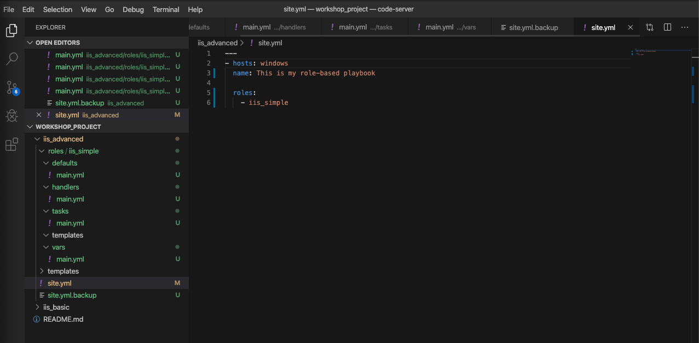
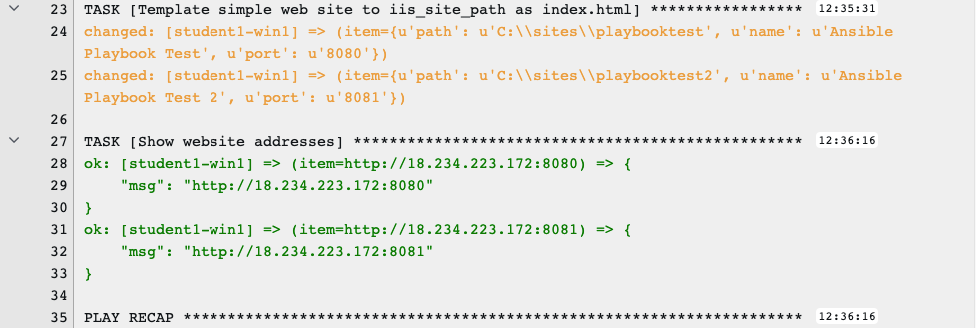

**Lisez ceci dans d'autres langues**:
<br> [English](README.md),  [日本語](README.ja.md),  [Française](README.fr.md).

Bien qu'il soit possible d'écrire un playbook dans un fichier comme nous l'avons fait tout au long de cet atelier, vous allez forcement vouloir réutiliser et organiser vos fichiers.

Les rôles Ansible sont notre façon de procéder. Lorsque vous créez un rôle, vous
déconstruisez votre playbook en plusieurs parties pour les mettres dans des répertoires structurés. Ceci est considéré comme la meilleure pratique et vous fera économiser beaucoup temps à l'avenir.

Pour cet exercice, vous allez prendre le playbook que vous venez d'écrire et le refactoriser en un rôle.

Commençons tout de suite avec le playook `iis-basic`.


Section 1: Créez une structure de répertoires pour votre nouveau rôle
=====================================================================

Étape 1:
--------

Dans Visual Studio Code, accédez à l'explorateur et à la section *WORKSHOP_PROJECT* où vous avez précédemment créé `iis_advanced`.


Sélectionnez le dossier **iis_advanced**.

Créez un répertoire appelé **rôles** en cliquant avec le bouton droit sur **iis_advanced** et en sélectionnant *Nouveau dossier*

Maintenant, faites un clic droit sur **rôles** et créez un nouveau dossier appelé `iis_simple`.

Étape 2:
--------

Dans *iis_simple*, créez de nouveaux dossiers comme suit:

- defaults

- vars

- handlers

- tasks

- templates

Étape 3:
--------

Dans chacun de ces nouveaux dossiers (à l'exception des templates), cliquez avec le bouton droit, puis *Nouveau fichier* pour Créer un fichier appelé `main.yml` dans chacun de ces dossiers. Vous ne le ferez pas pour le repertoire `templates`. Il s'agit de votre structure de rôle de base et main.yml sera le fichier par défaut que le rôle utilisera pour chaque section.

La structure finie ressemblera à ceci:


Section 2: Copier votre Playbook `site.yml` dans le rôle `iis_simple` nouvellement créé
=======================================================================================

Dans cette section, nous allons séparer les principales parties de votre playbook, y compris `vars:`, `tasks:`, `template:` et `handlers:`.

Étape 1:
--------

Faites une copie de sauvegarde de `site.yml`, puis créez un nouveau `site.yml`.

Accédez à votre dossier `iis_advanced`, cliquez avec le bouton droit sur` site.yml`, cliquez sur `renommer` et appelez-le `site.yml.backup`

Créez un nouveau fichier vierge appelé `site.yml` dans le même dossier

Étape 2:
--------

Mettez à jour site.yml pour qu'il appele seulement votre rôle. Il devrait ressembler à ci-dessous:

```yaml
    ---
    - hosts: windows
      name: This is my role-based playbook

      roles:
        - iis_simple
```



Étape 3:
--------

Ajoutez une variable par défaut à votre rôle. Modifiez le `roles\iis_simple\defaults\main.yml` comme ci-dessous:

```yaml
    ---
    # defaults file for iis_simple
    iis_sites:
      - name: 'Ansible Playbook Test'
        port: '8080'
        path: 'C:\sites\playbooktest'
      - name: 'Ansible Playbook Test 2'
        port: '8081'
        path: 'C:\sites\playbooktest2'
```

Étape 4:
--------

Ajoutez des variables spécifiques au rôle à votre rôle dans `roles\iis_simple\vars\main.yml`.

```yaml
    ---
    # vars file for iis_simple
    iis_test_message: "Hello World!  My test IIS Server"
```

> **Note**
>
> **Hé, attendez… venons-nous de mettre les variables à deux endroits séparés?**
>
> Oui… oui nous l'avons fait. Les variables peuvent être assignées à plusieurs endroits. Juste pour en nommer quelques-uns:
>
> - Le repertoire vars 
>
> - Le repertoire defaults 
>
> - Le repertoire group_vars 
>
> - Dans le playbook dans la section `vars:` 
>
> - Dans n'importe quel fichier qui peut être spécifié sur la ligne de commande en utilisant l'option `--extra_vars` 
>
> En bout de ligne, vous devriez lire la documentation sur les [variables](http://docs.ansible.com/ansible/latest/playbooks_variables.html#variable-precedence-where-should-i-put-a-variable) pour comprendre où définir les variables et quels emplacements ont la priorité. Dans cet exercice, nous utilisons les valeurs par défaut des rôles pour définir quelques variables et celles-ci sont les plus malléables. Après cela, nous avons défini certaines variables dans `/vars` qui ont une priorité plus élevée que les valeurs par défaut et ne peuvent pas être remplacées en tant que variable par défaut.

Étape 5:
--------

Créez un handler dans `roles\iis_simple\handlers\main.yml`.

```yaml
    ---
    # handlers file for iis_simple
    - name: restart iis service
      win_service:
        name: W3Svc
        state: restarted
        start_mode: auto
```

Étape 6:
--------

Ajoutez les tâches à votre rôle dans `roles\iis_simple\tasks\main.yml`.

<!--  -->
```yaml
    ---
    # tasks file for iis_simple

    - name: Install IIS
      win_feature:
        name: Web-Server
        state: present

    - name: Create site directory structure
      win_file:
        path: "{{ item.path }}"
        state: directory
      with_items: "{{ iis_sites }}"

    - name: Create IIS site
      win_iis_website:
        name: "{{ item.name }}"
        state: started
        port: "{{ item.port }}"
        physical_path: "{{ item.path }}"
      with_items: "{{ iis_sites }}"
      notify: restart iis service

    - name: Open port for site on the firewall
      win_firewall_rule:
        name: "iisport{{ item.port }}"
        enable: yes
        state: present
        localport: "{{ item.port }}"
        action: Allow
        direction: In
        protocol: Tcp
      with_items: "{{ iis_sites }}"

    - name: Template simple web site to iis_site_path as index.html
      win_template:
        src: 'index.html.j2'
        dest: '{{ item.path }}\index.html'
      with_items: "{{ iis_sites }}"

    - name: Show website addresses
      debug:
        msg: "{{ item }}"
      loop:
        - http://{{ ansible_host }}:8080
        - http://{{ ansible_host }}:8081
```
<!--  -->

Étape 7:
--------

Ajoutez le template index.html.

Cliquez avec le bouton droit sur `roles\iis_simple\templates` et créez un nouveau fichier appelé `index.html.j2` avec le contenu suivant:

<!--  -->
```html
    <html>
    <body>

      <p align=center>
      <h1 align=center>{{ ansible_hostname }} --- {{ iis_test_message }}

    </body>
    </html>
```
<!--  -->

Maintenant, rappelez-vous que nous avons toujours un dossier *templates* au niveau de base de ce playbook, nous allons donc le supprimer maintenant. Faites un clic droit dessus et sélectionnez *Supprimer*.

Étape 8: 
--------

Cliquez sur `Fichier` > `Enregistrer tout` pour vous assurer que tous vos fichiers sont enregistrés.

Cliquez sur l'icône du code source comme indiqué ci-dessous (1).

Tapez un message de validation tel que "Ajout d'un rôle iis_simple" (2) et cochez la case ci-dessus (3).


Cliquez sur le bouton `synchronize changes` dans la barre bleue en bas à gauche. 

Section 3: Exécuter votre nouveau playbook
==========================================

Maintenant que vous avez réussi à séparer votre playbook d'origine en un rôle, exécutons-le et voyons comment cela fonctionne. Nous n'avons pas besoin de créer un nouveau modèle, car nous réutilisons celui de l'exercice 5. Lorsque nous réexécutons le modèle, il sera automatiquement actualisé à partir de git et lancera notre nouveau rôle.

Étape 1:
--------

Avant que nous puissions modifier notre modèle de tache, vous devez d'abord resynchroniser de votre projet. Faites-le maintenant.

Étape 2:
--------

Selectionnez Modeles

> **Note**
>
> Alternativement, si vous n'avez pas quitté la page de création de modèles de travail, vous pouvez faire défiler vers le bas pour voir tous les modèles de tache existants

Étape 3:
--------

Cliquez sur l'icône de la fusée  pour le modèle **IIS Advanced**.

Étape 4:
--------

Lorsque vous y êtes invité, entrez le message de test souhaité

En cas de succès, votre sortie standard devrait ressembler à la figure ci-dessous. Notez que la plupart des tâches retournent OK car nous avons précédemment configuré les serveurs et les services sont déjà en cours d'exécution.




Une fois le travail terminé, vous devriez voir deux URL de vos sites Web affichés en bas de la sortie de la tache. Vérifiez qu'ils fonctionnent toujours.

Section 5: Review
=================

Vous devriez maintenant avoir un playbook complet, `site.yml` avec un seul rôle appelé `iis_simple`. L'avantage de structurer votre playbook en rôles est que vous pouvez désormais le réutiliser facilement dans vos playbooks afin que simplifier les modifications apportées aux variables, tâches, modèles, etc.


[Ansible Galaxy](https://galaxy.ansible.com) un bon référentiel de rôles à utiliser ou à référencer.
<br><br>
[Cliquez ici pour revenir à l'atelier Ansible pour Windows](../README.fr.md)
