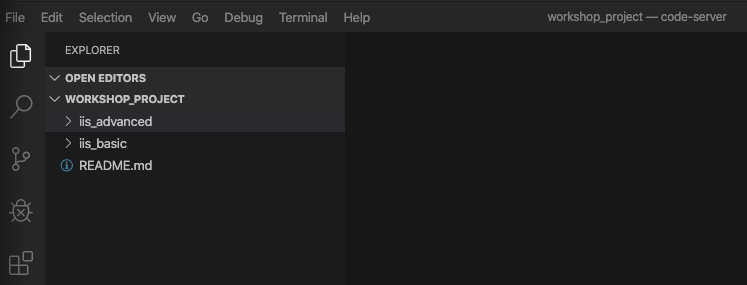
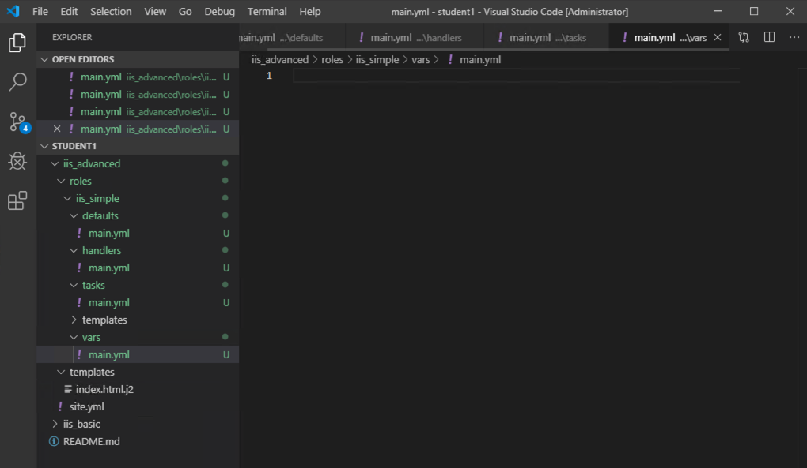
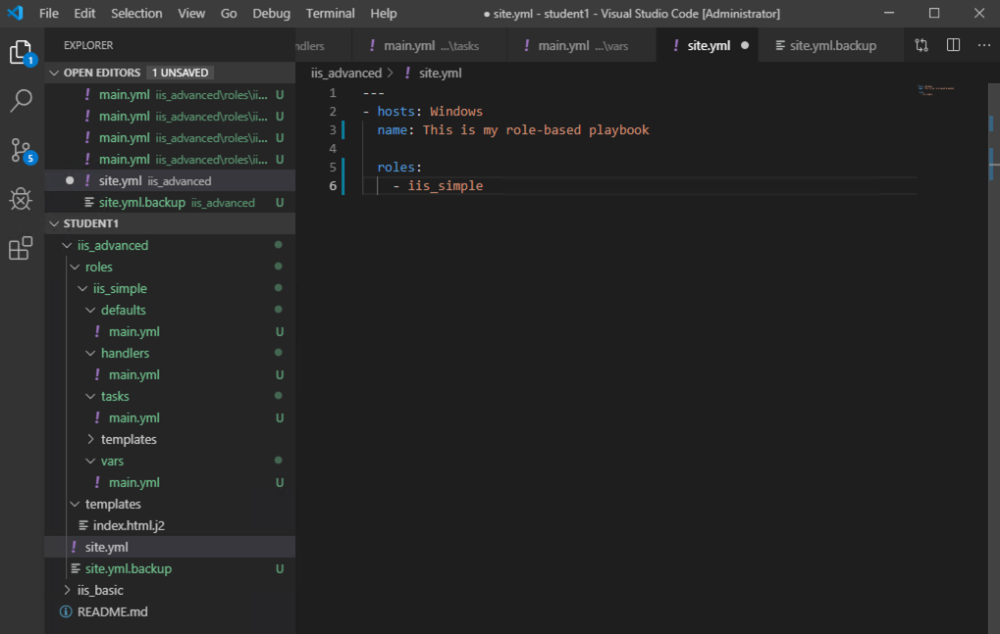
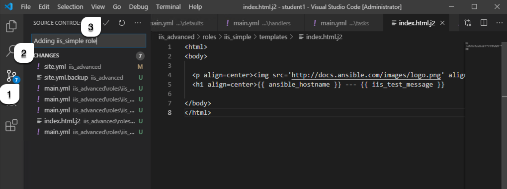
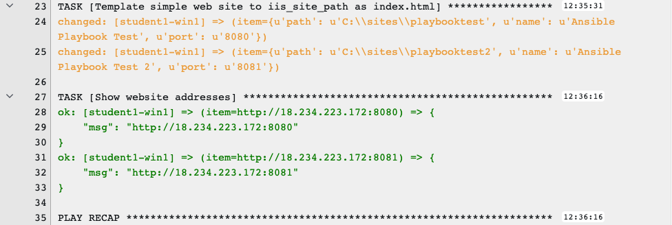

# 演習 6 - Ansible Roles
このワークショップ全体で行ったように、1つの Playbook として記述することは可能ですが、Ansible を使っていると、有用な Playbook を他から再利用したいと考えるようになります。  

Ansible Roles はこの手段を提供します。Roles を作成すると、Playbook をパーツが分解され、それらのパーツがディレクトリ構造に配置されます。これは Playbook 管理のベストプラクティスと考えられており、Ansible を使っていく上で多くの時間を節約できます。  

この演習では、作成した Playbook を Role に作り変えます。  

まず、iis-basic-playbookがどのように複数の Role に分解されるかを見てみましょう…  

## Role のためのディレクトリーの作成

### ステップ 1:

Visual Studio Codeで、エクスプローラーと以前に `iis_advanced` を作成した*WORKSHOP_PROJECT*セクションに移動します。  



**iis_advanced** フォルダーを選択します。  

**iis_advanced**を右クリックして*New Folder*を選択、**roles** という名前のホルダーを作成します。   

**roles**を右クリックし、その下に `iis_simple`という新しいフォルダーを作成します。　　

### ステップ 2:  

*iis\_simple* の下にさらに以下の新しいホルダーを作成します:

- defaults

- vars

- handlers

- tasks

- templates

### ステップ 3:  

template ホルダーを除く各ホルダーに、`main.yml`という名前のファイルを作成します。これは基本的な Roles のホルダー構造であり、main.ymlはロールが各セクションで使用するデフォルトのファイルになります。

完成した構造は次のようになります。  



## Playbook の Role 化

このセクションでは、`vars：`、`tasks：`、`template：`、`handlers：`など、Playbook の主要部分を分解し Role 化します。  

### ステップ 1:

元の `site.yml` のバックアップを作成した後、新しく `site.yml`を作成します。  

`iis_advanced` ホルダーで、`site.yml`を右クリックし、`rename`を選択、`site.yml.backup`に変更します。  

同じホルダーに`site.yml` を新たに作成します。  

### ステップ 2:

site.ymlを編集して、iis_simple という名の Role を呼び出すようにします。以下のようになります。  

```yaml
---
- hosts: windows
  name: This is my role-based playbook
  
  roles:
    - iis_simple
```



### ステップ 3:

デフォルト変数をロールに追加します。 `roles \ iis_simple \ defaults \ main.yml`を次のように編集します：

```yaml
---
# defaults file for iis_simple
iis_sites:
  - name: 'Ansible Playbook Test'
    port: '8080'
    path: 'C:\sites\playbooktest'
  - name: 'Ansible Playbook Test 2'
    port: '8081'
    path: 'C:\sites\playbooktest2'
```

### ステップ 4:

`roles \ iis_simple \ vars \ main.yml`のロールにいくつかのロール固有の変数を追加します。  

```yaml
---
# vars file for iis_simple
iis_test_message: "Hello World!  My test IIS Server"
```

> **ヒント**
>
> **変数を違う場所に置く？？**
>
> はい！ Ansible では、変数はいろんな場所に置く事が出来ます。ほんの一例をあげると:  
>
> - vars ホルダー
>
> - defaults ホルダー
>
> - group\_vars ホルダー
>
> - Playbook の `vars:` の中
>
> - コマンド実行の際の`--extra_vars` オプション
>
>上記変数の定義は、場所によって優先順位が決まっています。最初からあまりいろんなところに置く必要はありませんが、こちらを一度確認しておくと良いと思います。[variable precedence](http://docs.ansible.com/ansible/latest/playbooks_variables.html#variable-precedence-where-should-i-put-a-variable)。この演習では、Role の default を使用していくつかの変数を定義していますが、これらは優先順位が低いため、他の場所で記述されると置き換わります。逆に言うと、順応性がある変数とも言えます。この default より優先順位が高いのが vars で、一部をこちらで定義してみました。  

### ステップ 5:

次に、ハンドラーを Role 化してみましょう。編集するファイルは、`roles\iis_simple\handlers\main.yml` です。  

```yaml
---
# handlers file for iis_simple
- name: restart iis service
  win_service:
    name: W3Svc
    state: restarted
    start_mode: auto
```

### ステップ 6:

タスクの Role 化はこちらを編集します。 `roles\iis_simple\tasks\main.yml`  

<!--  -->
```yaml
---
# tasks file for iis_simple

- name: Install IIS
  win_feature:
    name: Web-Server
    state: present

- name: Create site directory structure
  win_file:
    path: "{{ item.path }}"
    state: directory
  with_items: "{{ iis_sites }}"

- name: Create IIS site
  win_iis_website:
    name: "{{ item.name }}"
    state: started
    port: "{{ item.port }}"
    physical_path: "{{ item.path }}"
  with_items: "{{ iis_sites }}"
  notify: restart iis service

- name: Open port for site on the firewall
  win_firewall_rule:
    name: "iisport{{ item.port }}"
    enable: yes
    state: present
    localport: "{{ item.port }}"
    action: Allow
    direction: In
    protocol: Tcp
  with_items: "{{ iis_sites }}"

- name: Template simple web site to iis_site_path as index.html
  win_template:
    src: 'index.html.j2'
    dest: '{{ item.path }}\index.html'
  with_items: "{{ iis_sites }}"
  
- name: Show website addresses
  debug:
    msg: "{{ item }}"
  loop:
    - http://{{ ansible_host }}:8080
    - http://{{ ansible_host }}:8081
```
<!--  -->

### ステップ 7:


最後にテンプレートの Role化です。こちらは、main.yml がありませんので、新しいファイルを作成して内容を記述します。  

`roles\iis_simple\templates` を右クリックして`index.html.j2` という名前の新しいファイルを作成、さらに、そのファイルを以下の通り編集してください。  

<!--  -->
```html
<html>
<body>

  <p align=center>
  <h1 align=center>{{ ansible_hostname }} --- {{ iis_test_message }}

</body>
</html>
```
<!--  -->

さて、iiadvanced レベルに以前の演習で作成した*templates*フォルダーがまだ残っていると思います。これを削除しておきましょう。右クリックして選択し、削除します。  

### ステップ 8: コミット

File → Save All をクリックして、すべてのファイルが保存されていることを確認します。  

Source Control アイコンをクリックし(1)、変更の内容に関するコメント、例えば、 `Adding iis_simple role` を入力し(2)、上部の Commit アイコンをクリックします(3)。  



左下の青いバーにある`変更を同期`ボタンをクリックします。これは問題なく終了することを確認します。  

## Role ベースの新しい Playbook の実行

元の Playbook をロールに正常に分離できたので、実行してどのように機能するかを見てみましょう。演習5と同じ site.yml を再利用しているため、新しいジョブテンプレートを作成する必要はありません。演習5で作成したジョブテンプレートを再度実行してみてください。GitLab から自動的に更新され、新しい Roles 含む Playbook が起動します。

### ステップ 1:

上記で編集した内容は、ジョブテンプレート実行と共に自動的にプロジェクトの更新として実行されます。このため、改めてプロジェクトで同期をかける必要はないのですが、一応演習ですので、プロジェクトで更新作業を行っておきましょう。Ansible Tower の左ペインでプロジェクトをクリックして、円形の更新アイコンをクリックします。  

### ステップ 2:

テンプレートを選択します。  

> **ヒント**
>
> ジョブテンプレートの作成ページから移動していない場合は、下にスクロールして既存のすべてのジョブテンプレートを表示することも可能です  

### ステップ 3:

**IIS Advanced** の右端にあるロケットのアイコン  をクリックし、ジョブテンプレートを起動します。  

### ステップ 4:

プロンプトが表示されたら、お好きなテストメッセージを入力してください。♬  

成功すると、標準出力は次の図のようになります。 サーバーとサービスが既に実行されていることを以前に構成したため、ほとんどのタスクはOKを返します。  

  

ジョブが正常に完了すると、ジョブ出力の下部にWebサイトへの2つのURLが出力されます。  

## まとめ

これで、 `iis_simple`と呼ばれる1つのロールを持つ Playbook ` site.yml`が完成しました。Playbook を Role 化することの利点は、Playbook を再利用しやすくするだけでなく、変数、タスク、テンプレートなどの変更を簡単にできることです。  

[Ansible Galaxy](https://galaxy.ansible.com) には沢山の Roles が置いてあります。是非ご確認ください。  


[ワークショップ一覧に戻る](../readme.ja.md)
