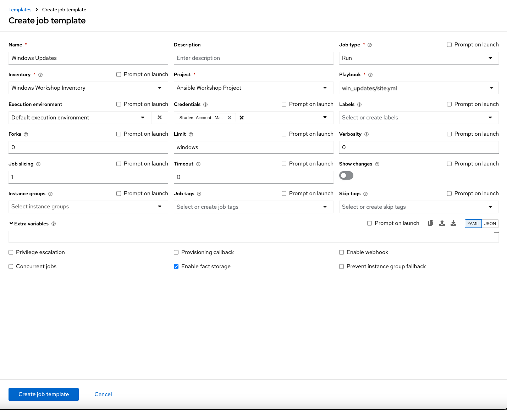
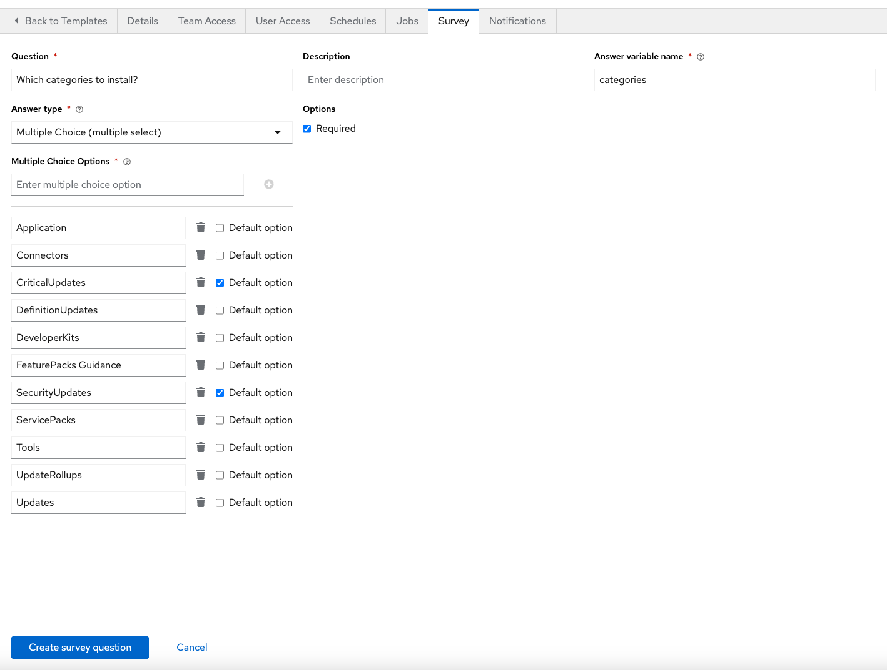
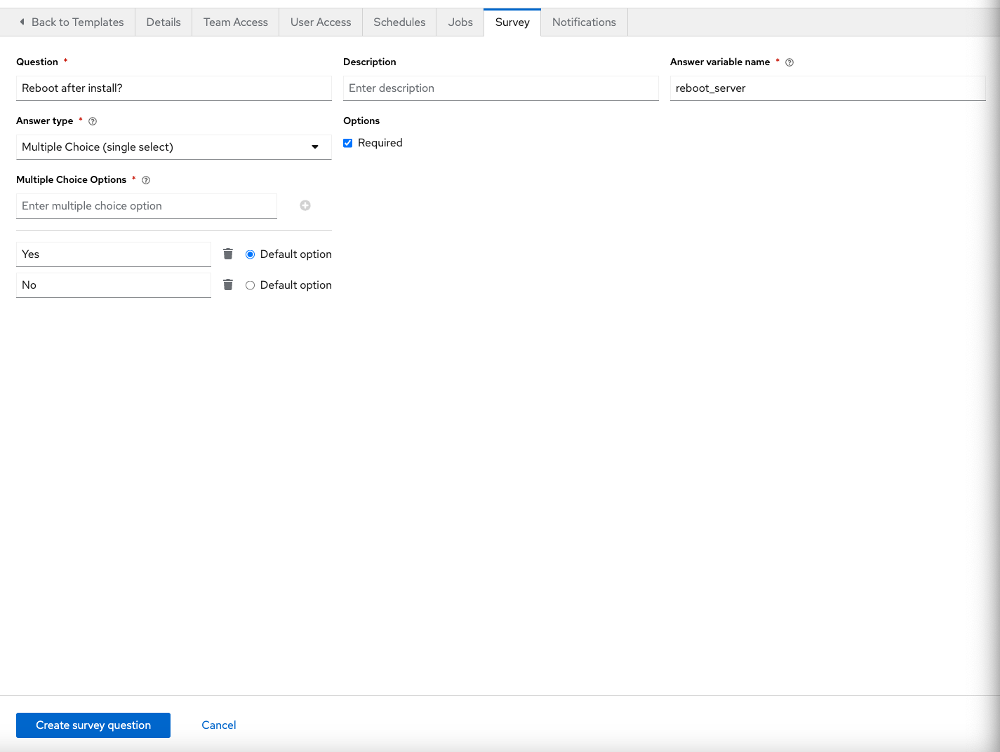

**Lisez ceci dans d'autres langues**:
<br> [English](README.md),  [日本語](README.ja.md),  [Française](README.fr.md).

Section 1 - Créer un Playbook
==================================

Le module `win_updates` est utilisé pour rechercher ou installer les mises à jour Windows. Le module utilise le service Windows Update intégré pour fonctionner. Cela signifie que vous aurez toujours besoin d'un système principal comme WSUS ou les serveurs Windows Update en ligne pour télécharger les mises à jour. Si la configuration de Windows Update de votre serveur est définie pour télécharger automatiquement mais ne pas installer, vous pouvez également utiliser le module pour organiser les mises à jour en lui disant de «rechercher» les mises à jour. Nous avons également la possibilité de mettre en liste blanche ou noire les mises à jour. Par exemple, nous pourrions lui dire de n'installer qu'une seule mise à jour de sécurité particulière au lieu de chaque mise à jour disponible.

Pour commencer, nous allons créer un nouveau playbook. Nous répéterons les étapes que vous avez effectuées dans les exercices précédents.


Étape 1:
--------

Dans Visual Studio Code, nous allons maintenant créer un nouveau répertoire dans votre référentiel git et créer un nouveau fichier playbook.

Dans l'Explorer, vous devriez avoir le repertoire où vous avez précédemment créé `iis_basic`.


Passez la souris sur la section *WORKSHOP_PROJECT* et cliquez sur le bouton *Nouveau dossier*. Tapez `win_updates` et appuyez sur Entrée.

Maintenant, cliquez sur le dossier `win_updates` et cliquez sur le bouton *Nouveau fichier*. Tapez `site.yml` et appuyez sur Entrée.

Vous devriez maintenant avoir un éditeur ouvert dans le volet droit qui peut être utilisé pour modifier votre playbook.


Section 2: Ecrire votre Playbook
================================

Modifiez votre site.yml et ajoutez une définition et quelques tâches à votre playbook. Cela couvrira un playbook très basique pour l'installation des mises à jour Windows. En règle générale, vous auriez encore plus de tâches pour accomplir l'ensemble du processus de mise à jour. Cela peut impliquer la création de tickets de service, la création d'instantanés ou la désactivation de la surveillance.

<!--  -->
```yaml
    ---
    - hosts: windows
      name: This is my Windows patching playbook
      tasks:
        - name: Install Windows Updates
          win_updates:
            category_names: "{{ categories | default(omit) }}"
            reboot: '{{ reboot_server | default(yes) }}'
```
<!--  -->

> **Note**
>
> **What are we doing?**
>
> -   `win_updates:` Ce module est utilisé pour vérifier ou installer des mises à jour. Nous lui demandons d'installer uniquement les mises à jour de catégories spécifiques à l'aide d'une variable. L'attribut `reboot` redémarrera automatiquement l'hôte distant s'il est requis et continuera à installer les mises à jour après le redémarrage. Nous utiliserons également une variable d'enquête pour nous empêcher de redémarrer quand c'est nécessaire. Si la valeur reboot_server n'est pas spécifiée, nous définirons l'attribut par defaut pour reboot sur `yes`.


Section 3: Enregistrer et valider
=================================

Votre playbook est terminé! Mais n'oubliez pas que nous devons encore valider les modifications apportées au SCM.

Cliquez sur «Fichier» → «Tout enregistrer» pour enregistrer les fichiers que vous avez écrits


Cliquez sur l'icône du code source (1), saisissez un message de validation tel que *Ajout d'un playbook de mise à jour Windows* (2), puis cochez la case ci-dessus (3).


Synchronisez-vous avec gitlab en cliquant sur les flèches dans la barre bleue en bas à gauche.


Cela devrait prendre 5 à 30 secondes pour terminer la validation. La barre bleue devrait s'arrêter de tourner et indiquer 0 problème…

Section 4: Création du modèle de tache
======================================

Maintenant, de retour dans Tower, vous devrez resynchroniser votre projet pour que les nouveaux fichiers s'affichent.

Ensuite, nous devons créer un nouveau modèle de tache pour exécuter ce playbook. Allez donc dans *Modèle*, cliquez sur *Ajouter* et sélectionnez "Modèle de tache".

Étape 1:
--------

Remplissez le formulaire en utilisant les valeurs suivantes

| Clé                | Valeur                     | Note |
|--------------------|----------------------------|------|
| NOM                | Windows Updates            |      |
| DESCRIPTION        |                            |      |
| JOB TYPE           | Run                        |      |
| INVENTAIRE         | Workshop Inventory |      |
| PROJET             | Ansible Workshop Project   |      |
| Playbook           | `win_updates/site.yml`     |      |
| MACHINE CREDENTIAL | Student Account            |      |
| LIMIT              | windows                    |      |
| OPTIONS            | [*] ENABLE FACT CACHE      |      |



Étape 2:
--------

Cliquez sur ENREGISTRER  puis sélectionnez AJOUTER UN QUESTIONNAIRE 

Étape 3:
--------

Remplissez le questionnaire avec les valeurs suivantes

| Clé                     | Valeur                                                                                                                                                 | Note                                         |
|-------------------------|--------------------------------------------------------------------------------------------------------------------------------------------------------|----------------------------------------------|
| PROMPT                  | Categories                                                                                                                                             |                                              |
| DESCRIPTION             | Which Categories to install?                                                                                                                           |                                              |
| ANSWER VARIABLE NAME    | categories                                                                                                                                             |                                              |
| ANSWER TYPE             | Multiple Choice (multiple select)                                                                                                                      | **There's also a *single* selection option** |
| MULTIPLE CHOICE OPTIONS |  Application<br>Connectors<br>CriticalUpdates<br>DefinitionUpdates<br>DeveloperKits<br>FeaturePacks Guidance<br>SecurityUpdates<br>ServicePacks<br>Tools<br>UpdateRollups<br>Updates |                                              |
| DEFAULT ANSWER          |  CriticalUpdates<br>SecurityUpdates                                                                                                                       |                                              |
| REQUIRED                | Selected                                                                                                                                               |                                              |
|                         |                                                                                                                                                        |                                              |



Une fois terminé, cliquez sur le bouton . Vous verrez votre nouveau champ à droite. Ajoutez maintenant un autre champ en remplissant à nouveau le formulaire .

| Clé                     | Valeur                                                  | Note |
|-------------------------|---------------------------------------------------------|------|
| PROMPT                  | Redémarrer après l'installation?                        |      |
| DESCRIPTION             | If the server needs to reboot, then do so after install |      |
| ANSWER VARIABLE NAME    | `reboot_server`                                         |      |
| ANSWER TYPE             | Multiple Choice (single select)                         |      |
| MULTIPLE CHOICE OPTIONS | Yes<br>No                                               |      |
| DEFAULT ANSWER          | Yes                                                     |      |
| REQUIRED                | Selected                                                |      |



Étape 4:
--------

Cliquez sur `Add` 

Étape 5:
--------

Cliquez sur `ENREGISTRER` 

Étape 6:
--------

De retour sur la page principale du modèle de travail, sélectionnez `ENREGISTRER`
 again.

Section 6: lancer votre nouveau playbook
========================================

Maintenant, exécutons-le et voyons comment il fonctionne.

Étape 1:
--------

Cliquez sur `Modeles`


Étape 2:
--------

Cliquez sur l'icône de la fusée  pour éxécuter la tache **Windows Updates**.

Étape 3:
--------

Lorsque vous y êtes invité, sélectionnez la catégories de mise à jour. Puis répondez "Oui" à la question **Redémarrer après l'installation?** Et cliquez sur **SUIVANT**.

Après le lancement de la tache, vous pouvez voir le résultat de la tache en cours en temps réel.
<br><br>
[Cliquez ici pour revenir à l'atelier Ansible pour Windows](../README.fr.md)
