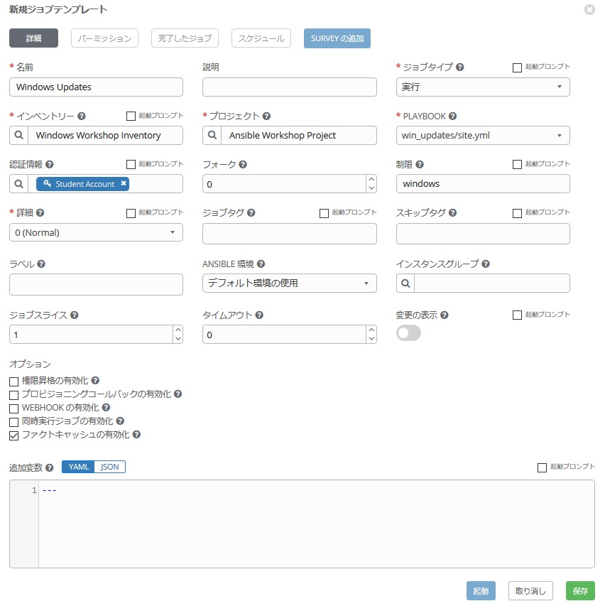

# 演習 7 - Windows パッチ管理

## Playbook の作成

Windwos のパッチ管理は、Ansible で Windows ホストを管理する際の大きなユースケースの一つです。Ansible では、`win_updates` モジュールを使って Windows Update の確認またはインストールが行われます。このモジュールは、Windows に元々組み込まれている、Window Update サービスを利用します。これは、各端末から更新をダウンロードするための WSUS やオンラインの Windows Update サーバーなどの パッチのリポジトリが引き続き必要ということを示しています。Windows Update の設定が自動的にダウンロードするがインストールはしないように構成されている場合は、更新を`検索`するよう指示することで、モジュールを使用して更新をステージングすることもできます。各パッチをホワイトリストまたはブラックリストに登録する機能もあります。たとえば、利用可能なすべての更新ではなく、1つの特定のセキュリティ更新のみをインストールするように指示することも可能です。  

最初に、新しい Playbook を作成します。 以前の演習で実行した手順を繰り返します。  

### ステップ 1:

Visual Studio Code を使って、Git リポジトリに新しいホルダーを作成し、新しい Playbook を作成します。  

以前に「iis_basic」ディレクトリを作成したWORKSHOP_PROJECTが存在していると思います。  


WORKSHOP_PROJECTセクションにカーソルを合わせ、*New Folder* ボタンをクリックします。`win_updates` と入力します。  

次に、`win_updates` ホルダーを右クリックして、*New File* を選択、`site.yml` と入力します。  

Playbook 編集用のエディターが右ペインに開きます。  


## Playbook の作成

作成した site.yml を編集し、Playbook にプレイの定義といくつかのタスクを追加します。これは、Windows Update を実行するための非常に基本的な Playbook です。一般的には、更新プロセスを実行するためにはさらに多くのタスク、例えば、サービスチケットの作成、バックアップの作成、または監視の無効化などが必要になる場合があります。そういった今回の演習では含まれていません。もちろん、別途他システムを Ansible と連携、または Ansible から操作することにより、全自動で行うことも可能です。  

<!--  -->
```yaml
---
- hosts: windows
  name: This is my Windows patching playbook
  tasks:
    - name: Install Windows Updates
      win_updates:
        category_names: "{{ categories | default(omit) }}"
        reboot: '{{ reboot_server | default(yes) }}'
```
<!--  -->

> **ヒント**
>
> **上記の説明**
>
> -   `win_updates:` このモジュールは、Windows 端末の新規パッチの確認またはインストールに使用されます。変数を使用して特定のカテゴリの更新のみをインストールするように指示しています。`reboot`属性は、必要に応じてリモートホストを自動的に再起動し再起動後も更新のインストールを続行します。 また、必要に応じて Survey を使って再起動を停止することも可能です。reboot_server 値が指定されていない場合、再起動属性をyesに設定します。変数が二つありますが、こちらは、Ansible Tower の Survey で入力します。

## 保存とコミット

改良された新しい Playbook の完成です♪  
早速、変更を保存し、GitLabにコミットしましょう。  

`File` をクリックし、`Save` を選択。編集したファイルを保存します。  


Source Control アイコンをクリックし (1)、変更内容例えば*Adding windows update playbook*を記述し (2)、上部の Commit ボタンをクリックします (3)。  


左下の青いバーの矢印をクリックして、gitlabに同期します。  


コミットが完了するまでに5〜30秒かかります。 青いバーは回転を停止し、問題が0であることを確認します...　

## ジョブテンプレートの作成

Ansible Tower の GUI に戻ってプロジェクトの同期を行います。理由は・・・、もうお分かりですね？  

次に、この Playbook を実行する新しいジョブテンプレートを作成する必要があります。*テンプレート*に移動して*追加*をクリックし、`ジョブテンプレート`を選択して新しいジョブテンプレートを作成します。

### ステップ 1:

次の値を使用してフォームに入力します。  

| キー                | 値                      | 備考 |
|--------------------|----------------------------|------|
| 名前               | Windows Updates            |      |
| 説明        |                            |      |
| ジョブタイプ           | 実行                        |      |
| インベントリー          | Windows Workshop Inventory |      |
| プロジェクト            | Ansible Workshop Project   |      |
| PLAYBOOK           | `win_updates/site.yml`     |      |
| 認証情報 | Student Account            |      |
| 制限              | windows                    |      |
| オプション            | [*] ファクトキャッシュの有効化にチェック      |      |



### ステップ 2:

 をクリックし、ADD SURVEY  をクリックします。  

### ステップ 3:

Survey画面に以下を入力します。

| キー                     | 値                                                                                                                                                  | 備考                                         |
|-------------------------|--------------------------------------------------------------------------------------------------------------------------------------------------------|----------------------------------------------|
| プロンプト                  | カテゴリー                                                                                                                                             |                                              |
| 説明             | どのカテゴリーのパッチをインストール？                                                                                                                           |                                              |
| 回答の変数名    | categories                                                                                                                                             |                                              |
| 回答タイプ             | 複数の選択 (複数の選択)                                                                                                                      | ***単一* 選択のオプションもあります** |
| 複数選択のオプション |  Application<br>Connectors<br>CriticalUpdates<br>DefinitionUpdates<br>DeveloperKits<br>FeaturePacks Guidance<br>SecurityUpdates<br>ServicePacks<br>Tools<br>UpdateRollups<br>Updates |                                              |
| デフォルトの応答          |  CriticalUpdates<br>SecurityUpdates                                                                                                                       |                                              |
| 必須                | チェック                                                                                                                                               |                                              |
|                         |                                                                                                                                                        |                                              |


入力が完了したら をクリックします。今作成した Survey 内容が右に追加されます。さらに、もう一つ Survey を追加します。  

| キー                     | 値                                                   | 備考 |
|-------------------------|---------------------------------------------------------|------|
| プロンプト                  | Reboot after install?                                   |      |
| 説明             | If the server needs to reboot, then do so after install |      |
| 回答の変数名    | `reboot_server`                                         |      |
| 回答タイプ             | 複数の選択 (単一の選択)                         |      |
| 複数選択のオプション | Yes<br>No                                               |      |
| デフォルトの応答          | Yes                                                     |      |
| 必須                | チェック                                                |      |


### ステップ 4:

をクリックします。  

### ステップ 5:

をクリックします。  

### ステップ 6:

ジョブテンプレート画面に戻りますので、 をクリックします。  

### playbook の起動

作成した Playbook を実行して、動くかどうか確認してみましょう♬  

### ステップ 1:

テンプレートを選択します。  

> **ヒント**
>
> ジョブテンプレートの作成ページから移動していない場合は、下にスクロールして既存のすべてのジョブテンプレートを表示することも可能です  

### ステップ 2:

**Windows Updates**の右端にあるロケットアイコン  をクリックします！  

### ステップ 3:

プロンプトが表示されたらUpdateのカテゴリーを選択し、さらに、*reboot after install?* に `Yes` を選択して、**次へ**をクリックします。  

ジョブが起動したら、リダイレクトされ、ジョブの出力をリアルタイムで見ることができます。  

### オプション演習:

Windows 環境にインストール済みのパッチ一覧は PowerShell の以下のコマンドで取得可能です。  

```
Get-WMIObject Win32_QuickFixEngineering
```

これをアドホックコマンドで実行してみましょう。やり方は・・・、もう大丈夫ですね？♬  

これで全ての演習は終了です！！  

[ワークショップ一覧に戻る](../readme.ja.md)

