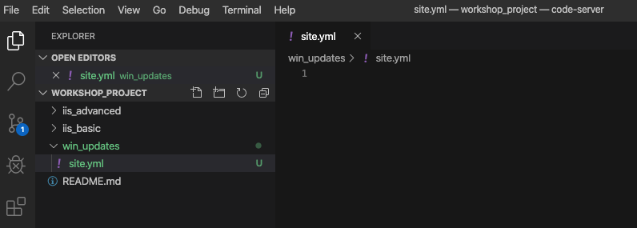
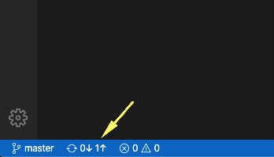
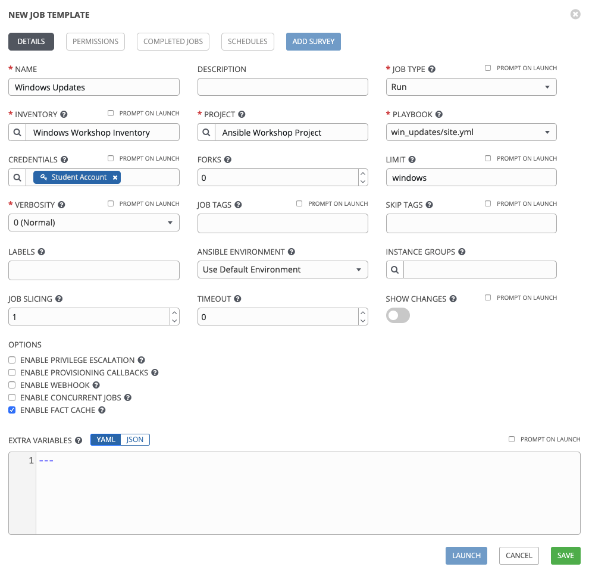
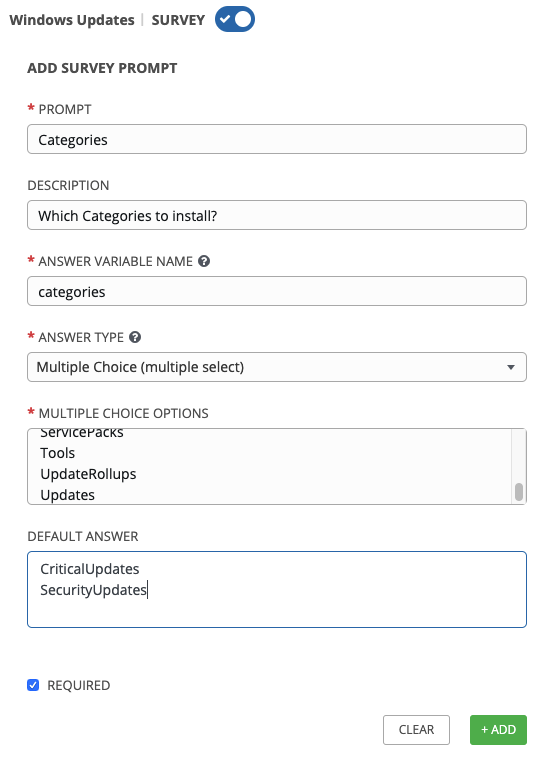

**他の言語でもお読みいただけます**:
<br> [English](README.md),  [日本語](README.ja.md),  [Français](README.fr.md).
<br>

セクション 1 - Playbook の作成
======================================

`win_updates` モジュールは、Windows Update の確認またはインストールに使用されます。このモジュールは、組み込みの
Windows Update サービスを利用して機能します。つまり、更新プログラムをダウンロードするには、WSUS やオンラインの Windows
Update Server などのバックエンドシステムが必要です。サーバーの Windows Update
設定が自動的にダウンロードされてもインストールされないように設定されている場合は、このモジュールを利用して、更新を `search`
するように指示することで、更新をステージングすることもできます。更新を許可リストまたは拒否リストに登録する機能もあります。たとえば、利用可能なすべての更新プログラムではなく、特定のセキュリティ更新プログラムを
1 つだけインストールするように指示できます。

まず、新しい Playbook を作成します。前の演習で実行した手順を繰り返します。

ステップ 1
--------------

Visual Studio Code 内で、git リポジトリーに新しいディレクトリーを作成し、新しい Playbook ファイルを作成します。

Explorer アコーディオンには、以前に iis\_basic を作成した *student\＃* セクションが必要です。


*WORKSHOP_PROJECT* セクションにカーソルを合わせ、*New Folder* ボタンをクリックします。`win_updates`
と入力し、Enter キーを押します。

次に、`win_updates` フォルダーを右クリックし、*新規ファイル* ボタンをクリックします。`site.yml` と入力して Enter
キーを押します。

これで、Playbook の作成に使用できるエディターが右側のペインで開いているはずです。



セクション 2: Playbook を書く
=====================================

site.yml を編集し、プレイ定義といくつかのタスクを Playbook に追加します。これは、Windows Update
をインストールするための非常に基本的な Playbook
を形成します。通常、更新プロセス全体を実行するには、さらに多くのタスクが必要になります。これには、サービスチケットの作成、スナップショットの作成、または監視の無効化が含まれる場合があります。

<!--  -->

```yaml
---
- hosts: windows
  name: This is my Windows patching playbook
  tasks:
    - name: Install Windows Updates
      win_updates:
        category_names: "{{ categories | default(omit) }}"
        reboot: '{{ reboot_server | default(true) }}'
```

<!--  -->

> **注意*
>
> ***内容を説明します。**
>
> - - `win_updates:` このモジュールは、更新のチェックまたはインストールに
>    使用されます。変数を使用して、特定のカテゴリーからのアップデートのみをインストールするように
>    指示します。必要であれば `reboot` 属性はリモートホストを自動的に
>    再起動し、再起動後に更新をインストールします。
>    また、survey 変数を使用して、必要であっても
>    再起動しないようにすることができます。reboot\_server 値が
>    指定されていない場合は、再起動属性を yes に設定します。

セクション 3: 保存してコミット
===========================================

Playbook が完成しました。ただし、ソースコード管理への変更をコミットする必要があることを忘れないでください。

`File` → `Save All` をクリックして、書き込んだファイルを保存します


ソースコードアイコン (1) をクリックし、*Adding windows update playbook* (2)
などのコミットメッセージを入力して、上のチェックボックス (3) をクリックします。


左下の青いバーの矢印をクリックして、gitlab に同期します。



コミットが完了するまで 5〜30 秒かかります。青いバーは回転を停止し、問題がないことを示しています...。

セクション 4: ジョブテンプレートの作成
=======================================================

ここで、Controller に戻り、新しいファイルが表示されるようにプロジェクトを再同期する必要があります。

次に、この Playbook を実行するための新しいジョブテンプレートを作成する必要があります。したがって、*Template* に移動し、*Add*
をクリックして `Job Template` を選択し、新しいジョブテンプレートを作成します。

ステップ 1
--------------

次の値を使用してフォームに記入します

| Key                | Value                      | Note |
|--------------------|----------------------------|------|
| NAME               | Windows Updates            |      |
| DESCRIPTION        |                            |      |
| JOB TYPE           | Run                        |      |
| INVENTORY          | Workshop Inventory |      |
| PROJECT            | Ansible Workshop Project   |      |
| Playbook           | `win_updates/site.yml`     |      |
| MACHINE CREDENTIAL | Student Account            |      |
| LIMIT              | windows                    |      |
| OPTIONS            | [\*] ENABLE FACT CACHE      |      |



ステップ 2
--------------

SAVE  をクリックして、ADD SURVEY
 を選択します。

ステップ 3
--------------

次の値を使用して survey フォームに記入します

| Key                     | Value                                                                                                                                                  | Note                                         |
|-------------------------|--------------------------------------------------------------------------------------------------------------------------------------------------------|----------------------------------------------|
| PROMPT                  | Categories                                                                                                                                             |                                              |
| DESCRIPTION             | Which Categories to install?                                                                                                                           |                                              |
| ANSWER VARIABLE NAME    | categories                                                                                                                                             |                                              |
| ANSWER TYPE             | Multiple Choice (multiple select)                                                                                                                      | **There's also a *single* selection option** |
| MULTIPLE CHOICE OPTIONS |  Application<br>Connectors<br>CriticalUpdates<br>DefinitionUpdates<br>DeveloperKits<br>FeaturePacks Guidance<br>SecurityUpdates<br>ServicePacks<br>Tools<br>UpdateRollups<br>Updates |                                              |
| DEFAULT ANSWER          |  CriticalUpdates<br>SecurityUpdates                                                                                                                       |                                              |
| REQUIRED                | Selected                                                                                                                                               |                                              |
|                         |                                                                                                                                                        |                                              |



完了したら、ADD 
ボタンをクリックします。新しいフィールドが右側に表示されます。次に、左側のフォームにもう一度入力して、別のフィールドを追加します。

| Key                     | Value                                                   | Note |
|-------------------------|---------------------------------------------------------|------|
| PROMPT                  | Reboot after install?                                   |      |
| DESCRIPTION             | If the server needs to reboot, then do so after install |      |
| ANSWER VARIABLE NAME    | `reboot_server`                                         |      |
| ANSWER TYPE             | Multiple Choice (single select)                         |      |
| MULTIPLE CHOICE OPTIONS | Yes<br>No                                               |      |
| DEFAULT ANSWER          | Yes                                                     |      |
| REQUIRED                | Selected                                                |      |


ステップ 4
--------------

ADD を選択します 

ステップ 5
--------------

SAVE を選択します 

ステップ 6
--------------

メインのジョブテンプレートページに戻り、もう一度 SAVE  を選択します。

セクション 6: 新しいプレイブックの実行
=======================================================

それを実行して、どのように機能するかを見てみましょう。

ステップ 1
--------------

テンプレートを選択します

> **注意**
>
> あるいは、ジョブテンプレートから移動していない場合
> 作成ページでは、下にスクロールして既存のすべてのジョブテンプレートを表示できます

ステップ 2
--------------

**Windows Updates** ジョブテンプレートのロケットアイコン 
をクリックします。

ステップ 3
--------------

プロンプトが表示されたら、更新カテゴリを選択して入力します。*Reboot after install?* プロンプトに `Yes`
と答えて、**Next** をクリックします。

ジョブの起動後、リダイレクトされ、ジョブの出力をリアルタイムで監視できます。

<br><br>
[Click here to return to the Ansible for Windows Workshop](../README.md)
