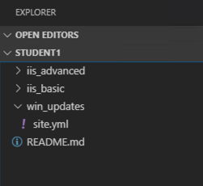
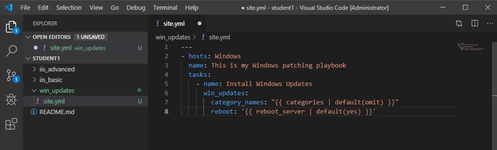
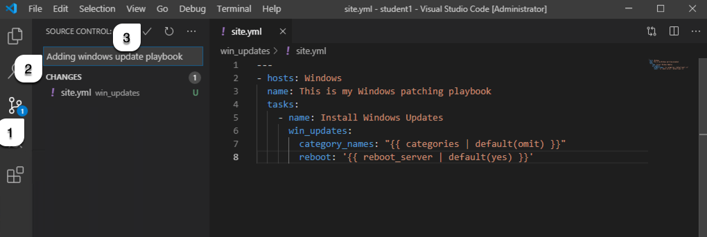
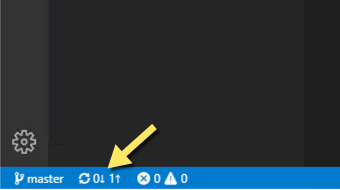
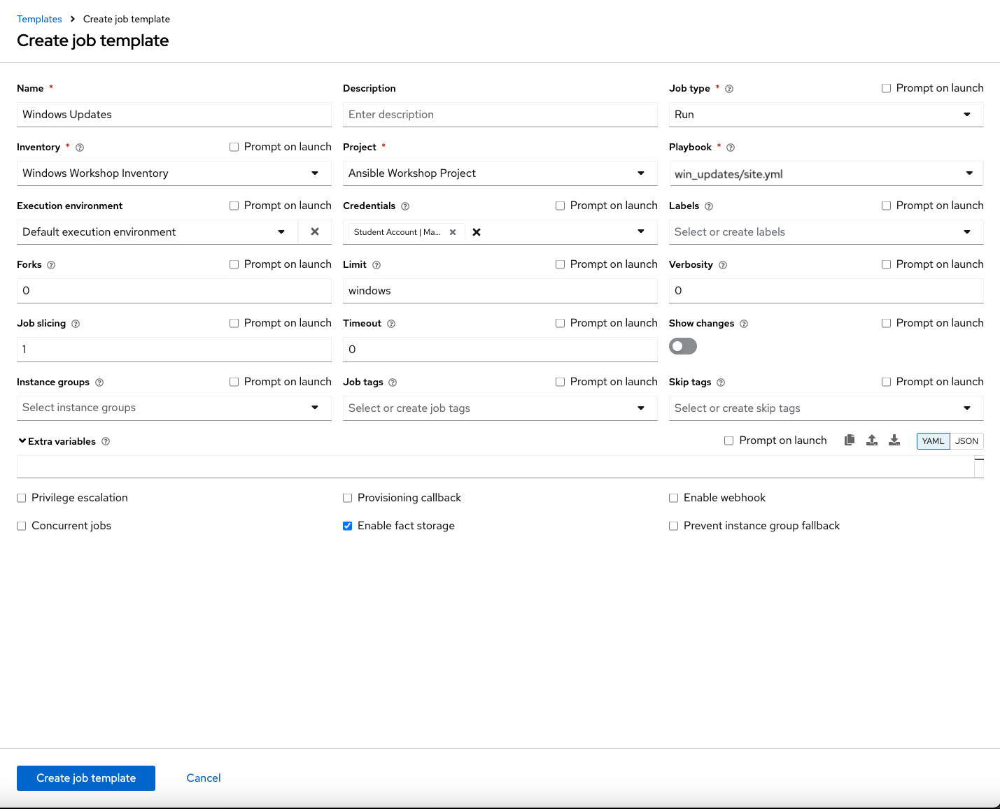
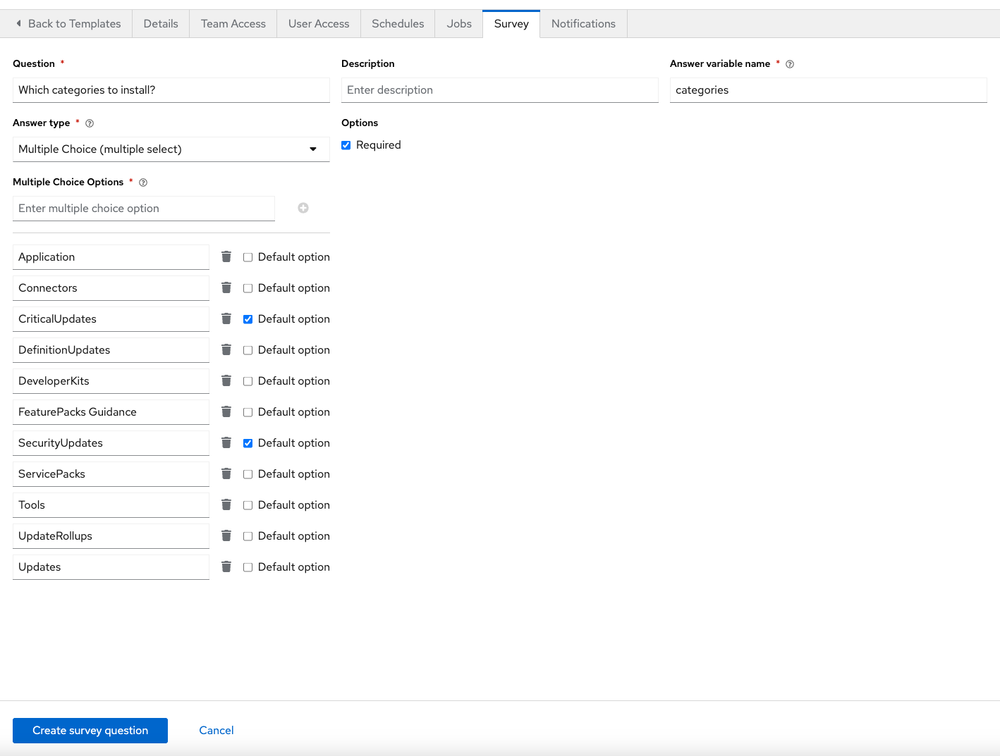
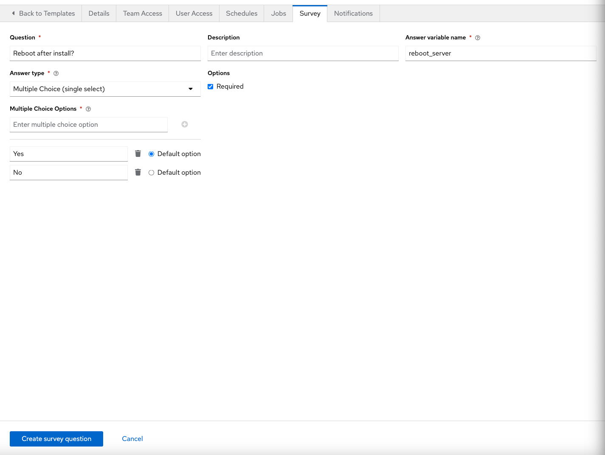

**Read this in other languages**:  
  [English](README.md),  [日本語](README.ja.md),  [Français](README.fr.md)  
 

---

# Section 1 – Creating your Playbook

The `win_updates` module is used to either check for or install Windows Updates. It uses the built-in Windows Update service, so you’ll still need a backend such as WSUS or the Microsoft Update servers. If your server’s Windows Update configuration is set to automatically download but not install, you can use this module to stage updates by telling it to `search` for them. You can also whitelist or blacklist specific updates — for example, installing only one security update instead of all available updates.

To begin, we’ll create a new playbook, following a similar process to earlier exercises.

---

## Step 1 – Create the Playbook File

In Visual Studio Code:

1. In the **Explorer** view, locate your *student#* section where you previously made `iis_basic`.  
2. Hover over the **WORKSHOP_PROJECT** folder and click the **New Folder** button. Name the folder `win_updates` and press Enter.  
3. Right-click the new `win_updates` folder, select **New File**, name it `site.yml`, and press Enter.  

You should now have an empty editor pane open for creating your playbook.  

---

# Section 2 – Write Your Playbook

Edit `site.yml` and add the following:

~~~yaml
---
- hosts: windows
  name: This is my Windows patching playbook
  tasks:
    - name: Install Windows Updates
      win_updates:
        category_names: "{{ categories | default(omit) }}"
        reboot: "{{ reboot_server | default(true) }}"
~~~

> **Note**  
> - `win_updates`: Checks for or installs updates.  
> - `category_names`: Allows you to limit updates to specific categories via a variable.  
> - `reboot`: If `true`, the remote host will reboot automatically when required, continuing the update process afterward. This is controlled via a survey variable so you can choose whether to reboot.

---

# Section 3 – Save and Commit

1. In VS Code, click **File → Save All**.  

2. Click the Source Code icon (1), type in a commit message such as *Adding
windows update playbook* (2), and click the check box above (3). 

3. Push your changes to GitLab by clicking the arrows on the lower left blue bar.

---

# Section 4 – Create Your Job Template

In **automation controller**:

1. Go to **Projects**, and resync your project so the new playbook appears.  
2. Go to **Templates**.  
3. Click **Create template**, then select **Create job template**.  

Fill out the form:

| Field              | Value                      |
|--------------------|----------------------------|
| **Name**           | Windows Updates            |
| **Description**    | (optional)                 |
| **Job Type**       | Run                        |
| **Inventory**      | Windows Workshop Inventory         |
| **Project**        | Ansible Workshop Project   |
| **Playbook**       | `win_updates/site.yml`     |
| **Execution Environment** | Default execution environment |
| **Credentials**    | Student Account            |
| **Limit**          | windows                    |
| **Options**        | Enable fact storage          |

Click **Save**.

---

## Add a Survey

1. On the Windows Updates job template page, click **Survey** tab and select the **Create survey question** button.  
2. Fill in the first survey question:  

| Field                     | Value                                                                                                          |
|---------------------------|----------------------------------------------------------------------------------------------------------------|
| **Question**                | Which categories to install?                                                                                                     |
| **Description**           | (Optional)                                                                                  |
| **Answer Variable Name**  | categories                                                                                                     |
| **Answer Type**           | Multiple Choice (multiple select)                                                                             |
| **Multiple Choice Options** | Application Connectors CriticalUpdates DefinitionUpdates DeveloperKits FeaturePacks Guidance SecurityUpdates ServicePacks Tools UpdateRollups Updates |
| **Default option**        | CriticalUpdates SecurityUpdates                                                                            |
| **Options**              |Required                                                                                                       |

Click **Create survey question** to save the question.

3. Add the second survey question:  

| Field                     | Value                                                   |
|---------------------------|---------------------------------------------------------|
| **Question**                | Reboot after install?                                   |
| **Description**           | (Optional) |
| **Answer Variable Name**  | reboot_server                                            |
| **Answer Type**           | Multiple Choice (single select)                         |
| **Multiple Choice Options** | Yes No                                             |
| **Default option**        | Yes                                                     |
| **Options**              | Required                                                |

4. Click **Create survey question**.

5. Back on the job template page, toggle the **Survey Enabled** button.

---

# Section 5 – Run Your Playbook

1. Go to **Templates** in automation controller.  
2. Locate the **Windows Updates** job template and click the **Launch** button (rocket icon).  
3. When prompted:  
   - Select the update categories.  
   - Choose **Yes** for *Reboot after install?*  
   - Click **Next**, then **Launch**.  

You’ll be redirected to the job output page to watch progress in real-time.

---

[Click here to return to the Ansible for Windows Workshop](../README.md)

