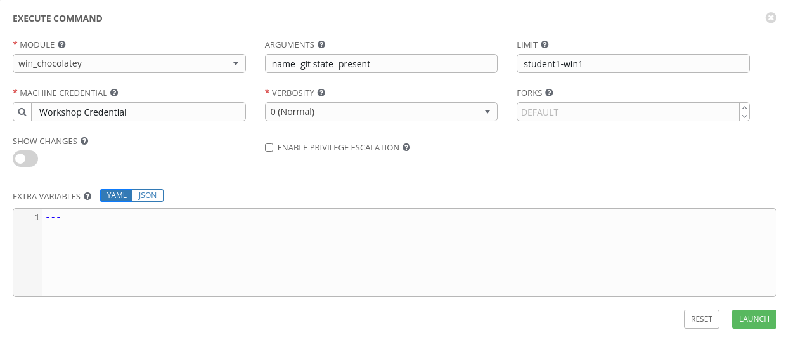
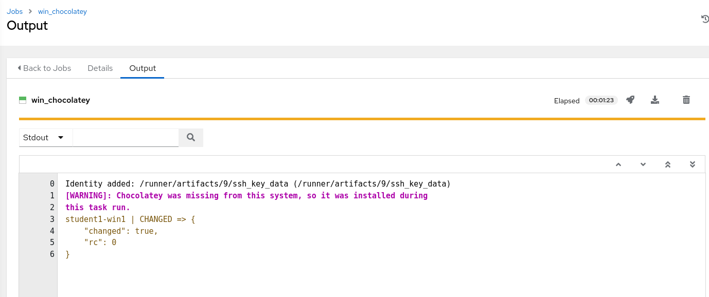
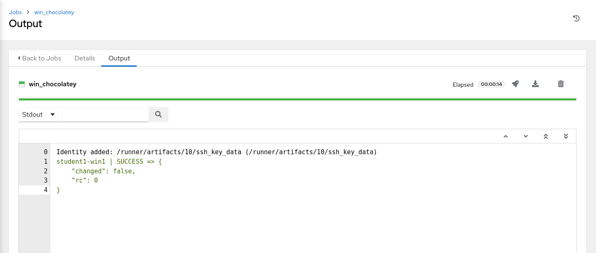
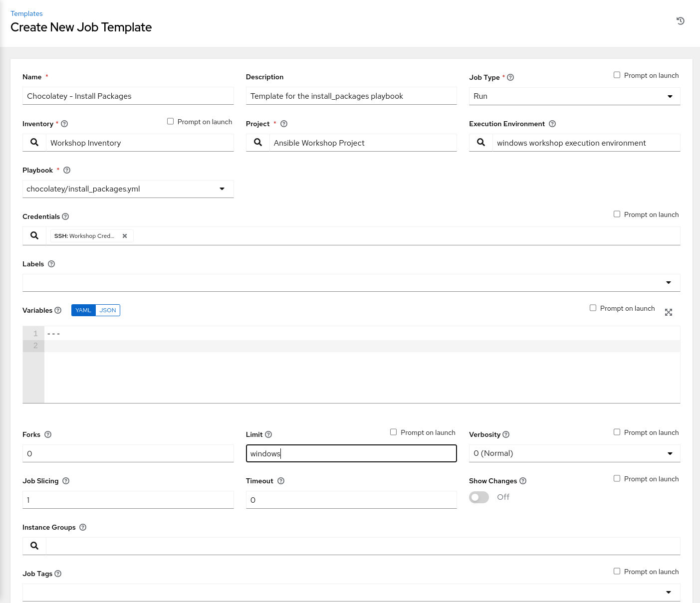
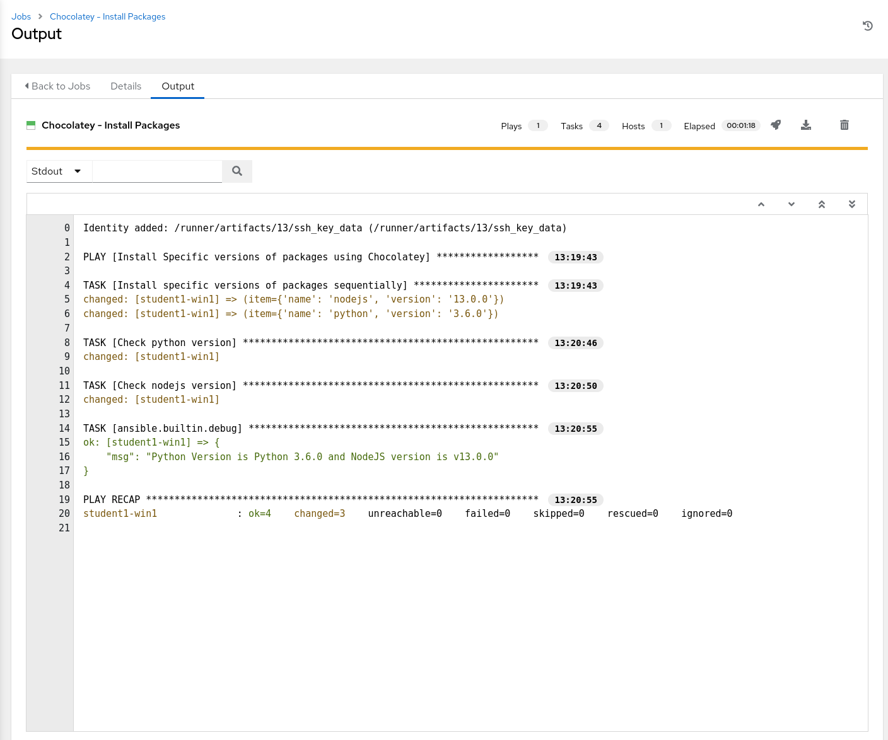
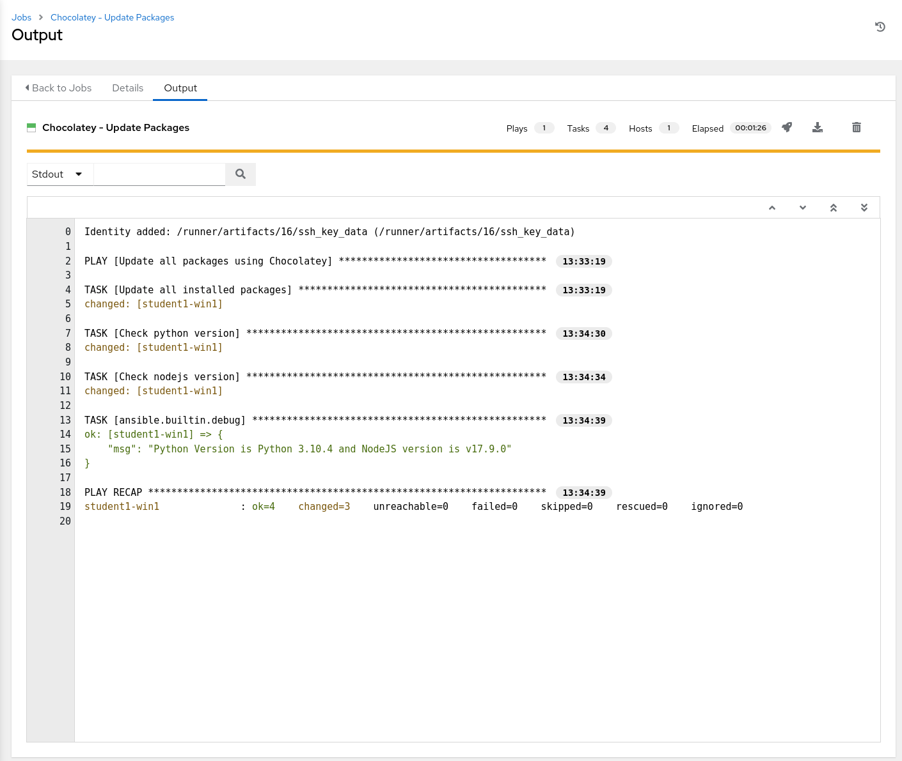
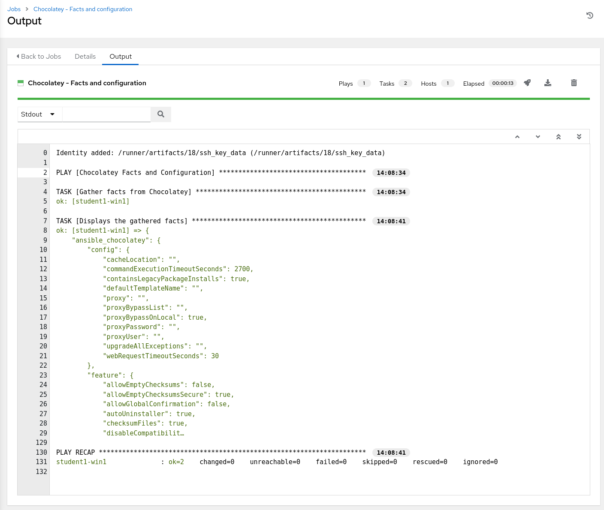
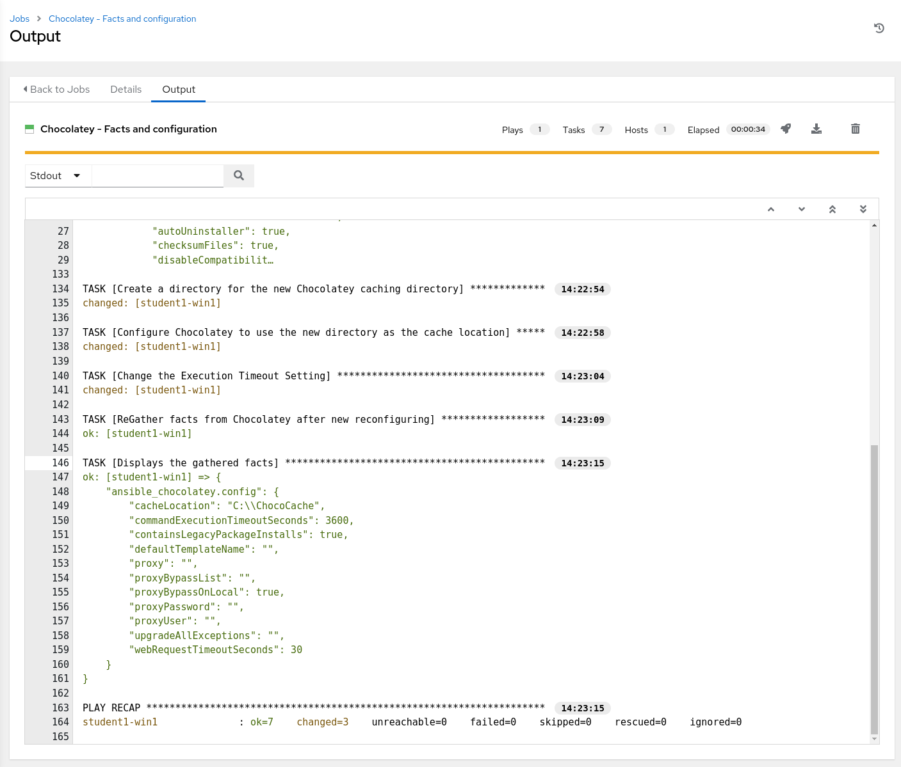

**Read this in other languages**:
<br> [English](README.md),  [日本語](README.ja.md).
<br>

This exercise aims to introduce how Ansible makes it easy to control all aspects of managing Windows software using Chocolatey. We will cover Installing, updating and uninstalling packages, managing different sources, configuring chocolatey clients and other common tasks that a system administrator would take on.

So what is Chocolatey anyways? Simply put, Chocolatey is a package management system for Windows. Chocolatey aims to simplify software management, making it easier to automate your entire Windows software lifecycle.

The open source Chocolatey client offers basic package management functionality, while the Chocolatey For Business suite provides an advanced feature set. Some highlights include:

* Package Builder allows you to take any EXE, MSI, zip, or script and automatically turn it into a Chocolatey package in as little as 5 seconds (and figures out the installer silent arguments for you).
* Package Internalizer takes the 8000+ packages that maintainers have already built for you in the Chocolatey Community Repository, and creates localized offline versions for you to use internally (including dependencies);
* Package Synchronizer will allow you to create Chocolatey packages for applications listed in Programs and Features, and allows you to manage them like any other package.
* Chocolatey Self-Service GUI allows end-users the ability to manage packages without requiring admin rights or elevated permissions.
* Chocolatey Central Management is a web dashboard and API (similar to Ansible Tower) giving you that high-level overview and reporting of your entire estate of endpoints.

*************************************************************************************************

# Section 1: The `win_chocolatey` module

## Step 1 - Install a package using an ad-hoc command

To start, we will use an ad-hoc command to install `git` using the `win_chocolatey` module. The `win_chocolatey` module is used to manage packages on a Windows system using Chocolatey.
<br>
To get started click **Inventories** on the left panel, and then click the name of our Inventory **Workshop Inventory**. Now that you are on the Inventory Details page, we will need to go select our Host. So click **HOSTS**.

Next to each host is a checkbox. Check the box next to each host you want to run an Ad-Hoc Command on. You will then see the **RUN COMMANDS** button become enabled. Click it now.


This will pop up the **Execute Command** window. From here is where we can run a single task against our hosts.

Fill out this form as follows:

| Key                | Value                    | Note                                                            |
|--------------------|--------------------------|-----------------------------------------------------------------|
| MODULE             | `win_chocolatey`         |                                                                 |
| ARGUMENTS          | `name=git state=present` | The name and state of the package                               |
| LIMIT              |                          | This will be pre-filled out for you with the hosts you selected |
| MACHINE CREDENTIAL |Student Account     |                                                                 |



Once you click **LAUNCH** you will be redirected to the Job log.

In the job output, you should see a result that looks like this:



We see that the output reports a CHANGED status to indicate that `git` was installed. The results also shows a warning that the Chocolatey client was missing from the system, so it was installed as a part of this task run. Future tasks that use the `win_chocolatey` module should now detect the client and use it without the need to install anything. To verify, re-run the job by clicking on the rocket icon in the **DETAILS** section, the output now should not have a warning, and will also not report any changes, but instead a SUCCESS status as the `win_chocolatey` module (like most Ansible modules) is idempotent (the run will also take less time because as the previous run installed 2 packages, this run installs none).



And just like that we have `git` installed.

## Step 2 - Install multiple packages with specific versions

In the last step we installed one package in an ad-hoc fashion, however in reality it is more likely that we would want to include package installation as one step in a multi step play. It is also likely that we would want to install multiple packages (possibly even specific versions of said packages). In this exercise we will be doing just that.

Let's start by going back to Visual Studio Code. Under the *WORKSHOP_PROJECT* section Create a directory called **chocolatey** and a file called
`install_packages.yml`

You should now have an editor open in the right pane that can be used for creating your playbook.

<!-- TODO: INSERT Image of Empty text editor here-->
<!--  -->


First we will define our play:

```yaml
---
- name: Install Specific versions of packages using Chocolatey
  hosts: all
  gather_facts: false
  vars:
    choco_packages:
      - name: nodejs
        version: 13.0.0
      - name: python
        version: 3.6.0

```

Since we will not need or use any of the facts gathered by Ansible,  we have disabled fact gathering by setting `gather_facts: false` to decrease overhead. We also defined one dictionary variable named `choco_packages` under the `vars` directive to hold the names and versions of the packages we want to install using Chocolatey.

Next we will add our tasks:

```yaml
  tasks:

  - name: Install specific versions of packages sequentially
    win_chocolatey:
      name: "{{ item.name }}"
      version: "{{ item.version }}"
    loop: "{{ choco_packages }}"

  - name: Check python version
    win_command: python --version
    register: check_python_version

  - name: Check nodejs version
    win_command: node --version
    register: check_node_version

  - debug:
      msg: Python Version is {{ check_python_version.stdout_lines[0] }} and NodeJS version is {{ check_node_version.stdout_lines[0] }}
```

We added 4 tasks to the tasks section:

* The first task uses the `win_chocolatey` module, and will loop over the `choco_packages` variable to install each product with the specified version
* The second and third tasks use the `win_command` module to execute commands to check the version of `python` and `node` respectively, registering the output of each.
* The fourth and final task used the `debug` module to display a message containing the information gathered in steps 2 and 3.

> **Tip**
>
> The `win_chocolatey` module's `name` attribute can actually take a list of packages avoiding the need for a loop, however using a loop will allow you to specify the versions of each package, and install them sequentially if order is relevant. for more information on the `win_chocolatey` module take a look at the [docs](https://docs.ansible.com/ansible/latest/modules/win_chocolatey_module.html).

The completed playbook `install_packages.yml` should look like this:

```yaml
---
- name: Install Specific versoins of packages using Chocolatey
  hosts: all
  gather_facts: false
  vars:
    choco_packages:
      - name: nodejs
        version: 13.0.0
      - name: python
        version: 3.6.0
  tasks:

  - name: Install specific versions of packages sequentially
    win_chocolatey:
      name: "{{ item.name }}"
      version: "{{ item.version }}"
    loop: "{{ choco_packages }}"

  - name: Check python version
    win_command: python --version
    register: check_python_version

  - name: Check nodejs version
    win_command: node --version
    register: check_node_version

  - debug:
      msg: Python Version is {{ check_python_version.stdout_lines[0] }} and NodeJS version is {{ check_node_version.stdout_lines[0] }}
```

Now that the playbook is ready:

* Save your work by Clicking `File > Save` from the menu (or using the Ctrl+S shortcut).
* Commit your changes to git - use a relevant commit message such as *Adding install\_packages.yml*.
* Push the committed changes to your repository by clicking the circular arrows.
* (Optional) Verify that your code is in git by going to GitLab using the information under **GitLab Access**.

Now head back to Ansible Tower, and sync your Project so that Tower Picks up the new playbook. Click **Projects** and then click the sync icon next to your project.


Once this is complete, we will create a new job template. Select **Templates** and click on the  icon, and select Job Template. Use the following values for your new Template:

| Key         | Value                                            | Note |
|-------------|--------------------------------------------------|------|
| Name        | Chocolatey - Install Packages                    |      |
| Description | Template for the install_packages playbook       |      |
| JOB TYPE    | Run                                              |      |
| INVENTORY   | Workshop Inventory                               |      |
| PROJECT     | Ansible Workshop Project                         |      |
| PLAYBOOK    | `chocolatey/install_packages.yml`                |      |
| CREDENTIAL  | Type: **Machine**. Name: **Student Account**     |      |
| LIMIT       | windows                                          |      |
| OPTIONS     |                                                  |      |

<br>



Click SAVE and then Click LAUNCH to run the job. The job should run successfully and you should be able to see Ansible looping and installing the packages specified in our variable



> **Tip**
>
> By now you should be familiar with the flow of creating or editing playbooks, committing your changes and pushing them to git. You should also be comfortable with refreshing your project, creating and running job templates in Ansible Tower. Later steps will no longer list each and every step to do so.

## Step 3 - Updating all installed packages

The `win_chocolatey` module can do more than just install packages, it is also used to uninstall and update packages. The action the module does is based on the value you pass to the `state` parameter. Some of the options you can pass include:

* `present`: Will ensure the package is installed.
* `absent` : Will ensure the package is not installed.
* `latest`: Will ensure the package is installed to the latest available version.

The last playbook did not explicitly define and set a value for `state`, so the default value `present` was used as the set value to the state parameter to install packages, however we installed older versions of packages on purpose, so now we want to update those packages.

In Visual Studio Code, create a new file under the `chocolatey` folder with the name `update_packages.yml`. In this playbook we will create a play that uses the `win_chocolatey` module with `latest` passed in as a value to the `state` parameter. Since we want to update all the packages previously installed by Chocolatey, no specific package name will be provided to the `name` parameter, instead the value `all` will be used.

> **Tip**
>
> Information on using `all` as a value that will be set to the `name` attribute can be found in the `win_chocolatey`'s module [docs](https://docs.ansible.com/ansible/latest/modules/win_chocolatey_module.html). Always check the documentation of a module that you are using for the first time, often there will be useful information that will save you a lot of work.

The contents of `update_packages.yml` are:

```yaml
---
- name: Update all packages using Chocolatey
  hosts: all
  gather_facts: false
  tasks:

  - name: Update all installed packages
    win_chocolatey:
      name: all
      state: latest

  - name: Check python version
    win_command: python --version
    register: check_python_version

  - name: Check nodejs version
    win_command: node --version
    register: check_node_version

  - debug:
      msg: Python Version is {{ check_python_version.stdout_lines[0] }} and NodeJS version is {{ check_node_version.stdout_lines[0] }}
```

The other tasks are there so that we can verify the versions of `nodejs` and `python` after the update task has been run. And that's it, simple right?

Now go ahead and make sure your new playbook is in Git, and that Ansible Tower can see it, and then create and run a new Job template with the following values:

> **Tip**
>
> Sine Almost everything will be similar to the first job template we created to install packages, you can `copy` that job template by going to `Tempates` and clicking on the  icon next to the `Chocolatey - Install Packages` template. This will create a copy of that template that you can then Edit by clicking on its name, and make the changes to the name, description and playbook to run. If you prefer you can also create a playbook from scratch, the choice is yours

| Key         | Value                                            | Note |
|-------------|--------------------------------------------------|------|
| Name        | Chocolatey - Update Packages                     |      |
| Description | Template for the update_packages playbook        |      |
| JOB TYPE    | Run                                              |      |
| INVENTORY   | Workshop Inventory                               |      |
| PROJECT     | Ansible Workshop Project                         |      |
| PLAYBOOK    | `chocolatey/update_packages.yml`                 |      |
| CREDENTIAL  | Type: **Machine**. Name: **Student Account**     |      |
| LIMIT       | windows                                          |      |
| OPTIONS     |                                                  |      |

After running the new Template, examine the `debug` task message, and compare the versions to the ones from the `install_packages` job output. The versions should be higher as those packages were updates (the `git` package that we installed using an adhoc command will also be checked for an update - unlikely that there will be one after minutes of installation).



# Section 2: Chocolatey facts and configurations

Even though the `win_chocolatey` module is what actually is used to manage packages with Chocolatey, it is not the only Chocolatey module available in Ansible, there are other modules to help you manage and configure Chocolatey on your Windows targets. In this exercise we will take a look at two of them: `win_chocolatey_facts` and `win_chocolatey_config`

## Step 1 - Gathering Chocolatey facts

The first module we will use is the `win_chocolatey_facts` module. This module is used to gather information from Chocolatey, such as installed packages, configuration, features and sources, which is useful for tasks suck as report generation, or conditionals defined on other tasks.

> **Tip**
>
> Read more on the `win_chocolatey_facts` in the [docs](https://docs.ansible.com/ansible/latest/modules/win_chocolatey_facts_module.html).

So let's take a closer look at the information gathered by this module by writing a simple playbook to collect and display the collected information.

In Visual Studio Code, under the `chocolatey` folder, create a new file called `chocolatey_configuration.yml`. The contents of that file should be as follows:

```yaml
---
- name: Chocolatey Facts and Configuration
  hosts: all
  gather_facts: false
  tasks:

  - name: Gather facts from Chocolatey
    win_chocolatey_facts:

  - name: Displays the gathered facts
    debug:
      var: ansible_chocolatey
```

The first task uses `win_chocolatey_facts` to gather all the available information from Chocolatey on the target Windows machine, and will store this information in a variable named `ansible_chocolatey`, which is using the `debug` module to print the contents of to examine them closer.

Add your new playbook to your source control repo, and sync your project in Ansible Tower, then create and run a new job template with the following values:

| Key         | Value                                            | Note |
|-------------|--------------------------------------------------|------|
| Name        | Chocolatey - Facts and configuration             |      |
| Description | Template for the chocolatey_configuration playbook |      |
| JOB TYPE    | Run                                              |      |
| INVENTORY   | Workshop Inventory                               |      |
| PROJECT     | Ansible Workshop Project                         |      |
| PLAYBOOK    | `chocolatey/chocolatey_conguration.yml`          |      |
| CREDENTIAL  | Type: **Machine**. Name: **Student Account**     |      |
| LIMIT       | windows                                          |      |
| OPTIONS     |                                                  |      |

<br>

The output of the job should show you the contents of the `ansible_chocolatey` variable collected in the first task.



Scroll through the output and observe the values, you can see the configuration of the Chocolatey client on the Windows target, the enabled and disabled features, the installed packages (do you see the packages we installed in previous exercises?) as well as the sources from which we are installing packages (more on this later!). Note that this information is in a JSON format, so you can access individual values by traversing the object tree. For example if I am only interested in information on the installed packages to let's say generate a report of installed packages, I can use the `ansible_chocolatey.packages` key to access those values.

<br>

> **Tip**
>
> We really did not need to use a `debug` task just to see the information collected by the `win_chocolatey_facts` module, instead, in Ansible Tower's job output pane click on the result of running the task on the Windows target, which will open the host events dialog for that specific host, which shows information about the host affected by the selected event and the output of that event (In this case, the JSON object returned by the `win_chocolatey_facts` module run)

<br>

## Step 2 - Configuring Chocolatey

In the previous step, we saw that we can gather the configurations of the Chocolatey client on the windows target using the `win_chocolatey_facts` module, but what if we want to modify those configurations? Well, there is a module for that!

The `win_chocolatey_config` module can be used to manage Chocolatey configurations by changing the values of configuration options, or unsetting them all together.

<br>

> **Tip**
>
> Read more on the `win_chocolatey_config` in the [docs](https://docs.ansible.com/ansible/latest/modules/win_chocolatey_config_module.html).

<br>

> **Tip**
>
> Read more on Chocolatey configuration [here](https://chocolatey.org/docs/chocolatey-configuration).

We will change the values of two configuration options: `cacheLocation` and `commandExecutionTimeoutSeconds`. In the output of the previous step we saw that the `cacheLocation` was unset or did not have a value configured - the default setting, and that the value for `commandExecutionTimeoutSeconds` was set to the default value of 2700. We will modify those configuration options to:

* set `cacheLocation` to `C:\ChocoCache`.
* set `commandExecutionTimeoutSeconds` to 1 hour or `3600` seconds.

In Visual Studio Code, edit the `chocolatey_configuration.yml` playbook, to add the following tasks:

```yaml
  - name: Create a directory for the new Chocolatey caching directory
    win_file:
      path: C:\ChocoCache
      state: directory

  - name: Configure Chocolatey to use the new directory as the cache location
    win_chocolatey_config:
      name: cacheLocation
      state: present
      value: C:\ChocoCache

  - name: Change the Execution Timeout Setting
    win_chocolatey_config:
      name: commandExecutionTimeoutSeconds
      state: present
      value: 3600

  - name: ReGather facts from Chocolatey after new reconfiguring
    win_chocolatey_facts:

  - name: Displays the gathered facts
    debug:
      var: ansible_chocolatey.config
```

These new tasks will perform the following:

* Create the directory `C:\ChocoCache` using the `win_file` module.
* Modify the value of `cacheLocation` to the newly created directory using `win_chocolatey_config`.
* Modify the value of `commandExecutionTimeoutSeconds` to `3600`.
* Re gather the Chocolatey facts after modifying the configuration values.
* And Finally print out the `config` section from the refreshed Chocolatey facts.

The contents of the `chocolatey_configuration.yml` playbook should now look like this:

```yaml
---
- name: Chocolatey Facts and Configuration
  hosts: all
  gather_facts: false
  tasks:

  - name: Gather facts from Chocolatey
    win_chocolatey_facts:

  - name: Displays the gathered facts
    debug:
      var: ansible_chocolatey

  - name: Create a directory for the new Chocolatey caching directory
    win_file:
      path: C:\ChocoCache
      state: directory

  - name: Configure Chocolatey to use the new directory as the cache location
    win_chocolatey_config:
      name: cacheLocation
      state: present
      value: C:\ChocoCache

  - name: Change the Execution Timeout Setting
    win_chocolatey_config:
      name: commandExecutionTimeoutSeconds
      state: present
      value: 3600

  - name: ReGather facts from Chocolatey after new reconfiguring
    win_chocolatey_facts:

  - name: Displays the gathered facts
    debug:
      var: ansible_chocolatey.config
```

Commit your changes and push them to source control, sync your project in Ansible Tower and run the `Chocolatey - Facts and Configuration` job template.
> **Tip**
>
> Back in [exercise 1](../1-tower), when you created the project in Ansible Tower, you checked an option to `UPDATE REVISION ON LAUNCH` - so we did not really need to refresh the project in Tower, but just in case that option was missed...

The playbook should run and make the configuration changes, and the output from the last `debug` task showing the value of the `ansible_chocolatey.config` section should reflect those changes and show the new values for `cacheLocation` and `commandExecutionTimeoutSeconds`.



<br><br>

And thats it. This exercise covered most Chocolatey related Ansible modules available (with the exception of `win_chocolatey_source` and `win_chocolatey_feature` which you can read about [here](https://docs.ansible.com/ansible/latest/modules/win_chocolatey_feature_module.html) and [here](https://docs.ansible.com/ansible/latest/modules/win_chocolatey_source_module.html). Hopefully you got a taste of the possibilities by using Ansible together with Chocolatey to manage your Windows packages.

<br><br>
[Click here to return to the Ansible for Windows Workshop](../README.md)
