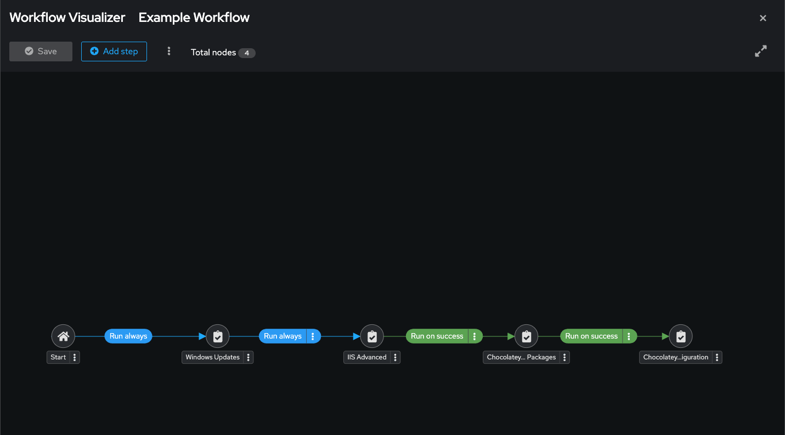
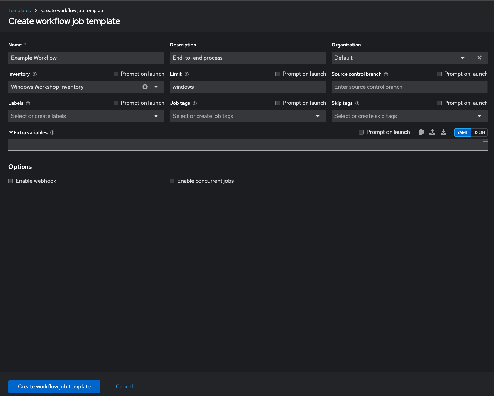
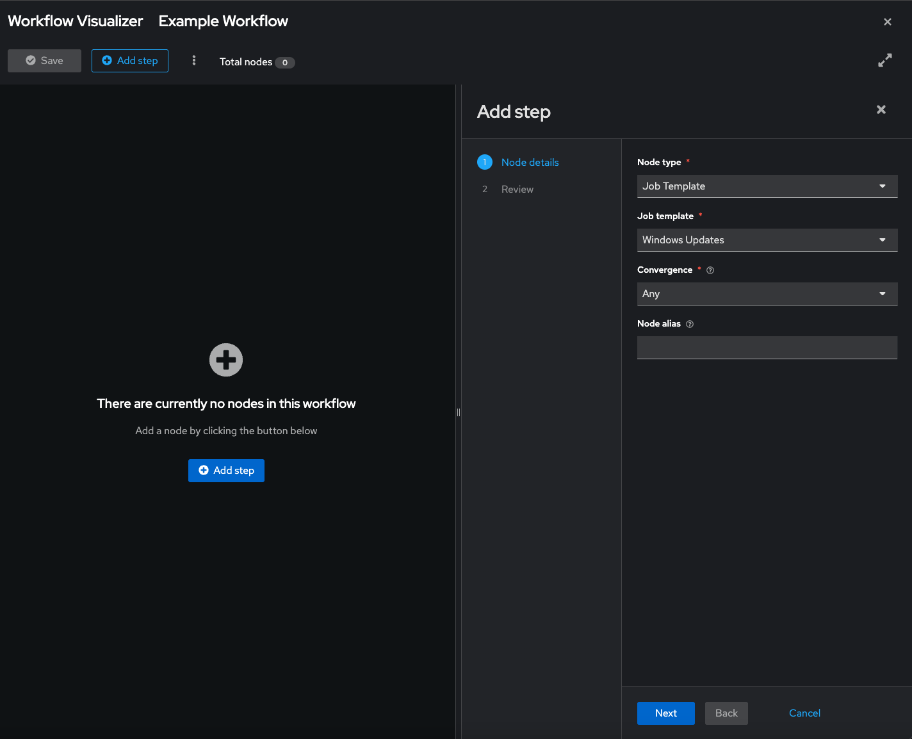
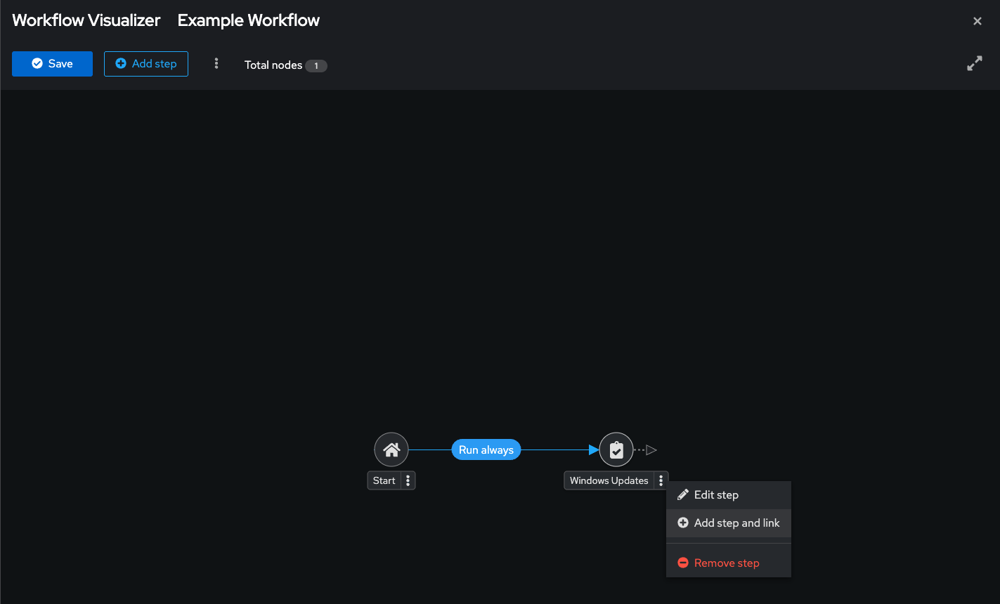
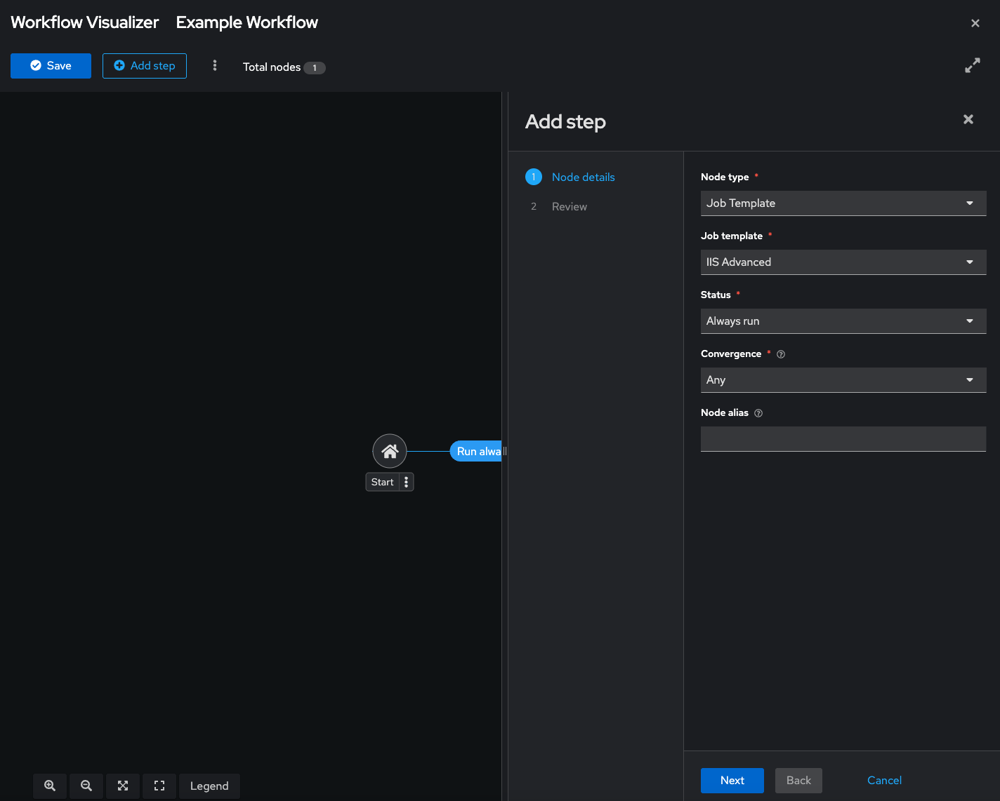
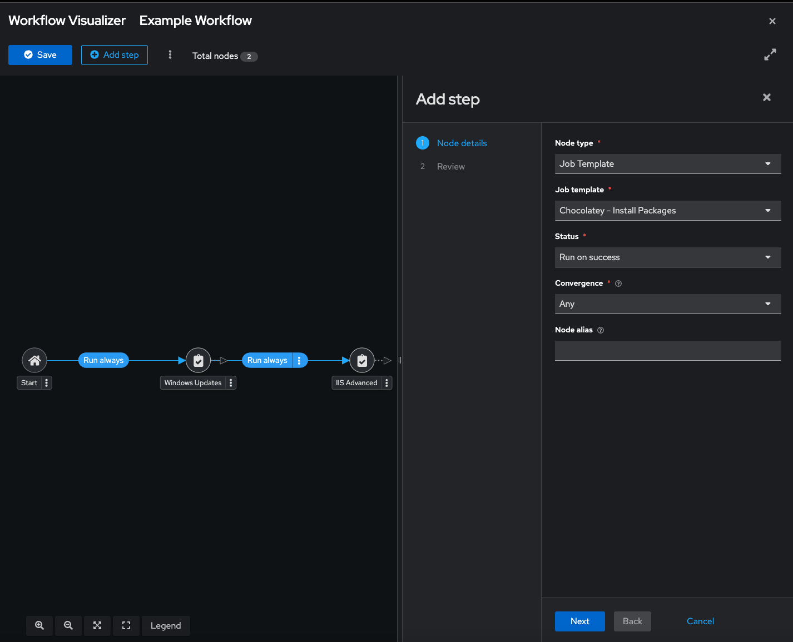
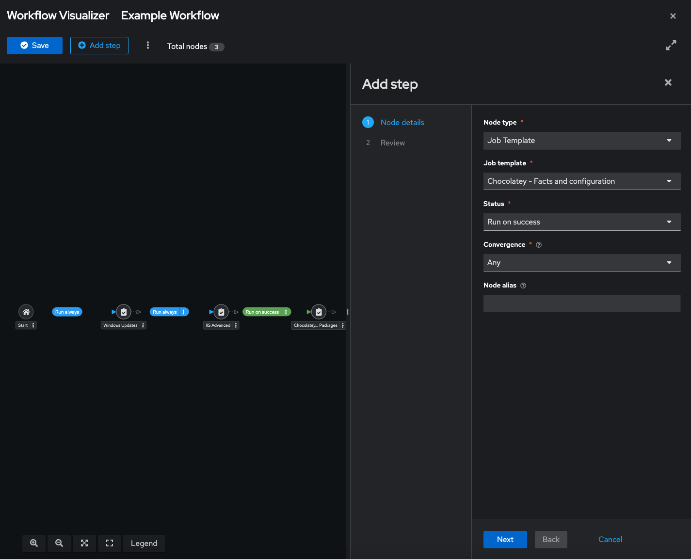
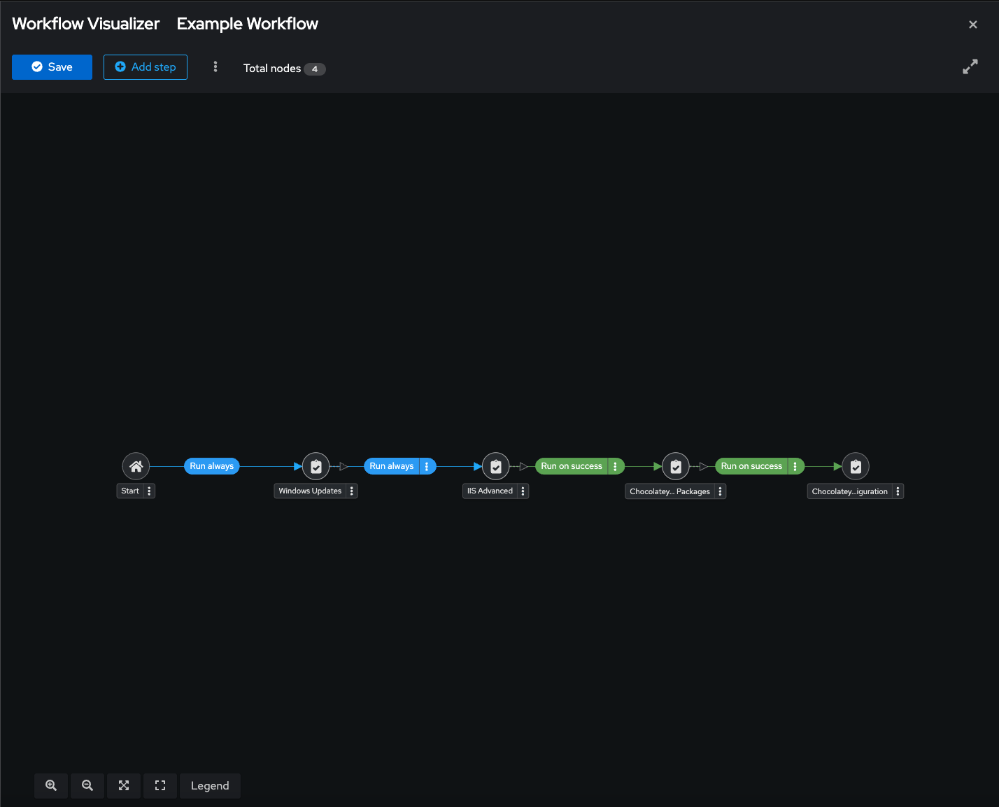
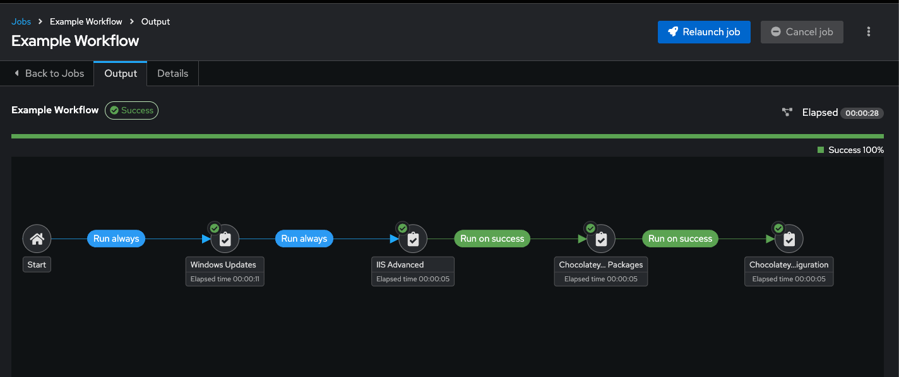

# Ansible ワークフローの作成

この演習では、**Ansible Automation Platform (AAP) 2.x** の **Automation Controller ワークフロー** を作成します。  
ワークフローとは、ジョブテンプレート（および他のノード）を条件付きパスで論理的にリンクするエンドツーエンドのオーケストレーションです。

今回のフローは以下の通りです。

- 選択した最新の Windows 更新プログラムをインストール  
- IIS をインストール（高度なロールを使用）  
- Chocolatey を使って追加パッケージをインストール  
- 最後に Chocolatey のファクトと設定を確認  

条件付きロジック（成功時／失敗時／常時実行）やロールバックパスを追加することも可能です。  
以下の手順は **AAP 2.5 UI** に基づいています。

## セクション 1 — ワークフローの作成

**Workflow Job Template** を作成し、既存のジョブテンプレートをノードとして追加します。

完成形は次のようになります。

### ステップ 1 — 新しいワークフローテンプレート

1. AAP Web UI で **Automation Execution → Templates** に移動します。  
   **Create template** をクリックし、**Create workflow job template** を選択します。

2. 次の値でフォームを入力します。

| キー            | 値                          | 備考 |
|-----------------|-----------------------------|------|
| **Name**        | Example Workflow            |      |
| **Description** | End-to-end process          |      |
| **Organization**| Default                     |      |
| **Inventory**   | Windows Workshop Inventory  |      |
| **Limit**       | windows                     |      |

3. **Create workflow job template** をクリックします。**Workflow Visualizer** が表示されます。（終了した場合は、テンプレートの **Details** ページから再度開くことができます。）

### ステップ 2 — 最初のジョブテンプレート（Windows Updates）の追加

1. **Add step** ボタンをクリックし、右側パネルから **Windows Updates** ジョブテンプレートを選択します。  
2. 次の設定を行います。

| キー              | 値               | 備考 |
|-------------------|------------------|------|
| **Node Type**     | Job Template     |      |
| **Job template**  | Windows Updates  |      |
| **Convergence**   | Any              |      |

3. **Next** をクリックし、次に **Finish** をクリックします。  
4. ビジュアライザーで 3 点リーダーをクリックし、**Add Step and link** を選択します。

### ステップ 3 — IIS Advanced ジョブテンプレートの追加

1. **IIS Advanced** ジョブテンプレートを選択します。  
2. 次の設定を行います。

| キー              | 値              | 備考 |
|-------------------|-----------------|------|
| **Node type**     | Job Template    |      |
| **Job template**  | IIS Advanced    |      |
| **Status**        | Always run      |      |
| **Convergence**   | Any             |      |

4. **Next** → **Finish** をクリックします。

これで、**Windows Updates** → **IIS Advanced** の 2 段階プロセスになりました。IIS は更新結果に関係なく実行されます。（後で失敗時の通知を追加できます。）

### ステップ 4 — Chocolatey ステップの追加

1. **IIS Advanced** 上にマウスを置き、3 点リーダーをクリックして **Add step and link** を選択し、**Chocolatey – Install Packages** を選択します。  
   設定は以下の通りです。

| キー              | 値                           | 備考 |
|-------------------|------------------------------|------|
| **Node type**     | Job Template                 |      |
| **Job template**  | Chocolatey - Install Packages|      |
| **Status**        | Run on success               |      |
| **Convergence**   | Any                          |      |

2. **Next** → **Finish** をクリックします。  
3. **Chocolatey – Install Packages** 上にマウスを置き、3 点リーダーをクリックして **Add step and link** を選択し、**Chocolatey – Facts and configuration** を選びます。  
   設定は以下の通りです。

| キー              | 値                                  | 備考 |
|-------------------|-------------------------------------|------|
| **Node type**     | Job Template                        |      |
| **Job template**  | Chocolatey - Facts and configuration|      |
| **Status**        | Run on success                      |      |
| **Convergence**   | Any                                 |      |

4. **Next** → **Finish** をクリックします。

5. ビジュアライザーで **Save** をクリックしてフローを保存します。

## セクション 2 — ワークフローの実行

1. 左ナビゲーションから **Automation Execution → Templates** に移動します。  
2. **Example Workflow** の **ロケット（Launch）** アイコンをクリックして開始します。テンプレートを開き、**Launch template** をクリックすることもできます。

各ノードの実行結果がリアルタイムで表示されます。

すべてが正常に動作すれば、結果は次のようになります。

