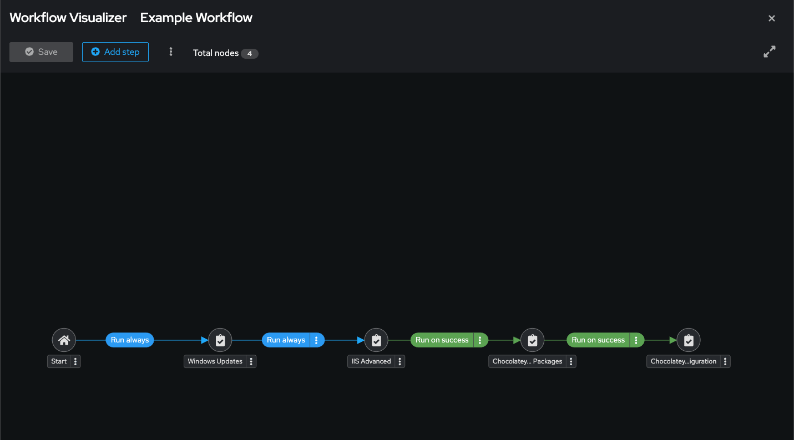
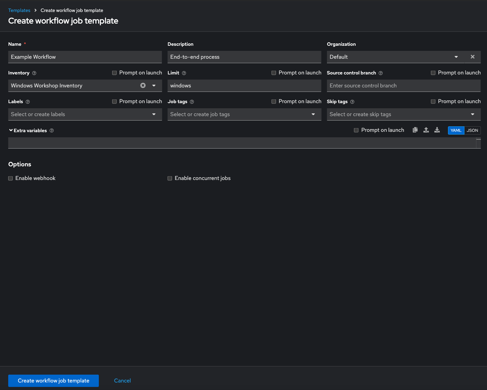
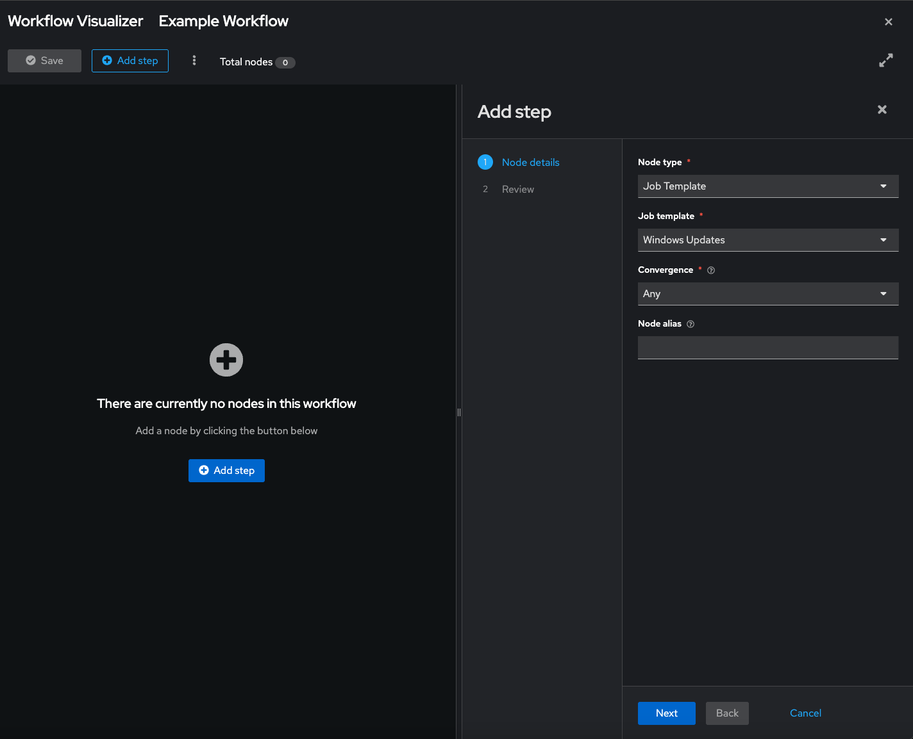
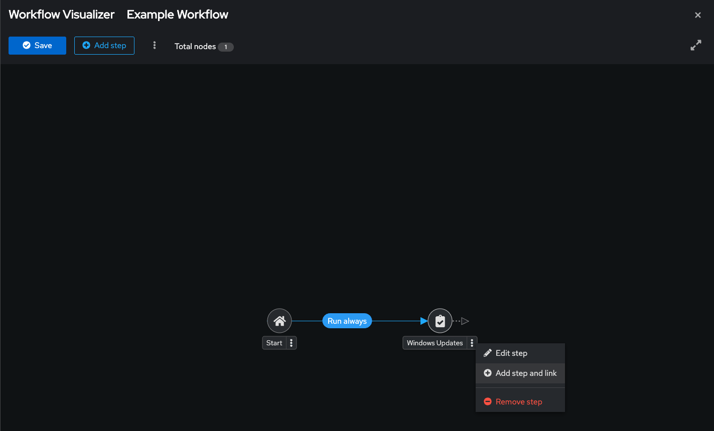
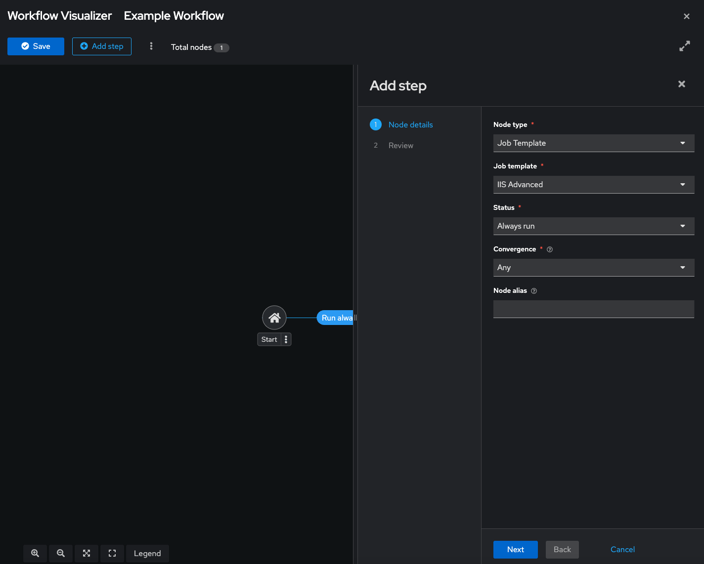
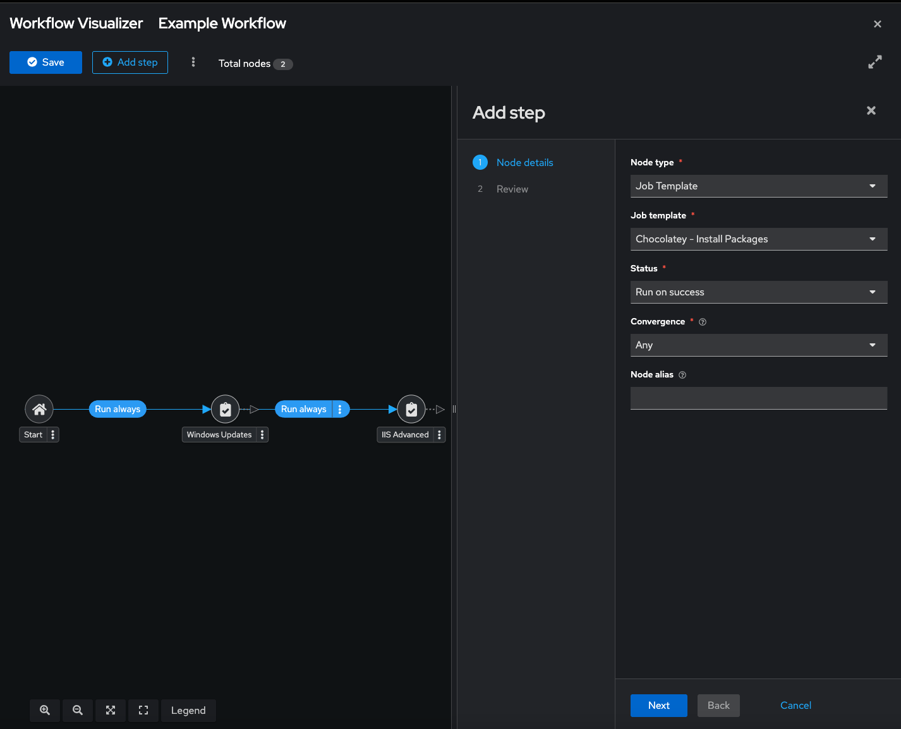
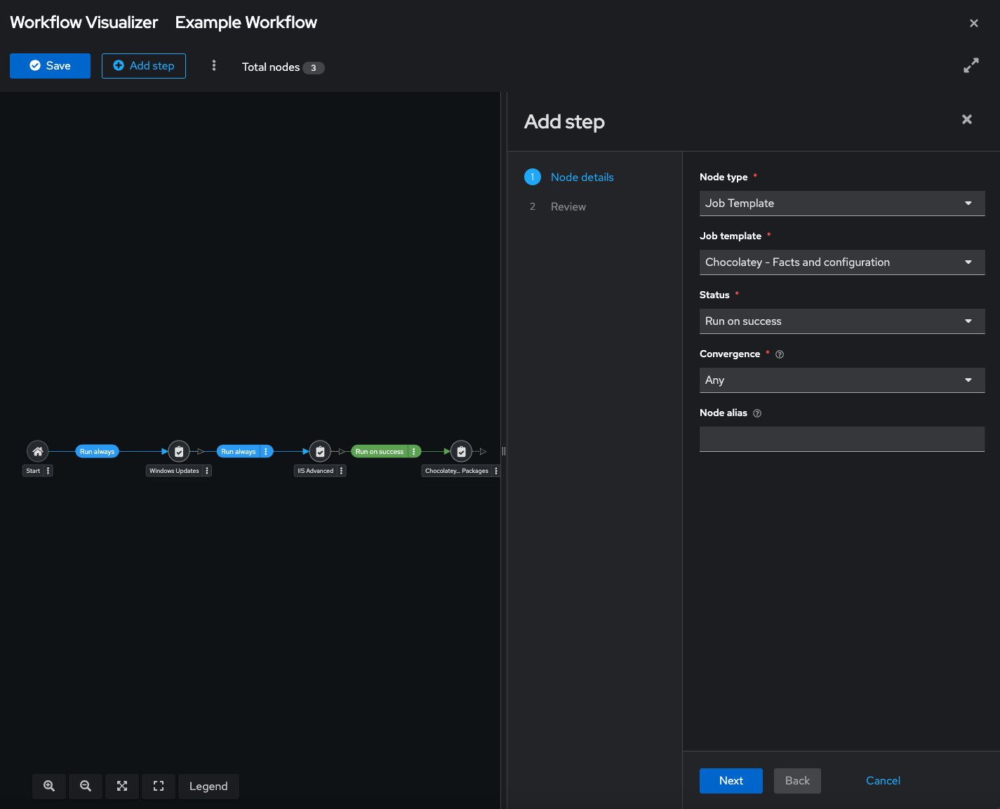
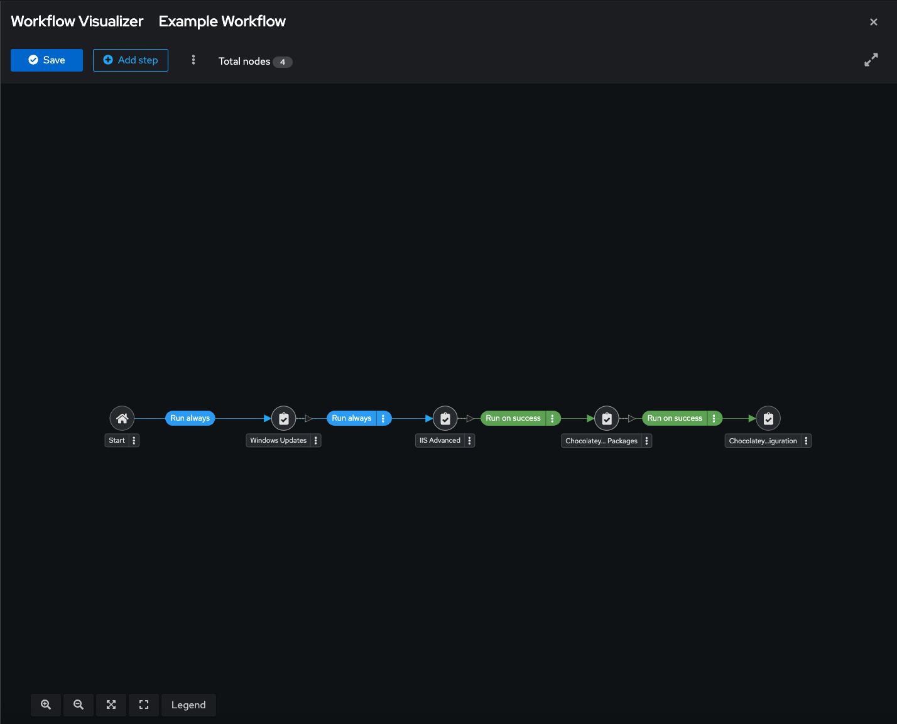
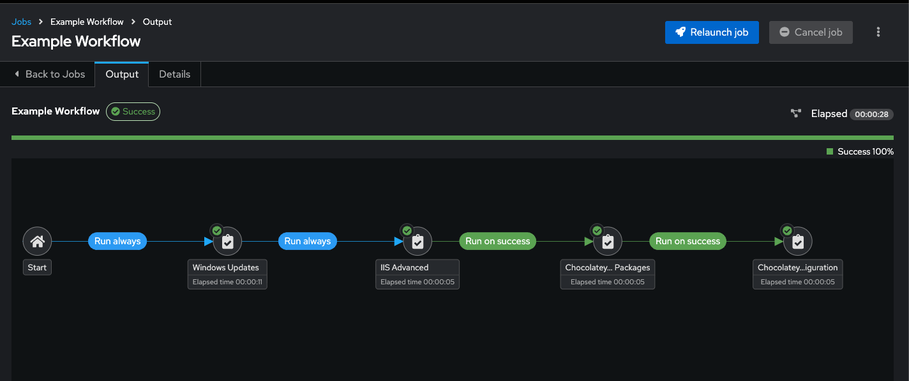

This exercise is designed to use everything you'll already put together, into something called a workflow.

You can think of a workflow as an end-to-end automation orchestration process, allowing you to link up automation plays and roles into a logical flow to get something done.

In our case, our flow will be:
- install latest selected Windows Updates
- install IIS (using our advanced role)
- Install additional packages (using chocolatey)
- and finally, checking those chocolatey facts and configuration

We can wrap some basic conditional logic around it all, and you can have things like a rollback mechanism, to cope with when things might not quite work out.

Section 1 - Creating your Workflow
==================================

We are going to create a new workflow template, into each we'll add our existing automation.

It'll look like this when we're finished:

Step 1:
-------

Go to *Template*, click *Add* and select `Workflow Template` to create a new workflow template.

Complete the form using the following values

| Key                | Value                      | Note |
|--------------------|----------------------------|------|
| NAME               | Example Workflow           |      |
| DESCRIPTION        | End-to-end process         |      |
| ORGANIZATION       | Default                    |      |
| INVENTORY          | Windows Workshop Inventory |      |
| LIMIT              | windows                    |      |

Click SAVE  and you'll be placed in the workflow visualizer.

Step 2:
-------

Click on the Start box and select **Windows Updates** from the selection on the right hand side.

Select the following properties:

| Key                | Value                      | Note |
|--------------------|----------------------------|------|
| RUN                | Always                     |      |
| CONVERGENCE        | Any                        |      |

Click on Prompt, Next and Confirm on the pop-up.

Back on the main visualizer screen, click on Select.

Stage one of our workflow added!

Hover over the **Windows Update** box and click on the green +

In the next box, select the **IIS Advanced** template.

Select the following properties:

| Key                | Value                      | Note |
|--------------------|----------------------------|------|
| RUN                | Always                     |      |
| CONVERGENCE        | Any                        |      |

Click on Prompt.

Change the message to read "created in our workflow example" (or similar) and press Next and Confirm on the pop-up.

Back on the main visualizer screen, click on Select.

We now have a 2 stage process! First we'll do a Windows update and then do the IIS advanced install **regardless** of whether the updates work or not. We may not care at this point if the updates work, but can setup notifications to fire on failure to alert someone/thing.

Let's add more to could represent some of an application deployment perhaps.

Hover over the **IIS Advanced** box and click on the green +

In the next box, select the **Chocolatey - Install Packages** template.

Select the following properties:

| Key                | Value                      | Note |
|--------------------|----------------------------|------|
| RUN                | On Success                 |      |
| CONVERGENCE        | Any                        |      |

Back on the main visualizer screen, click on Select.

Hover over the **Chocolatey - Install Packages** box and click on the green +

In the next box, select the **Chocolatey - Facts and configuration** template.

Select the following properties:

| Key                | Value                      | Note |
|--------------------|----------------------------|------|
| RUN                | On Success                 |      |
| CONVERGENCE        | Any                        |      |

Click on **Select**.

Click on **Save**.

You will be returned to the Templates Screen - now make sure you click **Save** here!

Section 2: Running your new workflow
====================================

Now let’s run it and see how it works.

Step 1:
-------

Select TEMPLATES

> **Note**
>
> Alternatively, if you haven’t navigated away from the templates
> creation page, you can scroll down to see all existing templates

Step 2:
-------

Click the rocketship icon  for the
**Example Workflow** Workflow Template.

After the workflow launches, you can watch the output of the workflow in realtime.

If all goes well, you should see output resembling the following:

