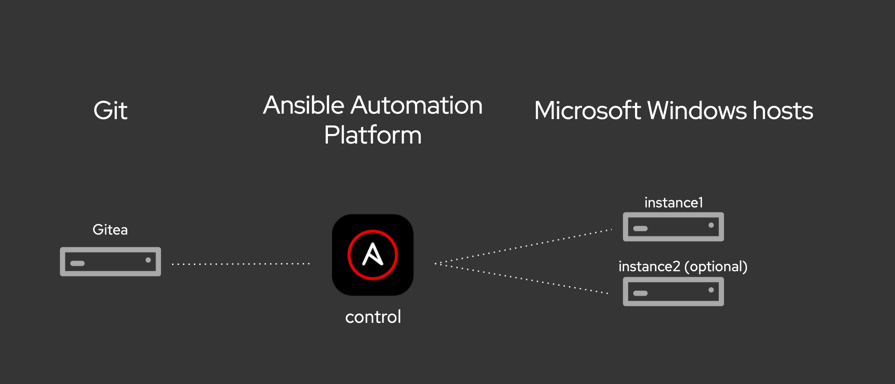

# Ansible Workshop - Ansible for Windows Automation

**Read this in other languages**:
  [English](README.md),  [日本語](README.ja.md),  [Français](README.fr.md).
 

This workshop guides you through configuring Ansible automation controller to connect to Windows Server instances for automating various operational tasks. Once Ansible automation controller is configured, you will start with automating simple tasks and then progress to more advanced use cases such as patching and leveraging third-party solutions to enhance automation (Chocolatey). There are minimal client requirements for you to interact with the workshop because you only need a compatible Web browser. This workshop has reduced requirements for Linux knowledge and other command line tools.

## Presentations

The presenter deck is available here:
[Ansible Windows Automation](../../decks/ansible_windows.pdf)

## Time planning

The time required to do the workshops strongly depends on a couple factors: the number of participants and how much discussions are done in between.

Having said that, the exercises themselves should take roughly 4-5 hours. The accompanying presentation itself adds another hour.

If your experience is different in scheduling these workshops, please let us know and file an issue.

## Lab Diagram

## Exercises

* [Exercise 1 - Intro and configuration of Ansible Tower](1-tower)
* [Exercise 2 - Ad-hoc commands](2-adhoc)
* [Exercise 3 - Intro to playbooks](3-playbook)
* [Exercise 4 - Ansible Tower projects](4-projects)
* [Exercise 5 - Advanced playbooks](5-adv-playbook)
* [Exercise 6 - Ansible roles](6-roles)
* [Exercise 7 - Patching Windows](7-win-patch) (optional)
* [Exercise 8 - Chocolatey](8-chocolatey) (optional)
* [Exercise 9 - Windows Workflow](9-win-workflow)
