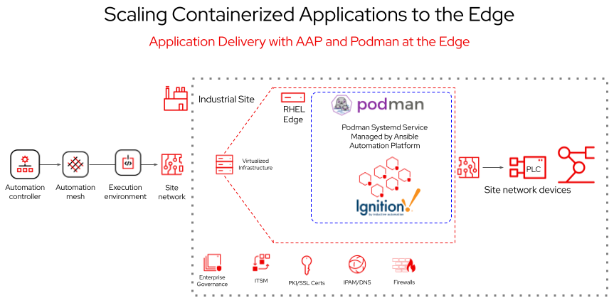

# Getting started with Ansible Automation Platform and edge

##  <a href="https://play.instruqt.com/embed/redhat/tracks/getting-started-edge-lab?token=em_VX7rLMJ7-5Hf8WoX" target="_blank">🚀 Launch the lab</a> 

## Overview

This self-paced lab covers how Ansible Automation Platform provides a consistent automation solution to create, deploy and manage distributed environments, such as the edge.

### Lab challenges

* Installing a containerized industrial edge application
* Deploying a monitoring solution
* Configuring the edge firewall
* Simplifying the process using an <a href="https://docs.ansible.com/automation-controller/latest/html/userguide/workflows.html" target="_blank">automation controller workflow</a>

There’s also a playground section you can use to experiment and explore!

## Presentation Deck

* <a href="https://docs.google.com/presentation/d/1WDw5QjAE74LfZUACrQUgYVRb61FP3zjaqnFwfOJet60/edit?usp=sharing" target="_blank">Google Slides</a> - For Red Hat employees

* <a href="https://github.com/ansible/instruqt/blob/devel/webpages/decks/lab-edge.pdf" target="_blank">PDF</a> - For everyone

## Playbook examples

* <a href="https://github.com/craig-br/instruqt-track-content/tree/devel/getting-started-edge-lab/playbooks" target="_blank">Playbook repository</a>

## Lab Diagram

