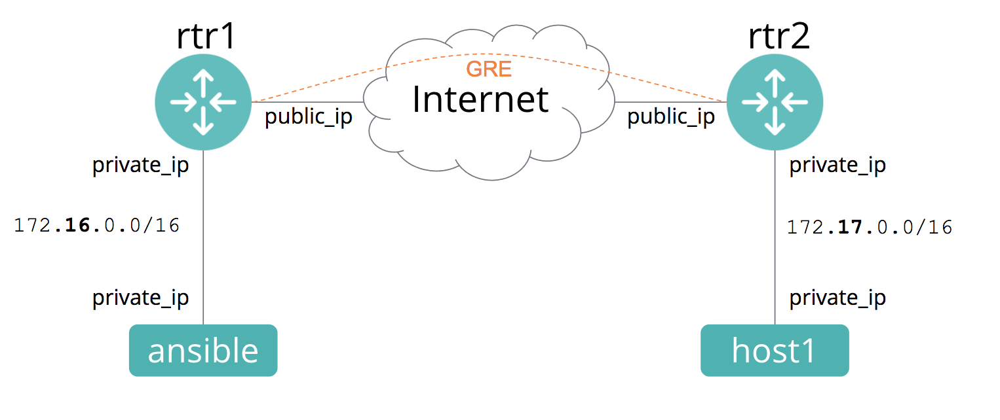

# 演習 1.3 - GRE トンネルの作成

次のplaybookを作成しましょう。このplaybookではGeneric Routing Encapsulation Tunnelを作成します。rtr1 と rtr2 間の[GRE トンネル](https://en.wikipedia.org/wiki/Generic_Routing_Encapsulation) を意味します。

playbookを作成する前に、何を作成するかを見ていきましょう。
- VPC-1、VPC-2と、2つのVPCがあります。rtr1 と rtr2 がそれぞれの VPC に存在します
- rtr1 と rtr2 間のGREトンネルを利用して、2つのVPCをブリッジさせます



## 目次
- [ステップ 1: workshop ディレクトリへの移動](#)
- [ステップ 2: playbook gre.yml を作ってみよう](#)
- [ステップ 3: playbookのセットアップ](#)
- [ステップ 4: R1 用 task の追加](#)
- [ステップ 5: R2 用 play のセットアップ](#)
- [ステップ 6: playbook の実行](#)

**学ぶこと:**
 - ios_config モジュール
 - parents キーワード
 - 条件分 (`when` clause)

 ---

## ステップ 0: pingが到達できないことを確認する

ここからの演習では2つのルーターにトンネルとルーティングの設定をしてホスト間の通信を可能にします。この時点で`host1`の`private_ip`にpingが到達できないことを確認してください。

```bash
ping 172.16.17.xx
```

## ステップ 1: workshop ディレクトリへの移動

```bash
cd ~/networking-workshop
```

## ステップ 2: playbook gre.yml を作ってみよう

```bash
vim gre.yml
```

## ステップ 3: playbookのセットアップ

このplaybookでは、GREトンネルの両サイドを定義する必要があります。tunnel source は物理インターフェースで構成します。tunnel destination は到達可能なIPアドレスを指定する必要があります。このケースで rtr1 の tunnel destination は rtr2 のパブリックIPアドレスである必要があります。

```bash
---
- name: Configure GRE Tunnel between rtr1 and rtr2
  hosts: routers
  gather_facts: no
  connection: network_cli
```

また **2つの変数** が必要です。rtr1 と rtr2 のパブリックIPが必要です。なお、これらのIPアドレスはワークショップ参加者それぞれで異なる状態である必要があります。 Ansibleノード上の `~/networking-workshop/lab_inventory/hosts` にパブリックIPアドレスを見つけることができます。ここではそれらをそれぞれ `rtr1_public_ip` と `rtr2_public_ip` と呼びます。一旦IPアドレスは 1.1.1.1 と 2.2.2.2 としていますが、これらを置き換えてください。または以下のように動的モードを使用してください:
```yml
  vars:
     #Variables can be manually set like this:
     rtr1_public_ip: "1.1.1.1"
     rtr2_public_ip: "2.2.2.2"
```

または以下のように他のホスト変数を動的に参照することもできます:


```yml
  vars:
    rtr1_public_ip: "{{hostvars['rtr1']['ansible_host']}}"
    rtr2_public_ip: "{{hostvars['rtr2']['ansible_host']}}"
```


hostvars は、ホスト定義変数を意味します。`rtr1` と `rtr2` は具体的ホストを表しています。`ansible_host`はパブリックIPアドレス(Ansibleで接続する際に使うIPアドレス)を表しています。これらのホスト変数はインベントリ `~/networking_workshop/lab_inventory/hosts` から収集されます。

## ステップ 4: R1 用 task の追加


```bash
  tasks:
  - name: create tunnel interface to R2
    ios_config:
      lines:
        - 'ip address 10.0.0.1 255.255.255.0'
        - 'tunnel source GigabitEthernet1'
        - 'tunnel destination {{rtr2_public_ip}}'
      parents: interface Tunnel 0
    when:
      - '"rtr1" in inventory_hostname'
```    


上では `when` の行が存在します。これは条件を表しています。inventory_hostnameが `rtr1` に合致する場合、task が実行されます。合致しない場合は **スキップ** されます。**スキップ** を見ることができるのは when を使用する時のみとなります。[conditionals の情報詳細はこちらをclick](http://docs.ansible.com/ansible/latest/playbooks_conditionals.html)

## ステップ 5: R2 用 play のセットアップ


```bash
  - name: create tunnel interface to R1
    ios_config:
      lines:
        - 'ip address 10.0.0.2 255.255.255.0'
        - 'tunnel source GigabitEthernet1'
        - 'tunnel destination {{rtr1_public_ip}}'
      parents: interface Tunnel 0
    when:
      - '"rtr2" in inventory_hostname'
```

playbookを書き終えたら、保存しましょう。`vi` または `vim`にて、`write/quit` を使用(例: Escキー押下後、wq!実行)し、playbookを保存します。2つの playbookができました。では実行してみましょう。

## ステップ 6: playbook の実行
gre.yml playbookを実行しましょう。
```bash
ansible-playbook gre.yml
```

投入されたコンフィグを確認するには`rtr1`,`rtr2`のIPアドレス`ansible_host`に`ec2-user`で接続します。演習用のコントローラーホストからの接続する際にパスワードは求められません。

```
ssh -l ec2-user yyy.yyy.yyy.yyy
```


conditionals を使用したplaybookは完成です。このモジュールで利用可能な別のパラメータ情報は[ios_config モジュール](http://docs.ansible.com/ansible/latest/ios_config_module.html) を確認してください。

# 完了
演習 1.3 のラボは完了です。

# 答え
[こちらをclick](https://github.com/network-automation/linklight/blob/master/exercises/networking/1.3-gre/gre.yml).

 ---
[Click Here to return to the Ansible Linklight - Networking Workshop](../README.ja.md)
