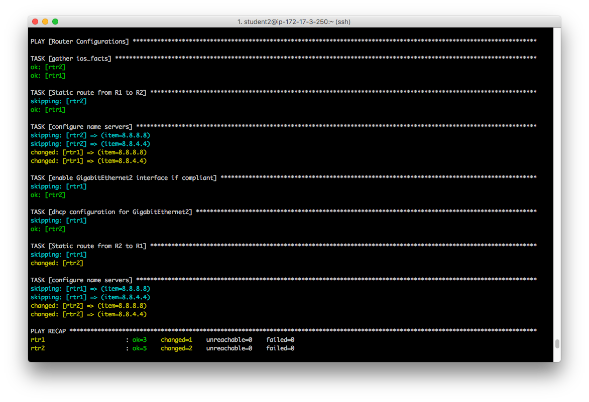

# 演習 1.4 - ルータの追加設定

前の演習ではAnsibleの基本を見てきました。この演習ではさらにplaybookに柔軟性とパワフルさを追加してくれるAnsibleのコンセプトを紹介します。

## 目次
 - [紹介](#intro)
 - [セクション 1 - playbookに変数を使う](#section-1---using-variables-in-a-playbook)
 - [セクション 2 - rtr1のブロックを作成する](#section-2---create-a-block-for-rtr1)
 - [セクション 3 - rtr2を設定する](#section-3---configuring-rtr2)
 - [Section 4 - routing_configs playbook を実行する](#section-4---running-your-routing_configs-playbook)
 - [Section 5: レビュー](#section-5-review)
 - [Section 6: テスト!](#section-6-test)

## 紹介

Ansibleはtaskをシンプルに、かつ繰り返し可能になっています。Ansible playbookを実行する際、全てのシステムが全く同じ状態ではなく、僅かな違いを合わせる必要があります。

- **変数** システム間の差異を変数で埋め、ポートやIPアドレス、そしてディレクトリの変更が出来るようにします。
- **ループ** ループを使えば同じtaskを何度でも繰り返すことができます。10のパッケージをインストールする場合などが分かりやすい例でしょう。 ループを用いれば、これを1つのtaskで行えます。
- **ブロック** taskの論理グループや、play内のエラーハンドリングにおいて利用します。ブロックレベルであるタスクを実行したい場合、データや指示をタスク共通でセットしたい場合に使いやすいです。

**jinja?** - jinja2 は Ansible に動的表現と変数へのアクセスを可能にします。

変数、ループ、ブロック、jinja2のすべてを把握するには、以下のAnsible Document内容を確認してください:
- [Ansible 変数](http://docs.ansible.com/ansible/playbooks_variables.html)
- [Ansible ループ](http://docs.ansible.com/ansible/playbooks_loops.html)
- [Ansible ブロック](http://docs.ansible.com/ansible/latest/playbooks_blocks.html)

## セクション 1 - plsybook内の変数の利用

まずは新しい router_configs.yml という名のplaybookを作成してみましょう。

新たなplaybookを作成するため、networking-workshopディレクトリに移動します。

```bash
cd ~/networking-workshop
vim router_configs.yml
```
4つの変数をセットします :
  - **ansible_network_os**: ネットワークOSタイプを決めるため、Minimum Viable Platform Agnostic (MVPA) モジュール (**_net** モジュール として知られています) を使用します
  - **dns_servers**: `rtr1` と `rtr2` 上に設定したい複数のDNSサーバのリスト
  - **host1_private_ip**: `host1` が使う プライベートアドレス 172.17.X.X
  - **control_private_ip**: `ansible` が使う プライベートアドレス 172.16.X.X

**host1** ノード と **ansible** ノード の private_ips を取得する必要があります:

 - IPアドレスは private_ip=x.x.x.x として右記ファイルに設定されます: `~/networking-workshop/lab_inventory/hosts`

変数は以下にあるように hostvars と呼ばれる変数に動的に呼び出されます。


```yml
---
- name: Router Configurations
  hosts: routers
  gather_facts: no
  connection: network_cli
  vars:
    ansible_network_os: ios
    dns_servers:
      - 8.8.8.8
      - 8.8.4.4
    host1_private_ip: "{{hostvars['host1']['private_ip']}}"
    control_private_ip: "{{hostvars['ansible']['private_ip']}}"
```      


## セクション 2: Create a block for rtr1
ブロックを作成し、条件付きでrtr1 用の task を追加します。わかりやすい playbook にするためコメントを追加します。


```
  tasks:
    ##Configuration for R1
    - block:
      - name: Static route from R1 to R2
        ios_static_route:
          prefix: "{{host1_private_ip}}"
          mask: 255.255.255.255
          next_hop: 10.0.0.2
      - name: configure name servers
        ios_system:
          name_servers: "{{item}}"
        with_items: "{{dns_servers}}"
      when:
        - '"rtr1" in inventory_hostname'
```


 ここで何が起きているか？
  - `vars:` この後に続いて記述されるものが変数名であることをAnsibleに伝えています
  - `dns_servers` dns_serversと命名したリスト型（list-type）の変数を定義しています。その後に続いているのは、DNSサーバのリストです
  - `{‌{ item }}` この記述によって 8.8.8.8 や 8.8.4.4 といったリストのアイテムを展開するようAnsibleに伝えています。
  - `with_items: "{‌{ dns_servers }}` これがループの本体で、Ansibleに対して `dns_servers` に含まれている全ての `item` に対してこのtaskを実行するよう伝えています。
  - `block:` このブロックは関連するいくつかのtaskを持ちます
  - `when:` when 節 はブロックと関連しています。特定の条件に合致する場合、ブロック内で全てのtaskを実行するようAnsibleに伝えます。

## セクション 3 - rtr2 の設定

このブロック内に4つのtaskがあります
- ios_interface
- ios_config
- ios_static_route
- ios_system


```yml
    ##Configuration for R2
    - block:
      - name: enable GigabitEthernet1 interface if compliant
        ios_interface:
          name: GigabitEthernet1
          description: interface to host1
          state: present
      - name: dhcp configuration for GigabitEthernet1
        ios_config:
          lines:
            - ip address dhcp
          parents: interface GigabitEthernet1
      - name: Static route from R2 to R1
        ios_static_route:
          prefix: "{{control_private_ip}}"
          mask: 255.255.255.255
          next_hop: 10.0.0.1
      - name: configure name servers
        ios_system:
          name_servers: "{{item}}"
        with_items: "{{dns_servers}}"
      when:
        - '"rtr2" in inventory_hostname'
```


**そして何が起こった?**
  - [ios_interface](https://docs.ansible.com/ansible/latest/modules/ios_interface_module.html): このモジュールはインターフェースの状態 (up, admin down, など) を定義することができます。このケースでは GigabitEthernet1 は起動しており、かつ正しい記述であることを確かめています。
  - [ios_config](http://docs.ansible.com/ansible/latest/ios_config_module.html): 前のplaybookでこのmoduleは使用していました。2つのtask(ip addr + static route)は結合できますが、特定の状態に至った場合ににtaskを分解するほうが好ましい場合もあります。  
  - [ios_system](https://docs.ansible.com/ansible/latest/ios_system_module.html): このモジュールは net_interface に似ており、ネットワーク装置のシステム属性を管理します。ルータに渡したい name_servers をフィードする際にこのモジュールをループと共に使用します。
  - [ios_static_route](https://docs.ansible.com/ansible/latest/ios_static_route_module.html): このモジュールはネットワーク装置のスタティックIPのルートを管理するために利用します。

## セクション 4 - routing_configs playbookの実行

### ステップ 1: 正しいディレクトリにいることを確認

```bash
cd ~/networking-workshop
```

### ステップ 2: playbookの実行

```bash
ansible-playbook router_configs.yml
```

## セクション 5: レビュー

うまくいけば、以下とよく似た標準出力が見れるはずです。もしうまくいかなかった時は教えてください。直すのをお手伝いします。



出力が上と似ていれば、Playbookは無事に実行されました。

それでは、簡単にここまでのおさらいをしましょう。

 - 適用したいサーバーの名前を変数として宣言しました
 - それから、ios_factsモジュールが生成した値をPlaybookの後のタスクで使用できるように登録しました
 - 次に{inventory_hostname}を使って条件のブロックを作りました
 - 条件が合った時、すなわちrtr1の時はスタティックルートとネームサーバの設定を適用しました
 - rtr2の場合はGigabitEthernet1をenable、DHCPアドレスを受け取れるように設定、rtr1と同様のスタティックルートとネームサーバの設定をしました

## セクション 6: テスト!

異なるVPCにあるホストにPingができるはずです。2つのVPCをGREトンネルで繋ぎ、2つのサブネット間でルーティングできるようにスタティックルートを追加しました。

```bash
ping <private IP of host node>
```

ホストノードのIPアドレスは、インベントリーファイル `~/networking-workshop/lab_inventory/hosts` に private_ip=172.17.x.x として記載されています。

例:
```bash
[ec2-user@ip-172-17-3-27 networking-workshop]$ ping 172.18.4.188
PING 172.18.4.188 (172.18.4.188) 56(84) bytes of data.
64 bytes from 172.18.4.188: icmp_seq=2 ttl=62 time=2.58 ms
64 bytes from 172.18.4.188: icmp_seq=3 ttl=62 time=3.52 ms
```
**Note** IPアドレスは172.18.4.188とは違うかもしれません!

**Help!** ping が動かない場合
まれに host route (Ansible コントローラーノードから rtr1, host1 から rtr2) が正しく設定されてない場合があります, これは本来 provisioner での初期設定時に完了されているべきものです、しかし簡単にAnsibleから修正することが可能です。

`host-routes.yml` playbook を実行してください。

```bash
cd ~/networking-workshop/1.4-router_configs
ansible-playbook host-routes.yml
```

# Answer Key
[ここをクリック](https://github.com/network-automation/linklight/blob/master/exercises/networking/1.4-router_configs/router_configs.yml).

# 完了
演習1.4が終了しました

 ---
[Click Here to return to the Ansible Linklight - Networking Workshop](../README.ja.md)
