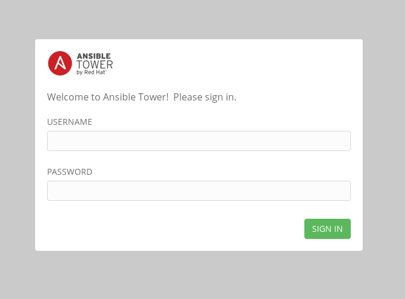
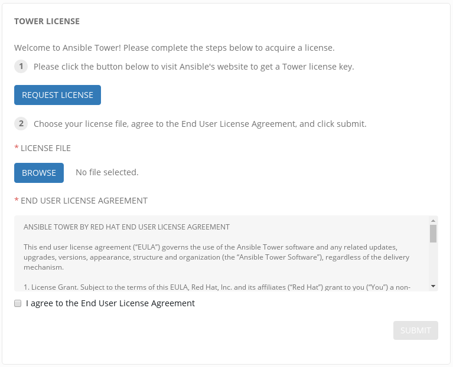
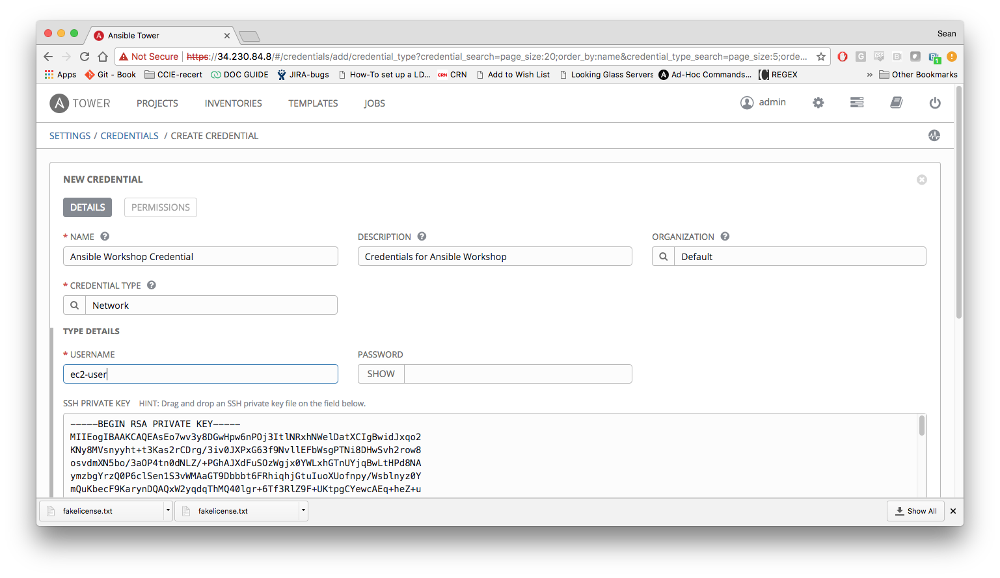
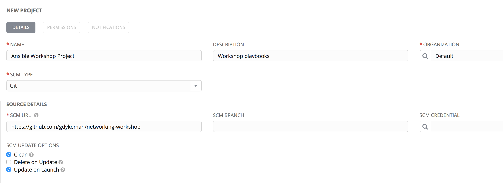
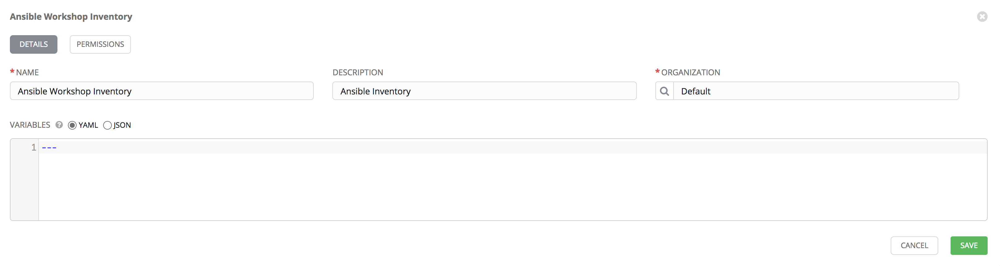
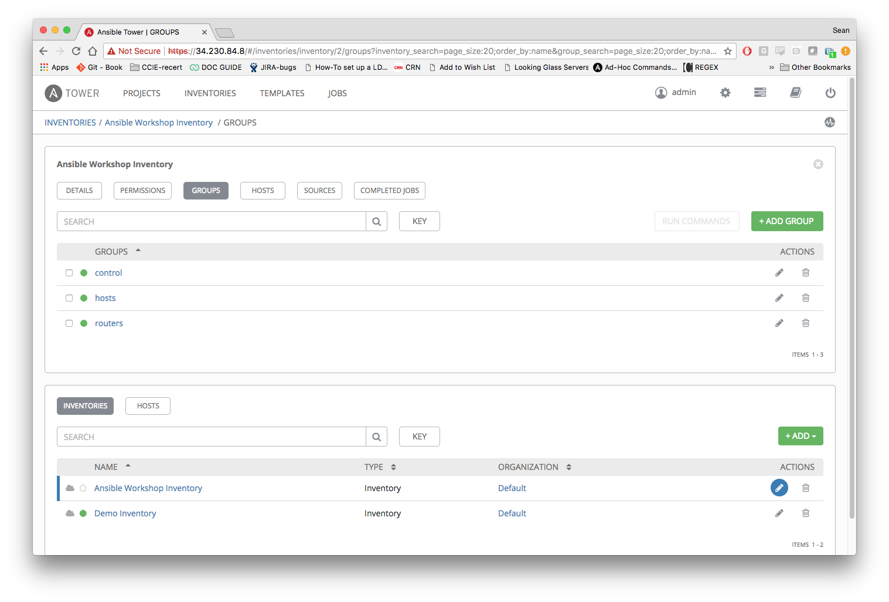

# Exercise 2.2 - Configuring Ansible Tower

In this exercise, we are going to configure Tower so that we can run a playbook.  If you are attending an in person instructor-led workshop it is possible the instructor has already licensed your Tower instance.

# The Tower UI

There are a number of constructs in the Ansible Tower UI that enable multi-tenancy, notifications, scheduling, etc. However, we are only going to focus on a few of the key constructs that are required for this workshop today.

- Credentials
- Projects
- Inventory
- Job Template

## Logging into Tower and Installing the License Key

### Step 1: Login
Use the username `admin` and and the password `ansibleWS` (or whatever you made it in exercise 2.1)



As soon as you login, you will prompted to request a license or browse for an existing license file



## Step 2: Download the License
In a separate browser tab, browse to the [Workshop License](https://www.ansible.com/workshop-license ) link to request a workshop license.

## Step 3: Browse for License
Back in the Tower UI, choose  and upload your license file that you received via e-mail into Tower.

## Step 4: Check License
Select "I agree to the End User License Agreement"

## Step 5: Submit
Click on 

# Creating a Credential

Credentials are utilized by Tower for authentication when launching jobs against machines, synchronizing with inventory sources, and importing project content from a version control system.

There are many [types of credentials](http://docs.ansible.com/ansible-tower/latest/html/userguide/credentials.html#credential-types) including machine, and various cloud providers. In this workshop, we are using a machine credential.

## Step 1: Select the gear icon
Click on the  icon in the top right of the browser window

## Step 2: Select CREDENTIALS

## Step 3: Add The CREDENTIALS
Click on  button

## Step 4: Complete the form using the following entries

| Field                | Value                                                                 |
| -------------------- |-----------------------------------------------------------------------|
| **NAME**             | Ansible Workshop Credential                                           |
| **DESCRIPTION**      | Credentials for Ansible Workshop                                      |
| **ORGANIZATION**     | Default                                                               |
| **CREDENTIAL TYPE**  | machine                                                               |
| **USERNAME**         | ec2-user                                                              |
| **SSH Key**          | Copy paste the ssh private key from the tower node `cat ~/.ssh/aws-private.pem`  |



## Step 5: Select Save
Click the  button

# Creating a Project
A Project is a logical collection of Ansible playbooks, represented in Tower. You can manage playbooks and playbook directories by either placing them manually under the Project Base Path on your Tower server, or by placing your playbooks into a source code management (SCM) system supported by Tower, including Git, Subversion, and Mercurial.

## Step 1: Click on PROJECTS
Click on the **PROJECTS** Tab on the Top Menu

## Step 2: Add a Project
Click the  button

## Step 3: Complete the form using the following entries

| Field                  | Value                                                                 |
| ---------------------- |-----------------------------------------------------------------------|
| **NAME**               | Ansible Workshop Project                                              |
| **DESCRIPTION**        | Workshop playbooks                                                    |
| **ORGANIZATION**       | Default                                                               |
| **SCM TYPE**           | Git                                                                   |
| **SCM URL**            | https://github.com/network-automation/linklight/                      |
| **SCM UPDATE OPTIONS** | Check Clean, Uncheck Delete on Update, Check Update on Launch         |



# Creating an Inventory

An inventory is a collection of hosts against which jobs may be launched. Inventories are divided into groups and these groups contain the actual hosts. Groups may be sourced manually, by entering host names into Tower, or from one of Ansible Tower’s supported cloud providers.

An Inventory can also be imported into Tower using the `tower-manage` command and this is how we are going to add an inventory for this workshop.

## Step 1: Create an Inventory
Click on the **INVENTORIES** Tab on the Top Menu

## Step 2: Add an Inventory
Click the  Button and chose **Inventory** (not Smart Inventory)

## Step 3: Complete the form using the following entries

| Field                  | Value                                                                 |
| ---------------------- |-----------------------------------------------------------------------|
| **NAME**               | Ansible Workshop Inventory                                            |
| **DESCRIPTION**        | Ansible Inventory                                                     |
| **ORGANIZATION**       | Default                                                               |



## Step 4: Save the Inventory
Click the  button

## Step 5: Using ssh, login to your Tower node
```bash
ssh studentXX@<IP_Address_of_your_tower_node>
```

## Step 6: Import the existing inventory

Use the tower-manage command to import an existing inventory. (Be sure to replace student(X) with your student number)

```bash
sudo tower-manage inventory_import --source=/home/studentXX/networking-workshop/lab_inventory/hosts --inventory-name="Ansible Workshop Inventory"
```

You should see output similar to the following:

```
[student2@ip-172-17-3-250 ~]$ sudo tower-manage inventory_import --source=/home/student1/networking-workshop/lab_inventory/hosts --inventory-name="Ansible Workshop Inventory"
    1.676 INFO     Updating inventory 2: Ansible Workshop Inventory
    1.755 INFO     Reading Ansible inventory source: /home/student2/linklight/lessons/lab_inventory/hosts
    2.704 ERROR     [WARNING]: Found both group and host with same name: control
    2.704 INFO     Processing JSON output...
    2.704 INFO     Loaded 3 groups, 4 hosts
    2.708 INFO     Inventory variables unmodified
    2.715 INFO     Group "control" added
    2.720 INFO     Group "hosts" added
    2.724 INFO     Group "routers" added
    2.734 INFO     Host "tower" added
    2.739 INFO     Host "host1" added
    2.743 INFO     Host "rtr1" added
    2.748 INFO     Host "rtr2" added
    2.759 INFO     Host "tower" added to group "control"
    2.766 INFO     Host "host1" added to group "hosts"
    2.773 INFO     Host "rtr1" added to group "routers"
    2.773 INFO     Host "rtr2" added to group "routers"
    2.856 INFO     Inventory import completed for  (Ansible Workshop Inventory - 9) in 1.2s
```

Try browsing your inventory in Tower. You should now notice that the inventory has been populated with Groups and that each of those groups contain hosts.



# End Result

At this point, we are doing with our basic configuration of Ansible Tower. In the next exercise, we will be solely focused on creating and running a job template so you can see Tower in action.

 ---
[Click Here to return to the Ansible Linklight - Networking Workshop](../README.md)
