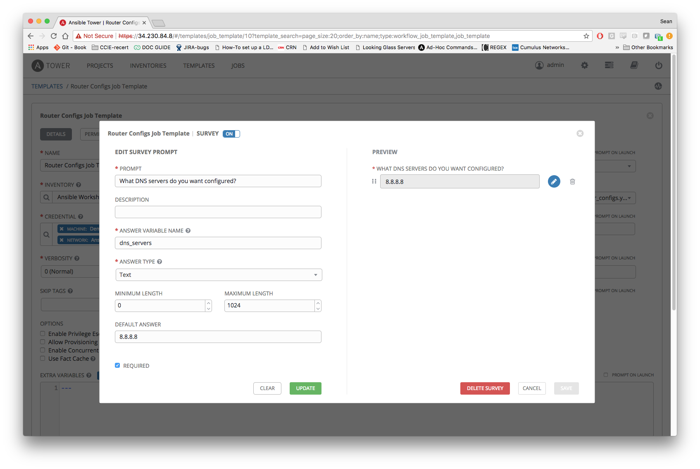
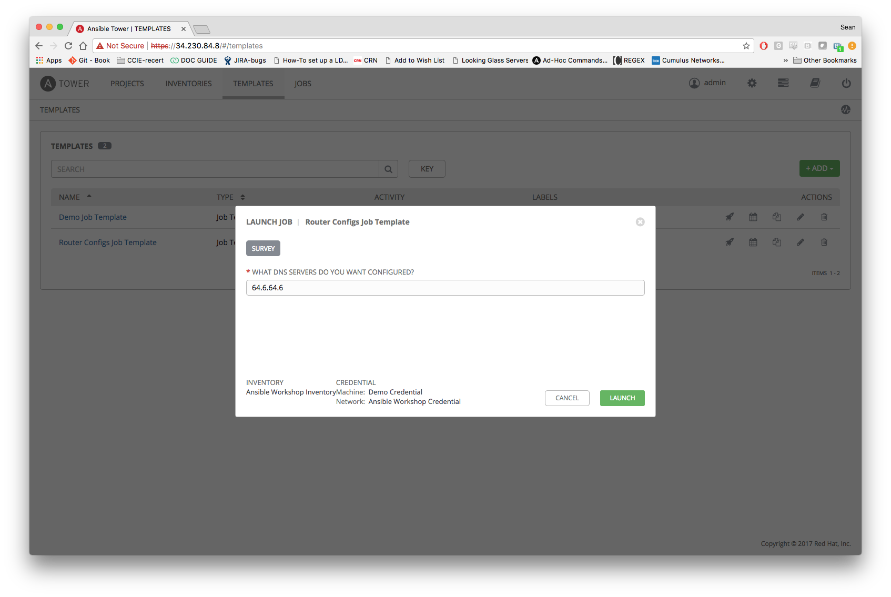

# 演習 2.3 - ジョブテンプレートの作成と実行Creating and Running a Job Template
ジョブテンプレートはAnsibleジョブを実行する為のパラメータセットを定義するものです。ジョブテンプレートは同じジョブを何度も実行するのに便利です。

## ジョブテンプレートの作成

### ステップ 1: テンプレートの選択
トップメニューの **TEMPLATES** タブをクリック

### ステップ 2: ジョブを追加
 ボタンをクリックし、 **Job Template** (workflow templateでは無い)を選択

### ステップ 3: 以下の値でフォームを入力して保存(SAVE)

| Field                  | Value                                                                                    |
| ---------------------- |------------------------------------------------------------------------------------------|
| **NAME**               | Router Configs Job Template                                                               |
| **DESCRIPTION**        | Template for router configurations                                                       |
| **JOB TYPE**           | Run                                                                                      |
| **INVENTORY**          | Ansible Workshop Inventory                                                               |
| **PROJECT**            | Ansible Workshop Project                                                                 |
| **PLAYBOOK**           | exercises/networking/1.5-roles/deploy_network.yml                                         |
| **MACHINE CREDENTIAL** | Demo Credential - This is required by default and can contain blank credentials.         |
| **NETWORK CREDENTIAL** | Ansible Workshop Credential                                                              |

Credentialの設定は以下のスクリーンショットを参照ください

### ステップ 4: ジョブテンプレートの保存
 ボタンをクリック

## ジョブテンプレートの実行
ジョブテンプレートの作成が終わり、実行する準備ができました。ジョブテンプレートを実行すると、ジョブ画面にリダイレクトされます。ジョブ画面ではジョブの状態がリアルタイムに表示されます。

### ステップ 1: Templates セクションに移動
トップメニューの **TEMPLATES** タブを選択

### ステップ 2: ジョブの実行
**Router Configs Job Template** の **rocketship icon**  をクリック

### ステップ 3: じっと座って、魔法が起きるのを見てみましょう
ジョブが実行されると、左側に実行中のPlaybookとpending、runnning、completeといった状態が表示されます。

右側には標準出力の内容、つまりコマンドラインからAinsible Coreを実行した時と同じ内容が表示されます。

おめでとうございます!
ジョブの実行が成功しました!

## サーベイの作成
次にサーベイ(Survey)と呼ぶAnsible Towerの素晴らしい機能を見てみましょう

### ステップ 1: テンプレートの選択
トップメニューの **TEMPLATES** タブをクリック

### ステップ 2: Router Configs ジョブテンプレートを編集(Edit)
Router Configs ジョブテンプレートの右側にある  アイコンをクリック

### ステップ 3: サーベイ(Survey)の作成
**Add Survey** をクリック

### ステップ 4: サーベイ(Survey)の各項目を入力

| Field                           | Value                         |
| ------------------------------- |-------------------------------|
| **PROMPT**                      | Router Configs Job Template   |
| **ANSWER VARIABLE NAME**        | dns_servers                   |
| **ANSWER TYPE**                 | Text                          |
| **DEFAULT ANSWER**              | 8.8.8.8                       |

以下のスクリーンショットも参照:

### ステップ 5: サーベイ(Survey)の保存
 ボタンをクリック

### ジョブの再実行
トップメニューの **TEMPLATES** タブをクリックし、次に **Router Configs Job Template** のロケットアイコンをクリックして **Router Configs Job Template** を再実行します

ジョブテンプレートを実行すると、サーベイがポップアップします。値を実際のIPv4 DNSサーバのアドレスに変更してみてください。

新しいジョブが実行され、サーベイの中に入力したIPアドレスが使用されます。サーベイに入力した値は左側のメニューの **EXTRA VARIABLES** に表示され、Playbookの変数を上書きします。
以下のスクリーンショットを参照ください:

# 完了
このTower演習は終了です

 ---
[Ansible Linklight - ネットワークワークショップ にもどる](../README.ja.md)
