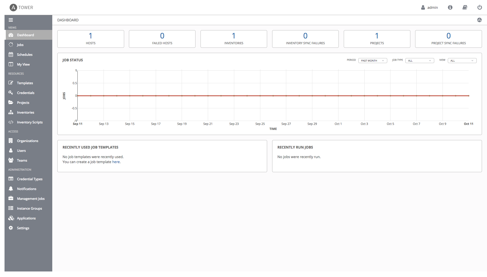
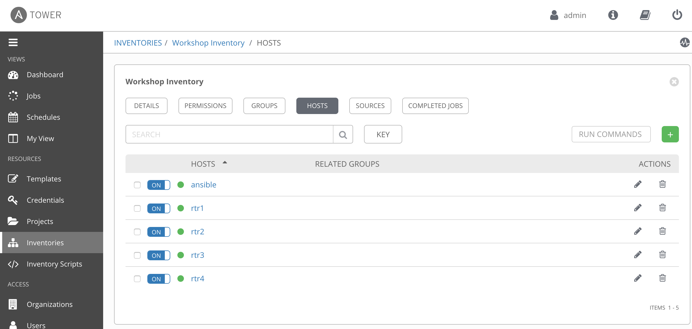

# Exercise 4-0: Red Hat Ansible Tower Setup

## Table of Contents

- [Objective](#Objective)
- [Guide](#Guide)
- [Playbook Output](#Playbook_Output)
- [Solution](#Solution)

# Objective

Demonstrate a manual setup for Red Hat Ansible Tower. Please return to master [Read Me](README.md) to understand the full objective and have another option with using an automated setup for Red Hat Ansible Tower using Playbooks.

# Guide

## Step 1: Tower Login

Make sure Tower is successfully installed by logging into it.  Open up your web browser and type in the Ansible control node's IP address e.g. https://X.X.X.X.  This is the same IP address has provided by the instructor.

Login information:
- The username will be `admin`
- password provided by instructor

After logging in the Job Dashboard will be the default window as shown below.

## Step 2: Setting up Inventory

An inventory is required for Tower to be able to run jobs.  An Inventory is a collection of hosts against which jobs may be launched, the same as an Ansible inventory file. In addition, Tower can make use of an existing configuration management data base (cmdb) such as ServiceNow or Infoblox DDI.

>More info on Inventories in respect to Tower can be found in the [documentation here](https://docs.ansible.com/ansible-tower/latest/html/userguide/inventories.html)

By default Tower has a **Demo Inventory** setup.  Click on the **Inventories** button under **Resources** on the left menu bar.  An animation is provided below:

Click on the green `+` symbol to add a new inventory.

Fill out the name and let the `ORGANIZATION` stay the default (which is Default)

| Parameter | Value |
|---|---|
| Name  | Workshop Inventory  |
|  Organization |  Default |

Now under the Inventories there will be two inventories, the `Demo Inventory` and the `Workshop Inventory`. Under the `Workshop Inventory` click the **Hosts** button, it will be empty since we have not added any hosts there.

Next we need to add all of the routers to our inventory.  Click on the green `+` symbol "Create a new host".  Make sure the router information matches exactly the information stored in `~/networking-workshop/lab_inventory/hosts` for example rtr1 is a Cisco Cloud Services Router.  There is a `private_ip`, `ansible_host`, `ansible_network_os` and `ansible_user` value that needs to be added.  Check out the following screenshot for an example (the IP addresses will be different for every workbench).

When all the hosts are added there should be four routers (rtr1 through rtr4) under the hosts button for the `Workshop Inventory` as well as the control node.

## Step 3: Setting up a Project

A project is how actually Playbooks are imported into Red Hat Ansible Tower.  You can manage playbooks and playbook directories by either placing them manually under the Project Base Path on your Tower server, or by placing your playbooks into a source code management (SCM) system supported by Tower, including Git, Subversion, Mercurial, and Red Hat Insights.  

> For more information on Projects in Tower, please [refer to the documentation](https://docs.ansible.com/ansible-tower/latest/html/userguide/projects.html)

For this exercise we are going to use an already existing Github repository and turn it into a project in Tower.  Click on the Projects link on the left menu.

Click the `+` green button to create a new project.  Fill out the following fields.

| Parameter | Value |
|---|---|
| Name  | Workshop Project  |
| Organization |  Default |
| SCM TYPE |  Git |
| SCM URL |  https://github.com/network-automation/tower_workshop |

Click on the Green Save button to save the new project.

In the Tower UI there will be two Projects.  In addition to the default `Demo Project` a new `Workshop Project` will appear.

## Step 4: Setting up a Credential

Credentials are utilized by Tower for authentication when launching Jobs against machines, synchronizing with inventory sources, and importing project content from a version control system.  For the workshop we need a credential to authenticate to the network devices.

> For more information on Credentials in Tower please [refer to the documentation](https://docs.ansible.com/ansible-tower/latest/html/userguide/credentials.html).

In the Tower UI, click on the Credentials link on the left menu.  

Click the green `+` button to create a new credential.

| Parameter | Value |
|---|---|
| Name  | Workshop Credential  |
| Organization |  Default |
| Credential Type |  Machine |
| SSH Private Key |  value from `~/.ssh/aws-private.pem` |

Click the green save button.

In addition to the default `Demo Credential` a new `Workshop Credential` will appear.

## End of Exercise

You have now setup all 3 components required to get started with Ansible Tower.  A credential, an inventory and a Project.  In the next exercise we will create a job template.

---
[Click Here to return to the Ansible - Network Automation Workshop](../../README.md)
