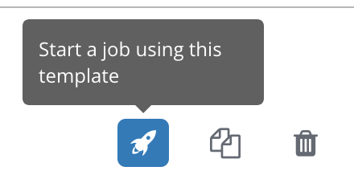

# Exercise 1: Creating a Tower Job Template

## Table of Contents

- [Objective](#objective)
- [Guide](#guide)
- [Playbook Output](#playbook-output)
- [Solution](#solution)

# Objective

Demonstrate a job template for Red Hat Ansible Tower.  To run an Ansible Playbook in Tower we need to create a **Job Template**.  A **Job Template** requires:
 - An **Inventory** to run the job against
 - A **Credential** is used to login to devices.
 - A **Project** which contains Playbooks

We have setup all the requirements in the previous exercise.  Now we will create a simple job template.

# Guide

## Step 1:

Open the web UI and click on the `Templates` link on the left menu.


Click on the green `+` button to create a new job template (make sure to select `Job Template` and not `Workflow Template`)

| Parameter | Value |
|---|---|
| Name  | BACKUP NETWORK CONFIG  |
|  Job Type |  Run |
|  Inventory |  Workshop Inventory |
|  Project |  Workshop Project |
|  Playbook |  network_backup.yml |
|  Credential |  Workshop Credential |

Here is a screenshot of the job template parameters filled out.


Scroll down and click the green `save` button.

## Step 2:

Click on the `Templates` link at the top of your screen


There will now be two jobs, the default `Demo Job Template` (which you can go ahead and delete if you want), and the new `BACKUP NETWORK CONFIG` job template.  Click on the rocket ship button to start the job.



## Step 3

Next, add the variables section `vars`. There will be one variable called `test_variable`.  The variable will have a string `"my test variable"`.

```yaml
---
- name: SIMPLE DEBUG PLAYBOOK
  hosts: localhost
  gather_facts: no

  vars:
    test_variable: "my test variable"
```

## Step 4

Next, add the first `task`. This task will use the `debug` module to print out the variable `test_variable`.

``` yaml
---
- name: SIMPLE DEBUG PLAYBOOK
  hosts: localhost
  connection: local
  gather_facts: no

  vars:
    test_variable: "my test variable"

  tasks:
    - name: DISPLAY TEST_VARIABLE
      debug:
        var: test_variable
```

>A play is a list of tasks. Tasks and modules have a 1:1 correlation.  Ansible modules are reusable, standalone scripts that can be used by the Ansible API, or by the ansible or ansible-playbook programs. They return information to ansible by printing a JSON string to stdout before exiting.

## Step 5

Run the playbook - exit back into the command line of the control host and execute the following:

```
[student1@ansible ~]$ ansible-playbook debug.yml
```
# Playbook Output

The output will look as follows.

```yaml
[student1@ansible ~]$ ansible-playbook debug.yml

PLAY [SIMPLE DEBUG PLAYBOOK] *******************************************************************************

TASK [DISPLAY TEST_VARIABLE] *******************************************************************************
ok: [localhost] => {
    "test_variable": "my test variable"
}

PLAY RECAP *************************************************************************************************
localhost                  : ok=1    changed=0    unreachable=0    failed=0
```
> Notice that the names you gave the play and task appear in this output. This is especially important when you have longer playbooks that include multiple tasks.

# Solution
The finished Ansible Playbook is provided here for an Answer key.

```yaml
---
- name: SIMPLE DEBUG PLAYBOOK
  hosts: localhost
  gather_facts: no

  vars:
    test_variable: "my test variable"

  tasks:
    - name: DISPLAY TEST_VARIABLE
      debug:
        var: test_variable
```

You have finished this exercise.  [Click here to return to the lab guide](../README.md)
