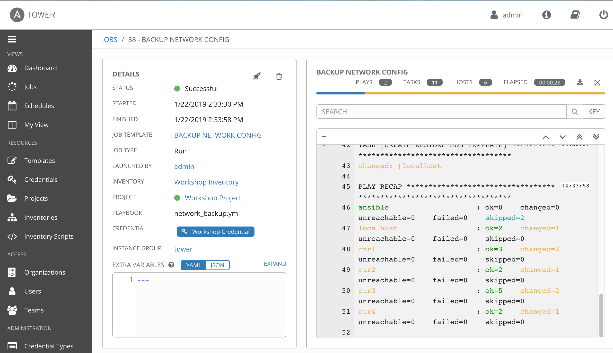
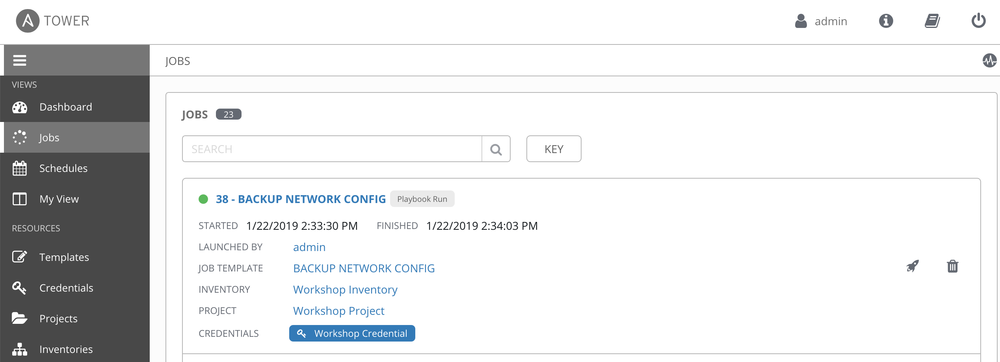

# Exercise 4-1: Creating a Tower Job Template

## Table of Contents

- [Objective](#objective)
- [Guide](#guide)
- [Playbook Output](#playbook-output)
- [Solution](#solution)

# Objective

Demonstrate a network backup configuration job template for Red Hat Ansible Tower.  This job template will save the running configuration from all four routers and store them under /tmp/backup on the control node with a timestamp.

To run an Ansible Playbook in Tower we need to create a **Job Template**.  A **Job Template** requires:
 - An **Inventory** to run the job against
 - A **Credential** is used to login to devices.
 - A **Project** which contains Playbooks

We have setup all the requirements in the previous exercise.  Now we will create the simple job template in the web UI.

# Guide

## Step 1:

Open the web UI and click on the `Templates` link on the left menu.


Click on the green `+` button to create a new job template (make sure to select `Job Template` and not `Workflow Template`)

| Parameter | Value |
|---|---|
| Name  | BACKUP NETWORK CONFIG  |
|  Job Type |  Run |
|  Inventory |  Workshop Inventory |
|  Project |  Workshop Project |
|  Playbook |  network_backup.yml |
|  Credential |  Workshop Credential |

Here is a screenshot of the job template parameters filled out.


Scroll down and click the green `save` button.

## Step 2:

Click on the `Templates` link at the top of your screen


There will now be two jobs, the default `Demo Job Template` (which you can go ahead and delete if you want), and the new `BACKUP NETWORK CONFIG` job template.  Click on the rocket ship button to start the job.


When the rocket button is clicked this will launch the job.  The job will open in a new window called the **Job Details View**.  More info about [Tower Jobs](https://docs.ansible.com/ansible-tower/latest/html/userguide/jobs.html) can be found in the documentation.

On the left side there is a **Details pane** on the right side there is the **Standard Out pane**.  The **Details pane** will information such as the timestamp for when the job started and finished, the job type (check or run), who launched the job, which project and playbook were used and more.  

The **Standard Out pane** will match the output from the Playbook itself.



If there is issues with your **BACKUP NETWORK CONFIG** job completing successfully please make sure you hostvars match what you have in inventory.  It is highly recommended to use the tower_setup.yml playbook from the previous exercise if you hit any problems.  To automate the setup of your inventory, credentials and project so that manual mistakes won't be made.  

## Step 3

Click the Jobs button the left menu.


The Jobs link displays a list of jobs and their status–shown as completed successfully or failed, or as an active (running) job. Actions you can take from this screen include viewing the details and standard output of a particular job, relaunch jobs, or remove jobs.



The **BACKUP NETWORK CONFIG** job was the most recent (unless you have been launching more jobs).  Click on this job to return to the **Job Details View**.  Tower will save the history of every job launched and it is possible to see down to the task level of what happened on a particular job.


## Step 4

To understand where the Playbooks are that we imported via the Project, return to the command line of the control node.  Switch to the **awx** user.

```
sudo su - awx
```

You have now switched to the awx user, perform an ls to see what files are in here.

```
-bash-4.2$ ls
beat.db  favicon.ico  job_status  projects  public  uwsgi.stats  venv  wsgi.py
```

There is a **projects** folder here that directly corresponds to the Projects link in Ansible Tower.  Move into the projects directory to see what is available.

```
-bash-4.2$ cd projects/
-bash-4.2$ ls
_10__workshop_project  _10__workshop_project.lock
-bash-4.2$ cd _10__workshop_project
```

The number might not match exactly here, but the **workshop_project** directly corresponds to our WorkShop Project we created in the previous exercise.

Perform an ls -la to look at one files are available in this directory.

```
-bash-4.2$ ls -la
total 44
drwxr-xr-x. 9 awx awx 4096 Jan 22 19:27 .
drwxr-x---. 3 awx awx   69 Jan 22 19:33 ..
-rw-r--r--. 1 awx awx  652 Jan 22 15:45 ansible.cfg
drwxr-xr-x. 4 awx awx   33 Jan 22 18:41 eos
drwxr-xr-x. 8 awx awx  198 Jan 22 19:27 .git
drwxr-xr-x. 2 awx awx   21 Jan 22 15:45 group_vars
drwxr-xr-x. 4 awx awx   33 Jan 22 18:37 ios
drwxr-xr-x. 4 awx awx   33 Jan 22 18:49 junos
-rw-r--r--. 1 awx awx 2535 Jan 22 19:27 network_backup.yml
-rw-r--r--. 1 awx awx  247 Jan 22 15:45 network_banner.yml
-rw-r--r--. 1 awx awx  252 Jan 22 15:45 network_l3_interface.yml
-rw-r--r--. 1 awx awx  250 Jan 22 15:45 network_restore.yml
drwxr-xr-x. 2 awx awx   96 Jan 22 15:45 network_setup
-rw-r--r--. 1 awx awx  543 Jan 22 15:45 network_system.yml
-rw-r--r--. 1 awx awx  609 Jan 22 15:45 network_time.yml
-rw-r--r--. 1 awx awx  272 Jan 22 15:45 network_user.yml
-rw-r--r--. 1 awx awx  297 Jan 22 15:45 README.md
-rw-r--r--. 1 awx awx  712 Jan 22 15:45 sample-vars-auto.yml
drwxr-xr-x. 2 awx awx  103 Jan 22 15:45 templates
```

The Playbooks (shown as .yml files) should directly correspond to the Github repo: https://github.com/network-automation/tower_workshop


# Solution
You have finished this exercise.  

You have
 - created a job template for backing up network configurations
 - launched the job template from the Ansible Tower UI
 - looked under the covers on the control node to see where the Playbooks are being stored

[Click here to return to the lab guide](../README.md)
