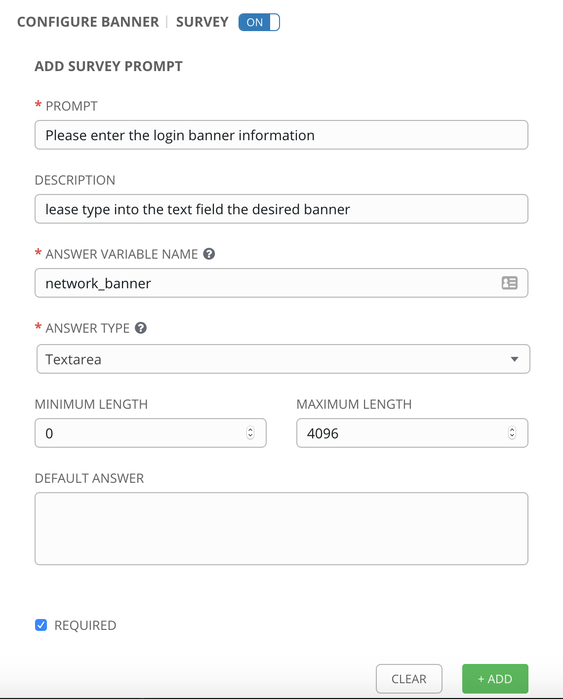
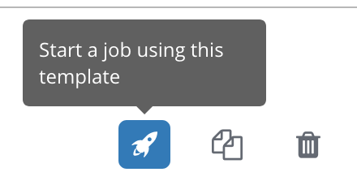
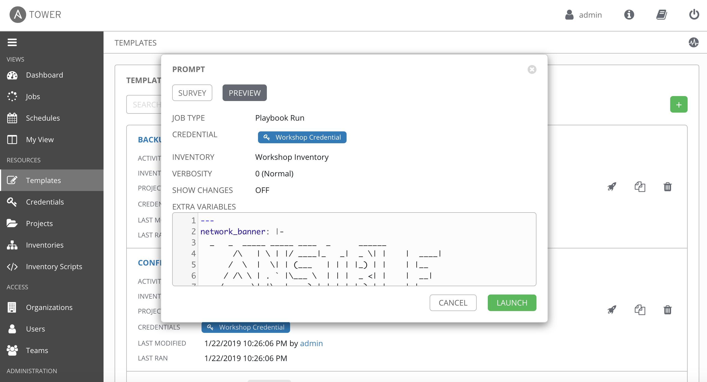
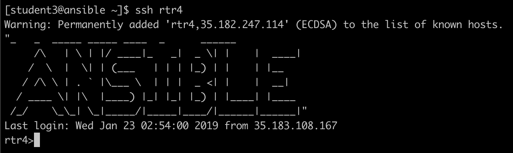

# Exercise 4-2: Creating a Survey

## Table of Contents

- [Objective](#objective)
- [Guide](#guide)
- [Playbook Output](#playbook-output)
- [Solution](#solution)

# Objective

Demonstrate the use of Ansible Tower [survey feature](https://docs.ansible.com/ansible-tower/latest/html/userguide/job_templates.html#surveys). Surveys set extra variables for the playbook similar to ‘Prompt for Extra Variables’ does, but in a user-friendly question and answer way. Surveys also allow for validation of user input.

# Guide

## Step 1:

Open the web UI and click on the `Templates` link on the left menu.


Click on the green `+` button to create a new job template (make sure to select `Job Template` and not `Workflow Template`)

| Parameter | Value |
|---|---|
| Name  | CONFIGURE BANNER  |
|  Job Type |  Run |
|  Inventory |  Workshop Inventory |
|  Project |  Workshop Project |
|  Playbook |  network_banner.yml |
|  Credential |  Workshop Credential |

Scroll down and click the green `save` button.  


## Step 2:

To understand the next step we need to take a step back.  When we loaded this [workshop project](https://github.com/network-automation/tower_workshop) into Tower we have access to a variety of playbooks including this `network_banner.yml` playbook.  This specific Playbook makes use of the [net_banner](https://docs.ansible.com/ansible/latest/modules/net_banner_module.html) agnostic network module which looks like the following:

```
- name: LOAD BANNER ONTO NETWORK DEVICE
  net_banner:
    banner: login
    text: |
      "{{network_banner}}"
```

We can set the variable `network_banner` anywhere and overload the default on the Playbook.  We will do this with an Ansible Tower **survey**.

## Step 3:

Click on the blue add survey button


Fill out the fields

| Parameter | Value |
|---|---|
| Prompt  | Please enter the login banner information  |
|  Description |  Please type into the text field the desired banner |
|  Answer Variable Name |  network_banner |
|  Answer type |  Textarea |
|  Required |  Checkmark |

It should look like this screenshot:



Click the green +Add button


Click the green **save** button to save the survey.  This will exit back to the main job template window.  Scroll down and click the second green **save** button to exit to the job templates window.

## Step 3

Click on the rocket ship to launch the job template.



The job will immediately prompt the user to set the `network_banner` variable.  Type in the banner message you want for the routers.  Click next to see how the survey rendered the input as extra vars for the Playbook launch.  For this example I used the word ANSIBLE rendered into ASCII art.



Click the green **Launch** button to kick off the job.


Let the job run to completion.  Let the instructor know if anything fails.


## Step 4

Login to one of the routers and see the banner setup

```
[student1@ansible]$ ssh rtr4
```

The banner will appear on login.  Here is an example from the **ANSIBLE** shown above.




# Solution
You have finished this exercise.  

You have
 - created a job template for configuring a banner on multiple network operating systems (Arista EOS, Cisco IOS and Juniper Junos)
 - Create a self service survey for the job template to fill out the network_banner variable
 - run the vendor agnostic job template on all four routers loading the banner on them

[Click here to return to the lab guide](../README.md)
