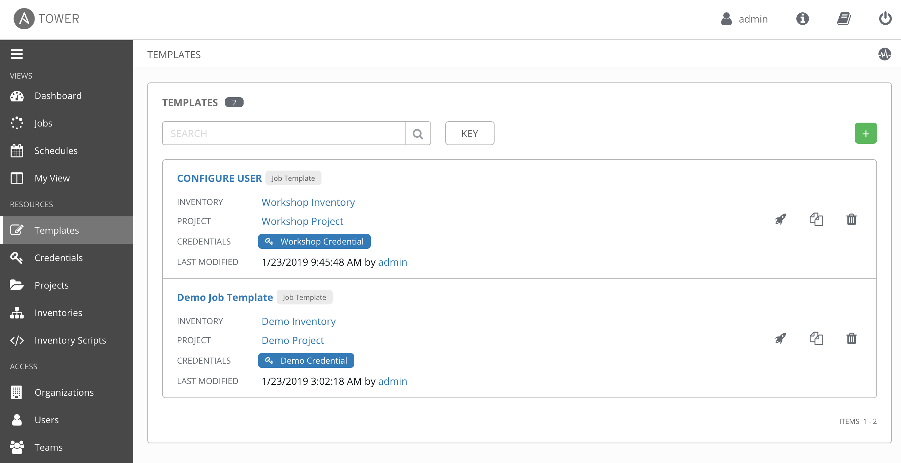
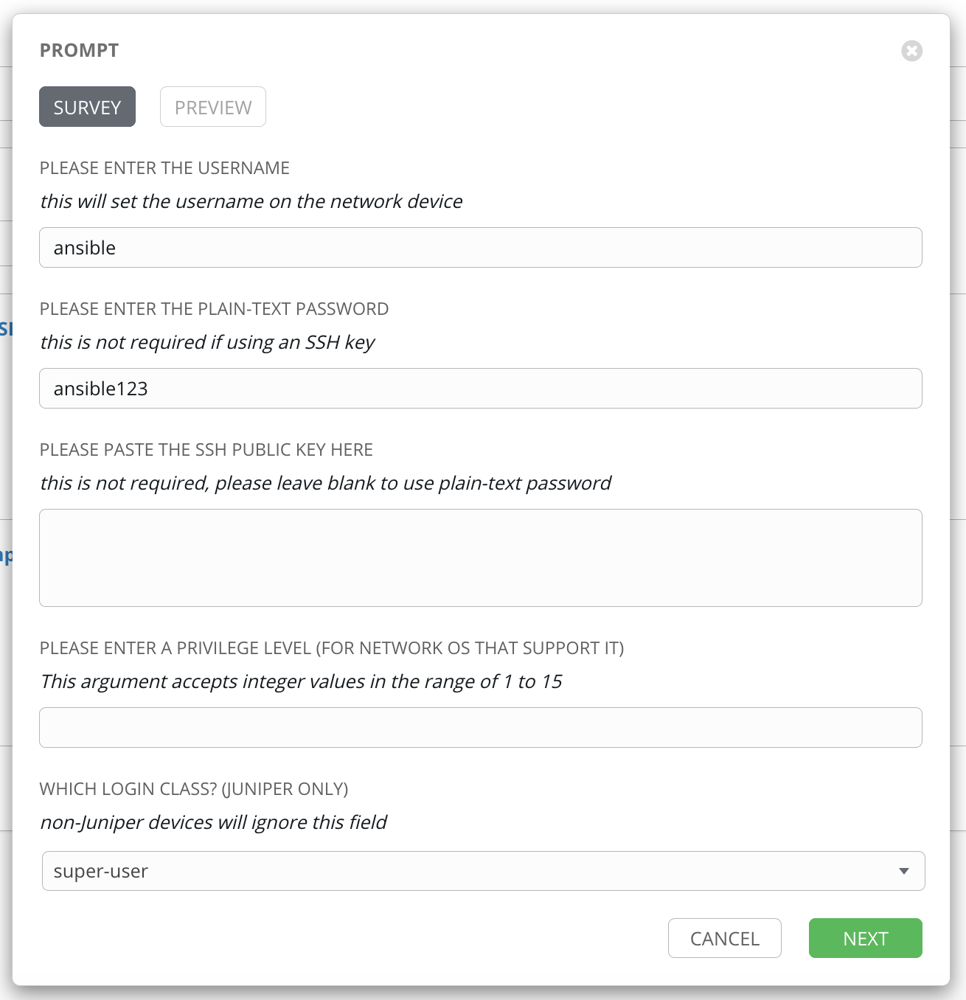
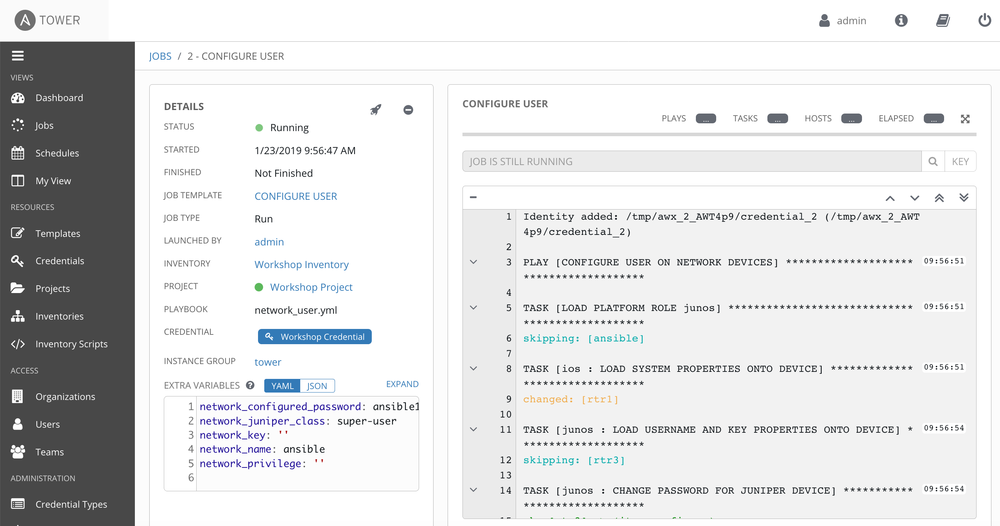

# Exercise 4-2: Creating a Tower Job Template - User Template

## Table of Contents

- [Objective](#objective)
- [Guide](#guide)
- [Playbook Output](#playbook-output)
- [Solution](#solution)

# Objective

Demonstrate a vendor agnostic job template for user creation.  This job will configure a specified user through a survey.

This exercise will differ from the previous exercise by automating the creation of the survey.  We will use a supplied survey specification file (`user.json`) along with the [tower_job_template module](https://docs.ansible.com/ansible/latest/modules/tower_job_template_module.html) to quickly provision the job into Ansible Tower.

# Guide

## Step 1:

Make sure you are on the control node cli. Using your favorite text editor (`vim` and `nano` are available on the control host) create a new file called `userjob.yml`.

```
---
- name: TOWER CONFIGURATION IN PLAYBOOK FORM
  hosts: ansible
  connection: local
  become: yes
  gather_facts: no
  tasks:

    - name: CREATE USER JOB TEMPLATE
      tower_job_template:
        name: "CONFIGURE USER"
        job_type: "run"
        inventory: "Workshop Inventory"
        project: "Workshop Project"
        playbook: "network_user.yml"
        credential: "Workshop Credential"
        survey_enabled: true
        survey_spec: "{{ lookup('template', '{{playbook_dir}}/user.json') }}"
        tower_username: admin
        tower_password: ansible
        tower_host: https://localhost
```

## Step 2:

Copy this [user.json](user.json) file and make sure its in the same folder as your userjob.yml Ansible Playbook.

## Step 3:

Launch the job with the `ansible-playbook` command.

```
ansible-playbook userjob.yml
```

## Playbook Output

Here is the Playbook output:

```
[student1@ansible ~]$ ansible-playbook userjob.yml

PLAY [TOWER CONFIGURATION IN PLAYBOOK FORM] ************************************

TASK [CREATE USER JOB TEMPLATE] ************************************************
changed: [ansible]

PLAY RECAP *********************************************************************
ansible                    : ok=1    changed=1    unreachable=0    failed=0    skipped=0
```

## Step 4

Click the Templates button the left menu.


The Template menu will displays the new **CONFIGURE USER** job template.



Click the rocket button to launch the job.


## Step 5

Fill out the survey, click the green **NEXT** button, then click the green **LAUNCH** button.



Feel free to use whatever you want!

When the job launches you will go to the **Job Details View** which will look like this:



# Verify

Login to the routers to verify the user was created

```
[student1@ansible ~]$ ssh rtr1
```

then look for the user

```
rtr1#show run | i username ansible
username ansible secret 5 $1$qroK$DkZ4Z71o/ZSbifb8yRiza.
```

# Solution
You have finished this exercise.  

You have
 - created a job template for creating users on network devices
 - launched the job template from the Ansible Tower UI
 - looked under the covers on the control node to see where the Playbooks are being stored

[Click here to return to the lab guide](../README.md)
