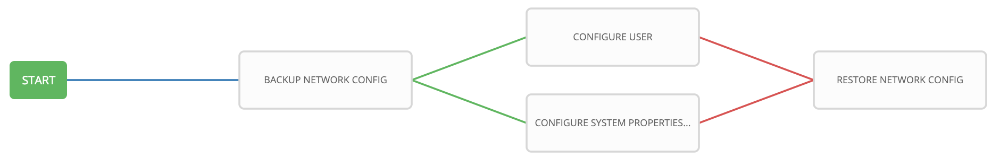

# Exercise 4-X: Tower Workflows

## Table of Contents

- [Objective](#Objective)
- [Guide](#Guide)
- [Playbook Output](#Playbook_Output)
- [Solution](#Solution)

# Objective

Demonstrate setup for a **[workflow](https://docs.ansible.com/ansible-tower/latest/html/userguide/workflows.html)** on Red Hat Ansible Tower.  To run an Ansible Playbook in Tower we need to create a **Job Template**.

This workflow has four jobs:
  - BACKUP NETWORK CONFIG - this job creates a time-stamped flat-file backup for all devices
  - CONFIGURE USER - this job configures a user
  - CONFIGURE SYSTEM PROPERTIES - this job configures system properties (such as (hostname, domain name, domain search, DNS)
  - RESTORE NETWORK CONFIG - which restores all targeted devices to a specified timestamp

# Guide

## Step 1: Create a Workflow Template

a. Click on **Templates** under **Resources** on the left menu

b. Click on the green plus button 

c. Choose **Workflow Template**

d. Fill out the following fields

| Field  | Value  |
|---|---|
| NAME  | WORKSHOP WORKFLOW  |
| DESCRIPTION  | demonstrate workflow  |
| ORGANIZATION  | DEFAULT |
| INVENTORY  | Workshop Inventory |

e. Click **SAVE**

## Step 1: Create a Workflow Template
