Atelier Automated Satellite : Configurer et exécuter une analyse OpenSCAP
================================================================================

**Lisez ceci dans d'autres langues**:
<br> [English](README.md),  [Française](README.fr.md).
<br>

Dans cet exercice, nous allons apprendre à configurer et à effectuer une analyse OpenSCAP à l'aide de playbooks dans Ansible Automation Platform 2 avec Satellite. Lorsque vous exécutez plusieurs systèmes Red Hat Enterprise Linux, il est important de maintenir tous ces systèmes conformes à une politique de sécurité et d'effectuer des analyses de sécurité fréquemment. OpenSCAP est un projet open source qui est utilisé par des agences gouvernementales, des entreprises, ainsi que par dans entreprise de commerce électronique (pour ne citer que quelques exemples). OpenSCAP fournit des outils pour la vérification automatique des vulnérabilités. Il es possilbe d'installer des manifeste SCAP workbench v1.2.0-8 en format RPM qui fournira des capacités d'analyse. Satellite vient avec le manifeste de sécurité SCAP v0.1.54-3 pour les systèmes RHEL7 et CentOS fournissant les tests XCCDF appropriés pour la conformité PCI et STIG. Cet exercice se concentrera sur les systèmes RHEL. 

Environnement
-----------

- Red Hat Satellite v6.x, Ansible Automation Platform 2.x

- 3 clients Red Hat Enterprise Linux v7.9

Préalables
--------------------------------------------------------------------------------------

- Exercice 0 : Lab de configuration

- Organisation à utiliser = Organisation par défaut

- Content View = RHEL7

- Environnements de cycle de vie = Dev, QA, Prod

Exercice
--------

#### 1\. Se connecter à Satellite

- Utilisez un navigateur web sur votre ordinateur pour accéder à l'interface utilisateur Satellite fourni, puis connectez-vous avec l'utilisateur admin.

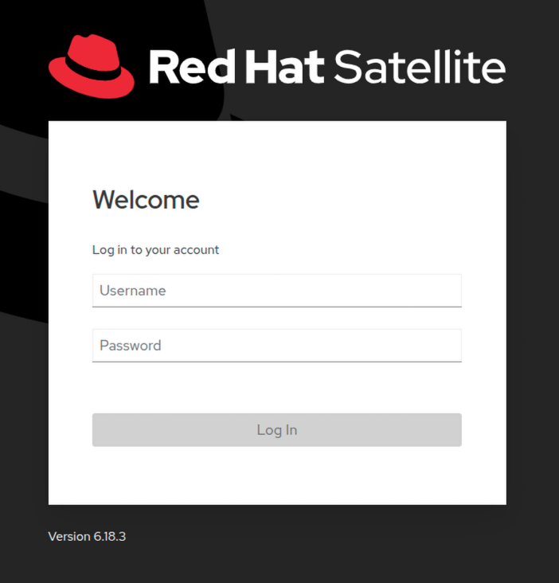

- Vous verrez le tableau de bord Satellite lorsque vous vous connectez

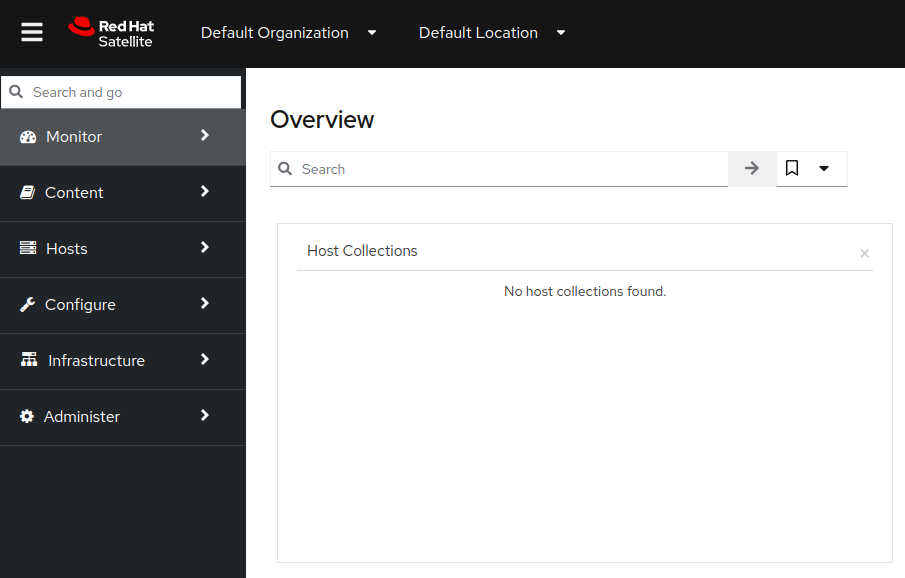

#### 2\. Créer une nouvelle politique de conformité

Maintenant, nous allons commencer à configurer une politique de conformité que nous pouvons utiliser pour analyser nos systèmes RHEL.

- Allez sur 'Hosts' à partir du menu sur le côté gauche, puis cliquez sur 'Policies'

- Cliquez sur le bouton « New Policy » et remplissez les détails comme suit à l'étape 3.

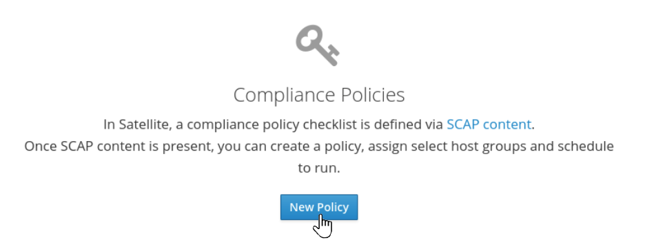

#### 3\. Configurer une nouvelle politique de conformité

Maintenant, nous allons commencer à configurer notre serveur Satellite pour pouvoir gérer une politique de conformité

- Sélectionnez "Manual" dans les options de déploiement et cliquez sur "Next"

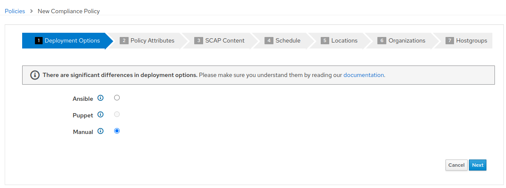

- Créer le nom de la politique "PCI_Compliance" et fournir la description que vous souhaitez. Puis cliquez sur "Next"

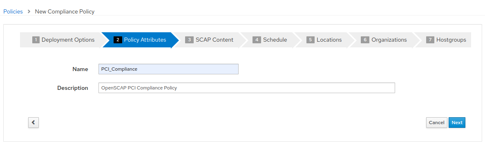

- Sélectionnez le contenu par défaut "Red Hat rhel7" et "PCI-DSS v3.2.1 Control Baseline for Red Hat Enterprise Linux 7". Il n'y a pas de fichier d'adaptation (tailoring). Puis cliquez sur "Next"

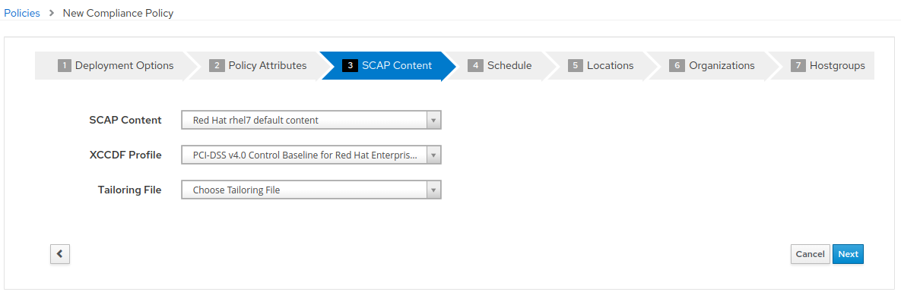

- Il faut établir un calendrier afin de déterminer à quelle fréquence l'analyse sera exécutée. Vous pouvez sélectionner "Weekly" et "Monday" aux fins de cet exercice. Puis cliquez sur "Next"

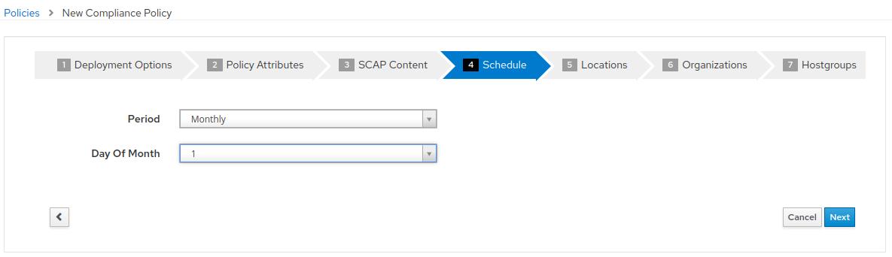

- Laissez les valeurs par défaut pour les étapes 5, 6 et 7. Cliquez sur "Next" pour "Location", et "Organizations". Puis à "Hostgroups" cliquez sur "Submit"

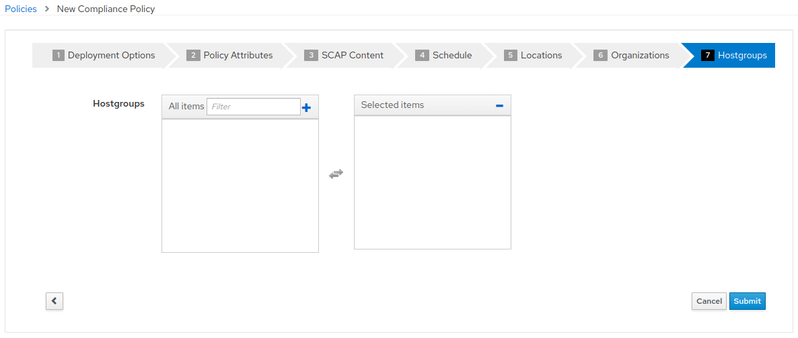

#### 4\. Se connecter à la plate-forme d'automatisation Ansible

- Utilisez un navigateur web sur votre ordinateur pour accéder à l'interface utilisateur Ansible via le lien trouvé dans votre environnement puis connectez-vous avec l'utilisateur admin. 


- Une fois que vous vous êtes connecté à Ansible Automation Platform 2, vous serez affiché la page la plus récente visitée.

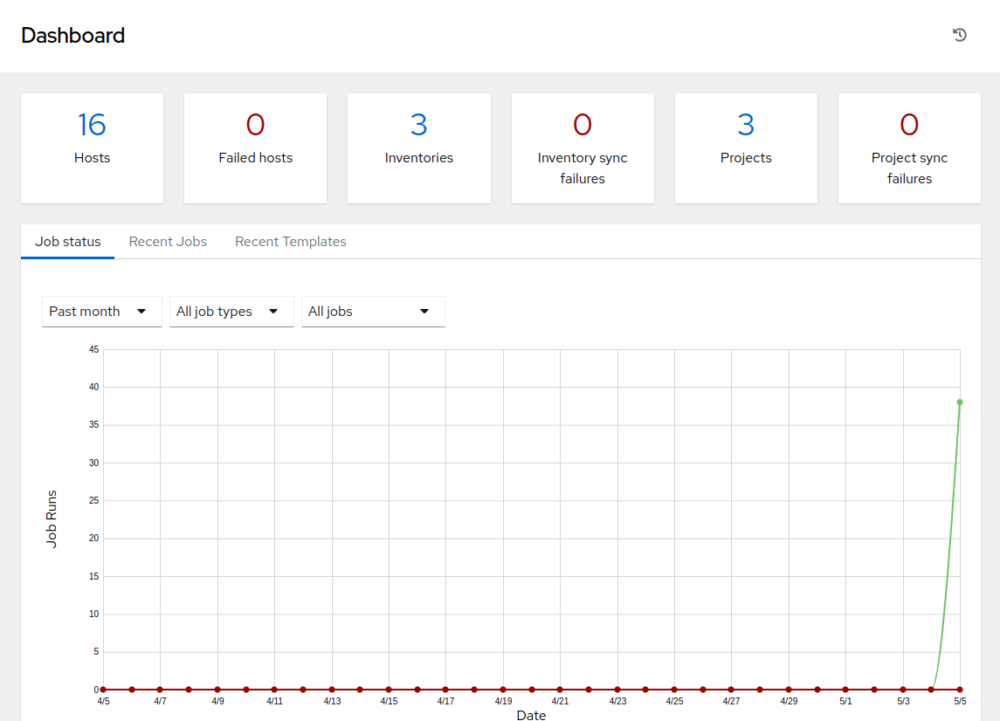

#### 5\. Configurer et lancer une template Ansible pour exécuter une analyse OpenSCAP.

Cette étape nous permettra de scanner un seul hôte rhel7 avec la politique ```PCI_Compliance``` que nous avons configurée sur Satellite.

- Dans Ansible Automation Platform cliquez sur 'Templates' dans le menu de la pane latérale gauche

- Cliquez sur le bouton en bleu 'Add' et sélectionnez 'Add job template' dans le menu déroulant. Remplir les détails comme suit:

        Name: SATELLITE / Compliance - OpenSCAP_Configure

        Job Type: Run

        Inventory: RHEL7 Development (Cliquez sur l'icône de la loupe pour sélectionner.)

        Project: Automated Management (Cliquez sur l'icône de la loupe pour sélectionner.)

        Execution Environment: smart_mgmt workshop execution environment (Cliquez sur l'icône de la loupe pour sélectionner.)

        Playbook: configure_openscap.yml (Cliquez sur le menu déroulant pour sélectionner.)

        Credentials: Workshop Credential, et Satellite Credential
        (Cliquez sur l'icône de la loupe pour sélectionner.)
          REMARQUE : Dans ce nouveau menu. Sélectionnez le bouton radio Workshop Credential
          La "Catégorie sélectionnée" est "Machine". Ensuite, utilisez le menu déroulant
          Selected Category " pour sélectionner Satellite_Collection.
          Vous choisirez alors Satellite Credential. Vous aurez ainsi deux type de credential sélectionnés. En cliquant sur "Select", vous enregistrez vos modifications
          et vous quitterez le menu.

          Extra Variables (Respectez l'espacement exact indiqué ci-dessous. Notez que les
          extra-vars que nous fournissons doivent être au format YAML):

        ---
        HOSTS: node1.example.com
        policy_name:
          - PCI_Compliance

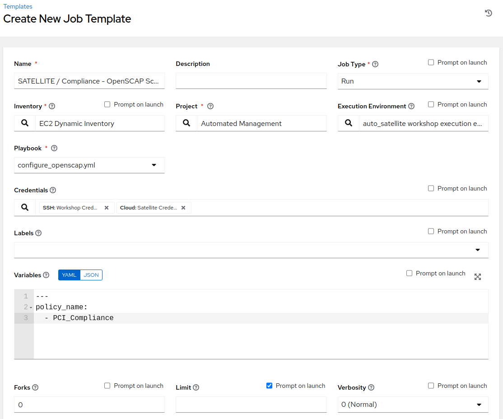

- Laissez le reste des champs comme ils sont, et cliquez sur 'Save'. Vous pouvez
ensuite sélectionnez 'Launch' pour éxecuter la job template.


Vous allez être amené à la fenêtre de sortie **Jobs > SATELLITE / Compliance - OpenSCAP_Configure** où vous pourrez suivre chaque tâche exécutée. Cela prendra environ 3 minutes pour terminer. Attendez que l'éxécution se termine avant de passer à l'étape suivante.

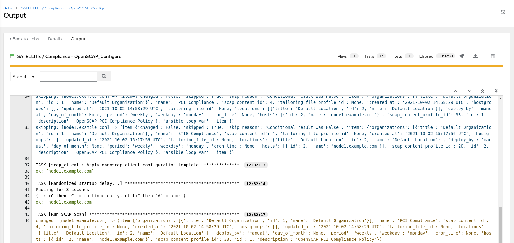


#### 6\. Aller de nouveau sur Satellite pour examiner le rapport de l'analyse Openscap (fichier Asset Reporting (ARF)).

- Survoler 'Hosts' dans le menu de la pane latérale, puis cliquez sur 'Reports'.

- Cliquez sur le bouton 'Full Report', sous Actions, pour 'node1.example.com' afin de réviser le résultat 

- En sélectionnant une règle, vous trouverez d'autres renseignements concernant la validation effectuée ainsi qu'une description de la règle qui comprend des références de sécurité et des identifiants.

- Retournez à la section **Rule Overview**. Vous pouvez trier par "Pass", "Fail", "Fixed", ou par tout nombre de qualificatifs souhaité ainsi que des règles de groupe par "Severity"

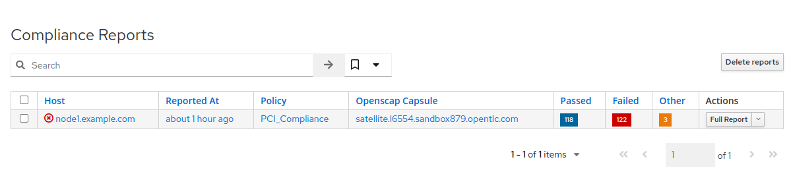

- Maintenant, décochez tout sauf la case **fail**. Ensuite, faites défiler.
cliquez sur le test "Prevent Login to Accounts With Empty Password"

- Si vous défilez la page, vous remarquerez plusieurs options de rémédiation, y compris
un snippet 'Ansible'. Cliquez sur "show" à côté du "Remediation Ansible Snippett",
qui présente ensuite des tâches que vous pouvez inclure dans un playbook pour automatiser
la rémédiation sur les systèmes touchés.

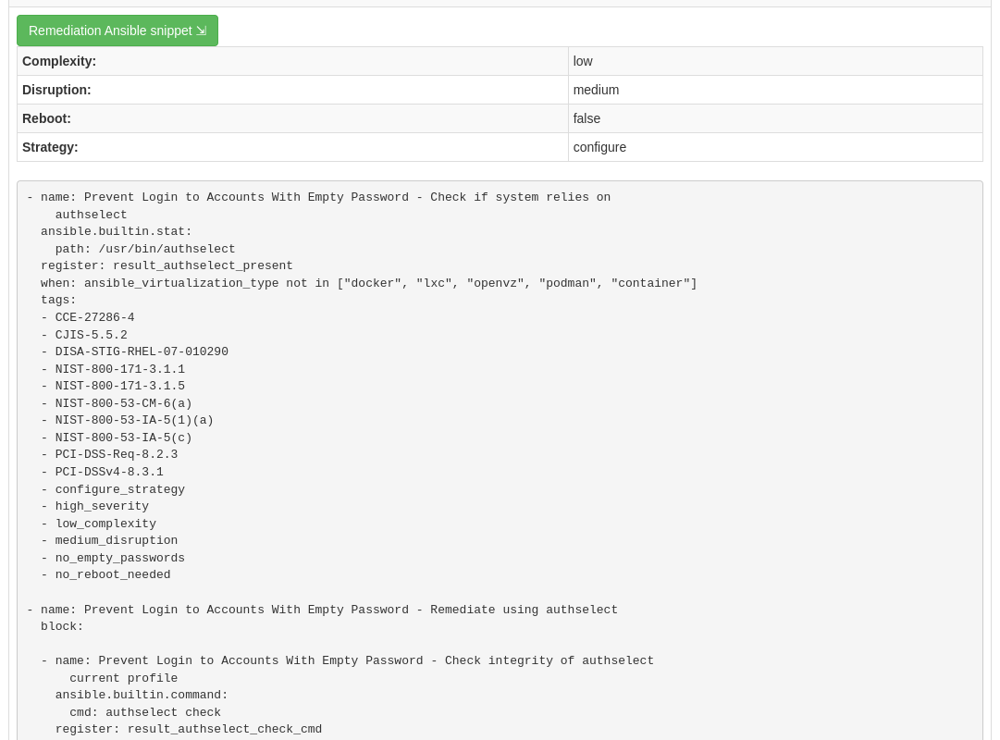

#### 7\. Extension des analyses OpenSCAP

Cette étape élargira notre analyse OpenSCAP pour ajouter un autre profil de conformité XCCDF appelé ```STIG_Compliance```. Nous allons également étendre pour inclure tous les systèmes dans l'inventaire 'RHEL7 Development' en ajustant la variable supplémentaire 'HOSTS' à 'all' au lieu de spécifier un système unique.

- Dans Satellite, passez par "Hosts" dans le menu à gauche de l'écran, puis cliquez sur "Policies".

- Cliquez sur le bouton "New Compliance Policy"

- Sélectionnez "Manual" dans les options de déploiement et cliquez sur "Next"


- Créer le nom de la politique "STIG_Compliance" et fournir la description que vous souhaitez. Puis cliquez sur "Next"

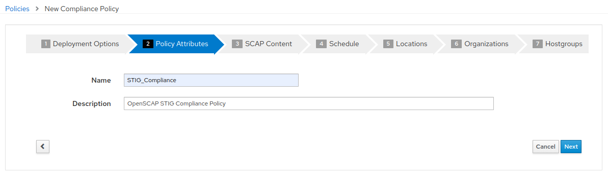

- Sélectionnez le contenu par défaut "Red Hat rhel7" et "DISA STIG for Red Hat Enterprise Linux 7". Il n'y a pas de fichier d'adaptation (tailoring). Puis cliquez sur "Next"

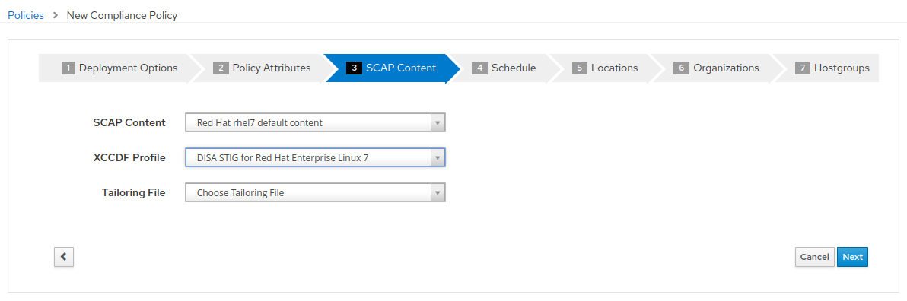

- Il faut établir un calendrier afin de déterminer à quelle fréquence l'analyse sera exécutée. Vous pouvez sélectionner "Weekly" et "Monday" à des fins de laboratoire. Puis cliquez sur "Next"


- Laissez les valeurs par défaut pour les étapes 5, 6 et 7. Cliquez sur "Next" pour "Location", et "Organizations". Puis à "Hostgroups" cliquez sur "Submit


- Maintenant, nous allons mettre à jour notre template OpenSCAP_Configure dans Ansible Automation Platform et lancer un autre analayse de conformité qui va inclure PCI et la nouvelle analyse STIG. 
- Dans Ansible Automation Platform, cliquez sur 'Templates' dans le menu de la pane latérale gauche
- Sélectionnez la job template Satellite/Compliiance - OpenSCAP_Configure, et cliquez sur éditer en bas de la job pour apporter des modifications aux « Variables Extra » :

        Extra Variables (Respectez l'espacement exact indiqué ci-dessous.
        Notez que les extra-vars que nous fournissons doivent être
        au format YAML):

        ---
        HOSTS: all
        policy_name:
          - PCI_Compliance
          - STIG_Compliance

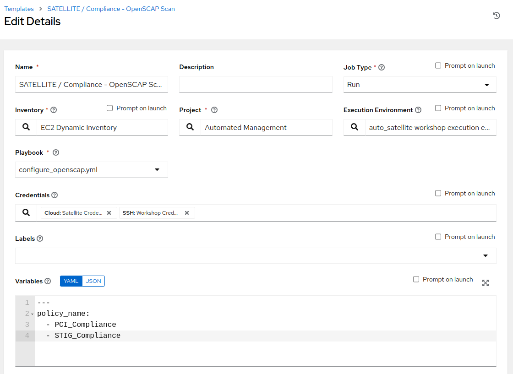

- Laissez le reste des champs comme ils sont, et cliquez sur 'Save'. Vous pouvez ensuite sélectionner 'Launch' pour éxécutez la job template.

- L'éxécution va vous conduira à la fenêtre de sortie **Jobs > SATELLITE / Compliance - OpenSCAP_Configure**. Cela prendra environ 5 minutes pour terminer. Attendez que l'éxécution se termine avant de passer à l'étape suivante.

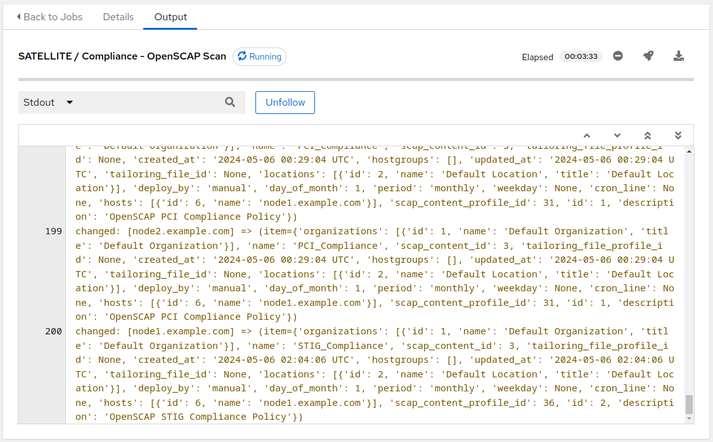

#### 8\. Naviguez de nouveau sur Satellite pour examiner le rapport d'analyse (fichier Asset Reporting File (ARF)).

- Survoler "Hosts" dans le menu à gauche de l'écran, puis cliquez sur "Reports".

- Notez que nous avons six nouvelles analyses, 2 analyses pour chaque noeud, un pour PCI_Compliance et l'autre pour STIG_Compliance.

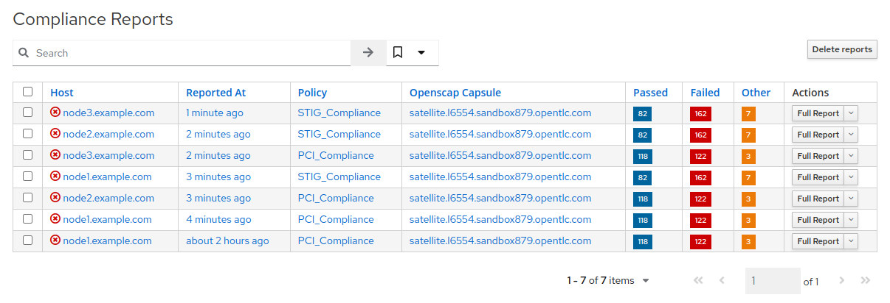

- Chaque rapport peut être examiné indépendamment des autres analyses 

#### 9\. Fin du laboratoire

- Félicitations, vous avez terminé le laboratoire ! 
- Continuer à [Exercice 2: Gestion des correctifs ](../2-patching/README.fr.md), OU [Retour à la page principale de l'atelier](../README.fr.md)
