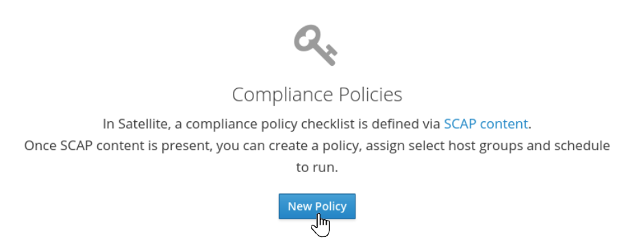
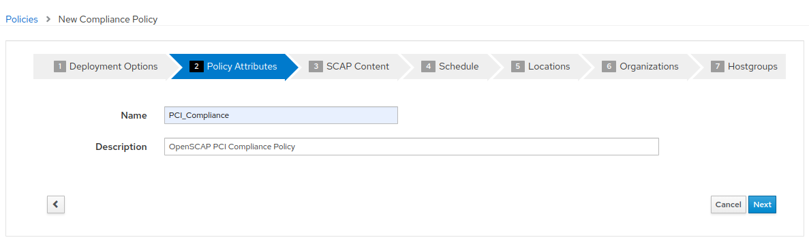
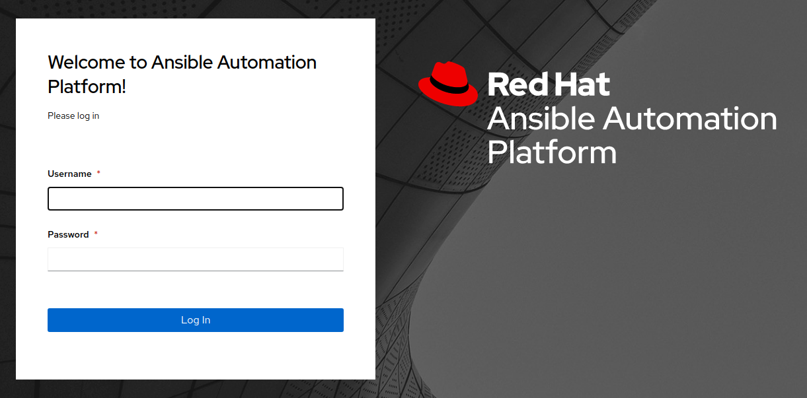
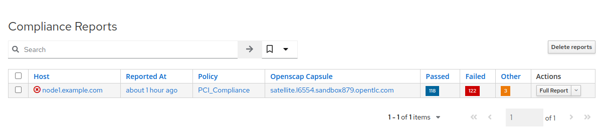
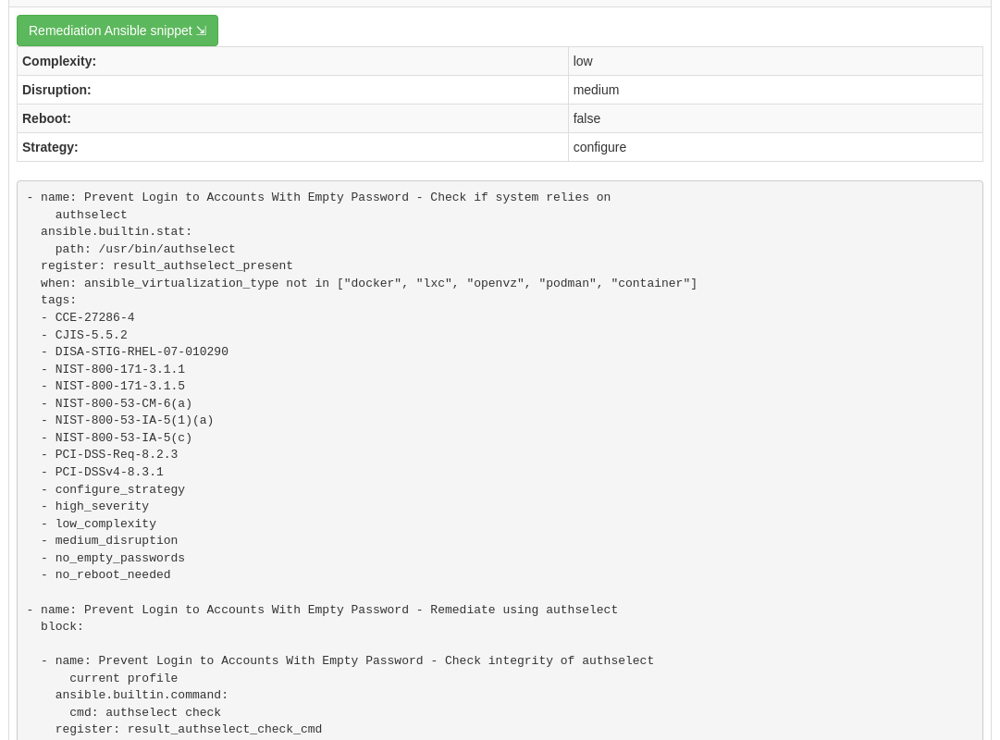
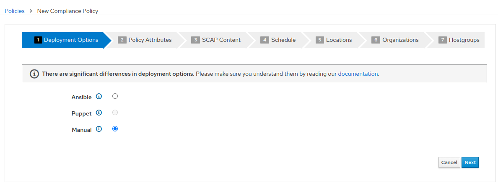
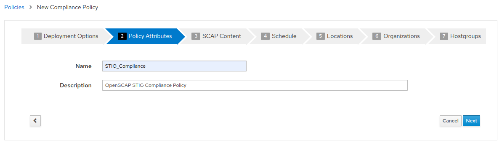
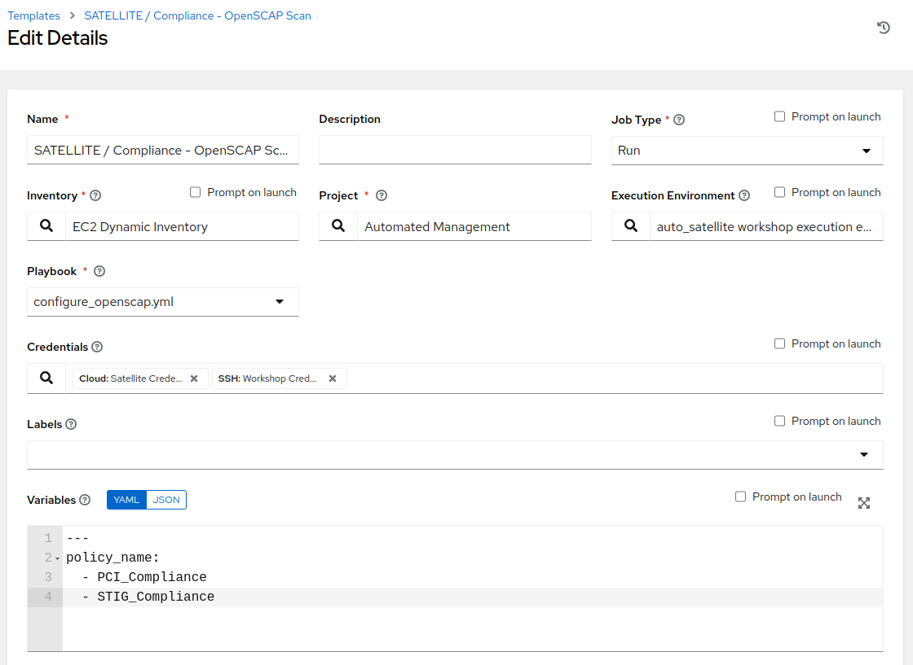
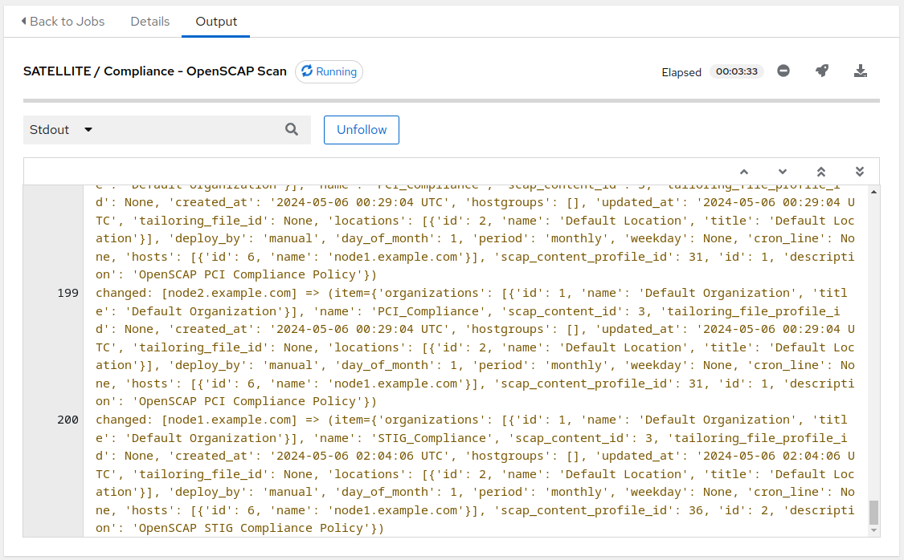

Automated Satellite Workshop: Configuring and performing an OpenSCAP Scan
================================================================================

**Read this in other languages**:
<br> [English](README.md),  [Français](README.fr.md).
<br>

In this exercise, we will learn how to configure and perform an OpenSCAP scan using playbooks in Ansible Automation Platform 2 with Satellite.

When running multiple Red Hat Enterprise Linux systems, it's important to keep all of these systems compliant with a meaningful security policy and perform security scans often.
OpenSCAP is an open source project that defines the language used to express compliance checklists in human and machine readable form (XML). 
Government agencies, corporations, and e-commerce organizations, for example, provide their compliance checklists using OpenSCAP.
The OpenSCAP project also develops tools for automated compliance checking.
Red Hat Satellite is configured with openscap integration enabled by default. 
This installs openscap ansible modules, roles, and related tools. Satellite is also loaded with the SCAP security guide (SSG)(scap-seruity-guide.noarch). 
The SSG contains the checklist files for multiple standards, for multiple operating systems and releases. 
These checklists allow for scanning systems to evaluate benchmarks for like CIS, PCI, HIPPA, Justice and DISA-STIG compliance. 

The SCAP packages are available with every install of RHEL. 
You can also install the RPM package for the SCAP workbench (e.g. scap-workbench.x86_64) which provides the ability to load and examine the checklists in a user friendly GUI. 
You can create a tailoring file for any of the included profiles that allows you to turn on or turn off specific checks to meet the your organization's unique requirements. You can launch and test scans based on your profiles using the tool. 
Your tailoring files and the profile can be loaded into Satellite and assigned to groups of systems customize scanning and reporting. Satellite produces reports to meet audit specifications.

This exercise will focus on standard profiles for PCI and DISA STIG for RHEL systems. Tailoring and other operating systems will be out of scope.

== Environment

-   Red Hat Satellite v6.x, Ansible Automation Platform 4.x

-   3 x Red Hat Enterprise Linux clients v7.9

Pre-requisites
--------------------------------------------------------------------------------------

-   Organization to be used = Default Organization

-   Content view = RHEL7

-   Lifecycle environments = Dev, QA, Prod

Exercise
--------

#### 1\. Logging into Satellite

-   Use a web browser on your computer to access the Satellite GUI provided , then login using the following nomenclature: *admin /* <*password*>


-   After entering the username and password on the login page, you will see the Satellite dashboard.


#### 2\. Creating a new compliance policy

Now we will start configuring a compliance policy that we can use to scan our RHEL nodes.

-   In Satellite hover over 'Hosts' from the menu pane on the left side, and then click on 'Policies'

-   Click on the "New Policy" button, and fill out the details as in step 3 below.



#### 3\. Configuring a new compliance policy

Now we will start configuring our Satellite server to be able to manage a compliance policy

-   Select "Manual" from the deployment options and click "Next"


-   Create the policy name "PCI_Compliance" and provide any description you like. Then click "Next"



-   Select the "Red Hat rhel7 default content" and "PCI-DSS v4.0 Control Baseline for Red Hat Enterprise Linux 7". There is no tailoring file. Then click "Next"


-   It is necessary to set a schedule when creating a new compliance policy. You can select "Monthly" and "1" for Day of Month for the purposes of this exercise. Then click "Next"


-   Steps 5, 6, and 7 as part of the New Compliance Policy can use default values. Click "Next" through "Locations", and "Organizations". For "Hostgroups" click "Submit"


- After clicking "Submit", you will be presented with the Compliance Policies view, where the new ```PCI_Compliance``` policy is listed.


#### 4\. Logging into the Ansible Automation Platform

-   Use a web browser on your computer to access the Ansible Automation Platform 2 Web UI via the link found in your Environment then login using the following nomenclature: *admin /* <*password*>



-   Once you have logged into Ansible Automation Platform 2, you will be shown the most recently visited page, or in case of first login, you will be presented with the main dashboard.


#### 5\. Configure and launch an Ansible Automation Platform template to run an OpenSCAP scan.

This step will allow us to scan a single RHEL 7 host with the ```PCI_Compliance``` policy that we configured on Satellite.

-   In Ansible Automation Platform click 'Templates' from the menu pane on the left side

-   Click the BLUE 'Add' drop-down icon and select 'Add job template' from the drop-down selection menu. Fill out the details as follows:

        Name: SATELLITE / Compliance - OpenSCAP Scan

        Job Type: Run

        Inventory: EC2 Dynamic Inventory (Click the magnifying glass icon to select.)

        Project: Automated Management (Click the magnifying glass icon to select.)

        Execution Environment: auto_satellite workshop execution environment (Click the
        magnifying glass icon to select.)

        Playbook: configure_openscap.yml (Click drop-down to select.)

        Credentials: Workshop Credential, and Satellite Credential
        (Click the magnifying glass icon to select.)
          NOTE: In this new menu. Select the Workshop Credential radio button.
          The 'Selected Category' for this is 'Machine'. Next, use the
          'Selected Category' drop-down menu again to select Satellite_Collection.
          You will choose the Satellite Credential. This will provide you with
          two sets of credentials. Choosing 'Select' will save your changes
          and exit the menu.

          Variables (Keep the exact spacing provided below. Note that the
          extra-vars that we are supplying need to be in YAML format):

        ---
        policy_name:
          - PCI_Compliance
	...

        Limit: Check the box "Prompt on launch"


-   Leave the rest of the fields blank or as they are, and click 'Save'.

-   With the job template saved, on the top right click the Survey tab, then click on the blue "Add" button. Fill out the details as follows:

        Question: Select inventory group

        Description: inventory group

        Answer variable name: dynamic_inventory_group

        Answer type: Multiple Choice (single select)

        Multiple Choice Options: RHEL7_Dev (click the check box to make it default)
                                 all


-   Once the survey details are configured, click "Save".

-   With the survey created, click the slider next to the gray "Survey Disabled". You should now see "Survey Enabled".


-   Click the Details tab and then on the bottom left select 'Launch' to run the job template.

-   On the survey, enter "node1.example.com" for the Limit and click Next. For "Select inventory group", leave the default selection for "RHEL7_Dev" and click Next. Review the entries on the launch Preview and notice scrolling down confirms the entries made during the survey.


-   Select "Launch".

-   You will be presented with the ```Jobs[SATELLITE / Compliance - OpenSCAP Scan]``` output window where you will be able to follow the job as each task in the playbook executed.
    This will take approximately 3 mins to complete.
    Wait for the job template to complete before proceeding to the next step.


#### 6\. Navigate back to Satellite to examine the Asset Reporting File (ARF).

-   Switch to the browser tab with the Satellite UI and hover over 'Hosts' from the side pane menu and then click on 'Reports'.



-   Click on the 'Full Report' button, under Actions, for 'node1.example.com' to see the report (This may take a few seconds). The Openscap Capsule field will reflect your workshop Satellite host.

-   Scroll down to the **Rule Overview** section. You can filter by "Pass", "Fail", "Fixed", or any number of qualifiers as well as group rules by "Severity"


> **NOTE:**
> *Firefox browser* - Currently Firefox browsers are unable to display the Rule Overview filters.

-   Selecting a rule presents detailed information regarding rationale as well as a description of the rule that includes references and identifiers.
-   Uncheck everything except the *fail* checkbox. For the "Group rules by" drop down menu, select "Severity".


- Scroll down and click on the failure "Prevent Login to Accounts With Empty Password".

- If you scroll the page you will notice multiple remediation option selections in green, including a 'Remediate Ansible snippet'.
Click "Activate to reveal" arrow next to the 'Remediation Ansible snippet', which then presents Ansible tasks you can include within a playbook to automate remediation across affected systems.



#### 7\. Expanding OpenSCAP policy scans

This step will expand our OpenSCAP policy scan to add another XCCDF compliance profile called ```STIG_Compliance```. We will also expand to include all systems in the 'RHEL7 Development' inventory by leaving the job run ```limit survey``` blank instead of specifying a single system.

-   In Satellite, hover over "Hosts" from the menu on the left side of the screen, and then click on "Policies".

-   Click on the "New Compliance Policy" button

-   Select "Manual" from the deployment options and click "Next"



-   Create the policy name "STIG_Compliance" and provide any description you like. Then click "Next"



-   Select the "Red Hat rhel7 default content" and "DISA STIG for Red Hat Enterprise Linux 7". There is no tailoring file. Then click "Next"


-   It is necessary to set a schedule when creating a new compliance policy. You can select "Monthly" and "1" for Day of Month for the purposes of this exercise. Then click "Next"


-   Steps 5, 6, and 7 as part of the New Compliance Policy can use default values. Click "Next" through "Locations", "Organizations", and "Hostgroups". On "Hostgroups" click "Submit" to create the policy.


- After clicking "Submit", you will be presented with the Compliance Policies view, where the new ```STIG_Compliance``` policy is listed, along with the ```PCI_Compliance``` policy created earlier in the exercise.


-   Now, we will update our OpenSCAP Scan job template in Ansible Automation Platform and run another PCI compliance scan, plus the STIG compliance scan.
-   Navigate back to the Ansible Automation Platform UI and click 'Templates' from the left side pane menu
-   Select the OpenSCAP Scan job template, and click edit at the bottom of the template to modify the "Variables" section and add the ```STIG_Compliance``` policy to the ```policy_name``` list:

        Variables (Keep the exact spacing provided below.
        Note that the extra-vars that we are supplying need to be
        in YAML format):

        ---
        policy_name:
          - PCI_Compliance
          - STIG_Compliance



-   Leave the rest of the fields blank or as they are, and click 'Save'. You can then select 'Launch' to deploy the job template.

-   On the survey, leave the Limit field empty, as we are going to target all instances in the inventory group and click Next. For "Select inventory group", leave the default selection for "RHEL7_Dev" and click Next. Review the entries on the launch Preview and notice scrolling down confirms the entries made during the survey. Click "Launch".
-   You will be presented with ```Jobs[SATELLITE / Compliance - OpenSCAP Scan]``` output window. This will take approximately 5 minutes to complete. Wait for the job template to complete before proceeding to the next step.



#### 8\. Navigate back to Satellite to examine the Asset Reporting File (ARF).

-   Switch to the browser tab with the Satellite UI and hover over "Hosts" from the menu on the left side of the screen, and then click on "Reports".

-   Notice that we've now easily scaled to six policy scans, with each node being scanned for the ```PCI_Compliance``` policy and for ```STIG_Compliance``` policy.


-   Each report can be reviewed independent of other node scans and remediations for rule findings can be completed according to the requirements of your own internal policies.

#### 9\. End of Exercise

-   You have finished Exercise 1.
-   Continue to [Exercise 2: Patch Management / OS](../2-patching/README.md), OR [Return to the main workshop page](../README.md)
