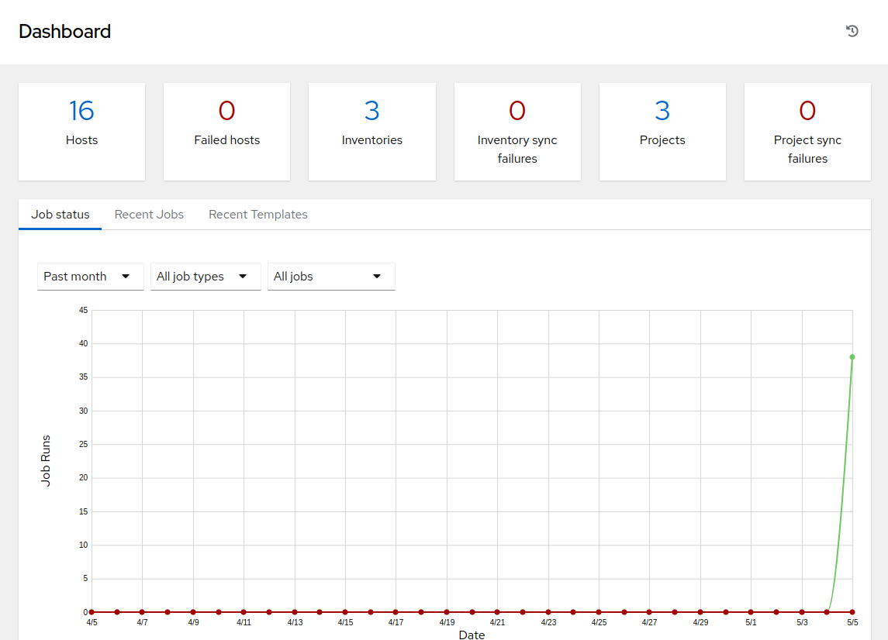
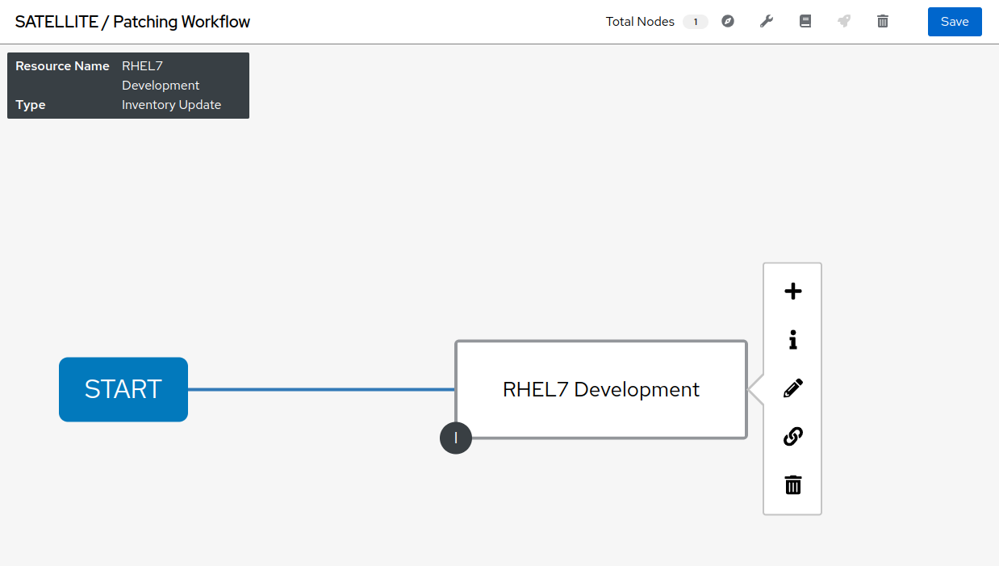
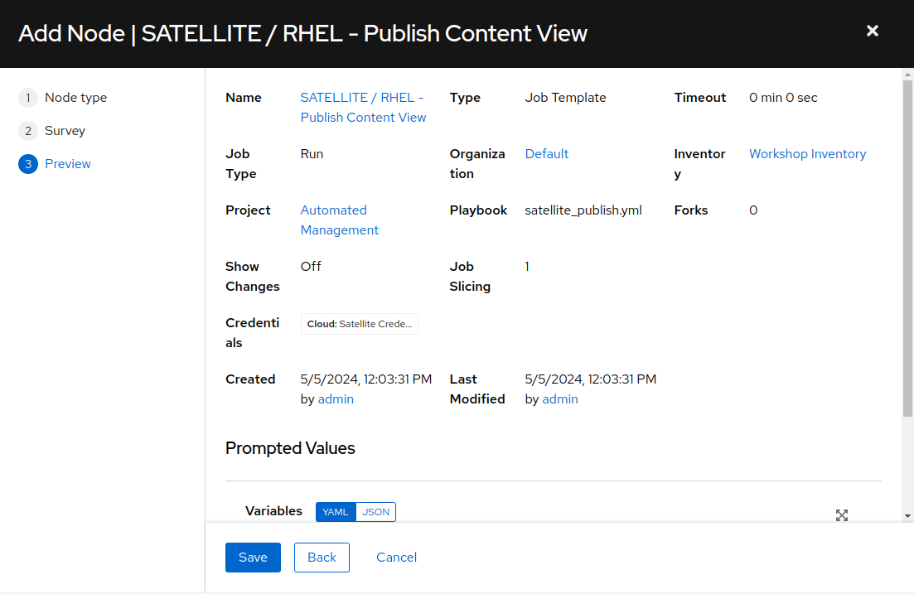
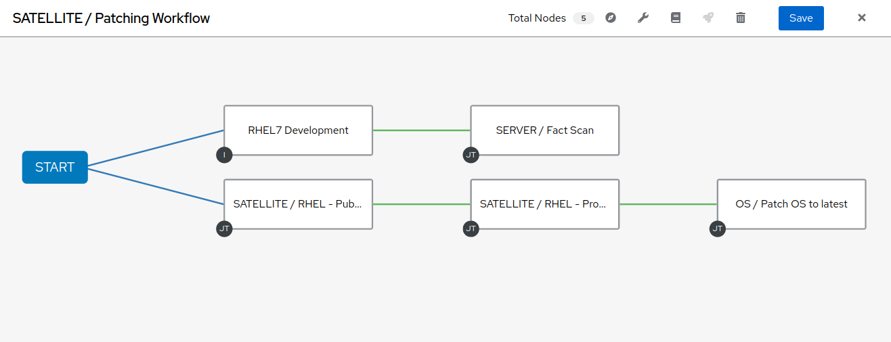
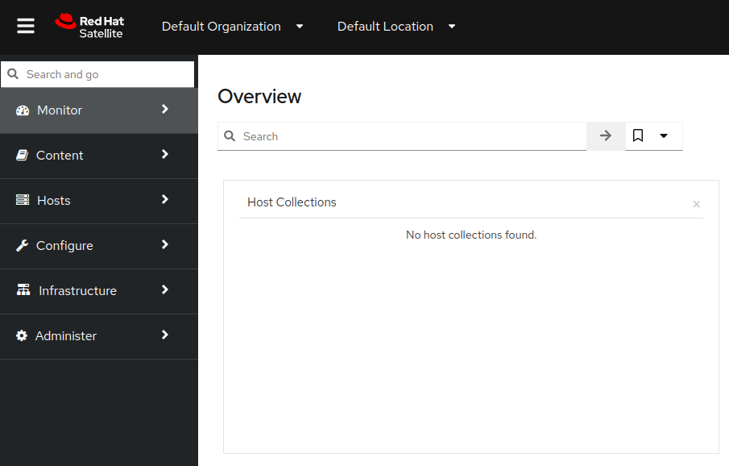
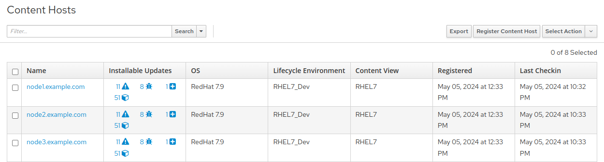
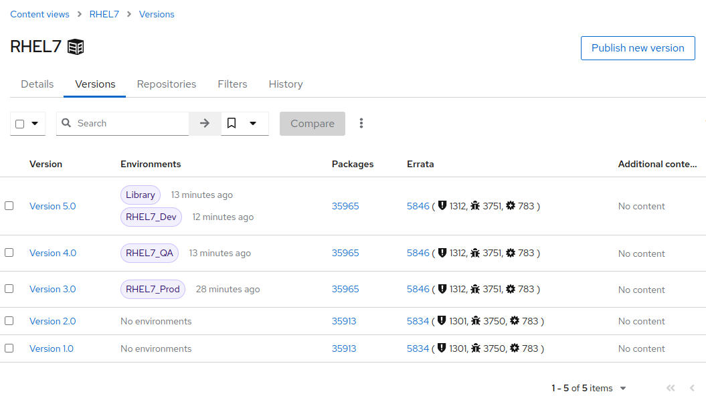
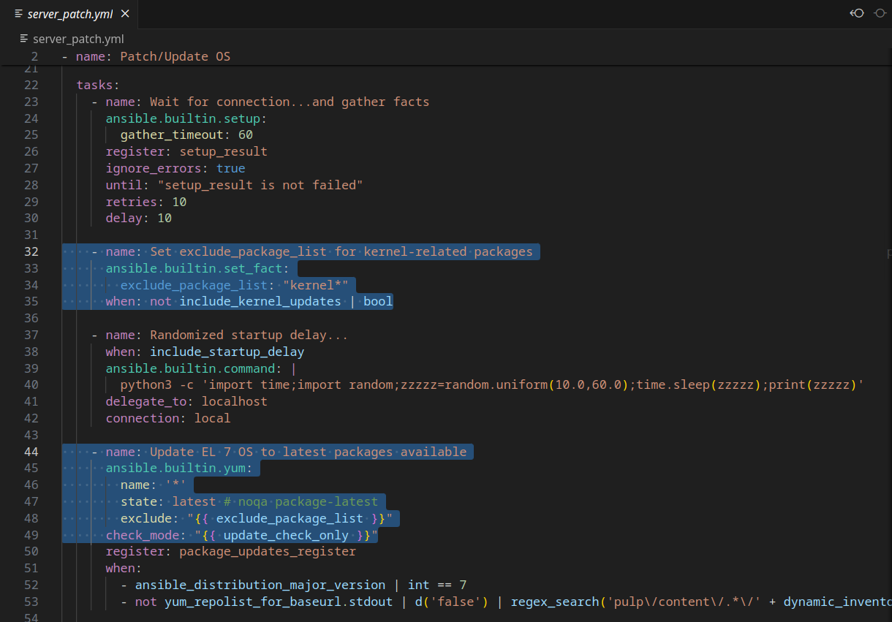

Automated Satellite Workshop: Automating Patch Management exercise
================================================================

**Read this in other languages**:
<br> [English](README.md),  [Français](README.fr.md).
<br>

In this exercise, we will learn how to leverage the use of workflows in Ansible Automation Platform to orchestrate patch management for several linux servers . Automating patch management reduces human error and improves configuration and patch accuracy. Additionally, automation provides capabilities to reduce the manual input associated with identifying, testing and patching systems.  Utilizing Ansible Automation Platform also provides capabilities for more complicated patching scenarios.

Environment
-----------

-   Satellite 6.x, Ansible Automation Platform 4.x

-   3 x Red Hat Enterprise Linux clients v7.9

Pre-requisites
--------------

-   Organization to be used = Default Organization

-   Location to be used = Default Location

-   A content view = RHEL7

-   Lifecycle environments = Dev, QA, Prod

Exercise
--------

#### 1\. Logging into the Ansible Automation Platform

-   Use a web browser on your computer to access the Ansible Automation Platform GUI via the link found in the Environment information. Use the username and password provided to login: admin / password_provided


-   Once you have logged into Ansible Automation Platform 2, you will be presented with the dashboard.



#### 2\. Creating a new Patching Workflow

Now we will start configuring a workflow that encompasses publishing a content view, promoting a content view, a fact scan, as well as a server patching. The goal is to publish a new content view and promote our RHEL7 Dev environment to QA.

-   Start by clicking "Templates" from the left side pane menu, and then click on the blue "Add" dropdown button and choose "Add workflow template".

-   Create the name "SATELLITE / Patching Workflow" and click Save (there are no other options necessary to select on this page).

-   This should open a blank workflow. Start building it by choosing the green Start button. You can always get back to this workflow from the template by selecting the 'Visualizer' tab.


* Select Start to add a node.
    * From the drop-down menu "Node Type" select "Inventory Source Sync" and enter "RHEL" in the Name filter and press Enter.
    * Select "RHEL7 Development". This defines the inventory that will be utilized in the workflow and ensures the most up-to-date inventory configuration is utilized with each workflow invocation.
    * Click "Save".



* Hover over Start again to add a second node (Click on the appearing "+").
    * From the drop-down menu "Node Type" select "Job Template" then look up and click on 'SATELLITE / RHEL - Publish Content View'.
    * Leave "Convergence" on "Any".
    * Click Next - a survey is attached to this template so you will need to select the correct content view for the servers we will patch.
    * Select the 'RHEL7' content view and click "Next".
    * You will then need to confirm the preview of this workflow node by clicking "Save".



This step in the workflow adds your first job template which runs a playbook called 'satellite_publish.yml'.

* Add a third node to the workflow by hovering over your 'RHEL7 Development' inventory node and select the + icon to generate another workflow node.
    * In the pop-up window, select 'On Success', and then Next.
    * In the follow-on window, Node Type will be 'Job Template'.
    * Select 'SERVER / Fact Scan', leave 'Convergence' to 'Any' again and select Next.
    * Leave the Limit field empty to target all instances and select "Next".
    * Leave the "Select inventory group" drop down on the default "RHEL7_Dev" selection and select "Next".
    * This step in the workflow will scan the nodes in the inventory defined to check for current package information.
    * Click "Save" to finish the node setup.

At this point your workflow should resemble the following:


There are two more nodes to add to this workflow.

* Hover over the 'SATELLITE / RHEL - Publish Content View' node and click the + icon.
    * In the pop-up window, select 'On Success' and then Next.
    * Add the 'SATELLITE / RHEL - Promote Content View' Job Template, and leave 'Convergence' to 'Any' again.
    * There is a survey attached that requires variables for content view, current lifecycle environment, and next lifecycle environment. For the purpose of this lab we're going to promote Dev to QA.
        * Select RHEL7 for 'Content View'
        * Select RHEL7_Dev for 'Current Lifecycle Environment'
        * Select RHEL7_QA for 'Next Lifecycle Environment'
    * Click 'Next'. You will then need to 'Save' the preview.

* Add the last node by hovering over 'SATELLITE / RHEL- Promote Content View' and selecting the + icon.
    * In the pop-up window, select 'On Success', and then Next.
    * Add the 'OS / Patch OS to latest' Job Template, leave 'Convergence' to 'Any' again and select Next.
    * This template also has a survey attached.
        * Leave the Limit field empty to target all instances and select "Next".
        * From the drop-down list 'Select Environment', set the environment you would like to patch: "RHEL7_Dev".
        * For 'Include kernel updates?', perhaps we have a situation where a reboot is not feasible at this time, but we still want to update everything else. As such, set the 'Include kernel updates?' selection to 'no'.
        * The 'Check for updates only? Do not patch at this time?' drop-down is a selection that provides a choice between applying updates versus only checking to see what updates are to be performed. In this case, we want to apply the patches, so leave the selection at 'no'.
        * Click "Next" at the bottom of the window and then click "Save" at the preview.



Before we can finish the workflow we need to link 'SERVER / Fact Scan' to 'OS / Patch OS to latest' and coverage on success.

* Hover over 'SERVER / Fact Scan' and click on the chain icon, then click to the right of the 'OS / Patch OS to latest' node to link.
    * You will be prompted with an "Add Link" menu for the Run options. Leave the selection defined for 'On Success'.
    * Click "Save".
    * You will then need to hover over the 'OS / Patch OS to latest' node and edit the node by clicking on the pencil icon. Scroll down to the "Convergence" drop-down and select 'All'.
    * Continue with clicking "Next", "Next" and "Save".

Your workflow should resemble the following:


Save and exit the workflow template editor by clicking on "Save" on the top right.

#### 3\. Logging into Satellite

-   Use a web browser on your computer to access the Satellite UI via the link found in the Environment information.


* Once logged in to Satellite, you'll be able to see the dashboard.



#### 4\. Exploring the Satellite host configuration

* In the Satellite UI on the left menu pane, hover over 'Hosts' and select 'Content Hosts'.
    * Observe the multiple security, bug fix, enhancements and package updates available for each server, which will vary depending on the date of when the workshop takes place.
    * Further, take note of the life cycle environment: RHEL7_Dev.



* In the Satellite UI on the left menu pane, navigate to 'Content' and select 'Content Views'.
    * Since the servers that we are working with are RHEL7 select the 'RHEL7' content view.
    * We may need to publish a new content view version, however, we set that up as part of our workflow!
    * Note: your content view version may differ from this example, that is OK



* In the Satellite UI on the left menu pane, navigate to Hosts > All Hosts and select node1.example.com.
    * Select the "content" tab under Details.
    * Notice the Installable errata; this is your number of errata before running your patch workflow.

#### 5\. Navigate back to Ansible Automation Platform and launch workflow job

* Click on Templates to locate the 'SATELLITE / Patching Workflow' template.
    * You can either click on the rocketship to the right of the template or select the template and select LAUNCH. (they do the same thing).
* Observe the job kicking off in Ansible.
    * You need to wait for this workflow to complete before moving on to the next step.
    * This workflow should take ~5 mins to complete.
    * Watch the green boxes expanding and contracting in each of the workflow nodes.
    * The node box will go green when the step is complete - you can also hover over a workflow node to see a status.


#### 6\. Navigate back to Satellite to examine automation effects

* In the Satellite UI on the left menu pane, navigate to 'Content' then 'Content Views' and select RHEL7.
    * Notice the new content view version.
* In the Satellite UI on the left menu pane, navigate to  Hosts > All Hosts and select node1.example.com.
    * Select the 'content' tab under Details.
    * Notice that the Installable errata has decreased.
    * This indicates that we have applied our updates.


* You may notice that not all issues are remediated.
    * This is to showcase that you can exclude updates based on type.
    * In this case we're not pushing out updates for kernel changes.
    * Of course this can be configurable through use of the exclude definition for ```ansible.builtin.yum``` module in the server_patch.yml playbook.



#### 7\. End of Exercise

-   You have finished the exercise.
-   Continue to [Exercise 3: CentOS conversion to RHEL](../3-convert2rhel/README.md), OR [Return to the main workshop page](../README.md)
