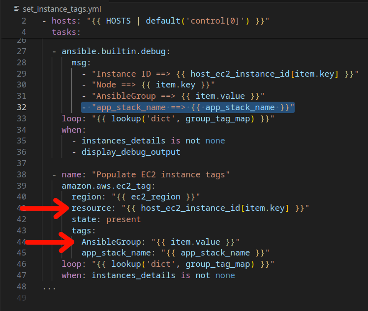
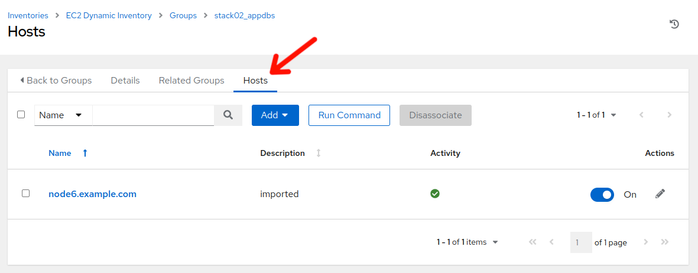

# Workshop Exercise - Three Tier App

## Table of Contents

- [Workshop Exercise - Three Tier App](#workshop-exercise---three-tier-app)
  - [Table of Contents](#table-of-contents)
  - [Objectives](#objectives)
  - [Guide](#guide)
    - [Three Tier App](#three-tier-app)
    - [Step 1 - Set Instance Tags](#step-1---set-instance-tags)
    - [Step 2 - Update Ansible Inventory](#step-2---update-ansible-inventory)
    - [Step 3 - Install Three Tier Application](#step-3---install-three-tier-application)
    - [Step 4 - Smoke Test Three Tier Application](#step-4---open-a-terminal-session)
  - [Conclusion](#conclusion)

## Objectives

* Install a three tier application stack to provide example of application/workload functionality testing pre/post conversion.

## Guide

### Three Tier App

This use-case will focus on conversion from CentOS (though this could be another RHEL derivitive) to RHEL while maintaining a 3 tier application stack (do no harm). We will utilize an additional project in Ansible Automation Platform, "Three Tier App / Prod", which will allow us to install a three tier application stack, consisting of HAProxy, Tomcat, and PostgreSQL, across the three CentOS nodes. Additionally, the project also provides a means to test/verify functionality of the application components, which we will perform before and after CentOS to RHEL conversions.

| Role                                   | Inventory name | 
| ---------------------------------------| ---------------|
| Automation controller                  | ansible-1      |
| Satellite Server                       | satellite      |
| CentOS/OracleLinux Host 4 - HAProxy    | node4          |
| CentOS/OracleLinux Host 5 - Tomcat     | node5          |
| CentOS/OracleLinux Host 6 - PostgreSQL | node6          |

| **A Note about using Satellite vs. Ansible Automation Platform for this...**<br>  |
| ------------- |
| Out of the box, Satellite 6 supports [RHEL systems roles](https://access.redhat.com/articles/3050101) (a collection of Ansible Roles) for a limited set of administration tasks. Satellite can be used to do OS conversions and upgrades, however an Ansible Automation Platform Subscription is required to execute complicated OS conversions and upgrades that require logic to meet up-time requirements.  Using these two solutions together ensures you have the best tool for the job for:<br>- Content Management (Satellite)<br>- OS Patching & Standardized Operating Environments (Satellite)<br>- Provisioning: OS, Infra Services and Applications/Other (Satellite and/or Ansible Automation Platform)<br>- Configuration of Infra and Apps (Ansible Automation Platform)<br><br>Reference: [Converting CentOS to RHEL with Red Hat Satellite 6](https://www.redhat.com/en/blog/steps-converting-centos-linux-convert2rhel-and-red-hat-satellite) and [Leapp Upgrade with Satellite 6](https://www.redhat.com/en/blog/leapp-upgrade-using-red-hat-satellite-6)|

### Step 1 - Set Instance Tags 

- Return to the AAP Web UI browser tab you opened in step 3 of the previous exercise. Navigate to Resources > Templates by clicking on "Templates" under the "Resources" group in the navigation menu. This will bring up a list of job templates that can be used to run playbook jobs on target hosts:

  

- In the filter box enter **Set instance** and click the magnifying glass.

  

- Click on the job template named **EC2 / Set instance tag - CentOS** to view the job template details. ( Click on `EC2 / Set instance tag - OracleLinux7` if you have Oracle Linux nodes)

  

- Click on the Source variable section expansion icon to view the entire variable definition for the job template.

  

- Note the **group_tag_map**...each node is being mapped to a group name which corresponds to the particular application tier role that the node is to serve. Looking at the Ansible playbook that corresonds to this job template:

  

- We can see that the **group_tag_map** dictionary is looped through, selecting a particular instace via the *resource: "{{ host_ec2_instance_id[item.key] }}"* filter and then setting the "AnsibleGroup" tag via *AnsibleGroup: "{{ item.value }}"*

- Additionally, the **app_stack_name** tag is set to designate that each node is a member of the same application stack.

- Click "Done" and then click "Launch" on the **EC2 / Set instance tag - CentOS** job template screen.

  

- The job run should complete in 8 to 10 seconds. Note the item --> key, value output listing, which corresponds to the instance tag "AnsibleGroup" that is being set respectively on each instance.

### Step 2 - Update Ansible Inventory

- Now that we have application tier group tags set, we can update the Ansible inventory to include inventory groups associated with our application stack tiers. However, before we do, let's review how the Ansible inventory update works behind the scenes.

  

- On the left menu bar, navigate to Resources > Inventories by clicking on "Inventories" under the "Resources" group in the navigation menu, then click on "EC2 Dynamic Inventory".

  

- Initially, the **EC2 Dynamic Inventory** inventory details tab will be displayed. Click on the "Sources" tab.

  

- The **EC2 Dynamic Inventory** inventory sources tab will be displayed. Click on the "CentOS7 Development" inventory source.

  

- The **CentOS7 Development** inventory source **Details** view will be displayed. Click on the variables expansion button on the side right.

  

- Looking at the Source variables, first let's look at `filters` and `hostnames`. The `filters` section will allow definining which instances should be selected for inclusion within the given inventory. In this case, the tags `ContentView`, `Environment`, `Student`, and `guid` will be utilized...all instances with tags matching the current values defined for each tag, will be selected. The `hostnames` sections allows defining how names of filtered resources will be definined in the inventory. In this case, the value currently defined with tag `NodeName` will be utilized for the name within the inventory.

  

- Scroll down the source variables section until you see "keyed_groups". [Keyed groups](https://docs.ansible.com/ansible/latest/plugins/inventory.html#:~:text=with%20the%20constructed-,keyed_groups,-option.%20The%20option) are where you can define dynamic inventory groups based on instance tags. In this case, given the instances that are selected via the filters in the previous section, if any of these instances are currently tagged with "app_stack_name" and "AnsibleGroup" tags, then it will create an inventory group with the name beginning with the value assigned to the "app_stack_name" tag, an "_" (underscore) and then the value assigned to the "AnsibleGroup" tag...so in this case, if the "app_stack_name" tag is currently set to `stack02` and the "AnsibleGroup" tag is set to `appdbs`, then the inventory group `stack02_appdbs` will be created (or confirmed if already existing) and that instance will be assigned to the `stack02_appdbs` group.

- Click on "Done" in the Source variables exapanded view.

  

- While still on the **CentOS7 Development** Details view, click on "Sync". The sync should complete in a few seconds. Now, let's verify our dynamic inventory group.

  

- In the menu bar on the left, select "Inventories" --> "EC2 Dynamic Inventory". Once the **EC2 Dynamic Inventory** details screen is displayed, click on the "Groups" tab.

  

- The **Groups** defined for the **EC2 Dynamic Inventory** screen is displayed. Scroll down and click on the `stack02_appdbs` group.

  

- Initially, the "Details" tab will display. Click on the "Hosts" tab and we will see that `node6.example.com` is present in the "stack02_appdbs" group. Remember earlier, when we reviewed the variables section of the **EC2 / Set instance tag - CentOS** job template? The **app_stack_name** and **group_tag_map** match up:

```
  "group_tag_map": {
    "node4.example.com": "frontends",
    "node5.example.com": "apps",
    "node6.example.com": "appdbs"
  },
  "app_stack_name": "stack02"
```

- Rather than having to navigate to **Inventories > EC2 Dynamic Inventory > Sources > _inventory_source_name_** and clicking "Sync" to initiate sync events, we have put together a job template with surveys and associated Ansible playbook that provides a more convenient method to utilize for this task. Let's review:

- Navigate to Resources > Templates by clicking on "Templates" under the "Resources" group in the navigation menu. This will bring up a list of job templates that can be used to run playbook jobs on target hosts:

  

- Click  to the right of **CONTROLLER / Update inventories via dynamic sources**.  

  

- Next we see the job template survey prompt. A survey is a customizable set of prompts that can be configured from the Survey tab of the job template. For this job template, the survey allows for choosing which part of the inventory will be updated. For "Select inventory to update" choose "CentOS7" from the drop-down and for "Choose Environment" select "Dev" and click the "Next" button.

  

- This will bring you to a preview of the selected job options and variable settings. Click "Launch".

  

- Survey the job output details...this job run only takes about 5 to 6 seconds to complete.

### Step 3 - Install Three Tier Application

- In the AAP Web UI, navigate to Resources > Templates by clicking on "Templates" under the "Resources" group in the navigation menu. This will bring up a list of job templates that can be used to run playbook jobs on target hosts.

  

- In the filter box, enter `EC2` and then click the magnifying glass. This will bring up a list of job templates specific to AWS/EC2 automation: 

  

- Click  to the right of **EC2 / Instance action**:

  

- For the `Launch | EC2 / Instance action - Other prompts` dialog, click **Next**.

  

- On the `Launch | EC2 / Instance action - Survey` dialog:
  - For `Select EC2 instance action` select "start".
  - For `Select OS target` select "CentOS7".
  - For `Select Environment stage` select "Dev".
  
  Then, click **Next**.

  

- On the `Launch | EC2 / Instance action - Preview` dialog, review and then click **Launch**. Once the `EC2 / Instance action` job has completed, our CentOS7 instances will be started and available for installing the three tier application stack.

- In the AAP Web UI, navigate to Resources > Templates by clicking on "Templates" under the "Resources" group in the navigation menu. This will bring up a list of job templates.

  

- Click  to the right of **CONVERT2RHEL / 98 - Three Tier App deployment** to launch the job.


- For `Choose application stack name`, remember earlier in the inventory tags section, "app_stack_name" was set to "stack02", so we choose "stack02" from the drop down selection. Then click **Next** then on the preview screen click **Launch**.

This will take ~2 minutes to complete.


### Step 4 - Smoke Test Three Tier Application

Now that our three tier application is installed, let's cover the application stack layout.

| Host              |  Component | Port  |
| ------------------|------------|-------|
| node4.example.com | HAProxy    | 80    |
| node5.example.com | Tomcat     | 8080  |
| node6.example.com | PostgreSQL | 5432  |

node4.example.com proxies incoming requests on port 80 and forwards them to port 8080 on node5.example.com, where Tomcat is running a simple java application that, upon an incoming request to the servlet, creates a table in the PostgreSQL database on node6.example.com, with the table name being constructed from the date and time of the request. For example:

`Table "06-06-2024-18-00" has been created!`

If you'd like to manually test the application stack, you can run the following commands by switching your browser to Visual Studio Code terminal, then from `ansible-1` prompt:

```curl http://node4.example.com```

Remember, node4.example.com is a proxy, so the above command displays the default page on node5.example.com

```curl http://node4.example.com/3ta/connectordbbservlet?```

The above will make a request to the Tomcat servlet, where the database table described earlier will be created on the PostgreSQL database on node6.example.com. Without writing out a complete PostgreSQL command cheat sheet, if desired, you can follow the following example command line trail (commands outlined in red rectangles) and check out the PostgreSQL system yourself:


- Now that we understand the application stack layout, rather than having to use the command line and checking all of the various components manually, let's look at how we can test application stack functionality...via automation!

  

- Use the side pane menu on the left to select **Templates**.

- Click  to the right of **CONVERT2RHEL / 99 - Three Tier App smoke test** to launch the application test job.

  

- For `Choose application stack name`, remember earlier in the inventory tags section, "app_stack_name" was set to "stack02", so we choose "stack02" from the drop down selection. Then click **Next**, then on the preview screen click **Launch**.

This should take ~15 seconds to complete.

  

- The Ansible playbook utilized by this job template makes a request to the Tomcat servlet via the HAproxy node and records the name of the database table that is presented. The database is then connected to and verifies that in fact a table with the recorded name is present in the database. By utilizing current time and date stamps, we are demonstrating that we are truly working with live systems in real time.

- If the job template completes successfully, then we have verified that our three tier application stack is functioning correctly. If it fails, we know that something with the application stack is malfunctioning and we can begin the debugging process to determine where the problem resides.

## Conclusion

In this exercise, we learned about how to set instance tags to assist with identifying instances. We then turned to looking into how Ansible Automation Platform dynamic inventory sources can be utilized to generate various host groups with a given inventory. We followed that with performing an automated installation of an example three tier application stack. Finally, we verified the three tier application stack functionality via an automated application smoke test.

Use the link below to move on the the next exercise.

---

**Navigation**

[Previous Exercise](../1.1-setup/README.md) - [Next Exercise](../1.3-analysis/README.md)

[Home](../README.md)
