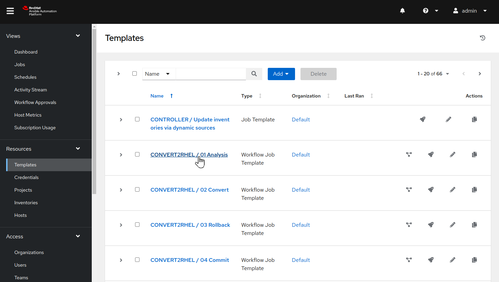
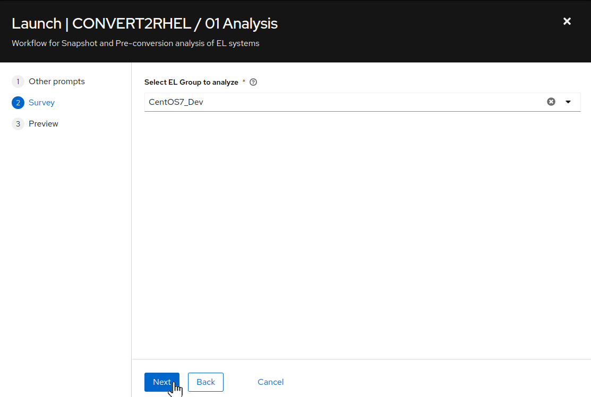
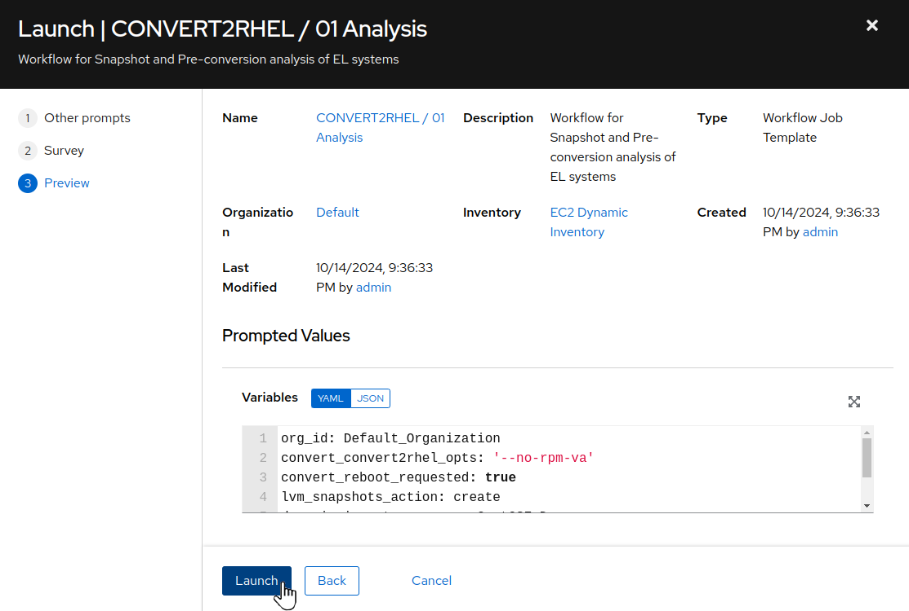
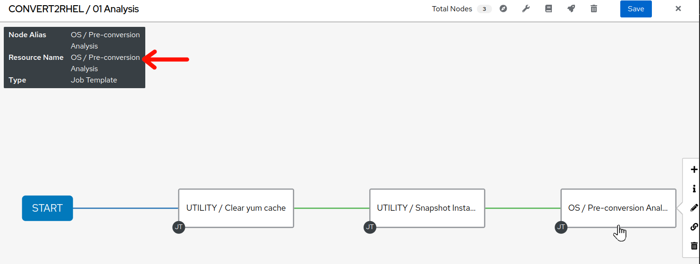

# Workshop Exercise - Run Pre-conversion Analysis Jobs

## Table of Contents

- [Workshop Exercise - Run Pre-conversion Analysis Jobs](#workshop-exercise---run-pre-conversion-jobs)
  - [Table of Contents](#table-of-contents)
  - [Objectives](#objectives)
  - [Guide](#guide)
    - [Step 1 - CentOS Conversion Automation Workflow](#step-1---centos-conversion-automation-workflow)
      - [Analysis](#analysis)
      - [Convert](#convert)
      - [Commit](#commit)
      - [Let's Get Started](#lets-get-started)
    - [Step 2 - Patch OS to latest package versions](#step-2---patch-os-to-latest-package-versions)
    - [Step 3 - Change Content Source for Content Host](#step-3---change-content-source-for-content-host)
    - [Step 4 - Use AAP to Launch an Analysis Playbook Job](#step-4---use-aap-to-launch-an-analysis-playbook-job)
    - [Step 5 - Review the Playbook Job Output](#step-5---review-the-playbook-job-output)
    - [Step 6 - Challenge Lab: Analysis Playbook](#step-6---challenge-lab-analysis-playbook)
  - [Conclusion](#conclusion)

## Objectives

* Understand the end-to-end CentOS conversion workflow
* Understand how to use AAP job templates to run Ansible playbooks
* Run the pre-conversion analysis jobs

## Guide

### Step 1 - CentOS Conversion Automation Workflow

Red Hat provides the Convert2RHEL utility, a tool to convert RHEL-like systems to their RHEL counterparts. The [Convert2RHEL documentation](https://access.redhat.com/documentation/en-us/red_hat_enterprise_linux/8/html-single/converting_from_an_rpm-based_linux_distribution_to_rhel/index) guides users on how to use the Convert2RHEL utility to manually convert a RHEL host. This is fine if there only a few CentOS hosts to convert, but what if you are a large enterprise with tens, hundreds, or even thousands of CentOS hosts? The manual process does not scale. Using automation, the end-to-end process for converting a RHEL host is reduced to a matter of days and the total downtime required for the actual conversion is measured in hours or less.

Our CentOS conversion automation approach follows a workflow with three phases:


> **Note**
>
> The <sub></sub> icon indicates workflow steps that are automated by Ansible playbooks.

#### Analysis

During the analysis phase, theoretically, no changes should be made to the system, other than the installation of the `Convert2RHEL` utility. However, to err on the side of caution, a first playbook is executed to create a snapshot that can be used for rolling back if any unforeseen issues corrupt the system. After the snapshot is created, the analysis playbook is executed, where the `Convert2RHEL` utility scans the host for issues or blockers that may prevent a successful conversion and then generates a report listing any potential risks found. The report also includes recommended actions that should be followed to reduce the likelihood of the reported issues impacting the conversion. If any recommended remediation actions are performed, the analysis workflow should be run again (snapshot/analyze) to verify the risks are resolved. This iteration continues until everyone reviewing the report is comfortable that any remaining findings are acceptable.

<!-- The following only applies when using the Ansible role being developed for LVM snapshots...

 In addition to conversion risks that could impact the success of the conversion, the report also indicates if there is enough free space to support the snapshot configuration required in case rolling back is required. If there is not enough free space, temporary space should be made available, for example, by adding an additional virtual disk to the rootvg volume group. Removing /var/crash or other non-critical filesystems under the rootvg volume group is another option. It is strongly recommended to make space so that a snapshot rollback is possible just in case.
-->

#### Convert

After the analysis phase is complete and the report indicates acceptable risk, a maintenance window can be scheduled and the conversion phase can begin. It is during this phase that the conversion playbooks are executed using a workflow job template. The first playbook creates a snapshot that can be used for rolling back if anything goes wrong with the conversion. After the snapshot is created, the second playbook uses the [convert role from the infra.convert2rhel Ansible collection](https://github.com/redhat-cop/infra.convert2rhel/tree/main/roles/convert), where the automation is a convenience wrapper around the Convert2RHEL utility, to perform the operation where the CentOS host is converted to RHEL. The host should not be accessed via login or application access during the conversion, unless working through remediation development activities. When the conversion is finished, the host will reboot under the newly converted RHEL system. Now the ops and app teams can assess if the conversion was successful by verifying all application services are working as expected.

#### Commit

If there are any application impacts discovered that can't be easily corrected within the scheduled maintenance window, the decision can be made to undo the conversion by rolling back the snapshot. This will revert all changes and return the host back to the previous CentOS version. However, if there are no issues found, the commit phase begins. During the commit phase, the host can be returned to normal operation while keeping the snapshot just in case any issues are uncovered later.
> **&#9432;** This is LVM specific: However, while the snapshots are kept, regular disk writes to volume groups will continue to consume the free space allocated to the snapshots. The amount of time this takes will depend on the amount of free space initially available and the volume of write i/o activity to the volume groups. Before the snapshot space is exhausted, the snapshots must be deleted and then there is no turning back.

Once comfortable with the converted host, the commit playbook should be executed to delete the snapshot. The CentOS conversion to RHEL is complete.

#### Let's Get Started

The CentOS conversion automation approach workflow is designed to reduce the risks inherent in doing an in-place conversion versus deploying a new RHEL host. Decision points at the end of the analysis and conversion phases allow the process to be rolled back and restarted with the benefit of lessons learned through reporting checks and actual conversion results. Of course, the best practice for avoiding production impacts or outages is to proceed with conversions in properly configured Dev and Test environments before moving on to Production hosts.

### Step 2 - Patch OS to latest package versions

One of the prerequisites for successful Convert2RHEL OS conversions is that the conversion must be performed with the latest packages from the minor version of the OS that is supported for the conversion. This is to ensure the rollback feature can be utilized in case the conversion fails.

  > **Note**
  >
  > While the Convert2RHEL rollback feature does work in a great many cases, Red Hat recommends that an additional means of backup external to the Convert2RHEL utility be implemented, with verification in advance of conversion operations that systems can be restored if needed.

- Switching to the Satellite Web UI browser tab and navigate to Hosts > Content Hosts by hovering over "Hosts" in the left navigation menu and then clicking "Content Hosts":

  

- We can see that the CentOS hosts have some package updates that can be applied.

  > **Note**
  >
  > The `/var/cache/yum` directory is utilized by the `yum` utility to cache RPM metadata and packages that have been accessed/installed. Over time, the space that this directory consumes can grow to significant amounts, often causing the `/var` filesystem to max out. In case you run the **OS / Patch OS to latest** job template and it errors out due to `/var` filesystem space exhaustion, run the **UTILITY / Clear yum cache** job template against the *CentOS7_Dev* inventory group to free up available space on the `/var` filesystem. As an option, consider running the **UTILITY / Clear yum cache** job template prior to the **OS / Patch OS to latest** job template as a preemptive step to ensure `/var` filesystem space exhaustion is not an issue.

- Return to the AAP Web UI browser tab and navigate to Resources > Templates by clicking on "Templates" under the "Resources" group in the navigation menu:

  

- Click  to the right of **OS / Patch OS to latest** to launch the OS patch job. This will display the job template limit and variable dialog:

  

- Click "Next". The survey dialog will display:

  

- Next we see the job template survey dialog. A survey is a customizable set of prompts that can be configured from the Survey tab of the job template. For this job template, the survey allows for selecting the Ansible inventory group, as well as whether or not to include kernel package updates and whether or not to perform a "Check only" operation and not actually update packages, but verify what packages would be updated if we were to perform the update at this moment. We are working with the **CentOS7_Dev** inventory group, so click the "Select inventory group" drop down menu and select "CentOS7_Dev". Leave "Include kernel updates?" at the default "yes" and leave "Check for updates only?" at the default "no". Click "Next".

  

- Review the various settings and prompted values for the **OS / Patch OS to latest** job launch. Click "Launch". This job run will require anywhere from three to five minutes to complete.

  

- With a successful job completion, we are ready to proceed with the pre-conversion OS analysis.

### Step 3 - Change Content Source for Content Host

Before we start the pre-conversion OS analysis, we need to change the Satellite content source for our CentOS content hosts. With the release of Convert2RHEL 2.x, providing content registration details as part of the variables supplied are no longer utilized. Instead, the system to be converted should be registered to a content view that provides access to package repositories for both the current version of installed operating system, as well as access to package repositories for the target version of RHEL that is being converted to. In addition, access to the Convert2RHEL related package repositories should be included.

If you would like to review the content view configuration that we will be utilizing as part of the conversion process, switch to the browser tab where you are logged in to Satellite.

- Once the Satellite web UI is accessible, click on Content > Lifecycle > Content Views.

  

  > **Note**
  >
  > A composite content view in Satellite is a content view that is composed of other composite views, typically multiples of content views.

- On the `CentOS7_to_RHEL7` content view page, click on the `Content views` tab.

  

- Notice that the CentOS7 and RHEL7 content views have been added to the CentOS7_to_RHEL7 composite content view. Click on either of the CentOS7 or RHEL7 content views and then the `Repositories` tab in each view.

  

  

Currently, our CentOS7 nodes are configured to utilize the `CentOS7` content view, with associated `CentOS7_Dev` lifecycle environment. We will now change our CentOS7 nodes to instead consume the `CentOS7_to_RHEL7` composite content view via the associated `CentOS7_to_RHEL7_Dev` lifecycle environment during the conversion process.

- Return to the AAP Web UI browser tab and navigate to Resources > Templates by clicking on "Templates" under the "Resources" group in the navigation panel and click on `SATELLITE / Change content source for content host`.

  

- On the details page, review the job template settings and variables section, then click on "Launch".

  

- On the survey dialog, for `Select inventory group`, select `CentOS7_Dev` from the drop down. Leave the specific content hosts limit field blank. for `Select target lifecycle environment for the content host`, select `CentOS7_to_RHEL7_Dev`, then click "Next".

  

- On the preview dialog, review the various settings and if desired, review the Prompted Values/Variable section. When ready to proceed, click "Launch".

  

- Verify that the Change content source for content host job completes successfully.

  

If you would like to verify the content host configuration has changed, switch to the browser tab where you are logged in to Satellite.

- Once the Satellite web UI is accessible, click on Hosts > Content Hosts. When the *Content Hosts* page is displayed, we should see that the CentOS7 content hosts are now configured to pull package content from the "CentOS7_to_RHEL7" content view and "CentOS7_to_RHEL7_Dev" lifecycle environment.

  

### Step 4 - Use AAP to Launch an Analysis Playbook Job

As we progress through the workshop, we'll refer back to this diagram to track where we are in our automation approach workflow. We are starting now in the highlighted block below:

  

The first step in converting our three tier app hosts will be executing the analysis workflow to generate the Convert2RHEL pre-conversion analysis report for each host. To do this, we will use the Ansible Automation Platform (AAP) automation controller host that has been pre-configured in your workshop lab environment.

- Return to the AAP Web UI browser tab and navigate to Resources > Templates by clicking on "Templates" under the "Resources" group in the navigation menu:

  

- Click on the "CONVERT2RHEL / 01 Analysis" workflow job template. This will display the Details tab of the workflow job template:

  

- From here, we could use the "Edit" button if we wanted to make any changes to the workflow job template. This workflow job template is already configured, so we are ready to use it to submit a workflow job. To do this, use the "Launch" button which will bring up a series of prompts.

  > **Note**
  >
  > The prompts that each job or workflow template presents to users can be configured using the "Prompt on launch" checkboxes seen when editing a job or workflow template.

  

- The first prompt as seen above allows for limiting the scope of the automation across a grouping of hosts by defining specific hosts within the inventory group, as well as reviewing variables that are being passed to the workflow. No adjustments are necessary at this time, so click the "Next" button to move on.

  

- For this workflow job template, the survey allows for choosing a group of hosts on which the workflow will execute against. For `Select EL Group to analyze` choose `CentOS_Dev` from the drop-down and click the "Next" button. This will bring you to a preview of the selected job options and variable settings.

  

- If you are satisfied with the job preview, use the "Launch" button to start the workflow job.

### Step 5 - Review the Workflow Job Output

After launching the analysis workflow job, the AAP Web UI will navigate automatically to the workflow output page for the workflow you just started.

  

- While the workflow job is running, you can monitor progress by clicking on an individual workflow job node and then click on the "Output" tab within the individual job run. The job output will scroll automatically as task results are streamed to the bottom of job output shown in the AAP Web UI.

- The analysis workflow will run the Convert2RHEL pre-conversion system analysis. Click on the `OS / Pre-conversion Analysis` job node and then click on the "Output" tab to follow the job outout log. This will take about nine to ten minutes to complete. When it is done, you can find a "PLAY RECAP" at the end of the job output showing the success or failure status for the playbook runs executed on each host. A status of "failed=0" indicates a successful playbook run. Scroll to the bottom of the job output and you should see that your job summary looks like this example:

  

- Additionally, you can verify the status of each node by scrolling through the job output and checking for a message specific to each node indicating that the pre-conversion analysis was successful. If any issues were found, a quick synopsis message will be printed instead, as well as providing a path to the pre-conversion log file for further, manual investigations.

  

- If any errors are experienced, the `CONVERT2RHEL / 03 Rollback` job template can be used to revert nodes back to the pre-conversion analysis state and steps can be taken to remediate any issues/errors, followed by a new pre-conversion analysis workflow template run. Repeat this process until the pre-conversion analysis returns SUCCESS.

### Step 6 - Challenge Lab: Analysis Playbook

Let's take a closer look at the playbook we just ran.

> **Tip**
>
> Try looking at the configuration details of the "Automated Management" project and the "CONVERT2RHEL / 01 Analysis" workflow template.

Can you find the upstream source repo and playbook code?

> **Warning**
>
> **Solution below\!**

- In the AAP Web UI, navigate to Resources > Projects > Automated Management. Under the Details tab, you will see the "Source Control URL" setting that defines where job templates of this project will go to pull their playbooks. We see it is pointing to this git repo on GitHub: [https://github.com/redhat-partner-tech/automated-satellite](https://github.com/redhat-partner-tech/automated-satellite). Open this URL in a new browser tab.

  

- With the new tab opened and the `redhat-partner-tech/automated-satellite` repo displayed, on the left side of the browser, click the drop down for the branch selection where `main` is displayed. Click the `aap2-rhdp-prod` branch to select this branch for viewing.

- Go back to the AAP Web UI and now navigate to Resources > Templates > CONVERT2RHEL / 01 Analysis. Under the Details tab, you will see that this is a workflow template. In order to view the individual jobs within the workflow, click on the tab named "Visualizer". Once, the workflow visualization is displayed, hover the mouse pointer over the node named "OS / Pre-conversion Analysis". We can see that the node name in this workflow is the same as the resource used, in this case, the name of the job template "OS / Pre-conversion Analysis".

  

- Staying in the the AAP Web UI, navigate to Resources > Templates > OS / Pre-conversion Analysis. Under the Details tab, you will see that this is a job template, with the "Playbook" setting with the name of the playbook this job template runs when it is used to submit a job. The playbook name is `c2r_analysis.yml`. In your browser, switch back GitHub browser tab where we navigated to the project source. There you can find `c2r_analysis.yml` listed in the files of the git repo. Click on it to see the playbook contents.

- Notice that the `Analyze CentOS 7.9 systems` tasks is comprised of the following:
```
    - name: Analyze CentOS 7.9 systems
      when:
        - "ansible_distribution == 'CentOS'"
        - "ansible_distribution_major_version | int  == 7"
        - "ansible_distribution_version.split('.')[1] | int >= 9"
      ansible.builtin.import_tasks: c2r_analysis_centos.yml
```
- Since our CentOS nodes match all of these `when` tests, the tasks from `c2r_analysis_centos.yml` are going to be imported into our playbook run. In your GitHub browser tab, find `c2r_analysis_centos.yml` and click on it to review the playbook contents.

- Notice that after some intial preparations are performed, the `Generate pre-conversion analysis report` task of the playbook imports the `analysis` role from the `infra.convert2rhel` Ansible collection.
```
- name: Generate pre-conversion analysis report
  ansible.builtin.import_role:
    name: infra.convert2rhel.analysis
```
By checking the `collections/requirements.yml` file in the `redhat-partner-tech/automated-satellite` git repo, we can discover that this role comes from another git repo at [https://github.com/heatmiser/infra.convert2rhel](https://github.com/heatmiser/infra.convert2rhel). It is the `analysis` role under this second git repo that provides all the automation tasks that ultimately runs the Convert2RHEL analysis scan and generates the report. *NOTE* We are utilizing a fork of the upstream infra.convert2rhel Ansible collection [https://github.com/redhat-cop/infra.convert2rhel](https://github.com/redhat-cop/infra.convert2rhel). Because the upstream collections is a fast moving project, we utilize a fork where we can closely manage the state of the code base to ensure optimal stability for the lab/workshop/demo environment.

- In a new browser tab/instance, open the [https://github.com/heatmiser/infra.convert2rhel](https://github.com/heatmiser/infra.convert2rhel) URL. Drill down to the `roles/analysis` directory in this git repo to review the README and yaml source files.

When you are ready to develop your own custom playbooks to run conversions for your enterprise, you should consider using roles from the `infra.convert2rhel` Ansible collection to make your job easier.

## Conclusion

In this exercise, we learned about the end-to-end workflow used by our automation approach for doing RHEL-like OS conversions. We used a workflow template in AAP to submit a workflow job that cleared node yum cache, performed an LVM snapshop of each node, and then ran the Convert2RHEL pre-conversion analysis on our three tier application servers. In the challenge lab, we explored the analysis playbook that we ran and how it includes a role from an Ansible collection.

In the next exercise, we will review the analysis reports we just generated.

---

**Navigation**

[Previous Exercise](../1.2-three-tier-app/README.md) - [Next Exercise](../1.4-report/README.md)

[Home](../README.md)
