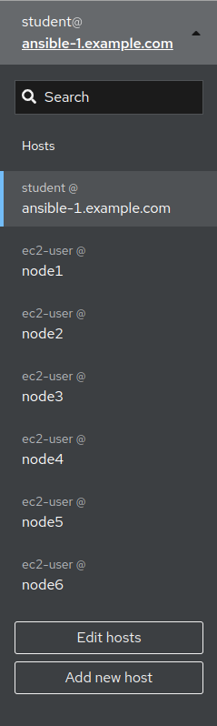
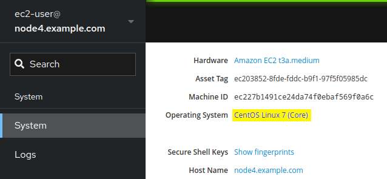
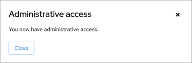
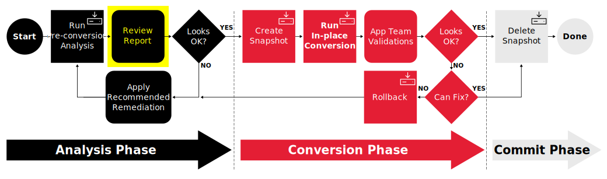
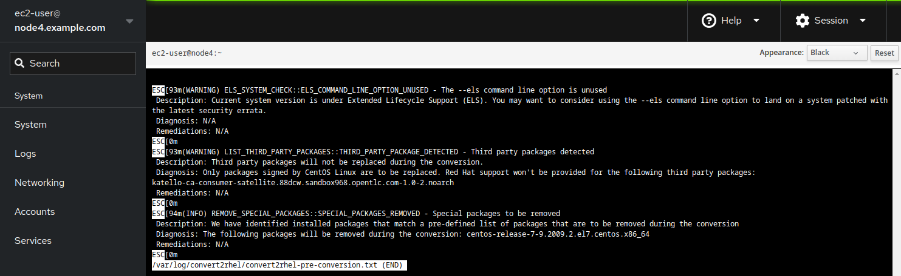

# Workshop Exercise - Review Pre-conversion Reports

## Table of Contents

- [Workshop Exercise - Review Pre-conversion Reports](#workshop-exercise---review-pre-conversion-reports)
  - [Table of Contents](#table-of-contents)
  - [Objectives](#objectives)
  - [Guide](#guide)
    - [Step 1 - Managing Convert2RHEL Pre-conversion Results](#step-1---managing-convert2rhel-pre-conversion-results)
    - [Step 2 - Navigating the CentOS Web Console](#step-2---navigating-the-rhel-web-console)
    - [Step 3 - Review Convert2RHEL Pre-conversion Report of CentOS 7 Host](#step-3---review-convert2rhel-pre-conversion-report-of-centos-7-host)
    - [Challenge Lab: What About Ignoring So Many High Findings?](#challenge-lab-what-about-ignoring-so-many-high-findings)
  - [Conclusion](#conclusion)

## Objectives

* Understand the different options for reviewing Convert2RHEL pre-conversion reports
* Use the RHEL/CentOS Web Console to review the reports we generated
* Embrace failure!

## Guide

### Step 1 - Managing Convert2RHEL Pre-conversion Results

In the previous exercise, we used a workflow template with associated job templates and playbooks to analyze our CentOS7 app servers. Behind the scenes, the `analysis` module from the `infra.convert2rhel` Ansible collection launched a Convert2RHEL pre-conversion analysis on each of our CentOS 7 app servers and once complete, parsed the pre-conversion analysis report for any issues that would either block the conversion from initiating or potentially failing. If any problems were found, then the Ansible Automation Platform automation job would have reported a failure.

- If we are using the Convert2RHEL utility to manually convert just a single CentOS host, we could simply get to a shell prompt on the host and look at the local report file output. In [Exercise 1.1, Step 2](../1.1-setup/README.md#step-2---open-a-terminal-session), we learned how to open an ssh session to one of our app servers. Follow those steps and after logging in, use this command to review the local Convert2RHEL pre-conversion report file:

  ```
  less /var/log/convert2rhel/convert2rhel-pre-conversion.txt
  ```

  This is a "quick and dirty" way to review the report, but doesn't scale if you need to review reports for a large number of hosts.

  > **Note**
  >
  > Use the up and down arrow keys to scroll through the file and type `q` when you are ready to quit the `less` command.

- CentOS 7 includes an optional administration web console based on [Cockpit](https://access.redhat.com/documentation/en-us/red_hat_enterprise_linux/8/html-single/managing_systems_using_the_rhel_8_web_console/index#what-is-the-RHEL-web-console_getting-started-with-the-rhel-8-web-console) called the CentOS Web Console. We will explore how to review the Convert2RHEL pre-conversion reports using the CentOS Web Console in the next step of this exercise.

- In addition to writing the plain text `convert2rhel-pre-conversion.txt` file, a JSON format `convert2rhel-pre-conversion.json` file is also generated. This file includes the same report results as the plain text file, but in JSON format which is perfect for being ingested by log management tools like Elastic/Kibana or Splunk. Many large enterprises will push their pre-conversion report data to one of these tools to develop their own custom dashboards that can filter reports by environment (e.g., Dev/Test/Prod), location, app ID, owning team, etc. <!-- FIXME: add Splunk example here when https://issues.redhat.com/browse/RIPU-35 gets done. -->

### Step 2 - Navigating the CentOS Web Console

For this workshop, we will be using the CentOS Web Console to access the Convert2RHEL pre-conversion reports we generated.

- Return to the RHEL Web Console browser tab you opened from [Exercise 1.1, Step 4](../1.1-setup/README.md#step-4---access-the-rhel-web-console). This is the RHEL Web Console of the AAP controller host, but we need to access our CentOS 7 app server hosts to see their pre-conversion reports. Do this by clicking the "student&#8203;@&#8203;ansible-1.example.com" box in the top left corner of the AAP RHEL Web Console to reveal the remote host menu. For example:

  

- You can use the remote host menu to navigate to the web consoles of each of your CentOS 7 app servers. Try selecting one of your CentOS 7 app servers now. The Web Console system overview page will show the operating system version installed. For example, we can see node4 is confirmed as running CentOS 7:

  

- Additionally, if you'd like, take note/record the `Asset Tag` and `Machine ID` values. You can compare these values post conversion to prove the base hardware/virtualization instance is the same.

- When you navigate to different hosts in the Web Console, look out for the "limited access mode" warning:

  

  If you see this, use the button to switch to administrative access mode before proceeding. A confirmation will appear like this:

  

- Take some time to explore the navigation menus available with the Web Console of your different CentOS 7 app servers. Once you feel comfortable navigating around the console and switching between hosts, move on to the next step where we will look at our first pre-conversion report.

### Step 3 - Review Convert2RHEL Pre-conversion Report of CentOS 7 Host

We are now here in the automation approach workflow:



Now, let's use the Web Console to review the Convert2RHEL pre-conversion reports. We will start by looking at one of the CentOS 7 hosts.

- Navigate to the RHEL Web Console remote host menu and click on the hostname of one of your CentOS 7 app servers (should be node4, node5, or node6). Remember as we learned in the previous step, you can confirm the CentOS version on the system overview page.

- Having verified you are looking at one of the CentOS 7 app servers, use the main menu to navigate to Tools > Terminal. This will display a shell terminal on the host system. In order to review the Convert2RHEL pre-conversion report that was generated for host, copy the following command line and paste into the terminal and press `Enter` or `return`:

```
less /var/log/convert2rhel/convert2rhel-pre-conversion.txt
```

 For example, the analysis output might look like this:

  

  > **Note**
  >
  > The contents of your report may differ from the example above because of updates made to the Convert2RHEL framework and other RHEL packages released over time since this workshop was written. If you discover any differences that materially break the flow of the exercises in the workshop, kindly let us know by raising an issue [here](https://github.com/redhat-partner-tech/automated-satellite/issues/new).

- When the pre-conversion report is generated, the Convert2RHEL framework collects system data and assesses convertability based on a large collection of checks. When any of these checks uncovers a potential risk, it is recorded as a finding in the report.

- The good news is that the warning regarding the "third party" package `katello-ca-consumer-satellite`:  
`(WARNING) LIST_THIRD_PARTY_PACKAGES::THIRD_PARTY_PACKAGE_DETECTED - Third party packages detected`  
...is something we can ignore, as this package is part of the registration of the CentOS system to Satellite.

- Other potential findings that might be present:
  - `(ERROR) REMOVE_EXCLUDED_PACKAGES::EXCLUDED_PACKAGE_REMOVAL_FAILED - Failed to remove excluded package`  
    This finding typically means that a package and version that is present on the system to be converted can not be found during the conversion analysis and as such the built-in rollback functionality within the `convert2rhel` utility would not be able to successfully rollback a conversion attempt if something went wrong.
  - `(OVERRIDABLE) PACKAGE_UPDATES::OUT_OF_DATE_PACKAGES - Outdated packages detected`  
    and  
    `(WARNING) CONVERT2RHEL_LATEST_VERSION::ALLOW_OLDER_VERSION_ENVIRONMENT_VARIABLE - Outdated convert2rhel version detected`  
    ...both relate to not using the most up-to-date version of the `convert2rhel` utility. Remember, in order to maintain optimal stability for the lab/workshop/demo environment, we pin the version of the `convert2rhel` utility to a specific release, so we can closely manage the state of the code base to ensure optimal stability for the lab/workshop/demo environment. As time passes and new versions can be tested against the workshop environment, updates will be made, so you may or may not experience the above issues in your pre-conversions analysis results.

### Challenge Lab: What if we were to experience warnings we are unsure of?

You may be wondering: what if there are many warning issues listed in the report? Why would we be going forward with attempting a conversion without first resolving all the findings on the report? It's a fair question.

> **Tip**
>
> Think back to the three key features that we introduced at the beginning of the exercise.

Is there a specific feature that helps with reducing risk?

> **Warning**
>
> **Solution below\!**

Of course, the answer is our automated snapshot/rollback capability.

- If any of the findings listed in the pre-conversion analysis report ultimately leads to the conversion failing or results in application compatibility impact, we can quickly get back to where we started by rolling back the snapshot. Before rolling back, we can debug the root cause and use the experience to understand the best way to develop remediation and eliminate the risk of that failure or impact happening in the future.

- There is a concept explained quite well in the famous article [Fail Fast](http://www.martinfowler.com/ieeeSoftware/failFast.pdf) published in *IEEE Software*. The article dates back to 2004, so this is hardly a new concept. Unfortunately, there is a stigma associated with failure that can lead to excessively risk-averse behavior. The most important benefit of having automated snapshots is being able to quickly revert failures. That allows us to safely adopt a "fail fast / fail smart" mantra.

- Of course, there are many best practices we can follow to reduce risk. Obviously, start with testing for application impacts by trying conversions in your lower environments first. Any issues that can be worked out with Dev and Test servers will help you be prepared to avoid those issues in Production.

- When present, the findings reported by the Convert2RHEL pre-conversion analysis report are there to make us aware of potential failure modes, but experience has shown that sometimes they are not a problem. Do not become petrified when you see those warnings on the report. Assess findings, develop automation to remediate any issues, and then run through the conversion process, reverting back to step one to loop through the process as your arsenal of remediation automation builds over time. Convert early _and_ often!

## Conclusion

In this exercise, we learned about the different options for managing Convert2RHEL pre-conversion analysis reports. We used the CentOS Web Console to look at the reports we generated in the previous exercise. In the challenge lab, we reviewed the importance of snapshots and learned to embrace failure.

---

**Navigation**

[Previous Exercise](../1.3-analysis/README.md) - [Next Exercise](../2.1-convert/README.md)

[Home](../README.md)
