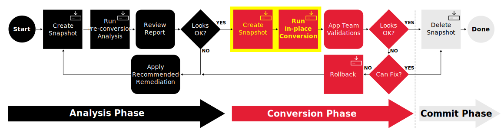

# Workshop Exercise - Run EL OS Conversion Jobs

## Table of Contents

- [Workshop Exercise - Run EL OS Conversion Jobs](#workshop-exercise---run-el-os-conversion-jobs)
  - [Table of Contents](#table-of-contents)
  - [Objectives](#objectives)
  - [Guide](#guide)
    - [Step 1 - Launch the Conversion Workflow Job Template](#step-1---launch-the-conversion-workflow-job-template)
    - [Step 2 - Learn More About Convert2RHEL](#step-2---learn-more-about-leapp)
  - [Conclusion](#conclusion)

## Objectives

* Use a workflow job template to create snapshots and start the coverversions
* Learn about how the Convert2RHEL framework goes about converting CentOS to RHEL

## Guide

We are ready to start the conversion phase of our CentOS to RHEL automation journey:

It is during this phase that the conversion playbooks are executed using a workflow job template. The first playbook creates a snapshot that can be used for rolling back if anything goes wrong with the conversion. After the snapshot is created, the second playbook uses the Convert2RHEL utility to perform the conversion where the host is advanced to the new RHEL major version.

### Step 1 - Launch the Conversion Workflow Job Template

We are about to start the CentOS conversion of our application servers. The hosts will not be available for login or application access during the conversion. When the conversion is finished, the hosts will reboot under the newly converted RHEL major version.

Conversions typically take less than an hour, although they can run for longer if there are applications that shutdown slowly or with bare metal hosts that have a long reboot cycle. The cloud instances provisioned for our workshop lab environment will convert fairly quickly as they are very lightweight compared to traditional enterprise app servers.

- Return to the AAP Web UI tab in your web browser. Navigate to Resources > Templates and then open the "CONVERT2RHEL / 02 Convert" job template. Here is what it looks like:

  

- Click the "Launch" button which will bring up the prompts for submitting the job starting with the variables prompt:

  

- We are going to convert all of our CentOS application hosts using a single job, so we can leave the `Limit` field empty. We don't need to change any of the variables settings, so click the "Next" button to move on.

  

- Next we see the job template survey prompt asking us to `Select EL Group to convert`. Choose the `CentOS7_Dev` inventory group. For the `Select target RHEL Lifecycle Environment to convert to` option, we want to utilize the comparable `RHEL7_Dev` Content View for our RPM package sources during the conversion, so choose `RHEL7_Dev` and click the "Next" button. This will bring you to a preview of the selected job options and variable settings.

  

- If you are satisfied with the job preview, use the "Launch" button to start the job.

### Step 2 - Learn More About Convert2RHEL

After launching the conversion job, the AAP Web UI will navigate automatically to the workflow job output page of the job we just started. This job will take up to 20 minutes to finish, so let's take this time to learn a little more about how the Convert2RHEL framework converts your EL OS to the associated RHEL major version.

- Keep in mind that the Convert2RHEL framework is responsible only for converting the CentOS packages. Additional tasks required for upgrading your standard agents, tools, middleware, etc., need to be included in the conversion playbooks you develop to deal with the specific requirements of your organization's environment.

## Conclusion

In this exercise, we launched a workflow job template to create snapshots and start the conversions of our CentOS app servers. We learned more about the Convert2RHEL framework to better understand what is happening as the CentOS systems are being converted.

In the next exercise, we'll learn more about how snapshots work.

---

**Navigation**

[Previous Exercise](../1.4-report/README.md) - [Next Exercise](../2.2-snapshots/README.md)

[Home](../README.md)
