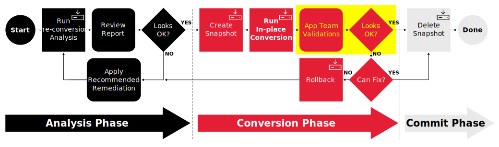
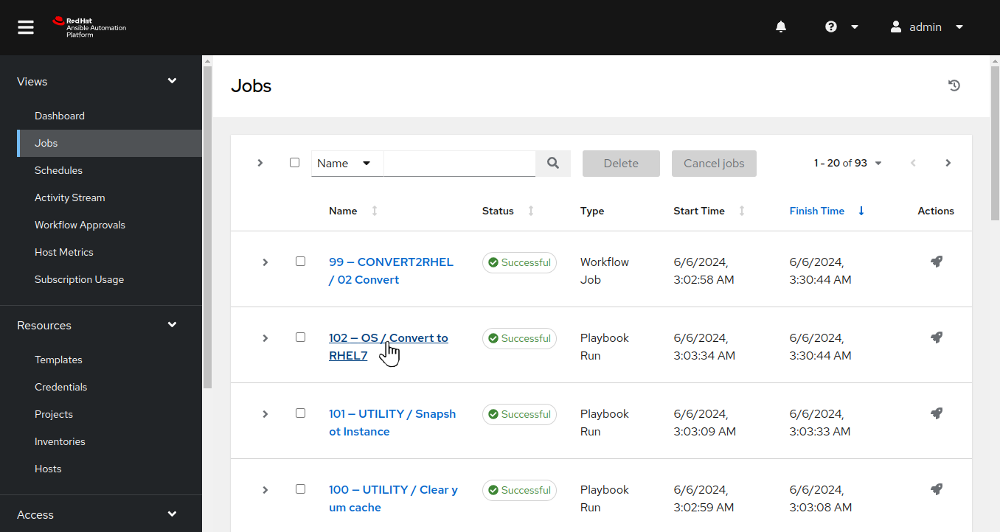
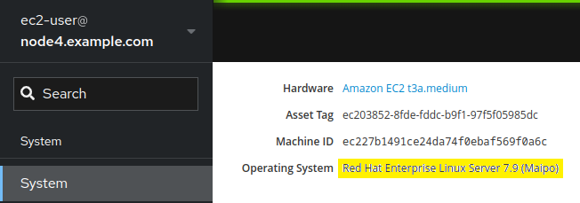
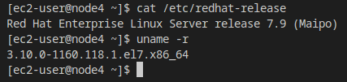
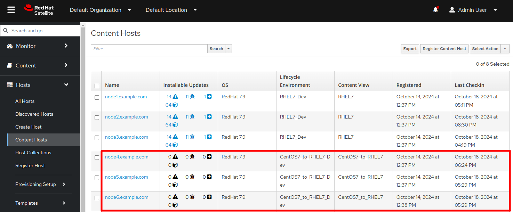

# Workshop Exercise - Check if the Conversions Were Successful

## Table of Contents

- [Workshop Exercise - Check if the Conversions Were Successful](#workshop-exercise---check-if-the-conversions-were-successful)
  - [Table of Contents](#table-of-contents)
  - [Objectives](#objectives)
  - [Guide](#guide)
    - [Step 1 - Review the Conversion Playbook Job Log](#step-1---review-the-conversion-playbook-job-log)
    - [Step 2 - Verify the Hosts are Converted to Next RHEL Version](#step-2---verify-the-hosts-are-converted-to-next-rhel-version)
  - [Conclusion](#conclusion)

## Objectives

* Review the conversion playbook job log
* Verify our three tier application servers are running the new RHEL version

## Guide

In the previous exercises, we reviewed pre-conversion analysis reports, as well as reviewing the potential for incorporating remediations. After all of that, you finally launched the Ansible workflow that initiated jobs with corresponding playbooks to run the CentOS conversions on your servers.

It's time to verify the results of the conversions and let our application team assess if their three tier application stack is in working order. We are here in our CentOS in-place conversion automation workflow:

Let's get started!

### Step 1 - Review the Conversion Playbook Job Log

The first thing we want to do is see if the job running the conversion playbook has finished successfully.

- Return to the AAP Web UI tab in your web browser. Navigate to Views > Jobs and then open the "## - OS / Convert to RHEL7" playbook run entry (## will be a number) to see the log output from the conversions.

  > **Note**
  >
  > When looking in the Jobs view, you will also see an entry for the "## - CONVERT2RHEL / 02 Convert" workflow job. Workflow jobs launch a number of playbook runs. To see the conversion playbook log output, we need to open the job entry for the conversion playbook run, not the workflow job entry.

  For example:

  

- If the playbook run finished without any failed tasks, you should see "Successful" displayed with a green checkmark.

  > **Note**
  >
  > If you see "Running" with spinning arrows, the playbook/automation job is still running. Wait for the job run to finish before moving on with this exercise.

  Scroll down to the end of the log output to see the "PLAY RECAP" indicating the success or failure status for the job run executed on each host. Here is what you should expect to see:

  

  If there are no failed runs, the CentOS in-place conversion is complete on all of our application servers.

### Step 2 - Verify the Hosts are Converted to Next RHEL Version

Now let's make sure our application servers have actually converted to RHEL.

- In [Exercise 1.4: Step 2](../1.4-report/README.md#step-2---navigating-the-centos-web-console), you used the CentOS Web Console to check the installed CentOS versions on your application servers. Let's repeat those steps to see the RHEL versions reported after our conversions.

  Return to your Web Console browser tab and use the remote host menu to navigate to the web consoles of each of your application servers. The Web Console system overview page should now show the converted versions.

  > **Note**
  >
  > You may need to refresh the browser using Ctrl-R to see the newly reported RHEL version.

  For example, the node4 application server that previously had CentOS 7.9 is now reporting RHEL 7.9:

  

- Additionally, if you recorded the `Asset Tag` and `Machine ID`, note that they are the same, serving as verification that this is indeed the same system that was previously operating with CentOS 7.

- You can also check the RHEL and kernel versions from the command line following the steps you used with [Exercise 1.4: Step 3](../1.4-report/README.md#step-3---review-convert2rhel-pre-conversion-report-of-centos-7-host).

  At the shell prompt of your application servers, use the `cat /etc/redhat-release` and `uname -r` commands. Here's an example showing that application server `node4` was converted to RHEL 7:

  

- Additionally, we can check Satellite to review the content host status for these systems. Switch over to the browser instance for Satellite and in the left navigation pane, select `Hosts > Content Hosts`. Note that the OS for node4, node5 and node6 now show to be RHEL 7.9:

  

## Conclusion

In this exercise, we observed that the conversion playbook runs completed successfully. We then used the RHEL Web Console,the command line, as well as Satellite to verify the new RHEL versions were installed.

Continue to the following exercise to verify the three tier application is still functioning as expected after the CentOS to RHEL conversions:

- [Exercise 2.4 - How is the Three Tier App Doing?](../2.4-check-three-tier-app/README.md)

Otherwise, you may skip ahead to the next section of the workshop where we will demonstrate rolling back the CentOS conversion, starting with these exercises:

- [Exercise 3.1 - (Optional) Trash the Instance](../3.1-error-condition/README.md)
- [Exercise 3.2 - Run Rollback Job](../3.2-rollback/README.md)

---

**Navigation**

[Previous Exercise](../2.2-snapshots/README.md) - [Next Exercise](../2.4-check-three-tier-app/README.md)

[Home](../README.md)
