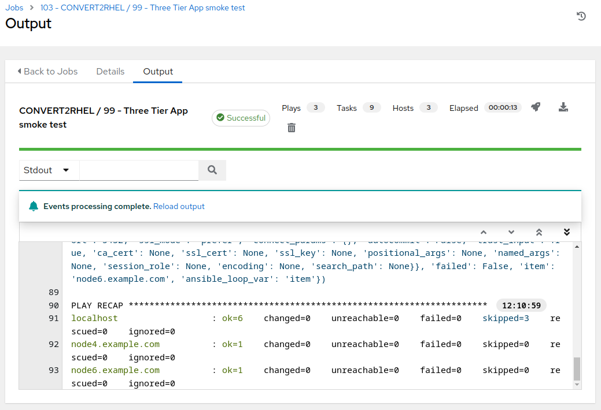

# Workshop Exercise - How is the Three Tier App Doing?

## Table of Contents

- [Workshop Exercise - How is the Three Tier App Doing?](#workshop-exercise---how-is-the-three-tier-app-doing)
  - [Table of Contents](#table-of-contents)
  - [Objectives](#objectives)
  - [Guide](#guide)
    - [Step 1 - Retest our Three Tier Application](#step-1---retest-our-three-tier-application)
  - [Conclusion](#conclusion)

## Objectives

* Confirm our three tier application is still functioning as expected after the upgrade
* Add new records to the app database to see what happens when rolling back

## Guide

In [Exercise 1.2](../1.2-three-tier-app/README.md) we installed a sample three tier applicationlication and tested its functionality via automation. Now that we have converted our CentOS aplication servers to RHEL, let's retest to see if there has been any impact.

### Step 1 - Retest our Three Tier Application

It's time to repeat the testing you did for [Step 4](../1.2-three-tier-app/README.md#step-4---smoke-test-three-tier-application) in exercise 1.2.

  

- Use the side pane menu on the left to select **Templates**.

- Click  to the right of **CONVERT2RHEL / 99 - Three Tier App smoke test** to launch the application test job.  This should take ~15 seconds to complete.

  

- If the job template completes successfully, then we have verified that our three tier application stack is functioning correctly. If it fails, we know that something with the application stack is malfunctioning and we can begin the debugging process to determine where the problem resides.

- If you observe any changes in your application behavior or the application isn't working at all, troubleshoot the issue to try to narrow down the root cause. Make note of any issues so you can retest after rolling back the upgrade.

### Step 2 - Add More Records to the Database

In [Exercise 2.2](../2.2-snapshots/README.md), we considered the potential pitfalls of including app data in the scope of our snapshot. Imagine what would happen if your app at first appeared fine after the upgrade, but an issue was later discovered after the app had been returned to production use.

- Wait at least one minute since running the previous smoke test job template and add a new table to the database via an additional run of of the **CONVERT2RHEL / 99 - Three Tier App smoke test** job template. Check the job template output for a task similar to this:

`TASK [Fail if database db01 did not contain table 06-06-2024-04-01]`

Remember this table name to see what happens after we revert the OS conversion in the next section of the workshop.

- What will be the business impact if data updates are rolled back with the upgrade? That is exactly the problem we will demonstrate next because the three tier application servers deployed in this workshop do not have separate volumes to isolate the OS from the app data.

## Conclusion

In this exercise, we observed that the RHEL in-place upgrade left our application untouched and we found that it still works as expected after the upgrade. Then we added some new app data to demonstrate what will happen after rolling back the upgrade.

This concludes the CentOS conversion section of the workshop. In the next and final section, we will be rolling back the CentOS conversion, taking us right back to where we started.

---

**Navigation**

[Previous Exercise](../2.3-check-convert/README.md) - [Next Exercise](../3.1-rm-rf/README.md)

[Home](../README.md)
