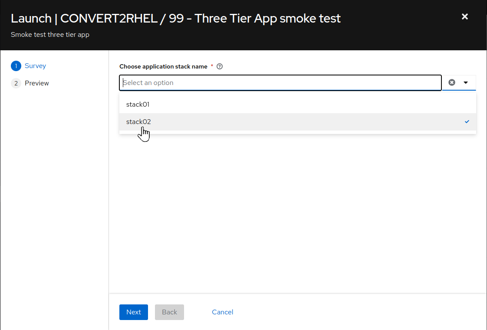
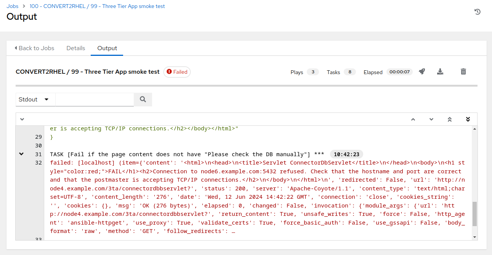

# Workshop Exercise - Simulate conversion failure

## Table of Contents

- [Workshop Exercise - Simulate conversion failure](#workshop-exercise---simulate-conversion-failure)
  - [Table of Contents](#table-of-contents)
  - [Optional Exercise](#optional-exercise)
  - [Objectives](#objectives)
  - [Guide](#guide)
    - [Step 1 - Select an Application Stack Server](#step-1---select-an-application-stack-server)
    - [Step 2 - Break your application](#step-2---break-your-application)
  - [Conclusion](#conclusion)

## Optional Exercise

This is an optional exercise. It is not required to successfully complete the workshop, but it will help demonstrate the effectiveness of rolling back a CentOS to RHEL conversion. Review the objectives listed in the next section to decide if you want to do this exercise or if you would rather skip ahead to the next exercise:

* [Exercise 3.2 - Run Rollback Job](3.2-rollback/README.md)

## Objectives

* Simulate a failed CentOS conversion or application impact
* Demonstrate the scope of rolling back a snapshot

## Guide

In this exercise, we are going to intentionally misconfigure one of our application stack servers to demonstrate how rolling back can save the day.

Let's get started!

### Step 1 - Select an Application Stack Server

In the next exercise, we will be rolling back the CentOS to RHEL conversion across our three tier application servers.

- Choose one of the servers. It can be the HAproxy node, or the Tomcat node, or the PostgreSQL node. In this example, the PostgreSQL node, node6, will be utilized.

- Follow the steps you used with [Exercise 1.1: Step 2](../1.1-setup/README.md#step-2---open-a-terminal-session) to open a terminal session on the application stack server you have chosen misconfigure.

- At the shell prompt, ssh to node6: `ssh node6` and then use the `sudo -i` command to switch to the root user. For example:

```
[student@ansible-1 ~]$ ssh node6
Last login: Thu Jun  6 20:45:47 2024 from ip-192-168-0-233.us-east-2.compute.internal
[ec2-user@node6 ~]$ sudo su -
Last login: Thu Jun  6 02:58:51 UTC 2024 on pts/0
[root@node6 ~]#
```

  Verify you see a root prompt like the example above.

### Step 2 - Break your application

  What if there was an issue with the PostgreSQL package conversion? Our application stack relies on the database to function. Without it, our application stack will be broken. We can simulate this by manually removing the postgresql-related packages like this:

  ```
  [root@node6 ~]# yum -y remove postgresql
  ```

  Once the postgresql package removal has completed, let's try testing the application via the **CONVERT2RHEL / 99 - Three Tier App smoke test** automation job. Switch to the browser instance with the AAP Web UI.

  

- Use the side pane menu on the left to select **Templates**.

- Click  to the right of **CONVERT2RHEL / 99 - Three Tier App smoke test** to launch the application test job.

  

- For `Choose application stack name`, remember earlier in the inventory tags section, "app_stack_name" was set to "stack02", so we choose "stack02" from the drop down selection. Then click **Next**, then on the preview screen click **Launch**.

This should take ~15 seconds to complete.

  

  This simulates an example application impact that can be reversed by rolling back the conversion.

## Conclusion

Congratulations, you have broken the application stack. Wasn't that fun?

In the next exercise, you will correct the issue by rolling back the conversion.

---

**Navigation**

[Previous Exercise](../2.4-check-three-tier-app/README.md) - [Next Exercise](../3.2-rollback/README.md)

[Home](../README.md)
