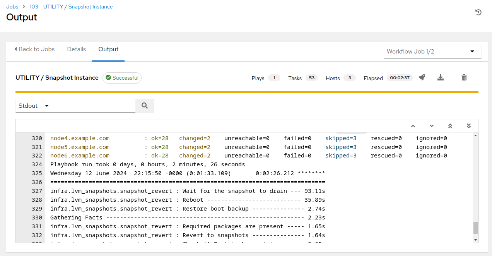
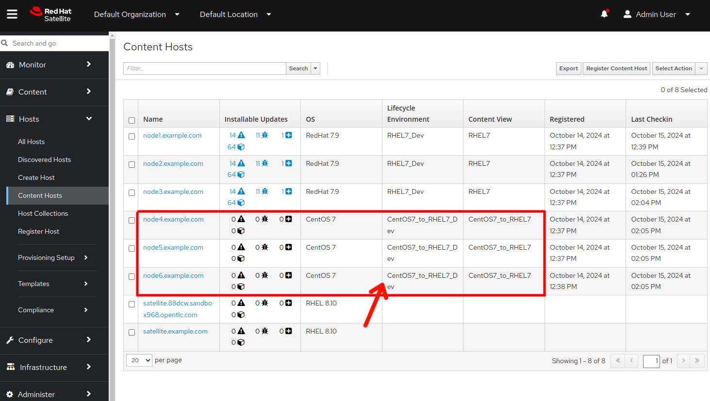

# Workshop Exercise - Run Rollback Job

## Table of Contents

- [Workshop Exercise - Run Rollback Job](#workshop-exercise---run-rollback-job)
  - [Table of Contents](#table-of-contents)
  - [Objectives](#objectives)
  - [Guide](#guide)
    - [Step 1 - Launch the Rollback Job Template](#step-1---launch-the-rollback-job-template)
    - [Step 2 - Observe the Rollback Job Output](#step-2---observe-the-rollback-job-output)
    - [Step 3 - Check the CentOS Version](#step-3---check-the-centos-version)
  - [Conclusion](#conclusion)

## Objectives

* Demonstrate using an Ansible playbook for rolling back a CentOS conversion
* Verify the CentOS major version is reverted back

## Guide

In this exercise, we will demonstrate rolling back one of our three tier application servers, just as we would if the CentOS conversion had failed or if we had found the conversion caused unexpected impacts to the application.

We are now here in our exploration of the CentOS conversion workflow:

After rolling back, the three tier application stack will be restored to as it was just before entering the conversion phase of the workflow.

### Step 1 - Launch the Rollback Job Template

In this step, we will be rolling back the CentOS conversion for our entire three tier application server stack.

> **Note**
>
> In this case, only one of our nodes has an issue. Depending on overall thoughts on how to best proceed, an argument could be made for just rolling back the PostgreSQL node, node6, and leave node4 and node5 as they are. However, in this case, we are going to demonstrate the ability to simulataneously roll back an entire application stack of systems at once.

- Return to the AAP Web UI tab in your web browser. Navigate to Resources > Templates and then open the "CONVERT2RHEL / 03 Rollback" workflow template. Here is what it looks like:

  

- Click the "Launch" button which will bring up the prompts for submitting the workflow starting with the limit and variables prompts. We want to do a rollback of the entire three tier application stack. To do this, we will not enter any values into the "Limit" prompt.

  

  Click the "Next" button to proceed.

  

- Next we see the job template survey prompt asking us to select an inventory group. Our systems were converted to RHEL7 and we looked in Satellite and verified that the nodes were in fact registered as RHEL7 nodes, configured to consume the RHEL7_Dev content view. So, we should choose "RHEL7_Dev" for our inventory group, yes? Actually, no. We have not committed to keeping the converted systems, our system tags that define the current OS have not been updated, so the Ansible inventory still recognizes these systems as members of the "CentOS7_Dev" inventory group. So if we have not initiated the commit automation to accept the converted systems as RHEL7_Dev nodes, we choose the "CentOS7_Dev" option and click the "Next" button.

- This will bring you to the preview of the selected job options and variable settings, for example:

  

  If everything looks good, use the "Launch" button to start the playbook job.

### Step 2 - Observe the Rollback Job Output

After launching the rollback workflow job, the AAP Web UI will navigate automatically to the workflow output visualizer page.

  

- The automated rollback takes only a few minutes to run. You can monitor the log output as the playbook run progresses by clicking directly on the "UTILITY / Snapshot Instance" node in the workflow visualizer.

- When all of the workflow job nodes have completed, if you haven't already, click on the "UTILITY / Snapshot Instance" node in the workflow visualizer. Once the "UTILITY / Snapshot Instance" job details displays, click on the "Output" tab and scroll to the bottom of the job output. If it finished successfully, you should see "failed=0" status for each node in the job summary, like this example:

  

  Notice in the example above, we see the job completed in aproximately two and a half minutes. However, most of that time was spent in the final "Wait for the snapshot to drain" task which holds the job until the snapshot merges finish in the background. The instance was actually rolled back and service ready in just under a minute. Impressive, right?

### Step 3 - Check the CentOS Version

Repeat the steps you followed with [Exercise 2.3: Step 2](../2.3-check-upg/README.md#step-2---verify-the-hosts-are-converted-to-next-rhel-version), this time to verify that the CentOS version is reverted back.

- For example, if the three tier host you rolled back had been converted from CentOS7 to RHEL7, you should now see it is back to CentOS7:

  

- Additionally, we can check Satellite to verify node status. Switching to the Satellite UI in your brwoser, hover over "Hosts" in the left hand menu and then click on "Content Hosts":

  

We can see that the three tier application stack nodes are all reverted to CentOS7 and set to utilize the CentOS7_Dev content view

## Conclusion

In this exercise, we used automation to quickly reverse the CentOS to RHEL conversion and restore the app server back to its original state.

In the next exercise, we'll dig deeper to validate that all changes and impacts caused by the conversion are now undone.

---

**Navigation**

[Previous Exercise](../3.1-error-condition/README.md) - [Next Exercise](../3.3-check-undo/README.md)

[Home](../README.md)
