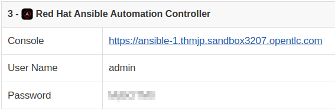
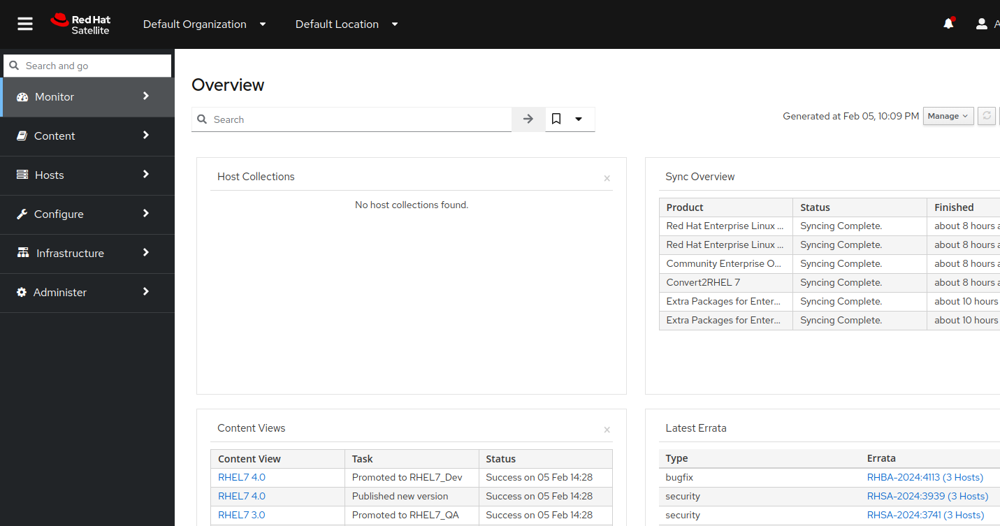
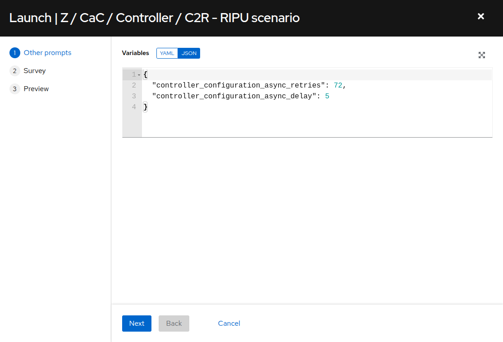
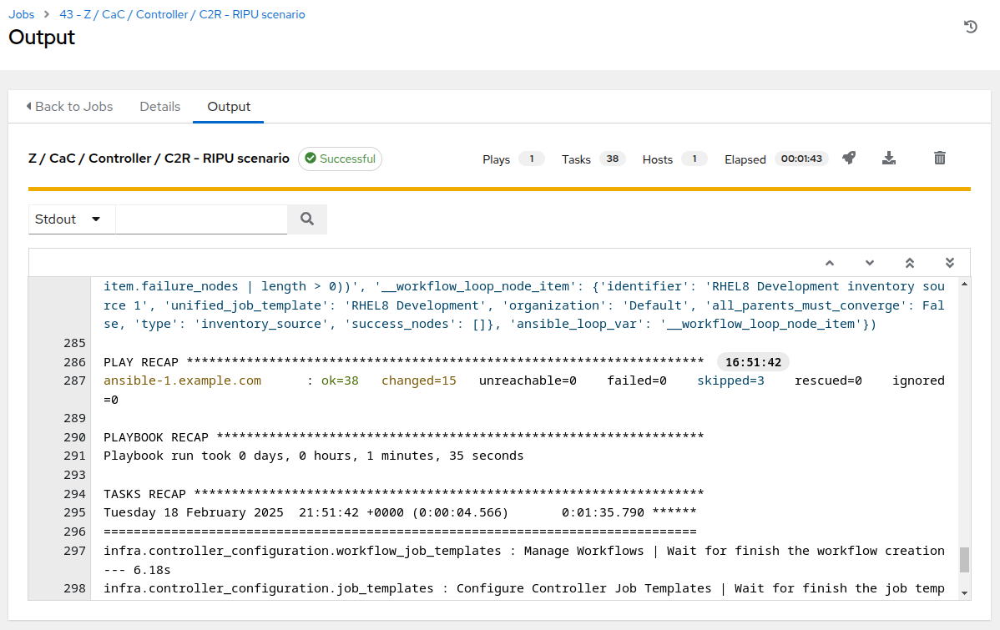

# Automated Satellite Workshop: RHEL In-place Upgrade Automation Exercise - Your Lab Environment

## Table of Contents

- [Workshop Exercise - Your Lab Environment](#workshop-exercise---your-lab-environment)
  - [Table of Contents](#table-of-contents)
  - [Objectives](#objectives)
  - [Guide](#guide)
    - [Your Lab Environment](#your-lab-environment)
    - [Step 1 - Access the AAP Web UI](#step-1---access-the-aap-web-ui)
    - [Step 2 - Access the Visual Studio Code Web UI](#step-2---access-the-visual-studio-code-web-ui)
    - [Step 3 - Open a Terminal Session](#step-3---open-a-terminal-session)
    - [Step 4 - Access the Satellite Web UI](#step-4---access-the-satellite-web-ui)
    - [Step 5 - Access the RHEL Web Console](#step-5---access-the-rhel-web-console)
    - [Step 6 - RHEL In-place Upgrade Automation exercise job template deploy](#step-6---rhel-in---place-upgrade-automation-exercise-job-template-deploy)
    - [Step 7 - Challenge Labs](#step-7---challenge-labs)
  - [Conclusion](#conclusion)

## Objectives

* Understand the lab topology and how to access the environment
* Understand how to perform the workshop exercises
* Understand challenge labs

## Guide

### Your Lab Environment

The workshop is provisioned with a pre-configured lab environment. You will have access to a host deployed with Ansible Automation Platform (AAP) which you will use to control the playbook and workflow jobs that automation the RHEL in-place upgrade workflow steps. You will also have access to three RHEL hosts.  These are the hosts where we will be upgrading the RHEL operating system (OS).

| Role                                | Inventory name |
| ------------------------------------| ---------------|
| Automation controller               | ansible-1      |
| Satellite Server                    | satellite      |
| Managed Host 1 - RHEL               | node1          |
| Managed Host 2 - RHEL               | node2          |
| Managed Host 3 - RHEL               | node3          |
| Managed Host 4 - CentOS/OracleLinux | node4          |
| Managed Host 5 - CentOS/OracleLinux | node5          |
| Managed Host 6 - CentOS/OracleLinux | node6          |

### Step 1 - Access the AAP Web UI

The AAP Web UI is where we will go to submit and check the status of the Ansible playbook jobs we will use to automate the RHEL in-place upgrade workflow.

- Let's open the AAP Web UI in a new web browser tab using the "Console" link under "Red Hat Ansible Automation Controller" on the workshop launch page. For example:

  

- Enter the username `admin` and the password provided. This will bring you to your AAP Web UI dashboard like the example below:

  

- We will learn more about how to use the AAP Web UI in the next exercise.

### Step 2 - Access the Visual Studio Code Web UI

We will use Visual Studio Code (VS Code) as it provides a convenient and intuitive way to use a web browser to edit files and access terminal sessions. If you are a command line hero, direct SSH access is available if VS Code is not to your liking. There is a short YouTube video to explain if you need additional clarity: <a href="https://youtu.be/Y_Gx4ZBfcuk">Ansible Workshops - Accessing your workbench environment</a>.

- You can open VS Code in your web browser using the "Console URL" link under "Visual Studio Code" on the workshop landing page. The password is provided below the link. For example:

  

- After opening the link, type in the provided password to access your instance of VS Code.

> **Note**
>
> A welcome wizard may appear to guide you through configuring your VS Code user experience. This is optional as the default settings will work fine for this workshop. Feel free to step though the wizard to explore the VS code bells and whistles or you may just skip it.

### Step 3 - Open a Terminal Session

Terminal sessions provide access to the RHEL commands and utilities that will help us understand what's going on "behind the curtain" when the RHEL in-place upgrade automation is doing its thing.

- Use VS Code to open a terminal session. For example:

  

- This terminal session will be running on the AAP control host `ansible-1`. Next, use the `ssh` command to login to one of your RHEL hosts. Finally, use the highlighted commands confirm the RHEL OS version and kernel version installed.

  For example:

  

- In the example above, the command `ssh node1` connects us to a new session on the node1 host. Then the commands `cat /etc/redhat-release` and `uname -r` are used to output the OS release information `Red Hat Enterprise Linux Server release 7.9 (Maipo)` and kernel version `3.10.0-1160.102.1.el7.x86_64` from that host.

### Step 4 - Access the Satellite Web UI

The Satellite Web UI is where we will go to review the Lifecycle Environments, Content Views and Activation Keys configured on the Satellite, as well as tracking the status of the RHEL hosts as we proceed through the upgrade workflow through as they move to the next RHEL major version.

- Let's open the Satellite Web UI in a new web browser tab using the "Console" link under "Red Hat Satellite" on the workshop launch page. For example:

  

- Enter the username `admin` and the password provided. This will bring you to your Satellite Web UI dashboard like the example below:

  

### Step 5 - Access the RHEL Web Console

We will use the RHEL Web Console to review the results of the Leapp pre-upgrade reports we generate for our three-tier app servers.

- Open a new web browser tab using the link under "RHEL Web Console Interactive Server Admin Interface" on the workshop launch page. For example:

  

- Enter the username `student` and the password provided. This will bring you to a RHEL Web Console Overview page like the example below:

  

- We will revisit the RHEL Web Console when we are ready to review our pre-upgrade reports in an upcoming exercise.

### Step 6 - RHEL In-place Upgrade Automation exercise job template deploy

- Before we proceed into the exercise steps, we need to launch some automation to further configure our workshop environment. The **Automated Satellite Workshop** covers a wide range of topics and as such, in order to keep a smaller number of job templates to work through, the `RHEL In Place Upgrade` job templates are not populated on the AAP Controller by default.   Switch to the browser tab with the AAP Web UI and on the left menu bar, select `Resources > Templates`.

  

- In the filter box, enter `RIPU` and click the magnifying glass to filter the job templates displayed.

  

- Click  to the right of **Z / CaC / Controller / RIPU scenario** to launch the job.

  

- At `Other prompts` verify default variables provided and click `Next`.

  

- For the `Choose RIPU version to prepare on Controller` survey, if you are proceeding through this exercise for the first time with RHEL7 hosts, select `RHEL8`. If you have already upgraded your hosts from RHEL7 to RHEL8 and are now looking to continue by upgrading from RHEL8 to RHEL9, then select `RHEL9`. Click `Next`.

  

- Verify variables and settings on the job preview. click `Launch`.

  

- The **Z / CaC / Controller / RIPU scenario** job should require just under 2 minutes to complete.

  

- Once the **Z / CaC / Controller / RIPU scenario** job has completed, on the left menu bar, select `Resources > Templates`. In the filter box, enter `leapp` and click the magnifying glass to filter the job templates displayed. The newly populated job templates for our RHEL In-place Upgrade Automation exercises are now available to use.

### Step 7 - Challenge Labs

You will soon discover that many exercises in the workshop come with a "Challenge Lab" step. These labs are meant to give you a small task to solve using what you have learned so far. The solution of the task is shown underneath a warning sign.

## Conclusion

In this exercise, we learned about the lab environment we will be using to continue through the workshop exercises. We verified that we are able to use VS Code in our web browser and from there we can open terminal sessions. We also made sure we are able to access the AAP Web UI which will be the "self-service portal" we use to perform the next steps of the RHEL in-place upgrade automation workflow. We also made sure we are able to access the Satellite Web UI where we can review the repositories providing the packages for the RHEL in-place upgrade automation workflow, as well as the status of the hosts themselves. Finally, we connected to the RHEL Web Console where we will soon be reviewing pre-upgrade reports.

Use the link below to move on the the next exercise.

---

**Navigation**

[Next Exercise](../1.2-three-tier-app/README.md)

[Home](../README.md)
