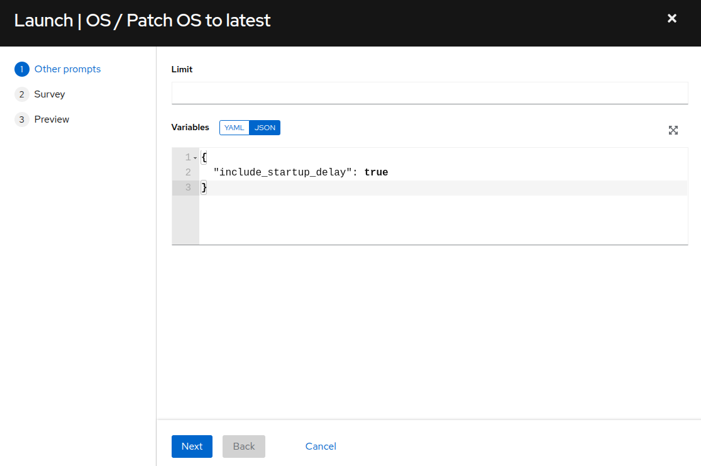

# Workshop Exercise - Run Pre-upgrade Jobs

## Table of Contents

- [Workshop Exercise - Run Pre-upgrade Jobs](#workshop-exercise---run-pre-upgrade-jobs)
  - [Table of Contents](#table-of-contents)
  - [Objectives](#objectives)
  - [Guide](#guide)
    - [Step 1 - RHEL In-place Upgrade Automation Workflow](#step-1---rhel-in-place-upgrade-automation-workflow)
      - [Analysis](#analysis)
      - [Upgrade](#upgrade)
      - [Commit](#commit)
      - [Let's Get Started](#lets-get-started)
    - [Step 2 - Use AAP to Launch an Analysis Playbook Job](#step-2---use-aap-to-launch-an-analysis-playbook-job)
    - [Step 3 - Review the Playbook Job Output](#step-3---review-the-playbook-job-output)
    - [Step 4 - Challenge Lab: Analysis Playbook](#step-4---challenge-lab-analysis-playbook)
  - [Conclusion](#conclusion)

## Objectives

* Understand the end-to-end RHEL in-place upgrade workflow
* Understand how to use AAP job templates to run Ansible playbooks
* Run the pre-upgrade analysis jobs

## Guide

### Step 1 - RHEL In-place Upgrade Automation Workflow

Red Hat Enterprise Linux (RHEL) provides the Leapp utility, the underlying framework that our automation approach uses to upgrade the operating system to the next major version. The [Leapp documentation](https://access.redhat.com/documentation/en-us/red_hat_enterprise_linux/8/html-single/upgrading_from_rhel_7_to_rhel_8/index) guides users on how to use the Leapp framework to manually upgrade a RHEL host. This is fine if you only have a few RHEL hosts to upgrade, but what if you are a large enterprise with tens, hundreds, a thousand, or even tens of thousands of RHEL hosts? The manual process does not scale. Using automation, the end-to-end process for upgrading a RHEL host is reduced to a matter of days and the total downtime required for the actual upgrade is measured in hours or less.

Our RHEL in-place upgrade automation approach follows a workflow with three phases:


> **Note**
>
> The <sub></sub> icon indicates workflow steps that are automated by Ansible playbooks.

#### Analysis

During the analysis phase, no changes are made yet. When the analysis playbook is executed, it uses the Leapp utility to scan the host for issues or blockers that may prevent a successful upgrade. Then it generates a detailed report listing any potential risks found. The report also includes recommended actions that should be followed to reduce the likelihood of the reported issues impacting the upgrade. If any recommended remediation actions are performed, the analysis scan should be run again to verify the risks are resolved. This iteration continues until everyone reviewing the report is comfortable that any remaining findings are acceptable.

<!-- The following only applies when using the Ansible role being developed for LVM snapshots...

 In addition to upgrade risks that could impact the success of the upgrade, the report also indicates if there is enough free space to support the snapshot configuration required in case rolling back is required. If there is not enough free space, temporarily space should be made available, for example, by adding an additional virtual disk to the rootvg volume group. Removing /var/crash or other non-critical filesystems under the rootvg volume group is another option. It is strongly recommended to to make space so that a snapshot rollback is possible just in case.
-->

#### Upgrade

After the analysis phase is done and the report indicates acceptable risk, a maintenance window can be scheduled and the upgrade phase can begin. It is during this phase that the upgrade playbooks are executed using a workflow job template. The first playbook creates a snapshot that can be used for rolling back if anything goes wrong with the upgrade. After the snapshot is created, the second playbook uses the Leapp utility to perform the upgrade where the RHEL OS is advanced to the new major version. The host will not be available for login or application access during the upgrade. When the upgrade is finished, the host will reboot under the newly upgraded RHEL major version. Now the ops and app teams can assess if the upgrade was successful by verifying all application services are working as expected.

#### Commit

If there are any application impacts discovered that can't be easily corrected within the scheduled maintenance window, the decision can be made to undo the upgrade by rolling back the snapshot. This will revert all changes and return the host back to the previous RHEL version. If there are no issues immediately found, the commit phase begins. During the commit phase, the host can be returned to normal operation while keeping the snapshot just in case any issues are uncovered later. <!-- This is LVM specific: However, while the snapshots are kept, regular disk writes to the rootvg volume group will continue to consume the free space allocated to the snapshots. The amount of time this takes will depend on the amount of free space initially available and the volume of write i/o activity to the rootvg volume group. Before the snapshot space is exhausted, the snapshots must be deleted and then there is no turning back. --> After everyone is comfortable with the upgraded host, the commit playbook should be executed to delete the snapshot. The RHEL in-place upgrade is complete.

#### Let's Get Started

The RHEL in-place upgrade automation approach workflow is designed to reduce the risks inherent in doing an in-place upgrade versus deploying a new RHEL host. Decision points at the end of the analysis and upgrade phases allow the process to be rolled back and restarted with the benefit of lessons learned through reporting checks and actual upgrade results. Of course, the best practice for avoiding production impacts or outages is to proceed with upgrades in properly configured Development and Test environments before moving on to Production hosts.

### Step 2 - Use AAP to Launch an Analysis Playbook Job

As we progress through the workshop, we'll refer back to this diagram to track where we are in our automation approach workflow. We are starting now in the highlighted block below:


The first step in upgrading our three tier stack hosts will be executing the analysis playbook to generate the Leapp pre-upgrade report for each host. To do this, we will use the Ansible Automation Platform (AAP) automation controller host that has been pre-configured in your workshop lab environment.

- Return to the AAP Web UI browser tab you opened in step 3 of the previous exercise. Navigate to Resources > Templates by clicking on "Templates" under the "Resources" group in the navigation menu. This will bring up a list of job templates that can be used to run playbook jobs on target hosts.

- Before we launch the analysis, all of our RHEL nodes need to be updated to the latest packages available. If you worked through the second exercise in this workshop, **Automating Patch Management**, depending on what options you chose, you might have already patched your RHEL nodes and applied all of the latest package updates available. You can verify if any package updates are available by reviewing the Content Hosts in Satellite. Switch to the broser tab with Satellite and on the left menu bar, select `Hosts > Content Hosts`:

  

- Here we can see that installed updates are available to be applied.

  

- Return to the AAP Web UI browser tab and Navigate to Resources > Templates by clicking on "Templates" under the "Resources" group in the navigation menu. This will bring up a list of job templates that can be used to run playbook jobs on target hosts. 

  

- Click on the **OS / Patch OS to latest** job template. This will display the Details tab of the job template:

  

- From here, we could use the "Edit" button if we wanted to make any changes to the job template. This job template is already configured, so we are ready to use it to submit a playbook job. To do this, use the "Launch" button. This will display the job template limit and variable dialog:

  

- We do not need to limit the job to specific hosts, so leave the `Limit` field empty and click "Next". The survey dialog will display:

  

- Next we see the job template survey dialog. A survey is a customizable set of prompts that can be configured from the Survey tab of the job template. For this job template, the survey allows for selecting the Ansible inventory group, as well as whether or not to include kernel package updates and whether or not to perform a "Check only" operation and not actually update packages, but verify what packages would be updated if we were to perform the update at this moment. We are working with the **RHEL7_Dev** inventory group, so click the "Select inventory group" drop down menu and select "RHEL7_Dev". Leave "Include kernel updates?" at the default "yes" and leave "Check for updates only?" at the default "no". Click "Next".

  

- Review the various settings and prompted values for the **OS / Patch OS to latest** job launch. Click "Launch". This job run will require anywhere from three to five minutes to complete.

  

- With a successful job completion, we are ready to proceed with the pre-upgrade OS analysis (or if you feel a post upgrade smoke test is called for, please go ahead and do that before continuing).

  

- On the left menu bar, select `Resources > Templates`. In the filter box, enter `leapp` and click the magnifying glass to filter the job templates displayed. Once the LEAPP job templates are displayed, click  to the right of **LEAPP / 01 Analysis** to launch the Leapp analysis job. This will display the job template limit and variable survey dialog:

  

- The first prompt as seen above allows for limiting the nodes that the analysis job will run against. We want to analyze all of our nodes at this time, so just click the "Next" button to move on.

  

- Next we see the inventory survey prompt. A survey is a customizable set of prompts that can be configured from the Survey tab of the job template. For this job template, the survey allows for choosing a group of hosts on which the job will execute the playbook. Choose the "RHEL7_Dev" option and click the "Next" button. This will bring you to a preview of the selected job options and variable settings.

  

- On the preview dialog, scroll down on the "Prompted Values" section. Note that for our inventory group survey prompt selection of `RHEL7_Dev` in the previous step, the variable `dynamic_inventory_group` has been set to `RHEL7_Dev`. Once satisfied with the job preview, use the "Launch" button to start the playbook job.

### Step 3 - Review the Playbook Job Output

After launching the analysis playbook job, the AAP Web UI will navigate automatically to the job output page for the job you just started.

- While the playbook job is running, you can monitor its progress by clicking the "Follow" button. When you are in follow mode, the output will scroll automatically as task results are streamed to the bottom of job output shown in the AAP Web UI.

- The analysis playbook will run the Leapp pre-upgrade scan. This will take about three or four minutes to complete. When it is done, you can find a "PLAY RECAP" at the end of the job output showing the success or failure status for the playbook runs executed on each host. A status of "failed=0" indicates a successful playbook run. Scroll to the bottom of the job output and you should see that your job summary looks like this example:

  

### Step 4 - Challenge Lab: Analysis Playbook

Let's take a closer look at the playbook we just ran.

> **Tip**
>
> Try looking at the configuration details of the "Automated Management" project and the "LEAPP / 01 Analysis" job template.

Can you find the upstream source repo and playbook code?

> **Warning**
>
> **Solution below\!**

- In the AAP Web UI, navigate to Resources > Projects > Automated Management. Under the Details tab, you will see the "Source Control URL" setting that defines where job templates of this project will go to pull their playbooks. We see it is pointing to this git repo on GitHub: [https://github.com/redhat-partner-tech/automated-satellite](https://github.com/redhat-partner-tech/automated-satellite). Open this URL in a new browser tab.

  

- With the new tab opened and the `redhat-partner-tech/automated-satellite` repo displayed, on the left side of the browser, click the drop down for the branch selection where `main` is displayed. Click the `aap2-rhdp-prod` branch to select this branch for viewing.

- Go back to the AAP Web UI and now navigate to Resources > Templates > LEAPP / 01 Analysis. Under the Details tab, you will see the "Playbook" setting with the name of the playbook this job template runs when it is used to submit a job. The playbook name is `leapp_analysis.yml`. In your GitHub browser tab, you can find `leapp_analysis.yml` listed in the files of the git repo. Click on it to see the playbook contents.

- Notice that after performing some initial automation prepatory steps, the playbook executes the `analysis` role from the `infra.leapp` Ansible collection.
```
  roles:
    - infra.leapp.analysis
```
By checking the `collections/requirements.yml` file in the git repo, we can discover that this role comes from another git repo at [https://github.com/heatmiser/ansible-leapp](https://github.com/heatmiser/ansible-leapp). It is the `analysis` role under this second git repo that provides all the automation tasks that ultimately runs the Leapp pre-upgrade analysis and generates the report.

*NOTE* We are utilizing a fork of the upstream `infra.leapp` Ansible collection [https://github.com/redhat-cop/infra.leapp](https://github.com/redhat-cop/infra.leapp). Because the upstream collections is a fast moving project, we utilize a fork where we can closely manage the state of the code base to ensure optimal stability for the lab/workshop/demo environment.

  

- In a new browser tab/instance, open the [https://github.com/heatmiser/ansible-leapp](https://github.com/heatmiser/ansible-leapp/tree/2024-01-07.01) URL. Drill down to the `roles/analysis` directory in this git repo to review the README and yaml source files.

When you are ready to develop your own custom playbooks to run conversions for your enterprise, you should consider using roles from the `infra.leapp` Ansible collection to make the RHEL in-place upgrade process easier.

## Conclusion

In this exercise, we learned about the end-to-end workflow used by our automation approach for doing RHEL in-place upgrades. We used a job template in AAP to submit a playbook job that ran the Leapp pre-upgrade analysis on our three tier application servers. In the challenge lab, we explored the playbook that we ran and how it includes a role from an upstream Ansible collection.

In the next exercise, we will review the pre-upgrade reports we just generated and take action to resolve any high-risk findings that were identified.

---

**Navigation**

[Previous Exercise](../1.2-three-tier-app/README.md) - [Next Exercise](../1.4-report/README.md)

[Home](../README.md)
