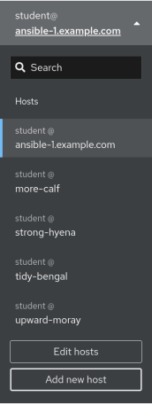
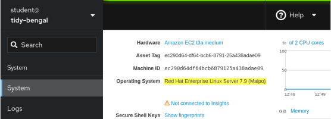
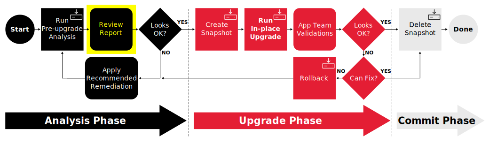
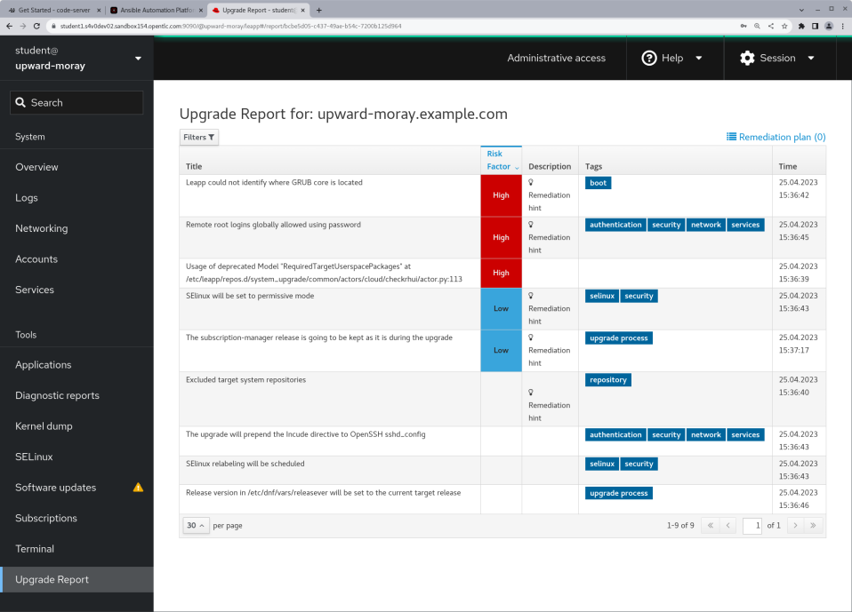
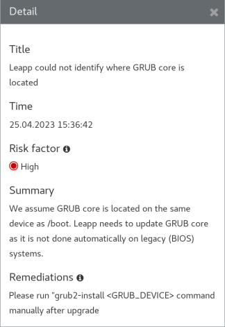
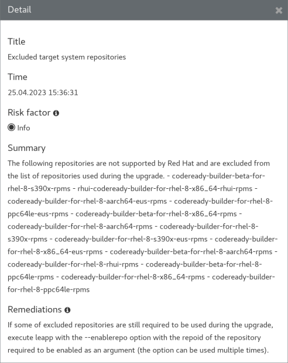
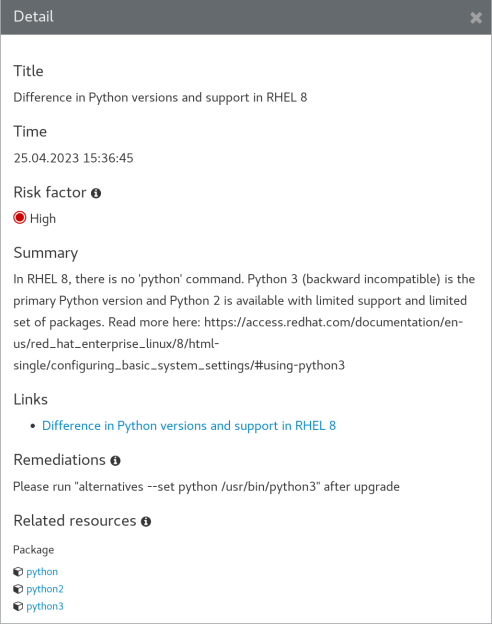
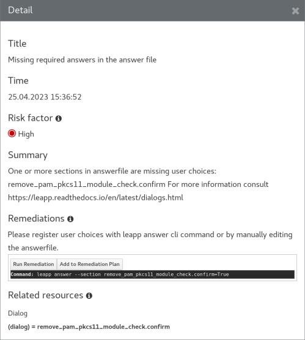

# Workshop Exercise - Review Pre-upgrade Reports

## Table of Contents

- [Workshop Exercise - Review Pre-upgrade Reports](#workshop-exercise---review-pre-upgrade-reports)
  - [Table of Contents](#table-of-contents)
  - [Objectives](#objectives)
  - [Guide](#guide)
    - [Step 1 - Managing Leapp Pre-upgrade Results](#step-1---managing-leapp-pre-upgrade-results)
    - [Step 2 - Navigating the RHEL Web Console](#step-2---navigating-the-rhel-web-console)
    - [Step 3 - Review Leapp Pre-upgrade Report of RHEL8 Host](#step-3---review-leapp-pre-upgrade-report-of-rhel8-host)
    - [Step 4 - Review Leapp Pre-upgrade Report of RHEL7 Host](#step-4---review-leapp-pre-upgrade-report-of-rhel7-host)
    - [Challenge Lab: What About Ignoring So Many High Findings?](#challenge-lab-what-about-ignoring-so-many-high-findings)
  - [Conclusion](#conclusion)

## Objectives

* Understand the different options for managing Leapp pre-upgrade reports
* Use the RHEL Web Console to review the reports we generated
* Learn how to filter pre-upgrade report entries
* Embrace failure!

## Guide

### Step 1 - Managing Leapp Pre-upgrade Results

In the previous exercise, we used a playbook job template to generate a Leapp pre-upgrade report on each of our pet app servers. Now we need to review the findings listed in those reports. There are a number of different ways that we can access the reports. Let's review these and consider the pros and cons:

- If we we're using the Leapp framework to manually upgrade just a single RHEL host, we could simply get to a shell prompt on the host and look at the local report file output. In [Exercise 1.1, Step 2](../1.1-setup/README.md#step-2---open-a-terminal-session), we learned how to open an ssh session to one of our pet app servers. Follow those steps and after logging in, use this command to review the local Leapp pre-upgrade report file:

  ```
  less /var/log/leapp/leapp-report.txt
  ```

  This is a "quick and dirty" way to review the report, but doesn't scale if you need to review reports for a large number of hosts.

  > **Note**
  >
  > Use the up and down arrow keys to scroll through the file and type `q` when you are ready to quit the `less` command.

- If your RHEL hosts are registered to [Red Hat Insights](https://www.redhat.com/en/technologies/management/insights), you can see the Leapp pre-upgrade reports on your Insights console. The pet app servers provisioned for this workshop are not registered to Insights, so we can't demonstrate this here. Read the blog article [Take the unknowns out of RHEL upgrades with Red Hat Insights](https://www.redhat.com/en/blog/take-unknowns-out-rhel-upgrades-red-hat-insights) to see an example of how Insights can be used to review and manage Leapp pre-upgrades.

- RHEL includes an optional administration web console based on [Cockpit](https://access.redhat.com/documentation/en-us/red_hat_enterprise_linux/8/html-single/managing_systems_using_the_rhel_8_web_console/index#what-is-the-RHEL-web-console_getting-started-with-the-rhel-8-web-console) that we call the RHEL Web Console. We will explore how to review the Leapp pre-upgrade reports using the RHEL Web Console in the next step of this exercise.

- In addition to writing the plain text `leapp-report.txt` file, Leapp also generates a JSON format `leapp-report.json` file. This file includes the same report results as the plain text file, but in JSON format which is perfect for being ingested by log management tools like Elastic/Kibana or Splunk. Many large enterprises will push their pre-upgrade report data to one of these tools to develop their own custom dashboards that can filter reports by environment (e.g., Dev/Test/Prod), location, app ID, owning team, etc. <!-- FIXME: add Splunk example here when https://issues.redhat.com/browse/RIPU-35 gets done. -->

### Step 2 - Navigating the RHEL Web Console

For this workshop, we will be using the RHEL Web Console to access the Leapp pre-upgrade reports we generated.

- Return to the RHEL Web Console browser tab you opened from [Exercise 1.1, Step 4](../1.1-setup/README.md#step-4---access-the-rhel-web-console). This is the RHEL Web Console of the AAP controller host, but we need to access our pet app server hosts to see their pre-upgrade reports. Do this by clicking the "student&#8203;@&#8203;ansible-1.example.com" box in the top left corner of the RHEL Web Console to reveal the remote host menu. For example:

  

- You can use the remote host menu to navigate to the web consoles of each of your pet app servers. Try selecting one of your pet servers now. The RHEL Web Console system overview page will show the operating system version installed. For example, this pet app server is running RHEL8:

  

  Here is an example of one running RHEL7:

  

- When you navigate to different hosts in the RHEL Web Console, look out for the "limited access mode" warning:

  

  If you see this, use the button to switch to administrative access mode before proceeding. A confirmation will appear like this:

  

- Take some time to explore the navigation menus available with the RHEL Web Console of your different pet app servers. Once you feel comfortable navigating around the console and switching between hosts, move on to the next step where we will look at our first pre-upgrade report.

### Step 3 - Review Leapp Pre-upgrade Report of RHEL8 Host

Now we are ready to use the RHEL Web Console to see the Leapp pre-upgrade reports. Let's start by looking at one of the RHEL8 hosts and then we'll look at one of the RHEL7 hosts in the next step.

While you might be interested in learning about upgrading only RHEL7 or RHEL8, we recommend following the exercise steps for both. This workshop presents the skills you need with the RHEL7 and RHEL8 examples covering different topics you must know irrespective of the OS version being upgraded.

We are now here in the automation approach workflow:



- Navigate to the RHEL Web Console remote host menu and click on the hostname of one of your RHEL8 pet app servers. Remember as we learned in the previous step, you can confirm the RHEL version on the system overview page. Also make sure you enabled administrative access as explained in the previous step.

- Having verified you are looking at one of the RHEL8 pet app servers, use the main menu to navigate to Tools > Upgrade Report. This will display the Leapp pre-upgrade report that was generated for the selected host. For example, the report might look like this:

  

  > **Note**
  >
  > The contents of your report may differ from the example above because of updates made to the Leapp framework and other RHEL packages released over time since this workshop was written. If you discover any differences that materially break the flow of the exercises in the workshop, kindly let us know by raising an issue [here](https://github.com/ansible/workshops/issues/new).

- When the pre-upgrade report is generated, the Leapp framework collects system data and assesses upgradeability based on a large collection of checks. When any of these checks uncovers a potential risk, it is recorded as a finding in the report. These findings are listed in order from highest risk to lowest. In the report above, we see there are three high risk findings. Let's review each of these.

- The first finding we see listed has the title "Leapp could not identify where GRUB core is located." You can see additional details for any finding by clicking on it in the list. For example, click on the first finding and you will see these details:

  

  This finding is being reported because the EC2 instances deployed for the workshop do not have a separate /boot partition. We'll ignore this one for now, but make a mental note as we may revisit this with a Challenge Lab in a later exercise. <!-- We'll talk about fixing this in the commit playbook. -->

- The next finding is titled "Remote root logins globally allowed using password." Click on it to see the details:

  

  This finding is meant to raise awareness of a change to the default root login settings introduced with RHEL9. We can safely ignore this finding because surely everybody already follows best practices by never logging in directly as the root user.

- That brings us to the final high risk finding. This one is a little embarrassing because it's actually a known bug in the Leapp framework.

  

  Luckily, it is completely benign and we can safely ignore it. This bug will be fixed with an update to the Leapp framework expected to be released soon. <!-- FIXME: remove this after the bug fix gets released. Also remove from RHEL7 report step further down. -->

- The good news is that none of the findings with our RHEL8 host were the most severe "inhibitor" classification. When any inhibitor findings are reported, the RHEL upgrade is blocked and can't proceed without first taking action to correct the cause of the inhibitor risk finding.

- There are a number of filtering options you can use to limit the findings that are displayed according to risk level, audience, etc. Click on the "Filters" button to experiment with this feature. For example, if you click the "Is inhibitor?" filter checkbox, you will see no findings displayed because there were no inhibitors.

- Let's now move on to the pre-upgrade report for one of our RHEL7 hosts. Spoiler alert: we will have to deal with some inhibitor findings with this one!

### Step 4 - Review Leapp Pre-upgrade Report of RHEL7 Host

In the previous step, we reviewed the pre-upgrade report for one of our RHEL8 hosts. Now let's take a look at the report from one of our RHEL7 hosts.

- Navigate to the RHEL Web Console remote host menu and click on the hostname of one of your RHEL7 pet app servers. Verify the host you have chosen is RHEL7. Then use the main menu to navigate to Tools > Upgrade Report. This will bring up the Leapp pre-upgrade report for the selected host. For example, the report might look like this:

  

  > **Note**
  >
  > The contents of your report may differ from the example above because of updates made to the Leapp framework and other RHEL packages released over time since this workshop was written. If you discover any differences that materially break the flow of the exercises in this workshop, kindly let us know by raising an issue [here](https://github.com/ansible/workshops/issues/new).

- In the report for our RHEL7 pet app server above, we see there are six high risk findings and two of those are inhibitor findings. Let's start by reviewing the high risk findings that are not inhibitors.

- The "GRUB core will be updated during upgrade" finding is no different than the finding with the same title we learned about in the RHEL8 pre-upgrade report, so we'll ignore this for now.

- The high risk finding "Usage of deprecated Model" is again because of the Leapp framework bug we talked about before. It's annoying but benign and we can ignore it.

- Now let's look at the new findings we are seeing only on our RHEL7 pre-upgrade report. At the top of the list we see the "Packages available in excluded repositories will not be installed" finding. Clicking on the finding to bring up the detailed view, we see this:

  

  This finding is warning that packages python3-pyxattr and rpcgen will not be upgraded because "they are available only in target system repositories that are intentionally excluded from the list of repositories used during the upgrade," but then refers to an informational finding titled "Excluded target system repositories" for more information. Scroll down and click on that finding to show its details:

  

  Here we see the remediation hint suggests to run the `leapp` utility with the `--enablerepo` option. But wait, that's assuming we are manually running the `leapp` command. Don't worry, in an upcoming exercise, we'll explore how this option can be given by setting a variable when submitting the upgrade playbook job. Stay tuned!

- The next high risk entry on the list is the "Difference in Python versions and support in RHEL8" finding:

  

  This finding could be a concern if we have any apps on our pet server that are using the system-provided Python interpreter. Let's assume we don't have any of those in which case we can blissfully ignore this finding.

- That leaves us with our two inhibitor findings. The first is the "Possible problems with remote login using root account" finding. You know the drill; click on the finding to review the details:

  

  Remember that with inhibitor findings, if we don't take action to resolve the inhibitor, the Leapp framework will block the RHEL in-place upgrade from going forward.

- The other inhibitor is the "Missing required answers in the answer file" finding. Here are the details for this one:

  

  Here again, we will need to take action to remediate this finding. Don't panic! In the next exercise, we will explore different options for automating the required remediation actions and recommendations.

### Challenge Lab: What About Ignoring So Many High Findings?

You may be wondering why are we only worrying about the inhibitor findings. What about all the other high risk findings showing up in red on the report? Red means danger! Why would we be going forward with attempting an upgrade without first resolving all the findings on the report? It's a fair question.

> **Tip**
>
> Think back to the four key features that we introduced at the beginning of the workshop.

Is there a specific feature that helps with reducing risk?

> **Warning**
>
> **Solution below\!**

Of course, the answer is our automated snapshot/rollback capability.

- If any of the high risk findings listed in the pre-upgrade report ultimately leads to the upgrade failing or results in application compatibility impact, we can quickly get back to where we started by rolling back the snapshot. Before rolling back, we can debug the root cause and use the experience to understand the best way to eliminate the risk of that failure or impact happening in the future.

- There is a concept explained quite well in the famous article [Fail Fast](http://www.martinfowler.com/ieeeSoftware/failFast.pdf) published in *IEEE Software*. The article dates back to 2004, so this is hardly a new concept. Unfortunately, there is a stigma associated with failure that can lead to excessively risk-averse behavior. The most important benefit of having automated snapshots is being able to quickly revert failures. That allows us to safely adopt a fail fast and fail smart mantra.

- Of course, there are many best practices we can follow to reduce risk. Obviously, test for application impacts by trying upgrades in your lower environments first. Any issues that can be worked out with Dev and Test servers will help you be prepared to avoid those issues in production.

- The high risk findings reported by the Leapp pre-upgrade report are there to make us aware of potential failure modes, but experience has shown that they are not a problem in many cases. Don't become petrified when you see those red findings on the report. Upgrade early and often!

## Conclusion

In this exercise, we learned about the different options for managing Leapp pre-upgrade reports. We used the RHEL Web Console to look at the reports we generated in the previous exercise and reviewed a number of the reported findings. In the challenge lab, we explored the importance of snapshots and learned to embrace failure.

In the next exercise, we are going to look at how to automate the remediation actions required to resolve our inhibitor findings.

---

**Navigation**

[Previous Exercise](../1.2-preupg/README.md) - [Next Exercise](../1.4-remediate/README.md)

[Home](../README.md)
