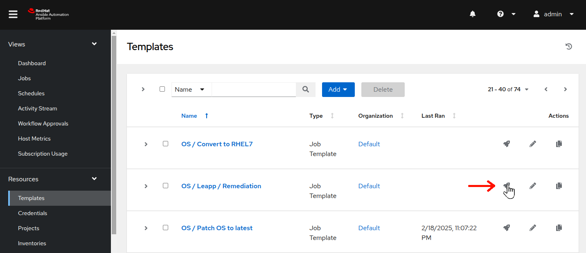

# Workshop Exercise - Perform Recommended Remediation

## Table of Contents

- [Workshop Exercise - Perform Recommended Remediation](#workshop-exercise---perform-recommended-remediation)
  - [Table of Contents](#table-of-contents)
  - [Objectives](#objectives)
  - [Guide](#guide)
    - [Step 1 - Explore Options for Resolving Inhibitors](#step-1---explore-options-for-resolving-inhibitors)
    - [Step 2 - Managing the Leapp Answer File](#step-2---managing-the-leapp-answer-file)
    - [Step 3 - Resolving Inhibitors Using a Remediation Playbook](#step-3---resolving-inhibitors-using-a-remediation-playbook)
  - [Conclusion](#conclusion)

## Objectives

* Consider different options for resolving inhibitor risk findings
* Learn how to use the `leapp_answerfile` variable of the `analysis` role
* Use a remediation playbook to proactively prepare for pre-upgrade

## Guide

### Step 1 - Explore Options for Resolving Inhibitors

In the previous exercise, we reviewed the Leapp pre-upgrade reports that were generated for our RHEL7 three tier application servers. There were a couple inhibitors reported for the RHEL7 hosts. We must take action to resolve them before those hosts can be upgraded.

We are now here in our automation approach workflow:


- Let's start by dissecting one of our inhibitor findings:

  

  <sub></sub> Each finding has a unique title.

  <sub></sub> A risk factor is assigned to each finding, but as we discussed in the previous exercise, this may be more nuanced than can be indicated by a simple High, Medium, Low or Info rating.

  <sub></sub> The summary provides a detailed explanation of the risk and solution recommendation.

  <sub></sub> Under remediation, we are given a fairly prescriptive recommendation.

  <sub></sub> Sometimes, the remediation also includes an exact command like this one.

- When a remediation command is given such as with the example above, there are a number of options we can choose from for how to execute the command. Obviously, we could go with the quick and dirty method of getting to a root shell prompt on the host to cut and paste the command or manually edit the answerfile. Of course, going that way is prone to human error and doesn't scale well. Another option would be to use the "Run Remediation" button shown above the command. Using this option, the RHEL Web Console executes the command for us. While doing this is less prone to human error, it still doesn't scale well as it's only going to run on this single host.

- In the next steps, we'll look at how we can use the scale of Ansible Automation Platform (AAP) to perform remediations in bulk across a large RHEL estate.

### Step 2 - Understanding the Leapp Answer File

The Leapp framework uses an answer file as a means of accepting user input choices. This is explained in greater detail in the [Asking user questions](https://leapp.readthedocs.io/en/latest/dialogs.html) section of the Leapp developer documentation. The inhibitor finding we dissected in the previous step is looking for us to make a decision or, more specifically, asking us to acknowledge we are aware that Leapp will disable the pam_pkcs11 PAM module during the RHEL upgrade.

- In [Exercise 1.2 - Run Pre-upgrade Jobs](../1.2-preupg/README.md), we launched a playbook that runs the pre-upgrade report using the `analysis` role from the `infra.leapp` Ansible collection. In reviewing the [documentation for this role](https://github.com/redhat-cop/infra.leapp/blob/main/roles/analysis/README.md), we see that the `analysis` role supports a `leapp_answerfile` input variable. We can set the variable to automatically populate the Leapp answer file during analysis. While that's a convenient way to resolve an answerfile inhibitor, our next inhibitor can't be resolved that way...and we are going to need to perform additional remediations anyway, so we will take care of the Leapp Answer File remediation with a set of remediation automation.

### Step 3 - Resolving Inhibitors Using a Remediation Playbook

- Here is our other inhibitor finding:

  

  Like the previous inhibitor finding, this one also provides a detailed summary and a a fairly prescriptive recommended remediation. However, it does not recommend an exact remediation command. Instead, the remediation recommends making edits to the `/etc/ssh/sshd_config` file.

- Of course, we're not going to just login to a root shell and `vi` the configuration file, are we? Right, let's make a playbook to automate the required remediations. Here's a task that should do the trick:

  ```yaml
  - name: Configure sshd
    ansible.builtin.lineinfile:
      path: "/etc/ssh/sshd_config"
      regex: "^(#)?{{ item.key }}"
      line: "{{ item.key }} {{ item.value }}"
      state: present
    loop:
      - {key: "PermitRootLogin", value: "prohibit-password"}
      - {key: "PasswordAuthentication", value: "no"}
    notify:
      - Restart sshd
  ```

  While we're at it, let's also add a task to take care of the answer file inhibitor using the `leapp answer` command. For example:

  ```yaml
  - name: Remove pam_pkcs11 module
    ansible.builtin.shell: |
      set -o pipefail
      leapp answer --section remove_pam_pkcs11_module_check.confirm=True
    args:
      executable: /bin/bash
  ```

- You will find the tasks above in the playbook [`remediate_rhel7.yml`](https://github.com/redhat-partner-tech/automated-satellite/blob/39b6e82ea9fec5a43d43aa0ab8f9f6e0c7ae1fcf/remediate_rhel7.yml#L22-L39). There are a few more remediation task examples in this playbook as well. The "OS / Leapp / Remediation" job template is already set up to execute this playbook, so let's use it to remediate our RHEL7 hosts.



- Return to your AAP Web UI browser tab. Navigate to Resources > Templates on the AAP Web UI and find the **OS / Remediation** job template. Click  to the right of **OS / Leapp / Remediation** to launch the remediation job.

- This will bring you to the job template survey prompt. Again, leave the "Limit" field empty and click "Next". Choose the `RHEL7_Dev` option at the "Select inventory group" prompt. Then click the "Next" button. Review the job preview details and then when ready, click the "Launch" button to submit the job. This playbook includes only a small number of lightweight tasks and should run pretty quickly, completing in approximately 30 seconds.

- When the **OS / Remediation** job is finished, launch the "LEAPP / 01 Analysis" job template one more time, again leaving the "Limit" field empty and taking care to choose the "RHEL7_Dev" option at the "Select inventory group" prompt. When the job completes, go back to the RHEL Web Console of your RHEL7 `node1` host and refresh the report. You should now see there are no inhibitors:

  

  With the high risk factor inhibitors remediated on our RHEL7 systems, we are ready to proceed along our RHEL upgrade process.

## Conclusion

In this exercise, we looked at the different ways we can resolve inhibitor risk findings. We learned that we could potentially utilize the `leapp_answerfile` variable of the `analysis` role to manage the Leapp answer file. Finally, we employed a remediation playbook to demonstrate how we could address pre-upgrade inhibitor findings at scale across our RHEL estate.

Now we are ready to try upgrading our RHEL three tier app servers, but before we get to that, there are two more optional exercises in this section of the workshop:

- [Exercise 1.5 - Custom Pre-upgrade Checks](../1.6-custom-modules/README.md)

These exercises are not required to successfully complete the workshop, but we recommend doing them if time allows. If you can't wait and want skip ahead to upgrading your RHEL hosts, strap in for this exciting exercise:

- [Exercise 2.1 - Run the RHEL Upgrade Jobs](../2.1-upgrade/README.md)

---

**Navigation**

[Previous Exercise](../1.4-report/README.md) - [Next Exercise](../1.6-custom-modules/README.md)

[Home](../README.md)
