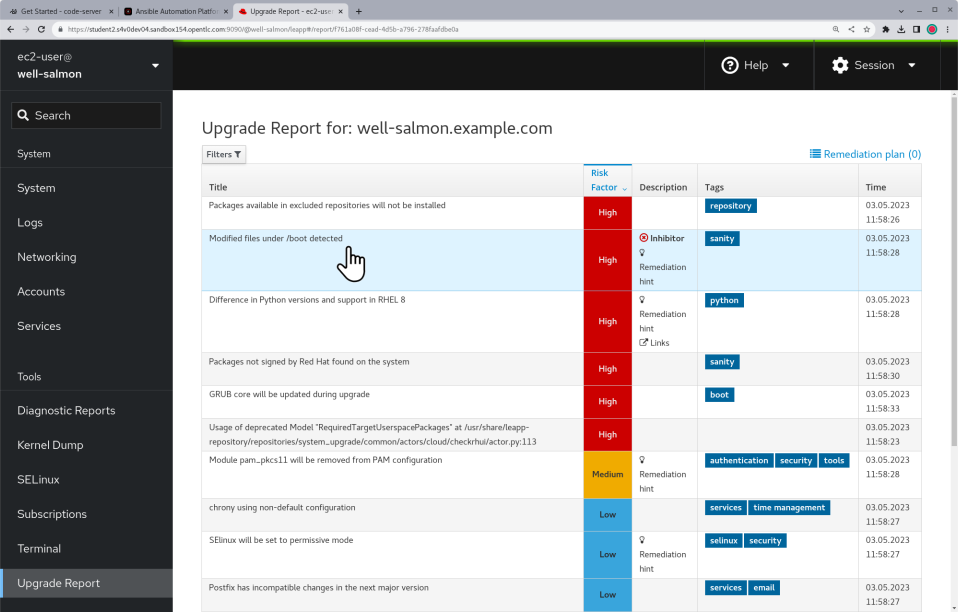
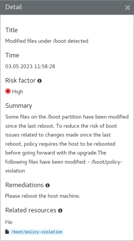

# !!WIP!! Workshop Exercise - Custom Modules !!WIP!!
This exercise still needs to be fully completed.

## Table of Contents

- [Workshop Exercise - Custom Modules](#workshop-exercise---custom-modules)
  - [Table of Contents](#table-of-contents)
  - [Optional Exercise](#optional-exercise)
  - [Objectives](#objectives)
  - [Guide](#guide)
    - [Step 1 - What are Custom Modules?](#step-1---what-are-custom-modules)
    - [Step 2 - Install a Leapp Custom Actor](#step-2---install-a-leapp-custom-actor)
    - [Step 3 - Generate a New Pre-upgrade Report](#step-3---generate-a-new-pre-upgrade-report)
    - [Step 4 - Learn More About Customizing the In-place Upgrade](#step-4---learn-more-about-customizing-the-in-place-upgrade)
  - [Conclusion](#conclusion)

## Optional Exercise

This is an optional exercise. It is not required to successfully complete the workshop, but it's recommended if time allows. Review the objectives listed in the next section to decide if you want to do this exercise or if you would rather skip ahead to the next exercise:

* [Exercise 2.1 - Run the RHEL Upgrade Jobs](../2.1-upgrade/README.md)

## Objectives

* Learn what are custom modules
* Install a Leapp custom actor to implement additional pre-upgrade checks
* See where to go to learn more about making your own custom actors

## Guide

### Step 1 - What are Custom Modules?

Custom modules is a generic term that refers to any custom capabilities that may be layered on the RHEL in-place upgrades automation approach to meet any special requirements unique to your enterprise.

- For example, maybe your organization has established a standard set of policies that must be followed before doing any system maintenance. In that case, you could implement a Leapp custom actor that will raise a pre-upgrade inhibitor if any conditions are detected that do not comply with your policies.

- Another use case for custom modules is to deal with 3rd-party tools and agents that are present in your standard RHEL server builds. For example, if you use Chef for configuration convergence, you could implement additional tasks in your upgrade playbook to take care of updating the Chef client package and making any required changes to the Chef node attributes and run list that would be required under the new OS version.

- We use the generic term "custom modules" because there is no single blueprint for how to design and implement the logic and automation for different organization's diverse requirements. Custom module requirements may call for a Leapp custom actor, custom Ansible automation, or even an integrated design utilizing both.

- Custom Leapp actors are best for implementing any additional pre-upgrade checks you may need because the results of these checks will be seamlessly included in the pre-upgrade report generated by the Leapp framework. Custom Leapp actors should also be used for any automated tasks that need to be run during the [interim system phase of the Leapp upgrade](https://docs.redhat.com/en/documentation/red_hat_enterprise_linux/8/html-single/upgrading_from_rhel_7_to_rhel_8/index#performing-the-upgrade-from-rhel-7-to-rhel-8_upgrading-from-rhel-7-to-rhel-8:~:text=In%20this%20phase%2C%20the%20system%20boots%20into%20a%20RHEL%208%2Dbased%20initial%20RAM%20disk%20image%2C%20initramfs.%20Leapp%20upgrades%20all%20packages%20and%20automatically%20reboots%20to%20the%20RHEL%208%20system.).

- Developing Leapp custom actors is not as easy compared to just adding tasks to a playbook, so most custom automation requirements are best achieved using Ansible. Tasks can be included in your upgrade playbook before and after the task that imports the `upgrade` role from the `infra.leapp` collection as part of the overall RHEL OS upgrade process.

### Step 2 - Install a Leapp Custom Actor

There is a collection of example custom actor at the GitHub repo [oamg/leapp-supplements](https://github.com/oamg/leapp-supplements). We will use one of these to demonstrate adding a custom check to our pre-upgrade reports.

- The example custom actor we are going to install implements checks for compliance with an imaginary organization's "reboot hygiene" policy. The actor will block the upgrade by reporting inhibitor risk if any of the following conditions are detected:

  - The host uptime is greater than the maximum defined by the policy.

  - The running kernel version does not match the default kernel version configured in the bootloader.

  - The /boot directory has any files that have been modified since the last reboot.

- Go to your VS Code browser tab and open a terminal session. Refer back to [Exercise 1.1, Step 2](../1.1-setup/README.md#step-2---open-a-terminal-session) if you need a reminder of how we did that.

- Login to one of your three tier app servers using the `ssh` command. For example:

  ```
  ssh node1
  ```

- Now we will install the RPM package that provides our custom actor. Run the following command on your three tier app server:

  ```
  sudo yum -y --enablerepo=leapp-supplements install leapp-upgrade-\*-supplements
  ```

  > **Note**
  >
  > We are installing the package manually just for the purpose of demonstrating this custom actor. If we were ready to roll out custom actors at enterprise scale, we would include the package installation at the beginning of our analysis playbook.

- This is an example of the output you should expect to see if the package is installed successfully:

  ```
  Resolving Dependencies
  --> Running transaction check
  ---> Package leapp-upgrade-el7toel8-supplements.noarch 0:1.0.0-47.demo.el7 will be installed
  --> Finished Dependency Resolution

  Dependencies Resolved

  ==========================================================================================
   Package                             Arch    Version             Repository          Size
  ==========================================================================================
  Installing:
   leapp-upgrade-el7toel8-supplements  noarch  1.0.0-47.demo.el7   leapp-supplements   12 k

  Transaction Summary
  ==========================================================================================
  Install  1 Package

  Total download size: 12 k
  Installed size: 18 k
  Downloading packages:
  leapp-upgrade-el7toel8-supplements-1.0.0-47.demo.el7.noarch.rpm    |  12 kB  00:00:00
  Running transaction check
  Running transaction test
  Transaction test succeeded
  Running transaction
    Installing : leapp-upgrade-el7toel8-supplements-1.0.0-47.demo.el7.noarch            1/1
    Verifying  : leapp-upgrade-el7toel8-supplements-1.0.0-47.demo.el7.noarch            1/1

  Installed:
    leapp-upgrade-el7toel8-supplements.noarch 0:1.0.0-47.demo.el7

  Complete!
  ```

- To demonstrate the custom actor at work, let's create a condition that violates our policy so that an inhibitor finding will be reported. Use this command:

  ```
  sudo touch /boot/policy-violation
  ```

  With this command, we just created a file under /boot with a timestamp later than the last reboot. This host is now out of compliance with our reboot hygiene policy!

### Step 3 - Generate a New Pre-upgrade Report

We are now ready to try running a pre-upgrade report including the checks from our custom actor.

- Return to your AAP Web UI browser tab. Navigate to Resources > Templates and open the "LEAPP / 01 Analysis" job template. Launch the job leaving "Limit" field empty and choosing the "RHEL7_Dev" option at the "Select inventory group" prompt.

- When the job completes, go back to the RHEL Web Console and use the remote host menu to navigate to the three tier app server "node1" where you installed the custom actor package. Refresh the pre-upgrade report. You should now see there is a new inhibitor finding. For example:

  

- Click on the finding to open the detail view. Here we see the summary with an explanation of the finding and the remediation hint which politely says please reboot:

  

- Reboot the host to resolve the inhibitor finding. For example:

  ```
  sudo reboot
  ```

- Now generate another pre-upgrade analysis report after rebooting. Verify that this inhibitor finding has disappeared with the new report.

### Step 4 - Learn More About Customizing the In-place Upgrade

Read the knowledge article [Customizing your Red Hat Enterprise Linux in-place upgrade](https://access.redhat.com/articles/4977891) to understand best practices for handling the upgrade of third-party packages using custom repositories for an in-place upgrade or custom actors.

The gritty details of developing Leapp custom actors are beyond the scope of this workshop. Here are some resources you can check out to learn more on your own:

  - [Developer Documentation for Leapp](https://leapp.readthedocs.io/en/latest/): this documentation covers the internal workflow architecture of the Leapp framework and how to develop and test your own custom actors.

  - [Leapp Dashboard](https://oamg.github.io/leapp-dashboard/#/): dig around here to make sure the custom actor functionality you are considering doesn't already exist in the mainstream Leapp framework.

  - [oamg/leapp-supplements](https://github.com/oamg/leapp-supplements): GitHub repo where you can find example custom actors and contribute your own. It also has the `Makefile` for custom actor RPM packaging.

## Conclusion

In this exercise, we learned that custom modules can be Leapp custom actors or simply custom tasks added to your upgrade playbook. We demonstrated installing an RPM package that provides an example custom actor with additional pre-upgrade checks and generated a new pre-upgrade report to see it in action.

---

**Navigation**

[Previous Exercise](../1.5-remediate/README.md) - [Next Exercise](../2.1-upgrade/README.md)

[Home](../README.md)
