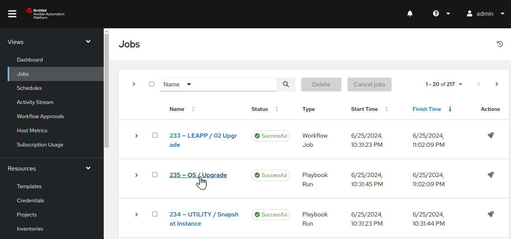

# Workshop Exercise - Check for successful upgrades

## Table of Contents

- [Workshop Exercise - Check for successful upgrades](#workshop-exercise---check-for-successful-upgrades)
  - [Table of Contents](#table-of-contents)
  - [Objectives](#objectives)
  - [Guide](#guide)
    - [Step 1 - Review the Upgrade Playbook Job Log](#step-1---review-the-upgrade-playbook-job-log)
    - [Step 2 - Verify the Hosts are Upgraded to Next RHEL Version](#step-2---verify-the-hosts-are-upgraded-to-next-rhel-version)
  - [Conclusion](#conclusion)

## Objectives

* Review the upgrade playbook job log
* Verify our three tier application servers are running the newer RHEL version

## Guide

In the previous exercises, we reviewed pre-upgrade reports and performed some recommended remediations. If you tried the optional exercise, you also learned about custom pre-upgrade checks. Subsequently, you launched an Ansible Automation Platform job template to automate the RHEL in-place upgrades on your RHEL three tier application servers.

It's time to verify the result of the upgrade automation and assess if our three tier application stack is functioning properly. Our current state in regards to the RHEL in-place upgrade automation workflow is as follows:

Let's get started!

### Step 1 - Review the Upgrade Playbook Job Log

The first thing we want to do is see if the job running the upgrade playbooks has finished successfully.

- Return to the AAP Web UI tab in your web browser. Navigate to Views > Jobs and then open the "job number - OS / Upgrade" playbook run entry to see the log output from the upgrades.

  > **Note**
  >
  > You will also see an entry for the "LEAPP / 02 Upgrade" workflow job. Workflow jobs launch a number of playbook runs. To see the playbook log output, we need to open the specific playbook run entry, not the workflow job entry.

  For example:

  

- If the playbook run finished without any failed tasks, you should see "Successful" displayed with a green checkmark.

  > **Note**
  >
  > If you see "Running" with spinning arrows, the playbook is still running. Wait for the playbook run to finish before moving on with this exercise.

  Scroll down to the end of the log output to see the "PLAY RECAP" indicating the success or failure status for the playbook run executed on each host. Here is what you should expect to see:

  

  If there are no failed runs, the RHEL in-place upgrade has completed on all of our three tier app servers.

### Step 2 - Verify the Hosts are Upgraded to Next RHEL Version

Now, let's verify that all three tier app servers are upgraded to the next RHEL version.

- In [Exercise 1.4: Step 2](../1.4-report/README.md#step-2---navigating-the-rhel-web-console), the RHEL Web Console was utilized to verify the installed RHEL versions on all three tier app servers. Let's repeat the same steps to verify the RHEL versions reported after the upgrades.

  Return to your RHEL Web Console browser tab and use the remote host menu to navigate to the web consoles of each of your three tier app servers. The RHEL Web Console system overview page should now show the upgraded versions.

  > **Note**
  >
  > You may need to refresh the browser using Ctrl-R to see the newly reported RHEL version.

  For example, three tier app server `node1` that was previously RHEL7 is now reporting RHEL8:

  

- You can also check the RHEL and kernel versions from the command line following the steps you used with [Exercise 1.1: Step 2](../1.1-setup/README.md#step-2---open-a-terminal-session).

  At the shell prompt of your three tier app servers, use the `cat /etc/redhat-release` and `uname -r` commands. Here's an example showing that three tier app server node1 was upgraded to RHEL8:

  

## Conclusion

In this exercise, we observed that the upgrade playbook job completed successfully. We then used the RHEL Web Console and the command line to verify that the new major RHEL version upgrade was applied.

If you deployed the sample three tier application in the earlier optional exercise 1.2, continue in the following exercise to verify that the three tier application is still functioning as expected after the RHEL upgrades:

- [Exercise 2.4 - Check three tier app](../2.4-check-three-tier-app/README.md)

Otherwise, you may skip ahead to the next section of the workshop where we will demonstrate rolling back the RHEL upgrade, starting with these exercises:

- [Exercise 3.1 - (Optional) Trash the Instance](../3.1-error-condition/README.md)
- [Exercise 3.2 - Run Rollback Job](../3.2-rollback/README.md)

---

**Navigation**

[Previous Exercise](../2.2-snapshots/README.md) - [Next Exercise](../2.4-check-three-tier-app/README.md)

[Home](../README.md)
