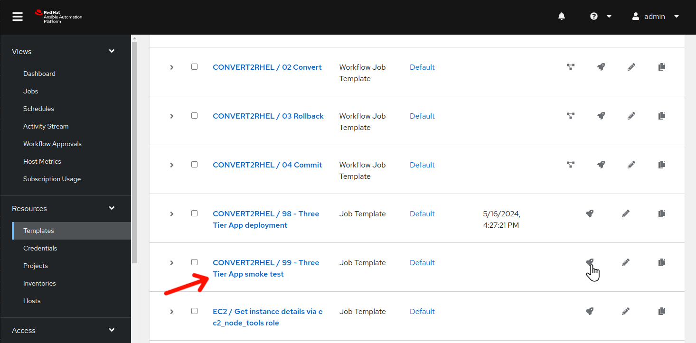
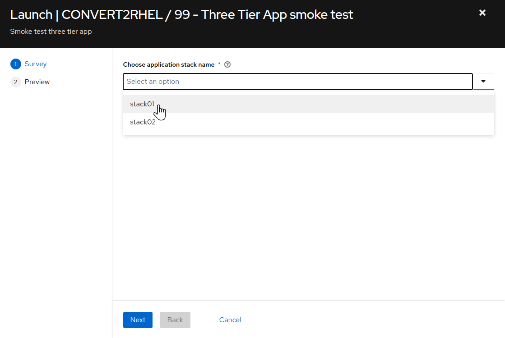
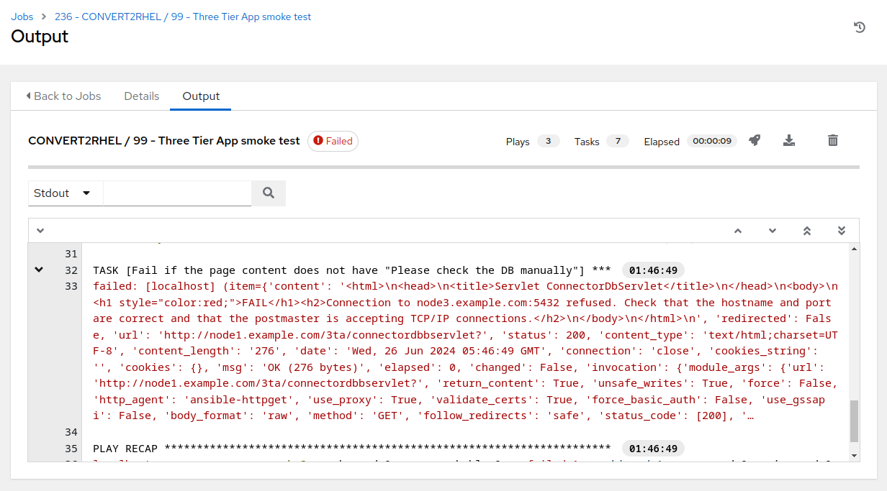

# Workshop Exercise - How is the Three Tier App Doing?

## Table of Contents

- [Workshop Exercise - How is the Three Tier App Doing?](#workshop-exercise---how-is-the-three-tier-app-doing)
  - [Table of Contents](#table-of-contents)
  - [Objectives](#objectives)
  - [Guide](#guide)
    - [Step 1 - Retest our Three Tier Application](#step-1---retest-our-three-tier-application)
  - [Conclusion](#conclusion)

## Objectives

* Confirm our three tier application is still functioning as expected after the conversion
* Add new records to the app database to see what happens when rolling back

## Guide

In [Exercise 1.2](../1.2-three-tier-app/README.md) we installed a sample three tier application and tested application functionality via automation. Now that we have upgrade upgrade our RHEL7 application servers to RHEL8, let's retest to see if there has been any impact.

### Step 1 - Retest our Three Tier Application

It's time to repeat the testing utilized in [Step 4](../1.2-three-tier-app/README.md#step-4---smoke-test-three-tier-application) of exercise 1.2.

  

- Use the side pane menu on the left to select **Templates**.

- Click  to the right of **CONVERT2RHEL / 99 - Three Tier App smoke test** to launch the application test job.

  

- For `Choose application stack name`, remember earlier in the inventory tags section, "app_stack_name" was set to "stack01"? So, we choose "stack01" from the drop down selection. Click **Next**, and then on the preview screen, click **Launch**.

This should take ~15 seconds to complete.

  

- Uh oh, something with the application stack is malfunctioning. We can begin the debugging process to determine where the problem resides. Hmmm, remember when we were reviewing the high, medium, and low risk factors while reviewing the pre upgrade report? node3 had a medium risk factor that listed postgreSQL as something to keep in mind.

### Step 2 - Add More Records to the Database

In [Exercise 2.2](../2.2-snapshots/README.md), we considered the potential pitfalls of including app data in the scope of our snapshot. Imagine what would happen if your app at first appeared fine after the conversion, but an issue was later discovered after the app had been returned to production use.

- Wait at least one minute since running the previous smoke test job template and add a new table to the database via an additional run of of the **CONVERT2RHEL / 99 - Three Tier App smoke test** job template. Check the job template output for a task _similar_ to this, typically the last task in the job run:

`TASK [Fail if database db01 did not contain table 06-06-2024-04-01]`

Remember and/or record this table name to see what happens after we revert the OS conversion in the next section of the workshop.

> **Note**
  >
  > The three tier application uses the current time and date to generate the new table names. Your table names are going to be different from the ones listed here in these exercises, as the instructions here were generated in the past.

- What will be the business impact if data updates are rolled back with the conversion? That is exactly the problem we will demonstrate next, because the three tier application servers deployed in this workshop do not have separate volumes to isolate the OS from the app data.

## Conclusion

In this exercise, we observed that the CentOS conversion to RHEL left our application untouched and we found that it still works as expected after the conversion. Then we added some new app data to demonstrate what will happen after rolling back the conversion.

This concludes the CentOS conversion section of the workshop. In the next and final section, we will be rolling back the CentOS conversion, taking us right back to where we started.

---

**Navigation**

[Previous Exercise](../2.3-check-convert/README.md) - [Next Exercise](../3.1-error-condition/README.md)

[Home](../README.md)
