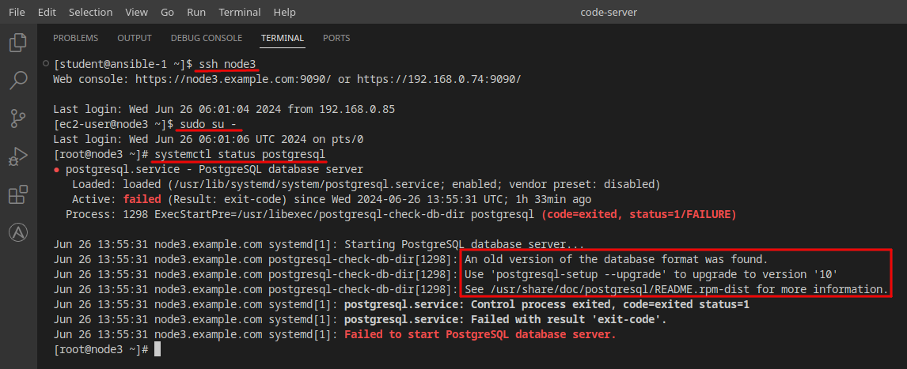
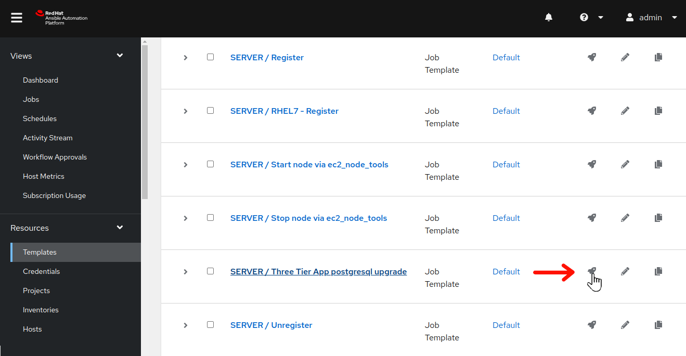
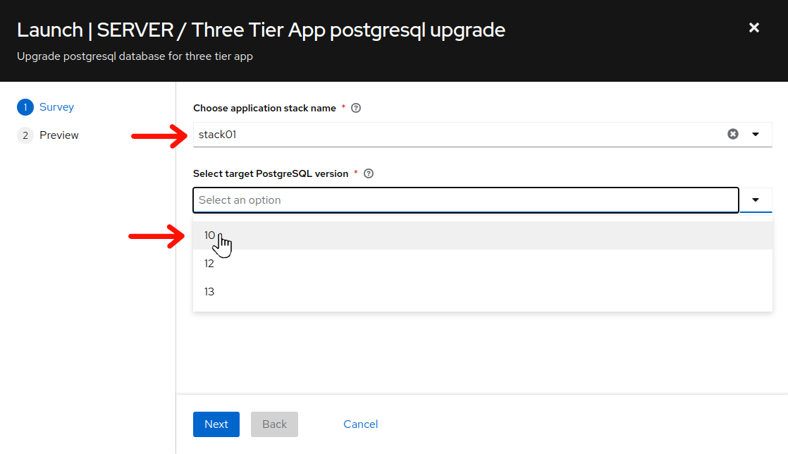
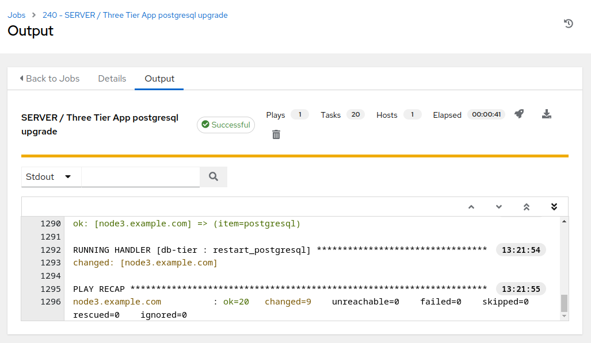
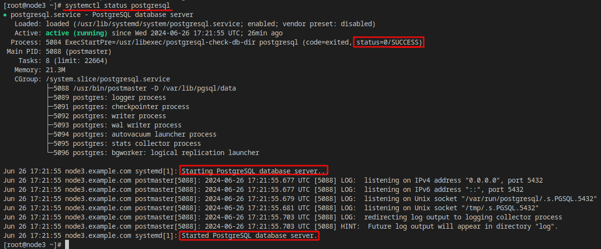
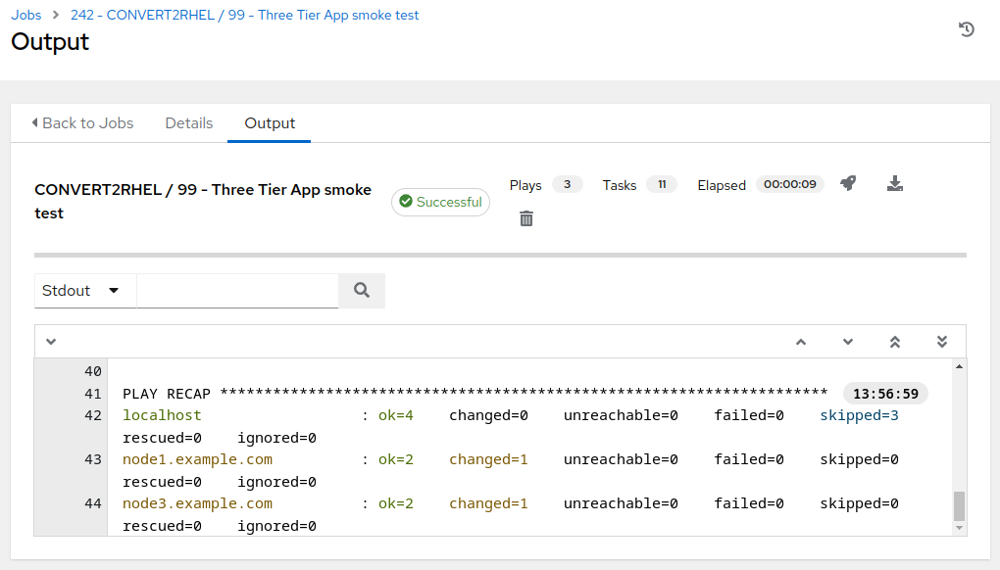

# Workshop Exercise - How is the Three Tier App Doing?

## Table of Contents

- [Workshop Exercise - How is the Three Tier App Doing?](#workshop-exercise---how-is-the-three-tier-app-doing)
  - [Table of Contents](#table-of-contents)
  - [Objectives](#objectives)
  - [Guide](#guide)
    - [Step 1 - Retest our Three Tier Application](#step-1---retest-our-three-tier-application)
    - [Step 2 - Upgrade Three Tier Application Database Version](#step-2---upgrade-three-tier-application-database-version)
    - [Step 3 - Test our Three Tier Application - Again](#step-3---test-our-three-tier-application---again)
  - [Conclusion](#conclusion)

## Objectives

* Confirm our three tier application is still functioning as expected after the conversion
* Understand additional post upgrade automation needs external to Leapp utility
* Add new records to the app database to see what happens when rolling back

## Guide

In [Exercise 1.2](../1.2-three-tier-app/README.md) we installed a sample three tier application and tested application functionality via automation. Now that we have upgrade upgrade our RHEL7 application servers to RHEL8, let's retest to see if there has been any impact.

### Step 1 - Retest our Three Tier Application

It's time to repeat the testing utilized in [Step 4](../1.2-three-tier-app/README.md#step-4---smoke-test-three-tier-application) of exercise 1.2.

  

- Use the side pane menu on the left to select **Templates**.

- Click  to the right of **CONVERT2RHEL / 99 - Three Tier App smoke test** to launch the application test job.

  

- For `Choose application stack name`, remember earlier in the inventory tags section, "app_stack_name" was set to "stack01"? So, we choose "stack01" from the drop down selection. Click **Next**, and then on the preview screen, click **Launch**.

This should take ~15 seconds to complete.

  

- Uh oh! Something with the application stack is malfunctioning. No worries, though...we have systems snapshots we can rollback to when needed. In the meantime, we can begin the debugging process to determine where the problem resides. Hmmm, remember when we were reviewing the high, medium, and low risk factors while reviewing the pre upgrade report? node3 had a medium risk factor that listed postgreSQL as something to keep in mind.

- Let's check the PostgreSQL service from the command line following the steps you used with [Exercise 1.1: Step 2](../1.1-setup/README.md#step-2---open-a-terminal-session).

  ssh to the PostgreSQL system, node3, and as root, use the `systemctl status postgresql` command to check the PostgreSQL service. Here is an example of the commands utilized:

  

- Back when reviewing the pre-upgrade analysis reports in [Exercise 1.4: Step 3](../1.1-setup/README.md# step-3---review-leapp-pre---upgrade-report-of-rhel7-host), for node3, there was a medium risk factor finding for PostgreSQL and the detailed information for that finding stated "...it is necessary to proceed with additional steps for the complete upgrade of the PostgreSQL data."

  This scenario is where the automation team would circle up with the three tier stack PostgreSQL DBAs and put together some automation to work through upgrading the PostgreSQL database to the new version format. For example, the [UpgradePostgres_3TA_AWS.yml](https://github.com/heatmiser/ansible-3tier-app/blob/production/UpgradePostgres_3TA_AWS.yml) playbook in the `Three Tier App / Prod` project.

### Step 2 - Upgrade Three Tier Application Database Version

Let's run some automation against the PostgreSQL system to update the PostgreSQL database version.

  

- Use the side pane menu on the left to select **Templates**.

- Click  to the right of **SERVER / Three Tier App postgresql upgrade** to launch the database upgrade job.

  

- For `Choose application stack name`, remember earlier in the inventory tags section, "app_stack_name" was set to "stack01"? So, we choose "stack01" from the drop down selection.

- For `Select target PostgreSQL version`, the information message provided when we exectuted `systemctl status postgres` on node3 stated "...upgrade to version '10'". Choose "10" from the drop down selection.

- Click **Next**, and then on the preview screen, click **Launch**.

This should take just under a minute to complete.

  

### Step 3 - Test our Three Tier Application - Again

With the PostgreSQL database upgraded, if you are still ssh'ed in as root on node3, you can verify that the database upgrade was successful by executing `systemctl status postgres` from the command line:

  

However, we want to ensure that our application stack is 100% fully functional, so let's use our automated application testing:

  

- Use the side pane menu on the left to select **Templates**.

- Click  to the right of **CONVERT2RHEL / 99 - Three Tier App smoke test** to launch the application test job.

  

- For `Choose application stack name`, choose "stack01" from the drop down selection. Click **Next**, and then on the preview screen, click **Launch**.

This should take ~15 seconds to complete.

  

Success! Our three tier application stack is fully functional, with all nodes running RHEL8!

### Step 4 - Verify and Record Database Tables

In [Exercise 2.2](../2.2-snapshots/README.md), we considered the potential pitfalls of including app data in the scope of our snapshot. Imagine what would happen if your app at first appeared fine after the conversion, but an issue was later discovered after the app had been returned to production use.

- In the Ansible Automtion Platform browser tab, go back and review the previous **CONVERT2RHEL / 99 - Three Tier App smoke test** job output and check the job template output for a task _similar_ to the following line, typically the last task in the job run:

`TASK [Fail if database db01 did not contain table 26-06-2024-17-56]`

Remember and/or record this table name to see what happens after we revert the OS conversion in the next section of the workshop.

> **Note**
  >
  > The three tier application uses the current time and date to generate the new table names. Your table names are going to be different from the ones listed here in these exercises, as the instructions here were generated in the past.

- What will be the business impact if data updates are rolled back with the conversion? That is exactly the problem we will demonstrate next, because the three tier application servers deployed in this workshop do not have separate volumes to isolate the OS from the app data.

## Conclusion

In this exercise, we observed that while the RHEL In-place Upgrade was successful from a functional operating system standpoint, we found that the three tier application stack was broken after the upgrade process, prompting the need for additional, post-upgrade automation steps. Then we added some new app data via our application functionality verification automation testing. This will permit exploration and understanding of circumstances that can occur after rolling back the upgrade.

This concludes the RHEL In-Place Upgrade section of the exercise. In the next and final sections, we will be rolling back the upgrade, taking us right back to where we started.

---

**Navigation**

[Previous Exercise](../2.3-check-upg/README.md) - [Next Exercise](../3.1-error-condition/README.md)

[Home](../README.md)
