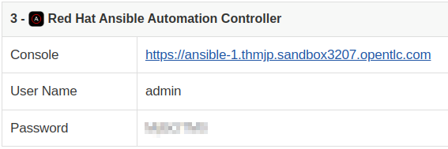
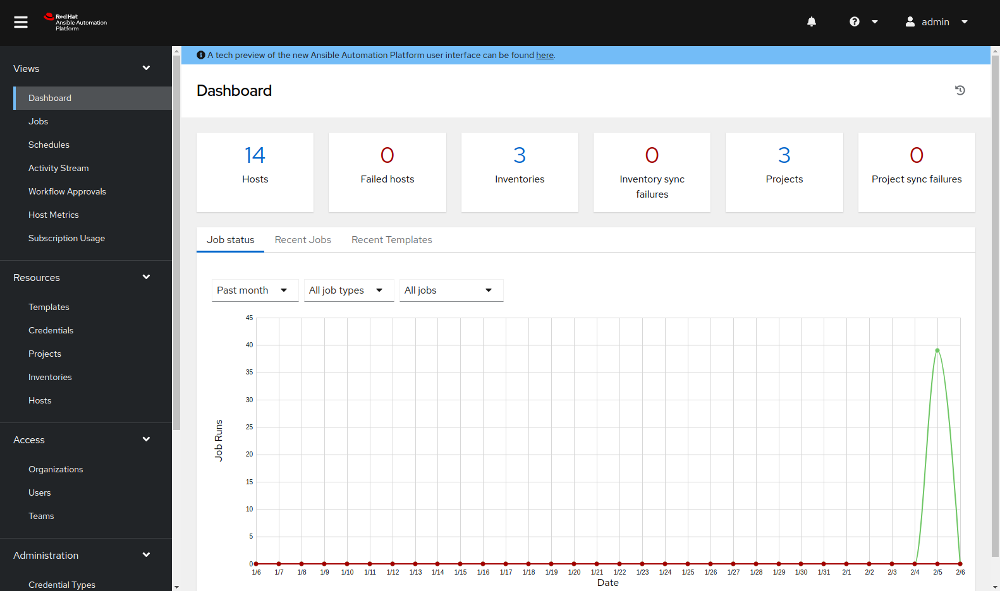
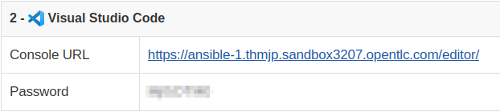
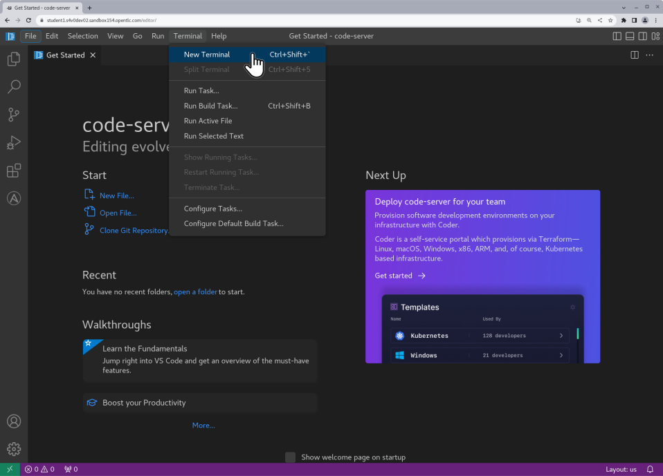
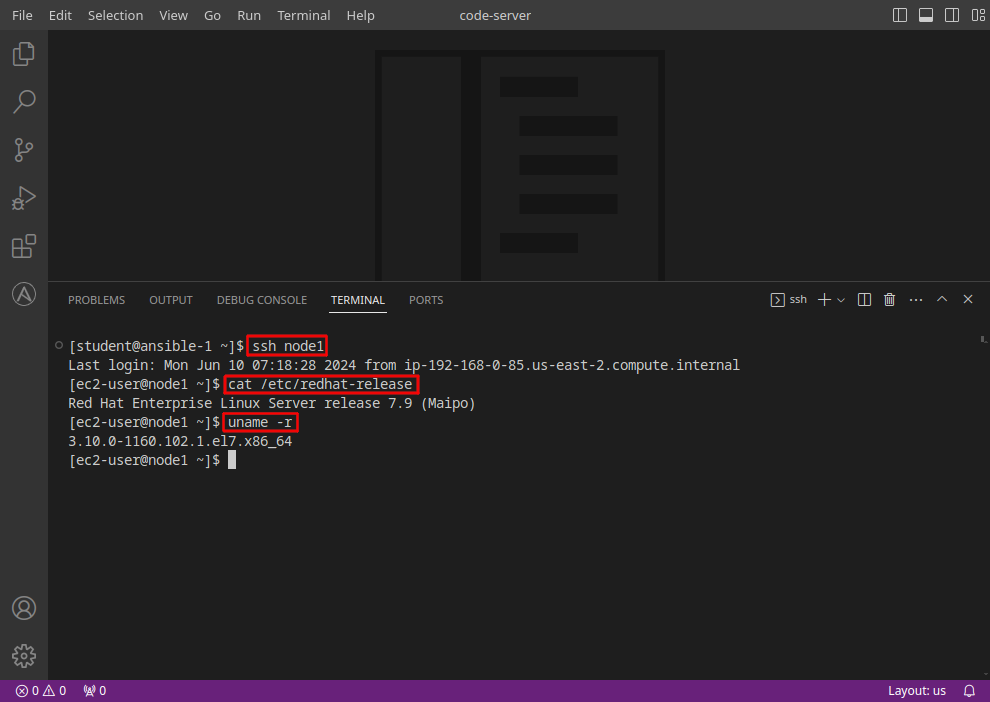
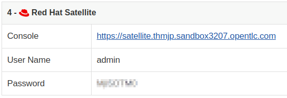
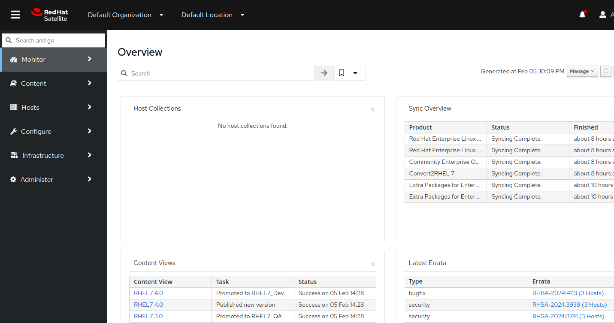

# Automated Satellite Workshop

**Read this in other languages**:
  [English](README.md),  [Français](README.fr.md).
 

In this workshop, you will learn how to get the most from Red Hat Satellite in concert with Red Hat Ansible Automation Platform.

## Table of Contents
- [Use Cases](#use-cases)
- [Presentations](#presentations)
- [Time planning](#time-planning)
- [Lab Diagram](#lab-diagram)
- [Your Environment](#your-environment)
- [Workshop Exercises](#workshop-exercises)

## Use Cases

This workshop currently focuses on 5 main customer pain points:
- Compliance (OpenSCAP Scanning) and Vulnerability Management
- Patch/Package Management
- CentOS/OracleLinux to RHEL Conversion
- RHEL In-Place-Upgrades
- Vulnerability Management with Insights

## Presentations

The exercises are self explanatory and guide the participants through the entire lab. All concepts are explained when they are introduced.

There is an optional presentation available to support the workshops and explain Automation, the basics of Ansible and the topics of the exercises in more detail.  Workshop presentation is located at [Automated Satellite Workshop](https://aap2.demoredhat.com/decks/ansible_auto_satellite.pdf).

Also have a look at our Ansible Best Practices Deck:
[Ansible Best Practices](https://aap2.demoredhat.com/decks/ansible_best_practices.pdf)

## Time planning

The time required to do the workshops strongly depends on multiple factors: the number of participants, how familiar those are with Linux in general and how much discussions are done in between.

Having said that, the exercises themselves should take roughly 4 to 5 hours. Compliance, Patching and Insights exercises each take roughly 30-45 minutes. OS Conversion and RHEL In-Place-Upgrade each require about an hour to complete. The accompanying presentation itself adds 45 minutes to an hour if included in whole.

## Lab Diagram

### Your Environment

| Role                                   | Inventory name |
| ---------------------------------------| ---------------|
| Ansible Automation Platform controller | ansible-1      |
| Satellite Server                       | satellite      |
| Managed Host 1 - RHEL                  | node1          |
| Managed Host 2 - RHEL                  | node2          |
| Managed Host 3 - RHEL                  | node3          |
| Managed Host 4 - CentOS/OracleLinux    | node4          |
| Managed Host 5 - CentOS/OracleLinux    | node5          |
| Managed Host 6 - CentOS/OracleLinux    | node6          |

### Step 1 - Access the AAP Web UI

The AAP Web UI is where we will go to submit and check the status of the Ansible playbook jobs we will use to automate Satellite and our managed hosts.

- Let's open the AAP Web UI in a new web browser tab using the "Console" link under "Red Hat Ansible Automation Controller" on the workshop launch page. For example:

  

- Enter the username `admin` and the password provided. This will bring you to your AAP Web UI dashboard like the example below:

  

- We will learn more about how to use the AAP Web UI in the next exercise.

### Step 2 - Access the Visual Studio Code Web UI

We will use Visual Studio Code (VS Code) as it provides a convenient and intuitive way to use a web browser to edit files and access terminal sessions. If you are a command line hero, direct SSH access is available if VS Code is not to your liking. There is a short YouTube video to explain if you need additional clarity: <a href="https://youtu.be/Y_Gx4ZBfcuk">Ansible Workshops - Accessing your workbench environment</a>.

- You can open VS Code in your web browser using the "Console URL" link under "Visual Studio Code" on the workshop landing page. The password is provided below the link. For example:

  

- After opening the link, type in the provided password to access your instance of VS Code.

> **Note**
>
> A welcome wizard may appear to guide you through configuring your VS Code user experience. This is optional as the default settings will work fine for this workshop. Feel free to step though the wizard to explore the VS code bells and whistles or you may just skip it.

### Step 3 - Open a Terminal Session

Terminal sessions provide access to the RHEL commands and utilities that will help us understand what's going on "behind the curtain" when the RHEL in-place upgrade automation is doing its thing.

- Use VS Code to open a terminal session. For example:

  

- This terminal session will be running on the AAP control host `ansible-1`. Next, use the `ssh` command to login to one of your RHEL hosts. Finally, use the highlighted commands to confirm the RHEL OS version and kernel version installed.

  For example:

  

- In the example above, the command `ssh node1` connects us to a new session on the node1 host. Then the commands `cat /etc/redhat-release` and `uname -r` are used to output the OS release information `Red Hat Enterprise Linux Server release 7.9 (Maipo)` and kernel version `3.10.0-1160.102.1.el7.x86_64` from that host.

### Step 4 - Access the Satellite Web UI

The Satellite Web UI is where we will go to review the Lifecycle Environments, Content Views and Activation Keys configured on the Satellite, as well as tracking the status of managed hosts as we proceed through the compliance and patching workflows.

- Let's open the Satellite Web UI in a new web browser tab using the "Console" link under "Red Hat Satellite" on the workshop launch page. For example:

  

- Enter the username `admin` and the password provided. This will bring you to your Satellite Web UI dashboard like the example below:

  

## Workshop Exercises

* [Exercise 1: Compliance / Vulnerability Management](1-compliance/README.md)
* [Exercise 2: Patch Management / OS](2-patching/README.md)
* [Exercise 3: CentOS to RHEL Conversion](3-convert2rhel/README.md)
* [Exercise 4: RHEL In-Place-Upgrade](4-ripu/README.md)
* [Exercise 5: Setup Insights](5-setupinsights/README.md)
* [Exercise 6: Explore Insights](6-exploreinsights/README.md)
* [Exercise 7: Remediate Vulnerability](7-remediatevulnerability/README.md)
