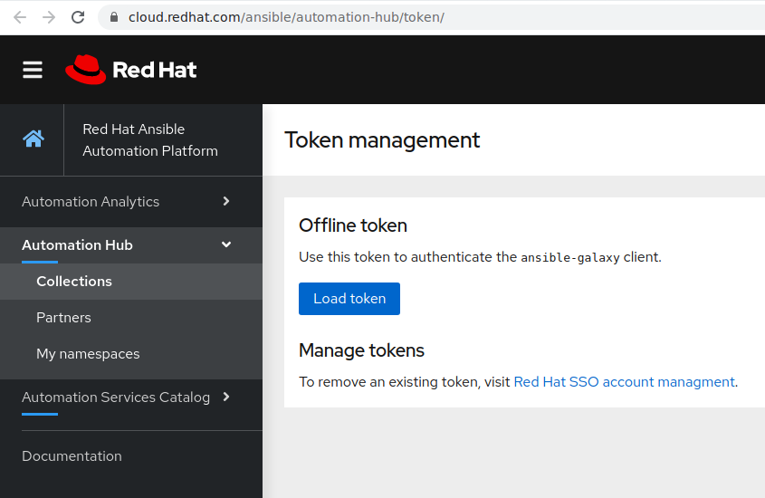
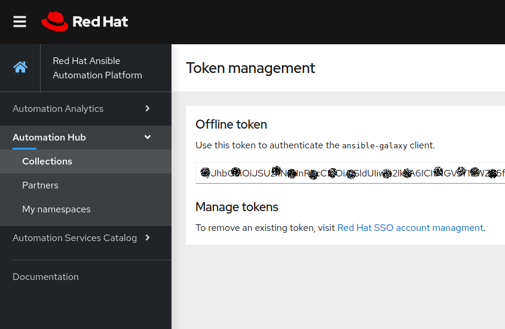

# Exercise 5 - How to use Red Hat Automation Hub?

## Table of Contents

- [Objective](#objective)
- [Red Hat Automation Hub](#red-hat-automation-hub)
    - [Certified Content](#certified-content)
    - [Supported Automation](#supported-automation)
- [Ansible Galaxy](#ansible-galaxy)
- [How to use Automation Hub](#how-to-use-automation-hub)
    - [Accessing collections](#accessing-collections)
       - [Creating a token](#creating-a-token)
       - [Using authentication token](#using-authentication-token)
       - [Using Collections](#using-collections)
    - [Authenticate Tower to Automation Hub](#authenticate-tower-to-automation-hub)
- [Takeaways](#takeaways)

# Objective

In this lab you will learn the value proposition of Red Hat Automation Hub and how to use the provided content.

# Red Hat Automation Hub

It is a service that is provided as part of the Red Hat SaaS Offering. It consists of the location where to discover and download only supported and certified Ansible Content Collections by Red Hat and its Partners. These content collections contain ways to consume automation, how-to-guides to implement them in your infrastructure. The support for Automation Hub is included with Red Hat Automation Platform subscription.

> **NOTE**: Red Hat Automation Hub resides on [https://cloud.redhat.com/ansible/automation-hub](https://cloud.redhat.com/ansible/automation-hub): requires Red Hat customer portal credentials and a valid Red Hat Automation Platform subscription.

## Certified Content

In the portal of Automation Hub, users have direct access to trusted content collections from Red Hat and Certified Partners. Certified collections are developed, tested, built, delivered, and supported by Red Hat and its Partners. To find more details about the scope of support, check the [Ansible Certified Content FAQ](https://access.redhat.com/articles/4916901),

## Supported Automation

Automation Hub is a one-stop-shop for Ansible content that is backed by support from Red Hat to deliver additional reassurance for customers. Additional supportability claims for these collections may be provided under the "Maintained and Supported By" one of Red Hat Partners.

# Ansible Galaxy

It is the location for wider Ansible community that initially started to provide pre-packaged units of work known as Ansible roles. Roles can be dropped into Ansible Playbooks and immediately put to work. in a recent version of Galaxy started to provide Ansible content collections as well.

Ansible Galaxy resides on [https://galaxy.ansible.com/](https://galaxy.ansible.com/)

# How to use Automation Hub

## Accessing collections

Ansible collections can be used and downloaded from multiple locations. They can either be downloaded using a requirement file, statically included in the git repository or eventually installed separately in the virtual environment.

In the scope of this exercise, the focus is on how access content from Automation Hub. This requires an authentication token and authentication URL. To do, some configuration steps need to be done in Ansible Tower.

## Authenticate Tower to Automation Hub

### Creating a token

Authenticating Ansible Tower requires a token. It can be achieved using the steps below:

1. Navigate to [https://cloud.redhat.com/ansible/automation-hub/token/](https://cloud.redhat.com/ansible/automation-hub/token/)

   

1. Click **Load Token**.

1. Click **copy icon** to copy the API token to the clipboard.

   

### Using authentication token

1. As user admin, navigate to the *Settings l> Jobs*

1. Set **PRIMARY GALAXY SERVER URL** to `https://cloud.redhat.com/api/automation-hub/`

1. Set **PRIMARY GALAXY AUTHENTICATION** URL to `https://sso.redhat.com/auth/realms/redhat-external/protocol/openid-connect/token`

1. Set **PRIMARY GALAXY SERVER TOKEN** to <COPIED_TOKEN>

> **TIP**: It is recommended using Red Hat Automation Hub as primary Galaxy Server URL to ensure using certified and supported content by Red Hat and its partners via Red Hat Ansible Automation subscription.

  

### Using collections

After authenticating Ansible Tower to access Automation Hub, using `collections/requirements.yml` file will automatically fetches the content collections from Automation Hub as first source.

# Takeaways

- The Red Hat Automation Hub provides certified collections that supported by Red Hat and its Partners. It's available via Red Hat Ansible Automation Platform.
- Ansible Galaxy hosts upstream community content collections.
- Red Hat Ansible Tower can be configured to authenticate to Red Hat Automation Hub in order to fetch certified and supported content collections that are utilized in a given project within tower.

----
**Navigation**
 
[Previous Exercise](../4-collections-from-tower/)

[Click here to return to the Ansible for Red Hat Enterprise Linux Workshop](../README.md)
