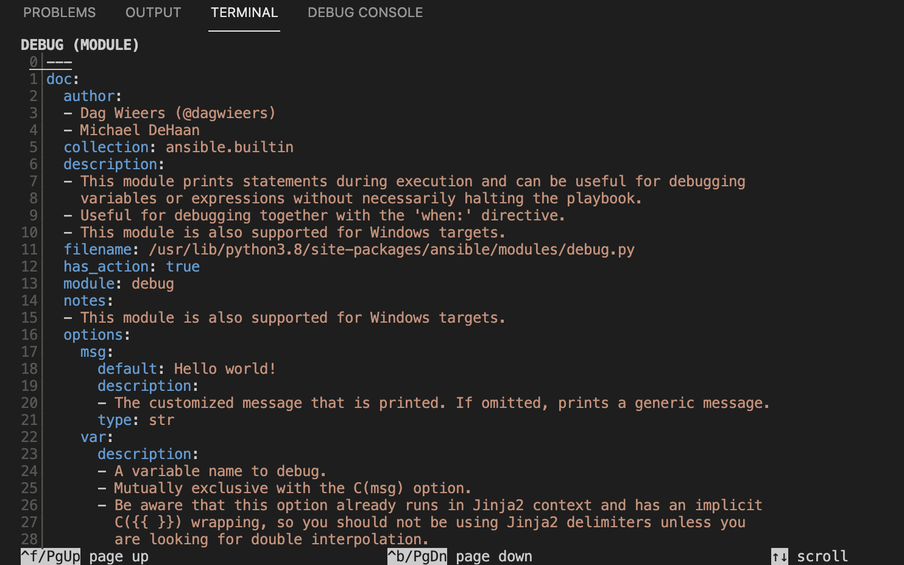
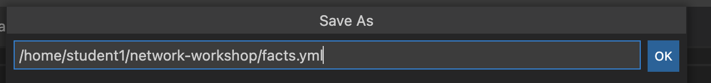
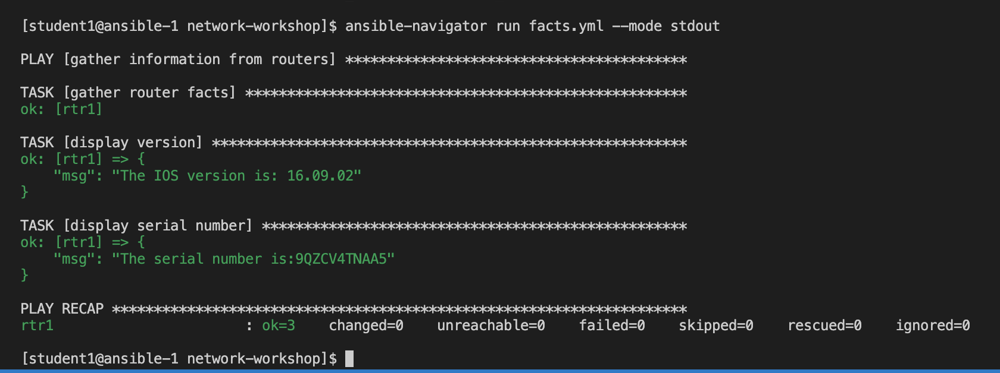

# Exercise 3: Ansible Facts

**Read this in other languages**:  [English](README.md),   [日本語](README.ja.md).

## Table of Contents

* [Objective](#objective)
* [Guide](#guide)
   * [Step 1 - Using documentation](#step-1---using-documentation)
   * [Step 2 - Creating the play](#step-2---creating-the-play)
   * [Step 3 - Create the facts task](#step-3---create-the-facts-task)
   * [Step 4 - Executing the playbook](#step-4---executing-the-playbook)
   * [Step 5 - Using debug module](#step-5---using-debug-module)
   * [Step 6 - Using stdout](#step-6---using-stdout)
* [Takeaways](#takeaways)
* [Solution](#solution)
* [Complete](#complete)

## Objective

Demonstration use of Ansible facts on network infrastructure.

Ansible facts are information derived from speaking to the remote network elements.  Ansible facts are returned in structured data (JSON) that makes it easy manipulate or modify.  For example a network engineer could create an audit report very quickly using Ansible facts and templating them into a markdown or HTML file.

This exercise will cover:

* Building an Ansible Playbook from scratch.
* Using `ansible-navigator :doc` for documentation
* Using the [cisco.ios.facts module](https://docs.ansible.com/ansible/latest/collections/cisco/ios/ios_facts_module.html).
* Using the [debug module](https://docs.ansible.com/ansible/latest/modules/debug_module.html).

## Guide

### Step 1 - Using documentation

Enter the `ansible-navigator` interactive mode on the terminal

```bash
$ ansible-navigator
```

screenshot of `ansible-navigator`:


In the above screenshot on line **9** we can see:

```
`:doc <plugin>`                 Review documentation for a module or plugin
 ```

Lets example the `debug` module by typing `:doc debug`

```bash
:doc debug
```

screenshot of `ansible-navigator :doc debug`:


The documentation for the `debug` module is now displayed in you interactive terminal session.  This is a YAML representation of the same exact documentation you would see on [docs.ansible.com](https://docs.ansible.com/ansible/latest/collections/ansible/builtin/debug_module.html).  Examples can be cut and paste directly from the module documentation into your Ansible Playbook.

When referring to a non-built in module, there is three important fields:

```
namespace.collection.module
```
For example:
```
cisco.ios.facts
```

Explanation of terms:
- **namespace** - example **cisco** - A namespace is grouping of multiple collections.  The **cisco** namespace contains multiple collections including **ios**, **nxos**, and **iosxr**.
- **collection** - example **ios** - A collection is a distribution format for Ansible content that can include playbooks, roles, modules, and plugins.  The **ios** collection contains all the modules for Cisco IOS/IOS-XE
- **module** - example facts - Modules are discrete units of code that can be used in a playbook task. For example the **facts** modules will return structured data about that specified system.

Press the **Esc** key to return to the main menu.  Try repeating the `:doc` command with the `cisco.ios.facts` module.

```bash
:doc cisco.ios.facts
```

We will be using the facts module in our playbook.

### Step 2 - Creating the play

Ansible Playbooks are [**YAML** files](https://yaml.org/). YAML is a structured encoding format that is also extremely human readable (unlike it's subset - the JSON format)

Create a new file in Visual Studio code:


For simplicity please name the playbook: `facts.yml`:



Enter the following play definition into `facts.yml`:

```yaml
---
- name: gather information from routers
  hosts: cisco
  gather_facts: no
```

Here is an explanation of each line:

* The first line, `---` indicates that this is a YAML file.
* The `- name:` keyword is an optional description for this particular Ansible Playbook.
* The `hosts:` keyword means this playbook against the group `cisco` defined in the inventory file.
* The `gather_facts: no` is required since as of Ansible 2.8 and earlier, this only works on Linux hosts, and not network infrastructure.  We will use a specific module to gather facts for network equipment.

### Step 3 - Create the facts task

Next, add the first `task`. This task will use the `cisco.ios.facts` module to gather facts about each device in the group `cisco`.

```yaml
---
- name: gather information from routers
  hosts: cisco
  gather_facts: no

  tasks:
    - name: gather router facts
      cisco.ios.facts:
```

> A play is a list of tasks. Modules are pre-written code that perform the task.

Save the playbook.

### Step 4 - Executing the playbook

Execute the Ansible Playbook by running `ansible-navigator`:

```sh
$ ansible-navigator run facts.yml
```

This will open an interactive session while the playbook interacts:

Screenshot of facts.yml:


To zoom into the playbook output we can press **0** which will show us a host-centric view.  Since there is only one host, there is just one option.

Screenshot of zooming in:


To see the verbose output of **rtr1** press **0** one more time to zoom into the module return values.

Screenshot of zooming into module data:


You can scroll down to view any facts that were collected from the Cisco network device.

### Step 5 - Using debug module

Write two additional tasks that display the routers' OS version and serial number.

<!--  -->

``` yaml
---
- name: gather information from routers
  hosts: cisco
  gather_facts: no

  tasks:
    - name: gather router facts
      cisco.ios.facts:

    - name: display version
      debug:
        msg: "The IOS version is: {{ ansible_net_version }}"

    - name: display serial number
      debug:
        msg: "The serial number is:{{ ansible_net_serialnum }}"
```

<!--  -->

### Step 6 - Using stdout

Now re-run the playbook using the `ansible-navigator` and the `--mode stdout`

The full command is: `ansible-navigator run facts.yml --mode stdout`

Screenshot of ansible-navigator using stdout:



Using less than 20 lines of "code" you have just automated version and serial number collection. Imagine if you were running this against your production network! You have actionable data in hand that does not go out of date.

## Takeaways

* The `ansible-navigator :doc` command will allow you access to documentation without an internet connection.  This documentation also matches the version of Ansible on the control node.
* The [cisco.ios.facts module](https://docs.ansible.com/ansible/latest/collections/cisco/ios/ios_config_module.html) gathers structured data specific for Cisco IOS.  There are relevant modules for each network platform.  For example there is a junos_facts for Juniper Junos, and a eos_facts for Arista EOS.
* The [debug module](https://docs.ansible.com/ansible/latest/modules/debug_module.html) allows an Ansible Playbook to print values to the terminal window.

## Solution

The finished Ansible Playbook is provided here for an answer key: [facts.yml](facts.yml).

## Complete

You have completed lab exercise 3

---
[Previous Exercise](../2-first-playbook/README.md) | [Next Exercise](../4-resource-module/README.md)

[Click here to return to the Ansible Network Automation Workshop](../README.md)
