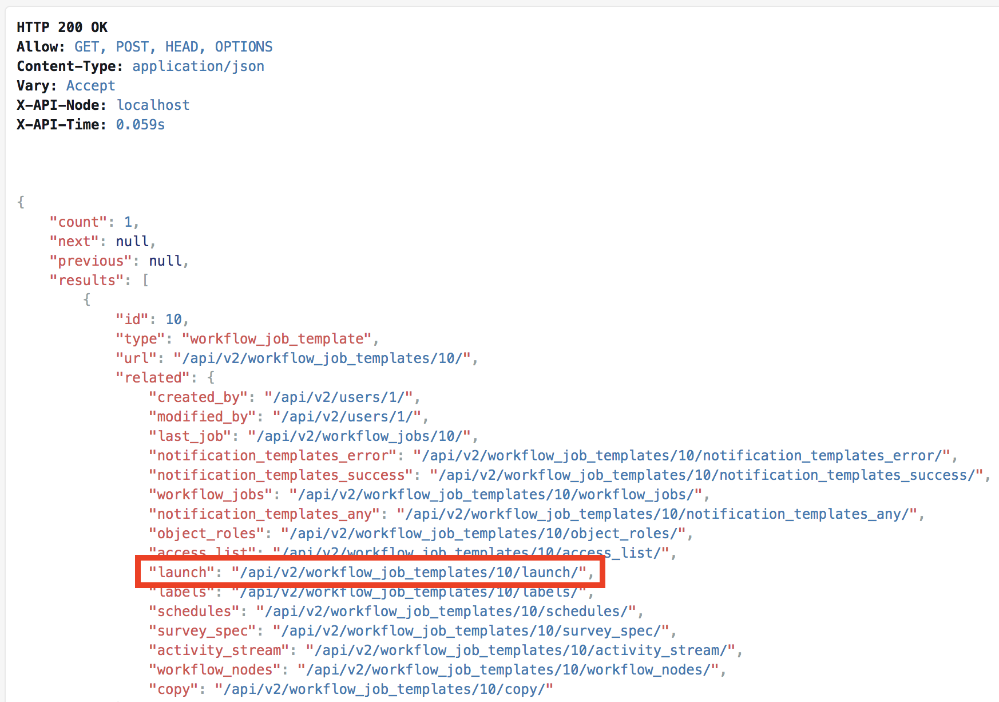

# Exercise 4-5: Working with the Ansible Tower API

# Objective

Demonstrate the use of [Ansible Tower API](https://docs.ansible.com/ansible-tower/latest/html/towerapi/index.html). The Ansible Tower API allows you to programmatically invoke actions against Tower. All actions in the GUI can also be done via the API.

For this exercise we will browse the API and invoke a Workflow via the browser and cURL.

# Guide

## Step 1

First, we're going to browse the Tower API at https://X.X.X.X/api. The IP to use is the IP of your control node.


If you're not logged in, do that now by clicking on **Login in** button in the top right. 

## Step 2

After logging in click on the **current_version** link. Feel free to browse around. After browsing around click on the **workflow_job_templates** link.


The output on this screen shows you all of the available Workflow Job Templates available to your user. For the next step, we'll want to launch a Workflow Job Template.

## Step 3

Find the Workflow Job Template that you want to execute. Select the **launch** link for the respective Workflow Job Template



After clicking the link, scroll to the very bottom of the page. Here you will see the payload options we can send to the Workflow Job Template and issue a POST to start the Workflow Job Template. Go ahead and click the **POST** button and browse to the Tower active jobs to see the Workflow Job running.


## Step 4

Next let's run some cURL commands against the Ansible Tower API. First we're going to install [jq](https://stedolan.github.io/jq/) onto the control node. SSH into the control node, and issue the following commands

```bash
$ wget https://github.com/stedolan/jq/releases/download/jq-1.6/jq-linux64
$ chmod +x jq-linux64
$ sudo mv jq-linux64 /usr/local/bin/jq
```

You should be able to use `jq` now

```bash
$ jq
jq - commandline JSON processor [version 1.6]

Usage:	jq [options] <jq filter> [file...]
	jq [options] --args <jq filter> [strings...]
	jq [options] --jsonargs <jq filter> [JSON_TEXTS...]

jq is a tool for processing JSON inputs, applying the given filter to
its JSON text inputs and producing the filter's results as JSON on
standard output.

The simplest filter is ., which copies jq's input to its output
unmodified (except for formatting, but note that IEEE754 is used
for number representation internally, with all that that implies).

For more advanced filters see the jq(1) manpage ("man jq")
and/or https://stedolan.github.io/jq

Example:

	$ echo '{"foo": 0}' | jq .
	{
		"foo": 0
	}

For a listing of options, use jq --help.
```

Now let's query the Tower API and pipe that to jq for readability.

```bash
$ curl -ks https://X.X.X.X/api/ | jq
{
  "description": "AWX REST API",
  "current_version": "/api/v2/",
  "available_versions": {
    "v1": "/api/v1/",
    "v2": "/api/v2/"
  },
  "oauth2": "/api/o/",
  "custom_logo": "",
  "custom_login_info": ""
}
```

...and start walking through the links

```bash
$ curl -ks https://X.X.X.X/api/v2/ | jq
{
  "ping": "/api/v2/ping/",
  "instances": "/api/v2/instances/",
  "instance_groups": "/api/v2/instance_groups/",
  "config": "/api/v2/config/",
  "settings": "/api/v2/settings/",
  "me": "/api/v2/me/",
  "dashboard": "/api/v2/dashboard/",
  "organizations": "/api/v2/organizations/",
  "users": "/api/v2/users/",
  "projects": "/api/v2/projects/",
  "project_updates": "/api/v2/project_updates/",
  "teams": "/api/v2/teams/",
  "credentials": "/api/v2/credentials/",
  "credential_types": "/api/v2/credential_types/",
  "applications": "/api/v2/applications/",
  "tokens": "/api/v2/tokens/",
  "inventory": "/api/v2/inventories/",
  "inventory_scripts": "/api/v2/inventory_scripts/",
  "inventory_sources": "/api/v2/inventory_sources/",
  "inventory_updates": "/api/v2/inventory_updates/",
  "groups": "/api/v2/groups/",
  "hosts": "/api/v2/hosts/",
  "job_templates": "/api/v2/job_templates/",
  "jobs": "/api/v2/jobs/",
  "job_events": "/api/v2/job_events/",
  "ad_hoc_commands": "/api/v2/ad_hoc_commands/",
  "system_job_templates": "/api/v2/system_job_templates/",
  "system_jobs": "/api/v2/system_jobs/",
  "schedules": "/api/v2/schedules/",
  "roles": "/api/v2/roles/",
  "notification_templates": "/api/v2/notification_templates/",
  "notifications": "/api/v2/notifications/",
  "labels": "/api/v2/labels/",
  "unified_job_templates": "/api/v2/unified_job_templates/",
  "unified_jobs": "/api/v2/unified_jobs/",
  "activity_stream": "/api/v2/activity_stream/",
  "workflow_job_templates": "/api/v2/workflow_job_templates/",
  "workflow_jobs": "/api/v2/workflow_jobs/",
  "workflow_job_template_nodes": "/api/v2/workflow_job_template_nodes/",
  "workflow_job_nodes": "/api/v2/workflow_job_nodes/"
}


$ curl -ks https://54.184.105.54/api/v2/workflow_job_templates/ | jq
{
  "detail": "Authentication credentials were not provided. To establish a login session, visit /api/login/."
}
```

As you can see, RBAC applies to the API as well. This shouldn't be a surprise since the GUI leverages the API for all functionality. For now we can pass the username/password to the cURL command.

**NOTE:** Do not use the following for production environments since the username and password are in plain text.

```bash
$ curl -ks -u '<username>:<password>' https://X.X.X.X/api/v2/workflow_job_templates/ | jq
{
  "count": 2,
  "next": null,
  "previous": null,
  "results": [
    {
      "id": 15,
      "type": "workflow_job_template",
      "url": "/api/v2/workflow_job_templates/15/",
      "related": {
        "created_by": "/api/v2/users/1/",
        "modified_by": "/api/v2/users/1/",
        "last_job": "/api/v2/workflow_jobs/210/",
        "notification_templates_error": "/api/v2/workflow_job_templates/15/notification_templates_error/",
        "notification_templates_success": "/api/v2/workflow_job_templates/15/notification_templates_success/",
...
      "allow_simultaneous": false,
      "ask_variables_on_launch": false,
      "inventory": null,
      "ask_inventory_on_launch": false
    }
  ]
}
```

To help parse this more easily we'll execute the following command

```bash
$ curl -ks -u '<username>:<password>' https://X.X.X.X/api/v2/workflow_job_templates/ | jq '.results[] | "Workflow Template \(.id) is \(.name)"'
```

This will give you the ID and name of the Workflow Job Templates available to you. Pick one for the following command

```bash
$ curl -ks -u '<username>:<password>' -H "Content-Type: application/json" -X POST -d '{}' https://X.X.X.X/api/v2/workflow_job_templates/<id>/launch/
```

If you browse the GUI, you will see the job has been launched. This concludes this exercise.

[Click here to return to the lab guide](../README.md)
