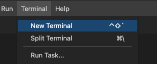

# Workshop Exercise - Check the Prerequisites

**Read this in other languages**:
<br> [English](README.md),  [日本語](README.ja.md),  [Portugues do Brasil](README.pt-br.md),  [Française](README.fr.md), [Español](README.es.md).

## Table of Contents

* [Objective](#objective)
* [Guide](#guide)
   * [Your Lab Environment](#your-lab-environment)
   * [Step 1 - Access the Environment](#step-1---access-the-environment)
   * [Step 2 - Using the Terminal](#step-2---using-the-terminal)
   * [Step 3 - Examining Execution Environments](#step-3---examining-execution-environments)
   * [Step 4 - Examining the ansible-navigator configuration](#step-4---examining-the-ansible-navigator-configuration)
   * [Step 5 - Challenge Labs](#step-5---challenge-labs)

## Objective

* Understand the lab topology and how to access the environment.
* Understand how to work the workshop exercises
* Understand challenge labs

These first few lab exercises will be exploring the command-line utilities of the Ansible Automation Platform.  This includes

- [ansible-navigator](https://github.com/ansible/ansible-navigator) - a command line utility and text-based user interface (TUI) for running and developing Ansible automation content.
- [ansible-core](https://docs.ansible.com/core.html) - the base executable that provides the framework, language and functions that underpin the Ansible Automation Platform.  It also includes various cli tools like `ansible`, `ansible-playbook` and `ansible-doc`.  Ansible Core acts as the bridge between the upstream community with the free and open source Ansible and connects it to the downstream enterprise automation offering from Red Hat, the Ansible Automation Platform.
- [Execution Environments](https://docs.ansible.com/automation-controller/latest/html/userguide/execution_environments.html) - not specifically covered in this workshop because the built-in Ansible Execution Environments already included all the Red Hat supported collections which includes all the collections we use for this workshop.  Execution Environments are container images that can be utilized as Ansible execution.
- [ansible-builder](https://github.com/ansible/ansible-builder) - not specifically covered in this workshop, `ansible-builder` is a command line utility to automate the process of building Execution Environments.

If you need more information on new Ansible Automation Platform components bookmark this landing page [https://red.ht/AAP-20](https://red.ht/AAP-20)

## Guide

### Your Lab Environment

In this lab you work in a pre-configured lab environment. You will have access to the following hosts:

| Role                 | Inventory name |
| ---------------------| ---------------|
| Ansible Control Host | ansible-1      |
| Managed Host 1       | node1          |
| Managed Host 2       | node2          |
| Managed Host 3       | node3          |

### Step 1 - Access the Environment

<table>
<thead>
  <tr>
    <th>It is highly encouraged to use Visual Studio Code to complete the workshop exercises. Visual Studio Code provides:
    <ul>
    <li>A file browser</li>
    <li>A text editor with syntax highlighting</li>
    <li>A in-browser terminal</li>
    </ul>
    Direct SSH access is available as a backup, or if Visual Studio Code is not sufficient to the student.  There is a short YouTube video provided if you need additional clarity: <a href="https://youtu.be/Y_Gx4ZBfcuk">Ansible Workshops - Accessing your workbench environment</a>.
</th>
</tr>
</thead>
</table>

- Connect to Visual Studio Code from the Workshop launch page (provided by your instructor).  The password is provided below the WebUI link.

  

- Type in the provided password to connect.

  

  - Open the `rhel-workshop` directory in Visual Studio Code:

### Step 2 - Using the Terminal

- Open a terminal in Visual Studio Code:

  

Navigate to the `rhel-workshop` directory on the Ansible control node terminal.

```bash
[student<X>@ansible-1 ~]$ cd ~/rhel-workshop/
[student<X>@ansible-1 rhel-workshop]$ pwd
/home/student<X>/rhel-workshop
[student<X>@ansible-1 rhel-workshop]$
```

* `~` - the tilde in this context is a shortcut for the home directory, i.e. `/home/student<X>`
* `cd` - Linux command to change directory
* `pwd` - Linux command for print working directory.  This will show the full path to the current working directory.

### Step 3 - Examining Execution Environments

Run the `ansible-navigator` command with the `images` argument to look at execution environments configured on the control node:

```bash
$ ansible-navigator images
```


> Note: The output  you see might differ from the above output

This command gives you information about all currently installed Execution Environments or EEs for short.  Investigate an EE by pressing the corresponding number.  For example pressing **2** with the above example will open the `ee-supported-rhel8` execution environment:


Selecting `2` for `Ansible version and collections` will show us all Ansible Collections installed on that particular EE, and the version of `ansible-core`:


### Step 4 - Examining the ansible-navigator configuration

Either use Visual Studio Code to open or use the `cat` command to view the contents of the `ansible-navigator.yml` file.  The file is located in the home directory:

```bash
$ cat ~/.ansible-navigator.yml
---
ansible-navigator:
  ansible:
    inventories:
    - /home/student<X>/lab_inventory/hosts

  execution-environment:
    image: registry.redhat.io/ansible-automation-platform-20-early-access/ee-supported-rhel8:2.0.0
    enabled: true
    container-engine: podman
    pull-policy: missing
    volume-mounts:
    - src: "/etc/ansible/"
      dest: "/etc/ansible/"
      label: "Z"
```

Note the following parameters within the `ansible-navigator.yml` file:

* `inventories`: shows the location of the ansible inventory being used
* `execution-environment`: where the default execution environment is set

For a full listing of every configurable knob checkout the [documentation](https://ansible-navigator.readthedocs.io/en/latest/settings/)

### Step 5 - Challenge Labs

You will soon discover that many chapters in this lab guide come with a "Challenge Lab" section. These labs are meant to give you a small task to solve using what you have learned so far. The solution of the task is shown underneath a warning sign.

---
**Navigation**
<br>
[Next Exercise](../1.2-thebasics)
<br><br>
[Click here to return to the Ansible for Red Hat Enterprise Linux Workshop](../README.md)
