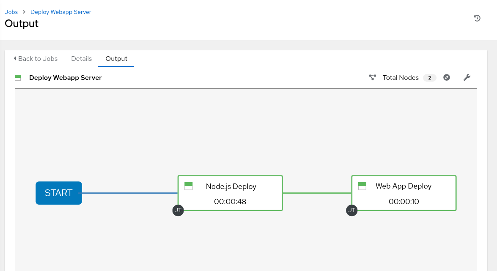

# Atelier - Les workflows

**Lisez ceci dans d'autres langues**:
<br> [English](README.md),  [日本語](README.ja.md),  [Portugues do Brasil](README.pt-br.md),  [Française](README.fr.md),  [Español](README.es.md).

## Table des matières

* [Objectif](#objectif)
* [Guide](#guide)
  * [Scénario de l atelier](#scénario-de-l-atelier)
  * [Configuration des projets](#configuration-des-projets)
  * [Configuration des modèles](#configuration-des-modèles)
  * [Configuration du workflow](#configuration-du-workflow)
  * [Et Action](#et-action)

# Objectif

L'idée de base d'un flux de travail est de lier plusieurs modèles de travail ensemble. Ils peuvent ou non partager l'inventaire, les Playbooks ou même les autorisations. Les liens peuvent être conditionnels:

  - si le modèle de travail A réussit, le modèle de travail B est automatiquement exécuté par la suite

  - mais en cas d'échec, le modèle de travail C sera exécuté.

Et les workflows ne sont même pas limités aux modèles de travail, mais peuvent également inclure des mises à jour de projet ou d'inventaire.

Cela permet de nouvelles applications pour Ansible Tower: différents modèles de travaux peuvent s'appuyer les uns sur les autres. Par exemple. l'équipe de mise en réseau crée des playbooks avec leur propre contenu, dans leur propre référentiel Git et ciblant même leur propre inventaire, tandis que l'équipe des opérations a également ses propres repos, playbooks et inventaire.

Dans ce laboratoire, vous apprendrez à configurer un flux de travail.

# Guide

## Scénario de l atelier

Vous avez deux départements dans votre organisation:

  - L'équipe des opérations Web qui développe des Playbooks dans leur propre référentiel Git.

  - L'équipe d'applications Web, qui développe des applications Web JSP pour Tomcat aussi dans leur référentiel Git.

Lorsqu'il y a un nouveau serveur Tomcat à déployer, deux choses doivent se produire:

  - Tomcat doit être installé, le pare-feu doit être ouvert et Tomcat doit démarrer.

  - La version la plus récente de l'application Web doit être déployée.

Pour vous faciliter la tâche, tout ce dont vous avez besoin existe déjà dans un référentiel Github: Playbooks, fichiers JSP, etc. Il vous suffit donc juste de les coller ensemble.

> **Remarque**
>
> Dans cet exemple, nous utilisons deux branches différentes du même référentiel pour le contenu des équipes distinctes. En réalité, la structure de vos référentiels SCM dépend de nombreux facteurs et peut être différente.

## Configuration des projets

Vous devez d'abord configurer le dépôt Git comme des projets comme vous le feriez normalement. Vous l'avez déjà fait auparavant, essayez de le faire vous-même. Des instructions détaillées peuvent être trouvées ci-dessous.

> **Avertissement**
>
> Si vous êtes toujours connecté en tant qu'utilisateur **wweb**, déconnectez-vous et reconnectez-vous en tant qu'utilisateur **admin**.

Créez le projet pour les opérations Web. Dans la vue **Projets **, cliquez sur le bouton plus vert et remplissez.

<table>
  <tr>
    <th>Parametre</th>
    <th>Valeur</th>
  </tr>
  <tr>
    <td>NOM</td>
    <td>Webops Git Repo</td>
  </tr>
  <tr>
    <td>ORGANISATION</td>
    <td>Default</td>
  </tr>
  <tr>
    <td>SCM TYPE</td>
    <td>Git</td>
  </tr>  
  <tr>
    <td>SCM URL</td>
    <td><code>https://github.com/ansible/workshop-examples.git</code></td>
  </tr>
  <tr>
    <td>SCM BRANCH/TAG/COMMIT</td>
    <td><code>webops</code></td>
  </tr>  
  <tr>
    <td>SCM UPDATE OPTIONS</td>
    <td>Tick all three boxes.</td>
  </tr>                    
</table>  

- Cliquez sur **ENREGISTRER**

---

Créez le projet pour les développeurs d'applications. Dans la vue **Projets** cliquez sur le bouton plus vert et remplissez:

<table>
  <tr>
    <th>Parametre</th>
    <th>Valeur</th>
  </tr>
  <tr>
    <td>NOM</td>
    <td>Webdev Git Repo</td>
  </tr>
  <tr>
    <td>ORGANISATION</td>
    <td>Default</td>
  </tr>
  <tr>
    <td>SCM TYPE</td>
    <td>Git</td>
  </tr>  
  <tr>
    <td>SCM URL</td>
    <td><code>https://github.com/ansible/workshop-examples.git</code></td>
  </tr>
  <tr>
    <td>SCM BRANCH/TAG/COMMIT</td>
    <td><code>webdev</code></td>
  </tr>
  <tr>
    <td>SCM UPDATE OPTIONS</td>
    <td>Tick all three boxes.</td>
  </tr>             
</table>

- Cliquez sur **ENREGISTRER**

## Configuration des modèles

Vous devez maintenant créer des modèles comme vous le feriez pour des travaux "normaux".

Accédez à la vue **Modèles**, cliquez sur le bouton vert plus et choisissez **Modèle de taches**:
Utilisez les valeurs suivantes:

  <table>
    <tr>
      <th>Parametre</th>
      <th>Valeur</th>
    </tr>
    <tr>
      <td>NOM</td>
      <td>Tomcat Deploy</td>
    </tr>
    <tr>
      <td>TYPE DE TACHE</td>
      <td>Run</td>
    </tr>
    <tr>
      <td>INVENTAIRE</td>
      <td>Workshop Inventory</td>
    </tr>  
    <tr>
      <td>PROJET</td>
      <td>Webops Git Repo</td>
    </tr>
    <tr>
      <td>PLAYBOOK</td>
      <td><code>rhel/webops/tomcat.yml</code></td>
    </tr>
    <tr>
      <td>CREDENTIAL</td>
      <td>Workshop Credentials</td>
    </tr>
    <tr>
      <td>OPTIONS</td>
      <td>Enable privilege escalation</td>
    </tr>                     
  </table>  

- Cliquez sur **ENREGISTRER**

---

Accédez à nouveau à la vue **Modèles**, cliquez sur le bouton plus, choisissez **Modèle de tâche** pour ajouter une nouvelle tache.
Utilisez les valeurs suivantes:

  <table>
    <tr>
      <th>Parametre</th>
      <th>Valeur</th>
    </tr>
    <tr>
      <td>NOME</td>
      <td>Web App Deploy</td>
    </tr>
    <tr>
      <td>TYPE DE TACHE</td>
      <td>Run</td>
    </tr>
    <tr>
      <td>INVENTAIRE</td>
      <td>Workshop Inventory</td>
    </tr>  
    <tr>
      <td>PROJET</td>
      <td>Webops Git Repo</td>
    </tr>
    <tr>
      <td>PLAYBOOK</td>
      <td><code>rhel/webdev/create_jsp.yml</code></td>
    </tr>
    <tr>
      <td>CREDENTIAL</td>
      <td>Workshop Credentials</td>
    </tr>
    <tr>
      <td>OPTIONS</td>
      <td>Enable privilege escalation</td>
    </tr>                     
  </table>  

- Cliquez sur **ENREGISTRER**

> **Astuce**
>
> Si vous voulez savoir à quoi ressemblent les Playbooks Ansible, consultez l'URL Github et regardez les branches appropriées.

## Configuration du workflow

Et maintenant, vous allez enfin configuré le workflow. Les flux de travail sont configurés dans la vue **Modèles**, vous avez peut-être remarqué que vous pouvez choisir entre **Modèle de Tache** et **Modèle de workflow** lors de l'ajout d'un modèle, ce qui est finalement logique.

  - Accédez à la vue **Modèles** et cliquez sur le bouton plus vert. Cette fois, choisissez **Modèle de workflow**

      - **NOM:** Déployer le serveur Webapp

      - **ORGANISATION:** Par défaut

  - Cliquez sur **ENREGISTRER**

  - Après avoir enregistré le modèle, le **Workflow Visualizer** s'ouvre pour vous permettre de créer un flux de travail. Vous pouvez ensuite ouvrir à nouveau le **Workflow Visualizer** en utilisant le bouton sur la page de détails du modèle.

  - Cliquez sur le bouton **DEMARRER**, un nouveau nœud s'ouvre. À droite, vous pouvez affecter une action au nœud, vous pouvez choisir entre **MODELE**, **PROJECT SYNC** et **SYNCRONISATION DES INVENTAIRES**.

  - Dans cet atelier, nous allons lier les travaux ensemble. Sélectionnez donc le travail **Tomcat Deploy** et cliquez sur **SELECTIONNER**.

  - Le nœud est annoté avec le nom du travail. Passez le pointeur de la souris sur le nœud, vous verrez un symbole vert **+** et bleu apparaître.

> **Astuce**
>
> L'utilisation du "x" rouge vous permet de supprimer le nœud, le vert plus vous permet d'ajouter le nœud suivant et le symbole de chaîne permet de le lier un autre nœud.

  - Cliquez sur le signe vert **+**

  - Choisissez **Web App Deploy** comme prochaine tâche

  - Laissez **Exécuter** réglé sur **En cas de succès**

> **Astuce**
>
> Le type permet des workflows plus complexes. Vous pouvez définir différents chemins d'exécution pour les exécutions réussies et les échecs du Playbook.

  - Cliquez sur **SELECTIONNER**

  - Cliquez sur **ENREGISTRER** dans la vue **VISUALISATEUR DE WORKFLOW**

  - Cliquez sur **ENREGISTRER** dans la vue **Modèle de workflow**

> **Astuce**
>
> Le **VISUALISATEUR DE WORKFLOW** a des options pour configurer des workflows plus avancés, veuillez vous référer à la documentation.

## Et Action

Votre workflow est prêt à démarrer, lancez-le.

  - Cliquez directement sur le bouton bleu **LANCEMENT** ou accédez à la vue **Modèles** et lancez le flux de travail **Déployer Webapp Server** en cliquant sur l'icône de fusée.



Notez comment l'exécution du flux de travail est affichée dans la vue des travaux. Contrairement à l'exécution normale d'un travail de modèle de travail cette fois, il n'y a pas de sortie de playbook à droite, mais une représentation visuelle des différentes étapes du flux de travail. Si vous souhaitez consulter les playbooks réels derrière cela, cliquez sur **DÉTAILS** à chaque étape. Si vous souhaitez revenir d'une vue détaillée au flux de travail correspondant, cliquez sur le bouton  dans la ligne **Tâches** de la partie **DETAILS** à gauche côté de l'aperçu de l'emploi.

Une fois le travail terminé, vérifiez si tout a bien fonctionné: connectez-vous à `node1`, `node2` ou `node3` à partir de votre hôte de contrôle et exécutez:
```bash
$ curl http://localhost:8080/coolapp/
```

> **Astuce**
>
> Vous devrez peut-être attendre quelques minutes jusqu'à ce que Tomcat réponde aux demandes.

----
**Navigation**
<br>
[Exercice précédent](../2.5-rbac/README.fr.md) - [Exercice suivant](../2.7-wrap/README.fr.md)

[Cliquez ici pour revenir à l'atelier Ansible pour Red Hat Enterprise Linux](../README.fr.md)
