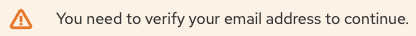

# Exercise - Red Hat Insights

**Read this in other languages**:  [English](README.md)

## Table Contents

* [Exercise - Red Hat Insights](#exercise---red-hat-insights)
   * [Table Contents](#table-contents)
* [Objective](#objective)
* [Guide](#guide)
   * [Step 1 - Understand Red Hat Insights](#step-1---understand-red-hat-insights)
   * [Step 2 - Create a cloud.redhat.com account](#step-2---create-a-cloudredhatcom-account)
   * [Step 3 - Examine your license](#step-3---examine-your-license)
   * [Step 4 - Launch the Ansible Job](#step-4---launch-the-ansible-job)
   * [Step 5 - Login to cloud.redhat.com](#step-5---login-to-cloudredhatcom)
* [Complete](#complete)

# Objective

The goal of this exercise is to understand Red Hat Insights, and use Ansible to install and configure it on all web nodes.

# Guide

## Step 1 - Understand Red Hat Insights

[Red Hat Insights](https://www.redhat.com/en/technologies/management/insights) allows you to proactively identify and remediate security, compliance, and configuration risks in your Red Hat® Enterprise Linux® environments. Red Hat Insights is included with a Red Hat Enterprise Linux subscription.

  - Enhanced visibility across Red Hat environments with a single tool
  - Comprehensive risk identification without manual analysis
  - Guidance at your fingertips
  - Resolution at scale with Red Hat Ansible Automation Platform

Effectively Red Hat Insights will identify security, compliance and configuration risks, and use Ansible Automation Platform to automate and implment the fixes.  There is no need to create your own Ansible Playbooks, Red Hat Insights will provide those to Ansible Tower.

## Step 2 - Create a cloud.redhat.com account

To get Red Hat Insights working in our workshop inventory we need two things:
  - a cloud.redhat.com account
  - a valid Red Hat Enterprise Linux license assigned to that account

Luckily both of these two things can be done in one spot:

- Navigate to [https://www.redhat.com/en/technologies/linux-platforms/enterprise-linux](https://www.redhat.com/en/technologies/linux-platforms/enterprise-linux)
- Click on the **Try it free** button:

  

- Click on the **DOWNLOAD** button:

  

- Now if you do not have an account, you can create one now:

  

- Create an account by clicking **Create one now** or by clicking on one of the alternate login methods (e.g. Github).  Fill out the information

- Make sure to verify your email address:

  

- After verification you can login the website will download the x86_64 file.  However you do not need this file for the purposes of this workshop exercise.  This also added access to the license for Red Hat Enterprise Linux

## Step 3 - Examine your license

- Navigate to Red Hat Customer Portal [https://access.redhat.com](https://access.redhat.com).
- Scroll down to the **My Subscriptions** and click the link:

  

- Now click on the **Subscriptions** link:

  

- You will see your active subscriptions:

  

## Step 4 - Launch the Ansible Job

You now have a Red Hat account, and an active subscription to use Red Hat Insights!  Open up the Ansible Tower UI again.

- Navigate to templates
- Click on the Rocket and launch the **SERVER / Red Hat Insights** Job
- Fill out the survey with your Red Hat Account:

  

- Watch the job finish successfully on all three web nodes

## Step 5 - Login to cloud.redhat.com

- Navigate your web browser to [https://cloud.redhat.com](https://cloud.redhat.com)
- Login and select Red Hat Insights Dashboard
- Click on **Inventory** in the left menu to show all your workshop nodes:

  

- Click on any node to bring up additional information on those Red Hat Enterprise Linux nodes.

# Complete

You have completed lab exercise

----
**Navigation**
 
[Previous Exercise](../6-system-roles)
  
[Click here to return to the Ansible for Red Hat Enterprise Linux Workshop](../README.md)
