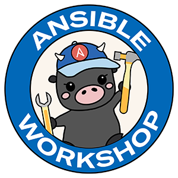

# Ansible AWS training provisioner

The `github.com/ansible/workshops` contains an Ansible Playbook `provision_lab.yml`, which is an automated lab setup for Ansible training on AWS (Amazon Web Services).  Set the `workshop_type` variable below to provision the corresponding workshop.

| Workshop | Workshop Type Var   |
|---|---|
| Ansible for Red Hat Enterprise Linux Workshop | `workshop_type: rhel`  |
| Ansible for Red Hat Enterprise Linux Workshop - 90 minutes  | `workshop_type: rhel_90`    |
| Ansible Network Automation Workshop | `workshop_type: network`  |
| Ansible F5 Workshop | `workshop_type: f5`   |
| Ansible Security Automation | `workshop_type: security`   |
| Ansible Windows Automation  | `workshop_type: windows`    |
| Ansible Demo Mode  | `workshop_type: demo`    |
| Smart Management Workshop | `workshop_type: smart_mgmt` |

## Table Of Contents

- [Ansible AWS training provisioner](#ansible-aws-training-provisioner)
  - [Table Of Contents](#table-of-contents)
  - [Requirements](#requirements)
  - [Lab Setup](#lab-setup)
    - [One Time Setup](#one-time-setup)
    - [Setup (per workshop)](#setup-per-workshop)
    - [Accessing student documentation and slides](#accessing-student-documentation-and-slides)
    - [Accessing instructor inventory](#accessing-instructor-inventory)
    - [DNS](#dns)
    - [Smart Management](#smart-management)
  - [Lab Teardown](#lab-teardown)
  - [Demos](#demos)
  - [FAQ](#faq)
  - [More info on what is happening](#more-info-on-what-is-happening)
  - [Getting Help](#getting-help)

## Requirements

* This provisioner must be run with `ansible-core` v2.11 or higher.
* AWS Account (follow directions on one time setup below)

## Lab Setup

### One Time Setup

[For One Time Setup - click here](../docs/setup.md)

### Setup (per workshop)

* Define the following variables in a file passed in using `-e @extra_vars.yml`

```yaml
---
# region where the nodes will live
ec2_region: us-east-1

# name prefix for all the VMs
ec2_name_prefix: TESTWORKSHOP

# creates student_total of workbenches for the workshop
student_total: 2

# Set the right workshop type, like network, rhel or f5 (see above)
workshop_type: rhel

# Generate offline token to authenticate the calls to Red Hat's APIs
# Can be accessed at https://access.redhat.com/management/api
offline_token: "eyQ.60y_ezoosYst_FJlZfVsud9qGbDt7QRly6nhprqVEREi......XYZ"

# Required for podman authentication to registry.redhat.io
redhat_username: <redhat_username>
redhat_password: <redhat_password>

#####OPTIONAL VARIABLES

# turn DNS on for control nodes, and set to type in valid_dns_type
dns_type: aws

# password for Ansible control node
admin_password: your_password123

# Sets the Route53 DNS zone to use for Amazon Web Services
workshop_dns_zone: rhdemo.io

# automatically installs Tower to control node
controllerinstall: true

# IBM Community Grid - defaults to true if you don't tell the provisioner
ibm_community_grid: false

```

If you want to license it you must copy a license called tower_license.json into this directory.  If you do not have a license already please request one using the [Workshop License Link](https://www.ansible.com/workshop-license).

For more extra_vars examples, look at the following:

* [sample-vars-rhel.yml](sample_workshops/sample-vars-rhel.yml) - example for the Ansible RHEL Workshop
* [sample-vars-windows.yml](sample_workshops/sample-vars-windows.yml) - example for the **Ansible Windows Workshop**
* [sample-vars-network.yml](sample_workshops/sample-vars-network.yml) - example for the **Ansible Network Workshop**
* [sample-vars-f5.yml](sample_workshops/sample-vars-f5.yml) - example for **Ansible F5 Workshop**
* [sample-vars-tower-auto.yml](sample_workshops/sample-vars-tower-auto.yml) - example for Tower installation and licensing
* [sample-vars-rhel-90.yml](sample_workshops/sample-vars-tower-auto.yml) - example for Tower installation and licensing
* [sample-vars-rhel-90.yml](sample_workshops/sample-vars-rhel-90.yml) - example for `rhel_90` workshop, meant to be taught in 90 minutes
* [sample-vars-demo.yml](sample_workshops/sample-vars-demo.yml) - example for `demo` mode, aggregate of all workshop topologies
* [sameple-vars-smart_mgmt.yml](sample_workshops/sample-vars-smart_mgmt.yml) - example for `smart_mgmt` workshop. [Read Notes](#smart-management)

* Run the playbook:

```bash
ansible-playbook provision_lab.yml -e @extra_vars.yml
```

* Login to the AWS EC2 console and you will see instances being created.  For example:

```yaml
testworkshop-student1-ansible
````

### IBM Community Grid

IBM’s World Community Grid is integrated into the workshops.  World Community Grid enables anyone with a Linux, Windows or Mac computer (or an Android smartphone for some projects)  to donate their unused computing power to advance scientific research on topics related to health and sustainability.

By default the key, value pair is set: `ibm_community_grid: true`.  This installs the boinc-client to all Red Hat Enterprise Linux instances (except the Ansible control node).  This can be disabled by setting `ibm_community_grid: false`. By default in the Ansible Automation workshops all research progress (points and CPU time) is added to a joint Ansible account for Red Hat. If you prefer to use your own account, or another project change the following variables:

```yaml
boinc_auth: "1114316_4080087955dc198a6109a25a56817809"
boinc_url: "www.worldcommunitygrid.org"
```

Please read this blog for more information: [https://www.ansible.com/blog/ansible-and-ibm-community-grid](https://www.ansible.com/blog/ansible-and-ibm-community-grid)

### Accessing student documentation and slides

* Exercises and instructor slides are hosted at [http://ansible.github.io/workshops](http://ansible.github.io/workshops)

* Workbench information is stored in two places after you provision:

  * in a local directory named after the workshop (e.g. testworkshop/instructor_inventory)
  * By default there will be a website `ec2_name_prefix.workshop_dns_zone` (e.g. `testworkshop.rhdemo.io`)

    * **NOTE:** It is possible to change the DNS domain (right now this is only supported via a AWS Route 53 Hosted Zone) using the parameter `workshop_dns_zone` in your `extra_vars.yml` file.
    * **NOTE:** The playbook does not create the route53 zone and must exist prior to running the playbook.

### Accessing instructor inventory

* The instructor inventory will be copied to `/tmp` on student1's control_node as part of the control_nodes role.
* The instructor can see all assigned students and what their workbench is by visiting `ec2_name_prefix.workshop_dns_zone/list.php` (e.g. `testworkshop.rhdemo.io/list.php`)

### DNS

The provisioner currently supports creating DNS records per control node with valid SSL certs using [Lets Encrypt](https://letsencrypt.org/).  Right now DNS is only supported via AWS Route 53, however we are building it in a way that this can be more pluggable and take advantage of other public clouds.

This means that each student workbench will get an individual DNS entry.  For example a DNS name will look like this: `https://student1.testworkshop.rhdemo.io`

* **NOTE:** The variable `dns_type` defaults to `aws`.  This can also be set to `dns_type: none`.
* **NOTE:**  If Lets Encrypt fails, the workshop provisioner will still pass, and alert you of errors in the `summary_information` at the end of the `provision_lab.yml` Ansible Playbook.

### Smart Management

The Smart Management Lab relies on a prebuilt AMI for Red Hat Satellite Server. An example for building this AMI can be found [here](https://github.com/willtome/ec2-image-build).

The Smart Management Lab also requires AWS DNS to be enabled and IBM community Grid to be disabled. See [sample vars](./sample_workshops/sample-vars-smart_mgmt.yml) for required configuration.

## Lab Teardown

The `teardown_lab.yml` playbook deletes all the training instances as well as local inventory files.

To destroy all the EC2 instances after training is complete:

* Run the playbook:

```bash
ansible-playbook teardown_lab.yml -e @extra_vars.yml
```

* Optionally you can enable verbose debug output of the information gathered that drives the teardown process by passing the extra optional variable `debug_teardown=true`. Example:

```bash
ansible-playbook teardown_lab.yml -e @extra_vars.yml -e debug_teardown=true
```

## Demos

There is a variable you can pass in within your extra_vars named `demo`.  When this keyword is defined it will install the specified demo from the Github repository [https://github.com/ansible/product-demos](https://github.com/ansible/product-demos).h

For example you can put:

```yaml
demo: all
```

Which will install all demos onto the Ansible Tower instance.  Not all demos will work on any `workshop_type`.  Please refer to the [Demo repository list](https://github.com/ansible/product-demos#demo-repository).

## FAQ

For frequently asked questions see the [FAQ](../docs/faq.md)

## More info on what is happening

The `provision_lab.yml` playbook creates a work bench for each student, configures them for password authentication, and creates an inventory file for each user with their IPs and credentials. An instructor inventory file is also created in the current directory which will let the instructor access the nodes of any student.  This file will be called `instructor_inventory.txt`

What does the AWS provisioner take care of automatically?

* AWS VPC creation (Amazon WebServices Virtual Private Cloud)
* Creation of an SSH key pair (stored at ./WORKSHOPNAME/WORKSHOPNAME-private.pem)
* Creation of a AWS EC2 security group
* Creation of a subnet for the VPC
* Creation of an internet gateway for the VPC
* Creation of route table for VPC (for reachability from internet)

## Getting Help

Please [file issues on Github](https://github.com/ansible/workshops/issues).  Please fill out all required information.  Your issue will be closed if you skip required information in the Github issues template.


