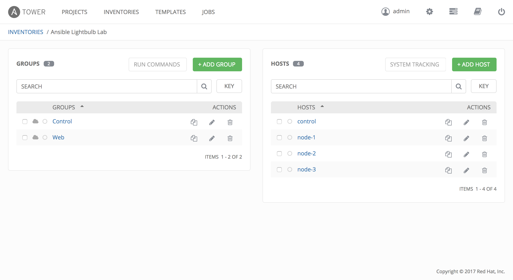
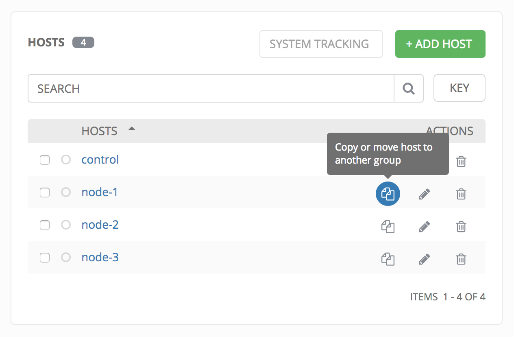
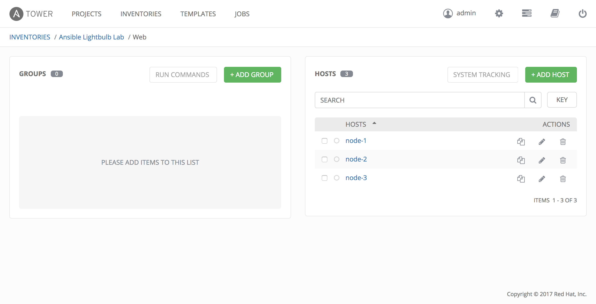

Static Inventory Importer
================================
This playbook helps students import their local, static inventory into Ansible Tower.

## Usage ##
This playbook users the tower-cli tool and it's associated Ansible modules to create an inventory, groups, and then hosts with a special type of loop: `with_inventory_hostnames`

### Pre-requisites ###

In order for this play to work, you must have already completed the following:
* The Ansible Tower install exercise
* Logged in using the password you set for the admin user
* Applied your license key

### Setup ###
Assuming a standard setup of the Lightbulb environment -- meaning you've followed the guides here or an instructors directions -- the only item you need to adjust in `inventory_import.yml` is the value for `tower_host_password` on line 5. This is the same value that you set as your admin accounts password.

### Running the playbook ###
Once you've modified the `tower_host_password` value, you can run the playbook normally as your student user:
```yaml
[student1@~]$ansible-playbook lightbulb/tools/inventory_import/inventory_import.yml
```

Once that's done, you can check under the Inventory tab in Ansible Tower and you should now have 2 inventory groups:


### Next steps ###

Tower-cli does not currently support creating hosts under a group, so they'll need to be moved individually to the appropriate group.

Select the 'Ansible Lightbulb Lab' inventory, and begin moving the hosts to their respective groups by clicking the 'copy or move icon':


Choose the 'web' group for nodes 1-3, and the 'control' group for the control node. The default behavior is to copy the hosts to groups, but you can choose move if desired.

Once complete, you should be able to look at each group and see their associated hosts. Here's the web group as an example:

