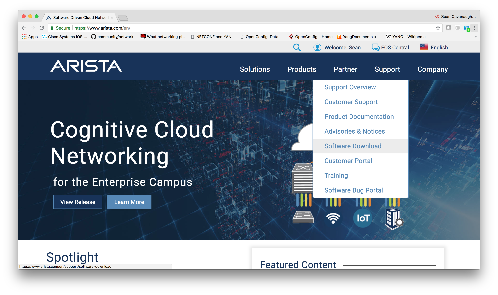

# Directions

Please follow the [vagrant setup instructions](../README.md) before switching to the Arista lab.

1. Download Arista Vagrant image

   Go to arista.com, make an account if you have not already, and click the Support->Software Downloads 

2. Add the box image to Vagrant

   Use the `vagrant box add` command on the newly downloaded box image.  Make sure to use the `--name` parameter and name the box image `veos`.

   ```bash
   ➜  user@rhel7:-$ vagrant box add vEOS-lab-4.20.1F-virtualbox.box --name veos
   ==> box: Box file was not detected as metadata. Adding it directly...
   ==> box: Adding box 'veos' (v0) for provider:
       box: Unpacking necessary files from:        file:///Users/sean/Documents/GitHub/linklight/vagrant-demo/arista/vEOS-lab-4.20.1F-virtualbox.box
   ==> box: Successfully added box 'veos' (v0) for 'virtualbox'!
   ➜  user@rhel7:-$
   ```

   NOTE: If you are having trouble, please refer to [Arista's official documentation](https://eos.arista.com/using-veos-with-vagrant-and-virtualbox/).

3. Vagrant up the topology

    Use the `vagrant up` command to bring up the topology

    ```
    ➜  user@rhel7:-$ vagrant up ansible leaf01 leaf02 spine01 spine02
    ```

4. Try connecting to an individual switch

   From the same directory as the Vagrantfile, use the `vagrant ssh` command to connect to the device.  To connect directly to the Arista CLI use the `-c FastCli` parameter

   ```
   ➜  user@rhel7:-$ vagrant ssh leaf01 -c FastCli
   leaf01>
   ```

5. Open up the Lab exercises

   Open up the [labs](./labs) directory

 ---


Red Hat® Ansible® Automation is a fully supported product built on the foundational capabilities of the Ansible project. Read more on [ansible.com](https://www.ansible.com/overview/networking)
